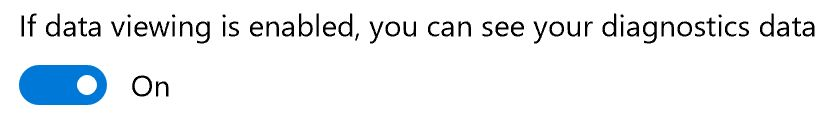
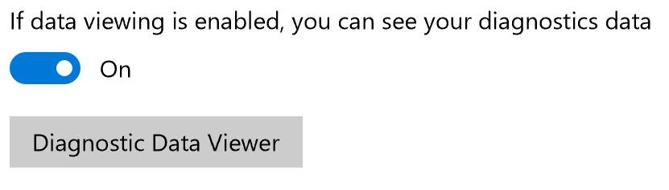

# Diagnostic Data Viewer Overview

**Applies to**

-   Windows 10, version 1709
-   Windows Server

[This information relates to pre-released product which may be substantially modified before it's commercially released. Microsoft makes no warranties, express or implied, with respect to the information provided here.]

## Introduction
The Diagnostic Data Viewer is a Windows app that lets you review the diagnostic data your device is sending to Microsoft, grouping the info into simple categories based on how it's used by Microsoft.

## Install and Use the Diagnostic Data Viewer
You must turn on data viewing and download the app before you can use the Diagnostic Data Viewer to review your device's diagnostic data.

### Turn on data viewing
Before you can use this tool, you must turn on data viewing in the **Settings** panel.

**To turn on data viewing**
1. Go to **Start**, select **Settings** > **Privacy** > **Feedback & diagnostics**.

2. Under **Diagnostic data**, turn on the **If data viewing is enabled, you can syour diagnostics data** option.

    

    By turning on data viewing, Windows can temporarily keep a copy of your diagnostic data after it's sent to Microsoft.

### Download the Diagnostic Data Viewer
Download the app from the [Windows Store Diagnostic Data Viewer](https://www.microsoft.com/en-us/store/p/diagnostic-data-viewer/9n8wtrrsq8f7?rtc=1) page.

### Start the Diagnostic Data Viewer
You must start this app from the **Settings** panel.

**To start the Diagnostic Data Viewer**
1. Go to **Start**, select **Settings** > **Privacy** > **Feedback & diagnostics**.

2. Under **Diagnostic data**, select the **Diagnostic Data Viewer** button.

    

    -OR-
3. Go to **Start** and search for the Diagnostic Data Viewer app.

## Use the Diagnostic Data Viewer
The Diagnostic Data Viewer provides you with the following features to view and filter your device's diagnostic data.

- **View your diagnostic events.** In the left column, you can review your diagnostic events. These events reflect activities that occurred and were sent to Microsoft. 

    Selecting an event opens the detailed JSON view, which provides the exact details uploaded to Microsoft. Microsoft uses this info to continually improve the Windows platform.

- **Search your diagnostic events.** The **Search** box at the top of the screen lets you search amongst all of the diagnostic event details. The returned search results include any diagnostic event that contains the matching text. 

    Selecting an event opens the detailed JSON view, with the matching text highlighted.

- **Filter your diagnostic event categories.** The 3-line **Menu** icon opens the detailed menu. In here, you'll find a list of diagnostic event categories, which define how the events are used by Microsoft.

    Selecting a check box lets you filter between the diagnostic event categories.

- **Provide diagnostic event feedback.** The **Feedback** icon opens the Feedback Hub app, letting you provide feedback about the Diagnostic Data Viewer and the diagnostic events.

    >[!Important]
    >All content in the Feedback Hub is publicly viewable. Therefore, make sure you don't put any personal info into your feedback comments.

    Selecting a specific event in the Diagnostic Data Viewer automatically fills in the field in the Feedback Hub. You can add your comments to the box labeled, **Give us more detail (optional)**.
	
## Microsoft sampling processes
Microsoft collects your diagnostic data based on a sample population of Windows devices. This sampling data is shown in the Diagnostic Data Viewer in 2 ways:

- **Device-level sampling.** Windows devices are chosen by random number to be part of the group that sends additional data to Microsoft. If your device is part of this group, you'll see this icon (Fig. 1) in the Diagnostic Data Viewer:

     **Fig. 1: Device-level sampling icon**

- **Event-level sampling.** If your device is part of the random group sending additional data to Microsoft, you will see this icon (Fig. 2) next to every specific event being sent to Microsoft. All of this data is used to help improve the Windows platform.

     **Fig. 2: Event-level sampling icon**
