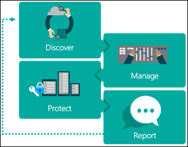

# Beginning your General Data Protection Regulation (GDPR) journey for Windows 10

This article provides info about GDPR, including what it is and the products Microsoft provides to help you to become compliant.

## Introduction
On May 25, 2018, a European privacy law is due to take effect that sets a new global bar for privacy rights, security, and compliance.

The General Data Protection Regulation, or GDPR, is fundamentally about protecting and enabling the privacy rights of individuals. The GDPR establishes strict global privacy requirements governing how you manage and protect personal data while respecting individual choice—no matter where data is sent, processed, or stored.

Microsoft and our customers are now on a journey to achieve the privacy goals of the GDPR. At Microsoft, we believe privacy is a fundamental right, and we believe that the GDPR is an important step forward for clarifying and enabling individual privacy rights. But we also recognize that the GDPR will require significant changes by organizations all over the world.

We have outlined our commitment to the GDPR and how we are supporting our customers within the [Get GDPR compliant with the Microsoft Cloud](https://blogs.microsoft.com/on-the-issues/2017/02/15/get-gdpr-compliant-with-the-microsoft-cloud/#hv52B68OZTwhUj2c.99) blog post by our Chief Privacy Officer [Brendon Lynch](https://blogs.microsoft.com/on-the-issues/author/brendonlynch/) and the [Earning your trust with contractual commitments to the General Data Protection Regulation](https://blogs.microsoft.com/on-the-issues/2017/04/17/earning-trust-contractual-commitments-general-data-protection-regulation/#6QbqoGWXCLavGM63.99)” blog post by [Rich Sauer](https://blogs.microsoft.com/on-the-issues/author/rsauer/) - Microsoft Corporate Vice President & Deputy General Counsel.

Although your journey to GDPR may seem challenging, we are here to help you. For specific information about the GDPR, our commitments and beginning your journey, please visit the [GDPR section of the Microsoft Trust Center](https://www.microsoft.com/en-us/trustcenter/privacy/gdpr).

## GDPR and its implications
The GDPR is a complex regulation that may require significant changes in how you gather, use and manage personal data. Microsoft has a long history of helping our customers comply with complex regulations, and when it comes to preparing for the GDPR, we are your partner on this journey.

The GDPR imposes rules on organizations that offer goods and services to people in the European Union (EU), or that collect and analyze data tied to EU residents, no matter where those businesses are located. Among the key elements of the GDPR are the following:

- **Enhanced personal privacy rights.** Strengthened data protection for residents of EU by ensuring they have the right to access to their personal data, to correct inaccuracies in that data, to erase that data, to object to processing of their personal data, and to move it.

- **Increased duty for protecting personal data.** Reinforced accountability of organizations that process personal data, providing increased clarity of responsibility in ensuring compliance.

- **Mandatory personal data breach reporting.** Organizations that control personal data are required to report personal data breaches that pose a risk to the rights and freedoms of individuals to their supervisory authorities without undue delay, and, where feasible, no later than 72 hours once they become aware of the breach.

As you might anticipate, the GDPR can have a significant impact on your business, potentially requiring you to update privacy policies, implement and strengthen data protection controls and breach notification procedures, deploy highly transparent policies, and further invest in IT and training. Microsoft Windows 10 can help you effectively and efficiently address some of these requirements.

## Personal and sensitive data
As part of your effort to comply with the GDPR, you will need to understand how the regulation defines personal and sensitive data and how those definitions relate to data held by your organization.

The GDPR considers personal data to be any information related to an identified or identifiable natural person. That can include both direct identification (such as, your legal name) and indirect identification (such as, specific information that makes it clear it is you the data references). The GDPR also makes clear that the concept of personal data includes online identifiers (such as, IP addresses, mobile device IDs) and location data.

The GDPR introduces specific definitions for genetic data (such as, an individual’s gene sequence) and biometric data. Genetic data and biometric data along with other sub categories of personal data (personal data revealing racial or ethnic origin, political opinions, religious or philosophical beliefs, or trade union membership: data concerning health; or data concerning a person’s sex life or sexual orientation) are treated as sensitive personal data under the GDPR. Sensitive personal data is afforded enhanced protections and generally requires an individual’s explicit consent where these data are to be processed.

### Examples of info relating to an identified or identifiable natural person (data subject)
This list provides examples of several types of info that will be regulated through GDPR. This is not an exhaustive list.

- 	Name

- 	Identification number (such as, SSN)

- 	Location data (such as, home address)

- 	Online identifier (such as, e-mail address, screen names, IP address, device IDs)

- 	Pseudonymous data (such as, using a key to identify individuals)

- 	Genetic data (such as, biological samples from an individual)

- 	Biometric data (such as, fingerprints, facial recognition)

## Getting started on the journey towards GDPR compliance
Given how much is involved to become GDPR-compliant, we strongly recommend that you don't wait to prepare until enforcement begins. You should review your privacy and data management practices now. We recommend that you begin your journey to GDPR compliance by focusing on four key steps:

- 	**Discover.** Identify what personal data you have and where it resides. 

- 	**Manage.** Govern how personal data is used and accessed.

- 	**Protect.** Establish security controls to prevent, detect, and respond to vulnerabilities and data breaches.	

- 	**Report.** Act on data requests, report data breaches, and keep required documentation.
 
    

For each of the steps, we've outlined example tools, resources, and features in various Microsoft solutions, which can be used to help you address the requirements of that step. While this article isn't a comprehensive “how to,” we've included links for you to find out more details, and more information is available in the [GDPR section of the Microsoft Trust Center](https://www.microsoft.com/en-us/trustcenter/privacy/gdpr).

## Windows 10 security and privacy
As you work to comply with the GDPR, understanding the role of your desktop and laptop client machines in creating, accessing, processing, storing and managing data that may qualify as as personal and potentially sensitive data under the GDPR is important. Windows 10 provides capabilities that will help you comply with the GDPR requirements to implement appropriate technical and organizational security measures to protect personal data.

With Windows 10, your ability to protect, detect and defend against the types of attacks that can lead to data breaches is greatly improved. Given the stringent requirements around breach notification within the GDPR, ensuring that your desktop and laptop systems are well defended will lower the risks you face that could result in costly breach analysis and notification.

In this section, we'll talk about how Windows 10 provides capabilities that fit squarely in the **Protect** stage of your journey, including these 4 scenarios:

- **Threat protection: Pre-breach threat resistance.** Disrupt the malware and hacking industry by moving the playing field to one where they lose the attack vectors that they depend on.

- **Threat protection: Post-breach detection and response.** Detect, investigate, and respond to advanced threats and data breaches on your networks.

- **Identity protection.** Next generation technology to help protect your user’s identities from abuse.

- **Information protection.** Comprehensive data protection while meeting compliance requirements and maintaining user productivity.

These capabilities, discussed in more detail below with references to specific GDPR requirements, are built on top of advanced device protection that maintains the integrity and security of the operating system and data.

A key provision within the GDPR is data protection by design and by default, and helping with your ability to meet this provision are features within Windows 10 such as the Trusted Platform Module (TPM) technology designed to provide hardware-based, security-related functions. A TPM chip is a secure crypto-processor that is designed to carry out cryptographic operations.

The chip includes multiple physical security mechanisms to make it tamper resistant, and malicious software is unable to tamper with the security functions of the TPM. Some of the key advantages of using TPM technology are that you can:

-	Generate, store, and limit the use of cryptographic keys.

-	Use TPM technology for platform device authentication by using the TPM’s unique RSA key, which is burned into itself.

-	Help to ensure platform integrity by taking and storing security measurements.

Additional advanced device protection relevant to your operating without data breaches include Windows Trusted Boot to help maintain the integrity of the system by ensuring malware is unable to start before system defenses.

### Threat protection: Pre-breach threat resistance
The GDPR requires you to implement appropriate technical and organizational security measures to protect personal data.

Your ability to meet this requirement to implement appropriate technical security measures should reflect the threats you face in today’s increasingly hostile IT environment. Today’s security threat landscape is one of aggressive and tenacious threats. In previous years, malicious attackers mostly focused on gaining community recognition through their attacks or the thrill of temporarily taking a system offline. Since then, attacker’s motives have shifted toward making money, including holding devices and data hostage until the owner pays the demanded ransom.

Modern attacks increasingly focus on large-scale intellectual property theft; targeted system degradation that can result in financial loss; and now even cyberterrorism that threatens the security of individuals, businesses, and national interests all over the world. These attackers are typically highly trained individuals and security experts, some of whom are in the employ of nation states that have large budgets and seemingly unlimited human resources. Threats like these require an approach that can meet this challenge.

Not only are these threats a risk to your ability to maintain control of any personal or sensitive data you may have, but they are a material risk to your overall business as well. Consider recent data from Ponemon Institute, Verizon, and Microsoft:

- The average cost of the type of data breach the GDPR will expect you to report is $3.5M. (Ponemon Institute).

- 63% of these breaches involve weak or stolen passwords that the GDPR expects you to address. (2016 Data Breach Investigations Report, Verizon Enterprise).

- Over 300,000 new malware samples are created and spread every day making your task to address data protection even more challenging. (Microsoft Malware Protection Center, Microsoft).

As seen with recent ransomware attacks, once called the "black plague" of the Internet, attackers are going after bigger targets that can afford to pay more, with potentially catastrophic consequences. Desktops and laptops, that contain personal and sensitive data, are commonly targeted where control over data might be lost.

In response to these threats and as a part of your mechanisms to resist these types of breaches so that you remain in compliance with the GDPR, Windows 10 provides built in technology, detailed below including the following:

- Windows Defender Antivirus to respond to emerging threats on data.

- Microsoft Edge to systemically disrupt phishing, malware, and hacking attacks.

- Device Guard to block all unwanted applications on client machines.

#### Responding to emerging threats on data
Windows Defender Antivirus is a built-in antimalware solution that provides security and antimalware management for desktops, portable computers, and servers. In Windows 10, it uses a multi-pronged approach to improve antimalware:

- **Cloud-delivered protection.** Helps to detect and block new malware within seconds, even if the malware has never been seen before.

- **Rich local context.** Improves how malware is identified. Windows 10 informs Windows Defender Antivirus not only about content like files and processes, but also where the content came from, where it's been stored, and more. 

- **Extensive global sensors.** Help to keep Windows Defender Antivirus current and aware of even the newest malware. This is accomplished in two ways: by collecting the rich local context data from end points and by centrally analyzing that data.

- **Tamper proofing.** Helps to guard Windows Defender Antivirus itself against malware attacks. For example, Windows Defender Antivirus uses Protected Processes, which prevents untrusted processes from attempting to tamper with Windows Defender Antivirus components, its registry keys, and so on.

- **Enterprise-level features.** Give IT pros the tools and configuration options necessary to make Windows Defender Antivirus an enterprise-class antimalware solution.

