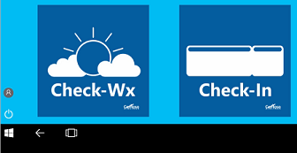

# Configure kiosks and digital signs on Windows desktop editions

>[!WARNING]
>Some information relates to prereleased product which may be substantially modified before it's commercially released. Microsoft makes no warranties, express or implied, with respect to the information provided here.

Some desktop devices in an enterprise serve a special purpose, such as a PC in the lobby that customers can use to view your product catalog or a PC displaying visual content as a digital sign. Windows 10 offers two different locked-down experiences for public or specialized use:

|  |  |
--- | ---
 | **A single-app kiosk**, which runs a single Universal Windows Platform (UWP) app in fullscreen above the lockscreen. People using the kiosk can see only that app.  When the kiosk account (a local standard user account) signs in, the kiosk app will launch automatically, and you can configure the kiosk account to sign in automatically as well. If the kiosk app is closed, it will automatically restart.  A single-app kiosk is ideal for public use.  (Using [Shell Launcher](kiosk-shelllauncher.md), you can configure a kiosk device that runs a Windows desktop application as the user interface. The application that you specify replaces the default shell (explorer.exe) that usually runs when a user logs on. This type of single-app kiosk does not run above the lockscreen.) | 
 |  **A multi-app kiosk**, which runs one or more apps from the desktop. People using the kiosk see a customized Start that shows only the tiles for the apps that are allowed. With this approach, you can configure a locked-down experience for different account types.  A multi-app kiosk is appropriate for devices that are shared by multiple people.  When you configure a multi-app kiosk, [specific policies are enforced](kiosk-policies.md) that will affect **all** non-administrator users on the device. | 

Kiosk configurations are based on **Assigned Access**, a feature in Windows 10 that allows an administrator to manage the user's experience by limiting the application entry points exposed to the user. 

There are several kiosk configuration methods that you can choose from, depending on your answers to the following questions.

|  |  |
--- | ---
 | **Which type of app will your kiosk run?** Your kiosk can run a Universal Windows Platform (UWP) app or a Windows desktop application. For [digital signage](setup-digital-signage.md), simply select a digital sign player as your kiosk app. [Check out the guidelines for kiosk apps.](guidelines-for-assigned-access-app.md) 
 | **Which type of kiosk do you need?** If you want your kiosk to run a single app for anyone to see or use, consider a single-app kiosk that runs either a [Universal Windows Platform (UWP) app](#uwp) or a [Windows desktop application](#classic). For a kiosk that people can sign in to with their accounts or that runs more than one app, choose [a multi-app kiosk](#desktop). 
 | **Which edition of Windows 10 will the kiosk run?** All of the configuration methods work for Windows 10 Enterprise and Education; some of the methods work for Windows 10 Pro. Kiosk mode is not available on Windows 10 Home. 
 | **Which type of user account will be the kiosk account?** The kiosk account can be a local standard user account, a local administrator account, a domain account, or an Azure Active Directory (Azure AD) account, depending on the method that you use to configure the kiosk. If you want people to sign in and authenticate on the device, you should use a multi-app kiosk configuration. The single-app kiosk configuration doesn't require people to sign in to the device, although they can sign in to the kiosk app if you select an app that has a sign-in method.     

>[!IMPORTANT]
>Single-app kiosk mode is not supported over a remote desktop connection. Your kiosk users must sign in on the physical device that is set up as a kiosk.
 

## Methods for a single-app kiosk running a UWP app

You can use this method | For this edition | For this kiosk account type 
--- | --- | ---
[Assigned access in Settings](kiosk-single-app.md#local) | Pro, Ent, Edu | Local standard user
[Assigned access cmdlets](kiosk-single-app.md#powershell)  | Pro, Ent, Edu | Local standard user
[The kiosk wizard in Windows Configuration Designer](kiosk-single-app.md#wizard)  | Pro (version 1709), Ent, Edu | Local standard user, Active Directory, Azure AD 
[Microsoft Intune or other mobile device management (MDM)](kiosk-single-app.md#mdm) | Pro (version 1709), Ent, Edu | Local standard user, Azure AD
[Shell Launcher](kiosk-shelllauncher.md) v2 | Ent, Edu | Local standard user, Active Directory, Azure AD

## Methods for a single-app kiosk running a Windows desktop application

You can use this method | For this edition | For this kiosk account type 
--- | --- | ---
[The kiosk wizard in Windows Configuration Designer](kiosk-single-app.md#wizard) | Ent, Edu | Local standard user, Active Directory, Azure AD 
[Microsoft Intune or other mobile device management (MDM)](kiosk-single-app.md#mdm) | Pro (version 1709), Ent, Edu | Local standard user, Azure AD
[Shell Launcher](kiosk-shelllauncher.md) v1 and v2 | Ent, Edu | Local standard user, Active Directory, Azure AD

## Methods for a multi-app kiosk

You can use this method | For this edition | For this kiosk account type 
--- | --- | ---
[XML in a provisioning package](lock-down-windows-10-to-specific-apps.md) | Pro, Ent, Edu | Local standard user, Active Directory, Azure AD
[Microsoft Intune or other MDM](lock-down-windows-10-to-specific-apps.md) | Pro, Ent, Edu | Local standard user, Azure AD
[MDM WMI Bridge Provider](kiosk-mdm-bridge.md) | Pro, Ent, Edu | Local standard user, Active Directory, Azure AD  

## Summary of kiosk configuration methods

Method | App type | Account type | Single-app kiosk | Multi-app kiosk
--- | --- | --- | :---: | :---:
[Assigned access in Settings](kiosk-single-app.md#local) | UWP | Local account | X  |
[Assigned access cmdlets](kiosk-single-app.md#powershell) | UWP | Local account | X |
[The kiosk wizard in Windows Configuration Designer](kiosk-single-app.md#wizard) | UWP, Windows desktop app | Local standard user, Active Directory, Azure AD | X  |
[XML in a provisioning package](lock-down-windows-10-to-specific-apps.md)  | UWP, Windows desktop app | Local standard user, Active Directory, Azure AD | X  | X
Microsoft Intune or other MDM [for full-screen single-app kiosk](kiosk-single-app.md#mdm) or [for multi-app kiosk with desktop](lock-down-windows-10-to-specific-apps.md) | UWP, Windows desktop app | Local standard user, Azure AD | X | X
[Shell Launcher](kiosk-shelllauncher.md) |Windows desktop app | Local standard user, Active Directory, Azure AD | X | 
[MDM Bridge WMI Provider](kiosk-mdm-bridge.md) | UWP, Windows desktop app | Local standard user, Active Directory, Azure AD |  | X

>[!NOTE]
>For devices running Windows 10 Enterprise and Education, version 1703 and earlier, you can use [AppLocker](lock-down-windows-10-applocker.md) to lock down a device to specific apps. 

