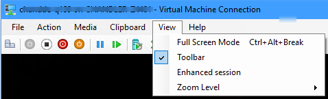

# Prepare a device for kiosk configuration

**Applies to**

-   Windows 10 Pro, Enterprise, and Education

>[!WARNING]
>For kiosks in public-facing environments with auto sign-in enabled, you should use a user account with least privilege, such as a local standard user account.
>
>Assigned access can be configured via Windows Management Instrumentation (WMI) or configuration service provider (CSP) to run its applications under a domain user or service account, rather than a local account. However, use of domain user or service accounts introduces risks that an attacker subverting the assigned access application might gain access to sensitive domain resources that have been inadvertently left accessible to any domain account. We recommend that customers proceed with caution when using domain accounts with assigned access, and consider the domain resources potentially exposed by the decision to do so.

>[!IMPORTANT]
>[User account control (UAC)](https://docs.microsoft.com/windows/security/identity-protection/user-account-control/user-account-control-overview) must be turned on to enable kiosk mode.
>
>Kiosk mode is not supported over a remote desktop connection. Your kiosk users must sign in on the physical device that is set up as a kiosk.

## Configuration recommendations

For a more secure kiosk experience, we recommend that you make the following configuration changes to the device before you configure it as a kiosk: 

Recommendation | How to
--- | ---
Hide update notifications (New in Windows 10, version 1809)   | Go to **Group Policy Editor** &gt; **Computer Configuration** &gt; **Administrative Templates\\Windows Components\\Windows Update\\Display options for update notifications** -or- Use the MDM setting **Update/UpdateNotificationLevel** from the [**Policy/Update** configuration service provider](https://docs.microsoft.com/windows/client-management/mdm/policy-csp-update#update-updatenotificationlevel) -or- Add the following registry keys as type DWORD (32-bit) in the path of **HKLM\SOFTWARE\Policies\Microsoft\Windows\WindowsUpdate**: **\SetUpdateNotificationLevel** with a value of `1`, and **\UpdateNotificationLevel** with a value of `1` to hide all notifications except restart warnings, or value of `2` to hide all notifications, including restart warnings.
Enable and schedule automatic updates | Go to **Group Policy Editor** &gt; **Computer Configuration** &gt; **Administrative Templates\\Windows Components\\Windows Update\\Configure Automatic Updates**, and select `option 4 (Auto download and schedule the install)` -or- Use the MDM setting **Update/AllowAutoUpdate** from the [**Policy/Update** configuration service provider](https://docs.microsoft.com/windows/client-management/mdm/policy-csp-update#update-allowautoupdate), and select `option 3 (Auto install and restart at a specified time)`  **Note:** Installations can take from between 30 minutes and 2 hours, depending on the device, so you should schedule updates to occur when a block of 3-4 hours is available.  To schedule the automatic update, configure **Schedule Install Day**, **Schedule Install Time**, and **Schedule Install Week**.
Enable automatic restart at the scheduled time | Go to **Group Policy Editor** &gt; **Computer Configuration** &gt; **Administrative Templates\\Windows Components\\Windows Update\\Always automatically restart at the scheduled time**
Replace "blue screen" with blank screen for OS errors   | Add the following registry key as DWORD (32-bit) type with a value of `1`:  **HKLM\SYSTEM\CurrentControlSet\Control\CrashControl\DisplayDisabled**
Put device in **Tablet mode**. | If you want users to be able to use the touch (on screen) keyboard, go to **Settings** &gt; **System** &gt; **Tablet mode** and choose **On.** Do not turn on this setting if users will not interact with the kiosk, such as for a digital sign.
Hide **Ease of access** feature on the sign-in screen. |     See [how to disable the Ease of Access button in the registry.](https://docs.microsoft.com/windows-hardware/customize/enterprise/complementary-features-to-custom-logon#welcome-screen)
Disable the hardware power button. |     Go to **Power Options** &gt; **Choose what the power button does**, change the setting to **Do nothing**, and then **Save changes**.
Remove the power button from the sign-in screen. |     Go to **Computer Configuration** &gt; **Windows Settings** &gt; **Security Settings** &gt; **Local Policies** &gt;**Security Options** &gt; **Shutdown: Allow system to be shut down without having to log on** and select **Disabled.**
Disable the camera. |     Go to **Settings** &gt; **Privacy** &gt; **Camera**, and turn off **Let apps use my camera**.
Turn off app notifications on the lock screen. |     Go to **Group Policy Editor** &gt; **Computer Configuration** &gt; **Administrative Templates\\System\\Logon\\Turn off app notifications on the lock screen**.
Disable removable media. |     Go to **Group Policy Editor** &gt; **Computer Configuration** &gt; **Administrative Templates\\System\\Device Installation\\Device Installation Restrictions**. Review the policy settings available in **Device Installation Restrictions** for the settings applicable to your situation.  **NOTE**: To prevent this policy from affecting a member of the Administrators group, in **Device Installation Restrictions**, enable **Allow administrators to override Device Installation Restriction policies**.

## Enable logging

Logs can help you [troubleshoot issues](multi-app-kiosk-troubleshoot.md) kiosk issues. Logs about configuration and runtime issues can be obtained by enabling the **Applications and Services Logs\Microsoft\Windows\AssignedAccess\Operational** channel, which is disabled by default.

## Automatic logon

In addition to the settings in the table, you may want to set up **automatic logon** for your kiosk device. When your kiosk device restarts, whether from an update or power outage, you can sign in the assigned access account manually or you can configure the device to sign in to the assigned access account automatically. Make sure that Group Policy settings applied to the device do not prevent automatic sign in.

>[!NOTE]
>If you are using a Windows 10 and later device restriction CSP to set "Preferred Azure AD tenant domain", this will break the "User logon type" auto-login feature of the Kiosk profile.

>[!TIP]
>If you use the [kiosk wizard in Windows Configuration Designer](kiosk-single-app.md#wizard) or [XML in a provisioning package](lock-down-windows-10-to-specific-apps.md) to configure your kiosk, you can set an account to sign in automatically in the wizard or XML. 

**How to edit the registry to have an account sign in automatically**

1. Open Registry Editor (regedit.exe).

   >[!NOTE]  
   >If you are not familiar with Registry Editor, [learn how to modify the Windows registry](https://go.microsoft.com/fwlink/p/?LinkId=615002).
  
 
2. Go to

   **HKEY\_LOCAL\_MACHINE\SOFTWARE\\Microsoft\WindowsNT\CurrentVersion\Winlogon**

3. Set the values for the following keys.

   - *AutoAdminLogon*: set value as **1**.

   - *DefaultUserName*: set value as the account that you want signed in.

   - *DefaultPassword*: set value as the password for the account.

     > [!NOTE]
     > If *DefaultUserName* and *DefaultPassword* aren't there, add them as **New** &gt; **String Value**.

   - *DefaultDomainName*: set value for domain, only for domain accounts. For local accounts, do not add this key.

4. Close Registry Editor. The next time the computer restarts, the account will sign in automatically.

>[!TIP]
>You can also configure automatic sign-in [using the Autologon tool from Sysinternals](https://docs.microsoft.com/sysinternals/downloads/autologon).

## Interactions and interoperability

The following table describes some features that have interoperability issues we recommend that you consider when running assigned access.

> [!Note]
> Where applicable, the table notes which features are optional that you can configure for assigned access.

<table>
<colgroup>
<col width="50%" />
<col width="50%" />
</colgroup>
<thead>
<tr class="header">
<th>Feature</th>
<th>Description</th>
</tr>
</thead>
<tbody>
<tr class="odd">
<td>
Accessibility
</td>
<td>
Assigned access does not change Ease of Access settings.

We recommend that you use <a href="https://docs.microsoft.com/windows-hardware/customize/enterprise/keyboardfilter" data-raw-source="[Keyboard Filter](https://docs.microsoft.com/windows-hardware/customize/enterprise/keyboardfilter)">Keyboard Filter</a> to block the following key combinations that bring up accessibility features:

<table>
<colgroup>
<col width="50%" />
<col width="50%" />
</colgroup>
<thead>
<tr class="header">
<th>Key combination</th>
<th>Blocked behavior</th>
</tr>
</thead>
<tbody>
<tr class="odd">
<td>
Left Alt+Left Shift+Print Screen
</td>
<td>
Open High Contrast dialog box.
</td>
</tr>
<tr class="even">
<td>
Left Alt+Left Shift+Num Lock
</td>
<td>
Open Mouse Keys dialog box.
</td>
</tr>
<tr class="odd">
<td>
Windows logo key+U
</td>
<td>
Open Ease of Access Center.
</td>
</tr>
</tbody>
</table>

 
</td>
</tr>
<tr class="even">
<td>
Assigned access Windows PowerShell cmdlets
</td>
<td>
In addition to using the Windows UI, you can use the Windows PowerShell cmdlets to set or clear assigned access. For more information, see <a href="https://docs.microsoft.com/powershell/module/assignedaccess/?view=win10-ps" data-raw-source="[Assigned access Windows PowerShell reference](https://docs.microsoft.com/powershell/module/assignedaccess/?view=win10-ps)">Assigned access Windows PowerShell reference</a>.
</td>
</tr>
<tr class="odd">
<td>
Key sequences blocked by assigned access
</td>
<td>
When in assigned access, some key combinations are blocked for assigned access users.

Alt+F4, Alt+Shift+TaB, Alt+Tab are not blocked by Assigned Access, it is recommended you use <a href="https://docs.microsoft.com/windows-hardware/customize/enterprise/keyboardfilter" data-raw-source="[Keyboard Filter](https://docs.microsoft.com/windows-hardware/customize/enterprise/keyboardfilter)">Keyboard Filter</a> to block these key combinations.

Ctrl+Alt+Delete is the key to break out of Assigned Access. If needed, you can use Keyboard Filter to configure a different key combination to break out of assigned access by setting BreakoutKeyScanCode as described in <a href="https://docs.microsoft.com/windows-hardware/customize/enterprise/wekf-settings" data-raw-source="[WEKF_Settings](https://docs.microsoft.com/windows-hardware/customize/enterprise/wekf-settings)">WEKF_Settings</a>.

<table>
<colgroup>
<col width="50%" />
<col width="50%" />
</colgroup>
<thead>
<tr class="header">
<th>Key combination</th>
<th>Blocked behavior for assigned access users</th>
</tr>
</thead>
<tbody>
<tr class="odd">
<td>
Alt+Esc
</td>
<td>
Cycle through items in the reverse order from which they were opened.
</td>
</tr>
<tr class="even">
<td>
Ctrl+Alt+Esc
</td>
<td>
Cycle through items in the reverse order from which they were opened.
</td>
</tr>
<tr class="odd">
<td>
Ctrl+Esc
</td>
<td>
Open the Start screen.
</td>
</tr>
<tr class="even">
<td>
Ctrl+F4
</td>
<td>
Close the window.
</td>
</tr>
<tr class="odd">
<td>
Ctrl+Shift+Esc
</td>
<td>
Open Task Manager.
</td>
</tr>
<tr class="even">
<td>
Ctrl+Tab
</td>
<td>
Switch windows within the application currently open.
</td>
</tr>
<tr class="odd">
<td>
LaunchApp1
</td>
<td>
Open the app that is assigned to this key.
</td>
</tr>
<tr class="even">
<td>
LaunchApp2
</td>
<td>
Open the app that is assigned to this key, which on many Microsoft keyboards is Calculator.
</td>
</tr>
<tr class="odd">
<td>
LaunchMail
</td>
<td>
Open the default mail client.
</td>
</tr>
<tr class="even">
<td>
Windows logo key
</td>
<td>
Open the Start screen.
</td>
</tr>
</tbody>
</table>

 

Keyboard Filter settings apply to other standard accounts.
</td>
</tr>
<tr class="even">
<td>
Key sequences blocked by <a href="https://docs.microsoft.com/windows-hardware/customize/enterprise/keyboardfilter" data-raw-source="[Keyboard Filter](https://docs.microsoft.com/windows-hardware/customize/enterprise/keyboardfilter)">Keyboard Filter</a>
</td>
<td>
If Keyboard Filter is turned ON then some key combinations are blocked automatically without you having to explicitly block them. For more information, see the <a href="https://docs.microsoft.com/windows-hardware/customize/enterprise/keyboardfilter" data-raw-source="[Keyboard Filter](https://docs.microsoft.com/windows-hardware/customize/enterprise/keyboardfilter)">Keyboard Filter</a> reference topic.

<a href="https://docs.microsoft.com/windows-hardware/customize/enterprise/keyboardfilter" data-raw-source="[Keyboard Filter](https://docs.microsoft.com/windows-hardware/customize/enterprise/keyboardfilter)">Keyboard Filter</a> is only available on Windows 10 Enterprise or Windows 10 Education.

</td>
</tr>
<tr class="odd">
<td>
Power button
</td>
<td>
Customizations for the Power button complement assigned access, letting you implement features such as removing the power button from the Welcome screen. Removing the power button ensures the user cannot turn off the device when it is in assigned access.

For more information on removing the power button or disabling the physical power button, see <a href="https://docs.microsoft.com/windows-hardware/customize/enterprise/custom-logon" data-raw-source="[Custom Logon](https://docs.microsoft.com/windows-hardware/customize/enterprise/custom-logon)">Custom Logon</a>.
</td>
</tr>
<tr class="even">
<td>
Unified Write Filter (UWF)
</td>
<td>
UWFsettings apply to all users, including those with assigned access.

For more information, see <a href="https://docs.microsoft.com/windows-hardware/customize/enterprise/unified-write-filter" data-raw-source="[Unified Write Filter](https://docs.microsoft.com/windows-hardware/customize/enterprise/unified-write-filter)">Unified Write Filter</a>.
</td>
</tr>
<tr class="odd">
<td>
WEDL_AssignedAccess class
</td>
<td>
Although you can use this class to configure and manage basic lockdown features for assigned access, we recommend that you use the Windows PowerShell cmdlets instead.

If you need to use assigned access API, see <a href="whttps://docs.microsoft.com/windows-hardware/customize/enterprise/wedl-assignedaccess" data-raw-source="[WEDL_AssignedAccess](whttps://docs.microsoft.com/windows-hardware/customize/enterprise/wedl-assignedaccess)">WEDL_AssignedAccess</a>.
</td>
</tr>
<tr class="even">
<td>
Welcome Screen
</td>
<td>
Customizations for the Welcome screen let you personalize not only how the Welcome screen looks, but for how it functions. You can disable the power or language button, or remove all user interface elements. There are many options to make the Welcome screen your own.

For more information, see <a href="https://docs.microsoft.com/windows-hardware/customize/enterprise/custom-logon" data-raw-source="[Custom Logon](https://docs.microsoft.com/windows-hardware/customize/enterprise/custom-logon)">Custom Logon</a>.
</td>
</tr>
</tbody>
</table>

## Testing your kiosk in a virtual machine (VM)

Customers sometimes use virtual machines (VMs) to test configurations before deploying those configurations to physical devices. If you use a VM to test your single-app kiosk configuration, you need to know how to connect to the VM properly.

A single-app kiosk kiosk configuration runs an app above the lockscreen. It doesn't work when it's accessed remotely, which includes *enhanced* sessions in Hyper-V. 

When you connect to a VM configured as a single-app kiosk, you need a *basic* session rather than an enhanced session. In the following image, notice that **Enhanced session** is not selected in the **View** menu; that means it's a basic session.

To connect to a VM in a basic session, do not select **Connect** in the connection dialog, as shown in the following image, but instead, select the **X** button in the upper-right corner to cancel the dialog. 

