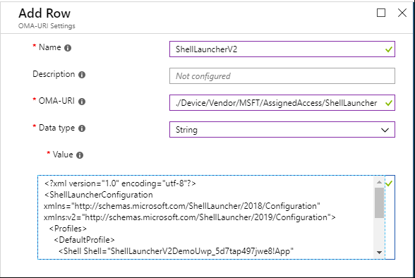

# Use Shell Launcher to create a Windows 10 kiosk


**Applies to**
- Windows 10 Ent, Edu

>[!WARNING]
>Some information relates to prereleased product which may be substantially modified before it's commercially released. Microsoft makes no warranties, express or implied, with respect to the information provided here.

Using Shell Launcher, you can configure a device that runs an application as the user interface, replacing the default shell (explorer.exe). In **Shell Launcher v1**, available in Windows 10, version 1809 and earlier, you can only specify a Windows desktop application as the replacement shell. In **Shell Launcher v2**, available in the next feature update to Windows 10, you can also specify a UWP app as the replacement shell.

>[!NOTE]
>Shell Launcher controls which application the user sees as the shell after sign-in. It does not prevent the user from accessing other desktop applications and system components. 
>
>Methods of controlling access to other desktop applications and system components can be used in addition to using the Shell Launcher. These methods include, but are not limited to:
>- [Group Policy](https://www.microsoft.com/download/details.aspx?id=25250) - example: Prevent access to registry editing tools
>- [AppLocker](https://docs.microsoft.com/windows/security/threat-protection/windows-defender-application-control/applocker/applocker-overview) - Application control policies
>- [Mobile Device Management](https://docs.microsoft.com/windows/client-management/mdm) - Enterprise management of device security policies

You can apply a custom shell through Shell Launcher [by using PowerShell](#configure-a-custom-shell-using-powershell). In Windows 10, version 1803 and later, you can also [use mobile device management (MDM)](#configure-a-custom-shell-in-mdm) to apply a custom shell through Shell Launcher.


## Differences between Shell Launcher v1 and Shell Launcher v2

Shell Launcher v1 replaces `explorer.exe`, the default shell, with `eshell.exe` which can launch a Windows desktop application.

Shell Launcher v2 replaces `explorer.exe` with `customshellhost.exe`. This new executable file can launch a Windows desktop application or a UWP app.

In addition to allowing you to use a UWP app for your replacement shell, Shell Launcher v2 offers additional enhancements:
- You can use a custom Windows desktop application that can then launch UWP apps, such as **Settings** and **Touch Keyboard**.
- From a custom UWP shell, you can launch secondary views and run on multiple monitors.
- The custom shell app runs in full screen, and and can run other apps in full screen on user’s demand.

For sample XML configurations for the different app combinations, see [Samples for Shell Launcher v2](https://github.com/Microsoft/Windows-iotcore-samples/tree/develop/Samples/ShellLauncherV2).

## Requirements

>[!WARNING]
>- Windows 10 doesn’t support setting a custom shell prior to OOBE. If you do, you won’t be able to deploy the resulting image.
>
>- Shell Launcher doesn't support a custom shell with an application that launches a different process and exits. For example, you cannot specify **write.exe** in Shell Launcher. Shell Launcher launches a custom shell and monitors the process to identify when the custom shell exits. **Write.exe** creates a 32-bit wordpad.exe process and exits. Because Shell Launcher is not aware of the newly created wordpad.exe process, Shell Launcher will take action based on the exit code of **Write.exe**, such as restarting the custom shell. 

-   A domain, Azure Active Directory, or local user account.

-   A Windows application that is installed for that account. The app can be your own company application or a common app like Internet Explorer.

[See the technical reference for the shell launcher component.](https://docs.microsoft.com/windows-hardware/customize/enterprise/shell-launcher)

## Enable Shell Launcher feature

To set a custom shell, you first turn on the Shell Launcher feature, and then you can set your custom shell as the default using PowerShell or MDM.

**To turn on Shell Launcher in Windows features**

1. Go to Control Panel &gt; **Programs and features** &gt; **Turn Windows features on or off**.

2. Expand **Device Lockdown**.

2. Select **Shell Launcher** and **OK**.

Alternatively, you can turn on Shell Launcher using Windows Configuration Designer in a provisioning package, using `SMISettings > ShellLauncher`, or you can use the Deployment Image Servicing and Management (DISM.exe) tool.

**To turn on Shell Launcher using DISM**

1.  Open a command prompt as an administrator.
2.  Enter the following command.

    ```
    Dism /online /Enable-Feature /all /FeatureName:Client-EmbeddedShellLauncher
    ```


## Configure a custom shell in MDM

You can use XML and a [custom OMA-URI setting](#custom-oma-uri-setting) to configure Shell Launcher in MDM.

### XML for Shell Launcher configuration

The following XML sample works for **Shell Launcher v1**:

```
<?xml version="1.0" encoding="utf-8"?> 
<ShellLauncherConfiguration xmlns="http://schemas.microsoft.com/ShellLauncher/2018/Configuration"> 
  <Profiles> 
    <Profile ID="{24A7309204F3F-44CC-8375-53F13FE213F7}"> 
      <Shell Shell="%ProgramFiles%\Internet Explorer\iexplore.exe -k www.bing.com" /> 
    </Profile> 
  </Profiles> 
  <Configs>
    <!--local account-->
    <Account Name="ShellLauncherUser"/>
    <Profile ID="{24A7309204F3F-44CC-8375-53F13FE213F7}"/>
  </Configs>
</ShellLauncherConfiguration>
``` 

For **Shell Launcher v2**, you will use a different schema reference and a different app type for `Shell`, as shown in the following example.

```
<?xml version="1.0" encoding="utf-8"?> 
<ShellLauncherConfiguration xmlns="http://schemas.microsoft.com/ShellLauncher/2018/Configuration" 
xmlns:v2="http://schemas.microsoft.com/ShellLauncher/2019/Configuration"> 
  <Profiles> 
    <DefaultProfile> 
      <Shell Shell="ShellLauncherV2DemoUwp_5d7tap497jwe8!App" v2:AppType="UWP" v2:AllAppsFullScreen="true"> 
        <DefaultAction Action="RestartShell"/> 
      </Shell> 
    </DefaultProfile> 
  </Profiles> 
  <Configs/> 
</ShellLauncherConfiguration>
``` 

>[!TIP]
>In the XML for Shell Launcher v2, note the **AllAppsFullScreen** attribute. When set to **True**, Shell Launcher will run every app in full screen, or maximized for desktop apps. When this attribute is set to **False** or not set, only the custom shell app runs in full screen; other apps launched by the user will run in windowed mode.

[Get XML examples for different Shell Launcher v2 configurations.](https://github.com/Microsoft/Windows-iotcore-samples/tree/develop/Samples/ShellLauncherV2)

### Custom OMA-URI setting

In your MDM service, you can create a [custom OMA-URI setting](https://docs.microsoft.com/intune/custom-settings-windows-10) to configure Shell Launcher v1 or v2. (The [XML](#xml-for-shell-launcher-configuration) that you use for your setting will determine whether you apply Shell Launcher v1 or v2.)

The OMA-URI path is `./Device/Vendor/MSFT/AssignedAccess/ShellLauncher`.

For the value, you can select data type `String` and paste the desired configuration file content into the value box. If you wish to upload the xml instead of pasting the content, choose data type `String (XML file)` instead. 



After you configure the profile containing the custom Shell Launcher setting, select **All Devices** or selected groups of devices to apply the profile to. Don't assign the profile to users or user groups.

## Configure a custom shell using PowerShell 

For scripts for Shell Launcher v2, see [Shell Launcher v2 Bridge WMI sample scripts](https://github.com/Microsoft/Windows-iotcore-samples/blob/develop/Samples/ShellLauncherV2/SampleBridgeWmiScripts/README.md).

For Shell Launcher v1, modify the following PowerShell script as appropriate. The comments in the sample script explain the purpose of each section and tell you where you will want to change the script for your purposes. Save your script with the extension .ps1, open Windows PowerShell as administrator, and run the script on the kiosk device.

```
# Check if shell launcher license is enabled
function Check-ShellLauncherLicenseEnabled
{
    [string]$source = @"
using System;
using System.Runtime.InteropServices;

static class CheckShellLauncherLicense
{
    const int S_OK = 0;

    public static bool IsShellLauncherLicenseEnabled()
    {
        int enabled = 0;

        if (NativeMethods.SLGetWindowsInformationDWORD("EmbeddedFeature-ShellLauncher-Enabled", out enabled) != S_OK) {
            enabled = 0;
        }
        
        return (enabled != 0);
    }

    static class NativeMethods
    {
        [DllImport("Slc.dll")]
        internal static extern int SLGetWindowsInformationDWORD([MarshalAs(UnmanagedType.LPWStr)]string valueName, out int value);
    }

}
"@

    $type = Add-Type -TypeDefinition $source -PassThru

    return $type[0]::IsShellLauncherLicenseEnabled()
}

[bool]$result = $false

$result = Check-ShellLauncherLicenseEnabled
"`nShell Launcher license enabled is set to " + $result
if (-not($result))
{
    "`nThis device doesn't have required license to use Shell Launcher"
    exit
}

$COMPUTER = "localhost"
$NAMESPACE = "root\standardcimv2\embedded"

# Create a handle to the class instance so we can call the static methods.
try {
    $ShellLauncherClass = [wmiclass]"\\$COMPUTER\${NAMESPACE}:WESL_UserSetting"
    } catch [Exception] {
    write-host $_.Exception.Message; 
    write-host "Make sure Shell Launcher feature is enabled"
    exit
    }


# This well-known security identifier (SID) corresponds to the BUILTIN\Administrators group.

$Admins_SID = "S-1-5-32-544"

# Create a function to retrieve the SID for a user account on a machine.

function Get-UsernameSID($AccountName) {

    $NTUserObject = New-Object System.Security.Principal.NTAccount($AccountName)
    $NTUserSID = $NTUserObject.Translate([System.Security.Principal.SecurityIdentifier])

    return $NTUserSID.Value
    
}

# Get the SID for a user account named "Cashier". Rename "Cashier" to an existing account on your system to test this script.

$Cashier_SID = Get-UsernameSID("Cashier")

# Define actions to take when the shell program exits.

$restart_shell = 0
$restart_device = 1
$shutdown_device = 2

# Examples. You can change these examples to use the program that you want to use as the shell.

# This example sets the command prompt as the default shell, and restarts the device if the command prompt is closed. 

$ShellLauncherClass.SetDefaultShell("cmd.exe", $restart_device)

# Display the default shell to verify that it was added correctly.

$DefaultShellObject = $ShellLauncherClass.GetDefaultShell()

"`nDefault Shell is set to " + $DefaultShellObject.Shell + " and the default action is set to " + $DefaultShellObject.defaultaction

# Set Internet Explorer as the shell for "Cashier", and restart the machine if Internet Explorer is closed.

$ShellLauncherClass.SetCustomShell($Cashier_SID, "c:\program files\internet explorer\iexplore.exe www.microsoft.com", ($null), ($null), $restart_shell)

# Set Explorer as the shell for administrators.

$ShellLauncherClass.SetCustomShell($Admins_SID, "explorer.exe")

# View all the custom shells defined.

"`nCurrent settings for custom shells:"
Get-WmiObject -namespace $NAMESPACE -computer $COMPUTER -class WESL_UserSetting | Select Sid, Shell, DefaultAction

# Enable Shell Launcher

$ShellLauncherClass.SetEnabled($TRUE)

$IsShellLauncherEnabled = $ShellLauncherClass.IsEnabled()

"`nEnabled is set to " + $IsShellLauncherEnabled.Enabled

# Remove the new custom shells.

$ShellLauncherClass.RemoveCustomShell($Admins_SID)

$ShellLauncherClass.RemoveCustomShell($Cashier_SID)

# Disable Shell Launcher

$ShellLauncherClass.SetEnabled($FALSE)

$IsShellLauncherEnabled = $ShellLauncherClass.IsEnabled()

"`nEnabled is set to " + $IsShellLauncherEnabled.Enabled
```
