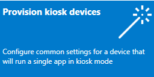
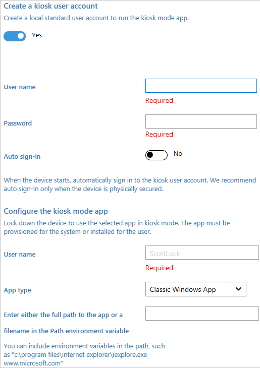

# Set up a single-app kiosk


**Applies to**

-   Windows 10 Pro, Enterprise, and Education


|  |  |
--- | ---
A single-app kiosk uses the Assigned Access feature to run a single app above the lockscreen.<br><br> When the kiosk account signs in, the app is launched automatically. The person using the kiosk cannot do anything on the device outside of the kiosk app. | 

>[!IMPORTANT]
>[User account control (UAC)](https://docs.microsoft.com/windows/security/identity-protection/user-account-control/user-account-control-overview) must be turned on to enable kiosk mode.
>
>Kiosk mode is not supported over a remote desktop connection. Your kiosk users must sign in on the physical device that is set up as a kiosk.

You have several options for configuring your single-app kiosk. 

Method | Description
--- | ---
[Locally, in Settings](#local) | The **Set up a kiosk** (previously named **Set up assigned access**) option in **Settings** is a quick and easy method to set up a single device as a kiosk for a local standard user account. <br><br>This method is supported on Windows 10 Pro, Enterprise, and Education.
[PowerShell](#powershell) | You can use Windows PowerShell cmdlets to set up a single-app kiosk. First, you need to [create the user account](https://support.microsoft.com/help/4026923/windows-create-a-local-user-or-administrator-account-in-windows-10) on the device and install the kiosk app for that account.<br><br>This method is supported on Windows 10 Pro, Enterprise, and Education.
[The kiosk wizard in Windows Configuration Designer](#wizard) | Windows Configuration Designer is a tool that produces a *provisioning package*, which is a package of configuration settings that can be applied to one or more devices during the first-run experience (OOBE) or after OOBE is done (runtime). You can also create the kiosk user account and install the kiosk app, as well as other useful settings, using the kiosk wizard.<br><br>This method is supported on Windows 10 Pro (version 1709 and later), Enterprise, and Education.
[Microsoft Intune or other mobile device management (MDM) provider](#mdm) | For managed devices, you can use MDM to set up a kiosk configuration.<br><br>This method is supported on Windows 10 Pro (version 1709 and later), Enterprise, and Education.


>[!TIP]
>You can also configure a kiosk account and app for single-app kiosk within [XML in a provisioning package](lock-down-windows-10-to-specific-apps.md) by using a [kiosk profile](lock-down-windows-10-to-specific-apps.md#profile).  
>
>Be sure to check the [configuration recommendations](kiosk-prepare.md) before you set up your kiosk.


<span id="local"/>
## Set up a kiosk in local Settings

>App type: UWP
>
>OS edition: Windows 10 Pro, Ent, Edu
>
>Account type: Local standard user

You can use **Settings** to quickly configure one or a few devices as a kiosk. 

When your kiosk is a local device that is not managed by Active Directory or Azure Active Directory, there is a default setting that enables automatic sign-in after a restart. That means that when the device restarts, the last signed-in user will be signed in automatically. If the last signed-in user is the kiosk account, the kiosk app will be launched automatically after the device restarts.

- If you want the kiosk account signed in automatically and the kiosk app launched when the device restarts, there is nothing you need to do.

- If you do not want the kiosk account signed in automatically when the device restarts, you must change the default setting before you configure the device as a kiosk. Sign in with the account that you will assign as the kiosk account, go to **Settings** > **Accounts** > **Sign-in options**, and toggle the **Use my sign-in info to automatically finish setting up my device after an update or restart** setting to **Off**. After you change the setting, you can apply the kiosk configuration to the device.


### Instructions for Windows 10, version 1809

When you set up a kiosk (also known as *assigned access*) in **Settings** for Windows 10, version 1809, you create the kiosk user account at the same time.

**To set up assigned access in PC settings**

1.  Go to **Start** &gt; **Settings** &gt; **Accounts** &gt; **Other users**.

2.  Select **Set up a kiosk > Assigned access**, and then select **Get started**.

3.  Enter a name for the new account. 

    >[!NOTE]
    >If there are any local standard user accounts on the device already, the **Create an account** page will offer the option to **Choose an existing account**.

4.  Choose the app that will run when the kiosk account signs in. Only apps that can run above the lock screen will be available in the list of apps to choose from. For more information, see [Guidelines for choosing an app for assigned access](guidelines-for-assigned-access-app.md). If you select **Microsoft Edge** as the kiosk app, you configure the following options:

    - Whether Microsoft Edge should display your website full-screen (digital sign) or with some browser controls available (public browser)
    - Which URL should be displayed when the kiosk accounts signs in
    - When Microsoft Edge should restart after a period of inactivity (if you select to run as a public browser)

5.  Select **Close**.

To remove assigned access, select the account tile on the **Set up a kiosk** page, and then select **Remove kiosk**.


### Instructions for Windows 10, version 1803 and earlier

When you set up a kiosk (also known as *assigned access*) in **Settings** for Windows 10, version 1803 and earlier, you must select an existing local standard user account. [Learn how to create a local standard user account.](https://support.microsoft.com/help/4026923/windows-create-a-local-user-or-administrator-account-in-windows-10)


**To set up assigned access in PC settings**

1.  Go to **Start** &gt; **Settings** &gt; **Accounts** &gt; **Other people**.

2.  Select **Set up assigned access**.

3.  Choose an account.

4.  Choose an app. Only apps that can run above the lock screen will be available in the list of apps to choose from. For more information, see [Guidelines for choosing an app for assigned access](guidelines-for-assigned-access-app.md).

5.  Close **Settings** – your choices are saved automatically, and will be applied the next time that user account logs on.

To remove assigned access, choose **Turn off assigned access and sign out of the selected account**.


<span id="powershell"/>
## Set up a kiosk using Windows PowerShell

 
>App type: UWP
>
>OS edition: Windows 10 Pro, Ent, Edu
>
>Account type: Local standard user


You can use any of the following PowerShell cmdlets to set up assigned access on multiple devices. 

Before you run the cmdlet:

1. Log in as administrator.
2. [Create the user account](https://support.microsoft.com/help/4026923/windows-create-a-local-user-or-administrator-account-in-windows-10) for Assigned Access.
3. Log in as the Assigned Access user account.
4. Install the Universal Windows app that follows the assigned access/above the lock guidelines.
5. Log out as the Assigned Access user account.
6. Log in as administrator.

To open PowerShell on Windows 10, search for PowerShell and find **Windows PowerShell Desktop app** in the results. Run PowerShell as administrator.

**Configure assigned access by AppUserModelID and user name**

```
Set-AssignedAccess -AppUserModelId <AUMID> -UserName <username>
```
**Configure assigned access by AppUserModelID and user SID**

```
Set-AssignedAccess -AppUserModelId <AUMID> -UserSID <usersid>
```
**Configure assigned access by app name and user name**

```
Set-AssignedAccess -AppName <CustomApp> -UserName <username>
```
**Configure assigned access by app name and user SID**

```
Set-AssignedAccess -AppName <CustomApp> -UserSID <usersid>
```

> [!NOTE]
> To set up assigned access using `-AppName`, the user account that you specify for assigned access must have logged on at least once. 

[Learn how to get the AUMID](https://go.microsoft.com/fwlink/p/?LinkId=614867).

[Learn how to get the AppName](https://msdn.microsoft.com/library/windows/hardware/mt620046%28v=vs.85%29.aspx) (see **Parameters**).

To remove assigned access, using PowerShell, run the following cmdlet.

```
Clear-AssignedAccess
```


<span id="wizard" />
## Set up a kiosk using the kiosk wizard in Windows Configuration Designer

>App type: UWP or Windows desktop application
>
>OS edition: Windows 10 Pro (version 1709 and later) for UWP only; Ent, Edu for both app types
>
>Account type: Local standard user, Active Directory 




>[!IMPORTANT]
>When Exchange Active Sync (EAS) password restrictions are active on the device, the autologon feature does not work. This behavior is by design. For more informations, see [How to turn on automatic logon in Windows](https://support.microsoft.com/help/324737/how-to-turn-on-automatic-logon-in-windows).

When you use the **Provision kiosk devices** wizard in Windows Configuration Designer, you can configure the kiosk to run either a Universal Windows app or a Windows desktop application.


[Install Windows Configuration Designer](provisioning-packages/provisioning-install-icd.md), then open Windows Configuration Designer and select **Provision kiosk devices**. After you name your project, and click **Next**, configure the settings as shown in the following table.


<table>
<tr><td  style="width:45%" valign="top"></br></br>Enable device setup if you want to configure settings on this page.</br></br><strong>If enabled:</strong></br></br>Enter a name for the device.</br></br>(Optional) Select a license file to upgrade Windows 10 to a different edition. <a href="https://technet.microsoft.com/itpro/windows/deploy/windows-10-edition-upgrades" data-raw-source="[See the permitted upgrades.](https://technet.microsoft.com/itpro/windows/deploy/windows-10-edition-upgrades)">See the permitted upgrades.</a></br></br>Toggle <strong>Configure devices for shared use</strong> off. This setting optimizes Windows 10 for shared use scenarios and isn&#39;t necessary for a kiosk scenario.</br></br>You can also select to remove pre-installed software from the device. </td><td></td></tr>
<tr><td  style="width:45%" valign="top">  </br></br>Enable network setup if you want to configure settings on this page.</br></br><strong>If enabled:</strong></br></br>Toggle <strong>On</strong> or <strong>Off</strong> for wireless network connectivity. If you select <strong>On</strong>, enter the SSID, the network type (<strong>Open</strong> or <strong>WPA2-Personal</strong>), and (if <strong>WPA2-Personal</strong>) the password for the wireless network.</td><td></td></tr>
<tr><td  style="width:45%" valign="top">  </br></br>Enable account management if you want to configure settings on this page. </br></br><strong>If enabled:</strong></br></br>You can enroll the device in Active Directory, enroll in Azure Active Directory, or create a local administrator account on the device</br></br>To enroll the device in Active Directory, enter the credentials for a least-privileged user account to join the device to the domain.</br></br>Before you use a Windows Configuration Designer wizard to configure bulk Azure AD enrollment, <a href="https://docs.microsoft.com/azure/active-directory/active-directory-azureadjoin-setup" data-raw-source="[set up Azure AD join in your organization](https://docs.microsoft.com/azure/active-directory/active-directory-azureadjoin-setup)">set up Azure AD join in your organization</a>. The <strong>maximum number of devices per user</strong> setting in your Azure AD tenant determines how many times the bulk token that you get in the wizard can be used. To enroll the device in Azure AD, select that option and enter a friendly name for the bulk token you will get using the wizard. Set an expiration date for the token (maximum is 180 days from the date you get the token). Click <strong>Get bulk token</strong>. In the <strong>Let&#39;s get you signed in</strong> window, enter an account that has permissions to join a device to Azure AD, and then the password. Click <strong>Accept</strong> to give Windows Configuration Designer the necessary permissions.</br></br><strong>Warning:</strong> You must run Windows Configuration Designer on Windows 10 to configure Azure Active Directory enrollment using any of the wizards.</br></br>To create a local administrator account, select that option and enter a user name and password. </br></br><strong>Important:</strong> If you create a local account in the provisioning package, you must change the password using the <strong>Settings</strong> app every 42 days. If the password is not changed during that period, the account might be locked out and unable to sign in.  </td><td></td></tr>
<tr><td  style="width:45%" valign="top"> </br></br>You can provision the kiosk app in the <strong>Add applications</strong> step. You can install multiple applications, both Windows desktop applications (Win32) and Universal Windows Platform (UWP) apps, in a provisioning package. The settings in this step vary according to the application that you select. For help with the settings, see <a href="provisioning-packages/provision-pcs-with-apps.md" data-raw-source="[Provision PCs with apps](provisioning-packages/provision-pcs-with-apps.md)">Provision PCs with apps</a></br></br><strong>Warning:</strong> If you click the plus button to add an application, you must specify an application for the provisioning package to validate. If you click the plus button in error, select any executable file in <strong>Installer Path</strong>, and then a <strong>Cancel</strong> button becomes available, allowing you to complete the provisioning package without an application. </td><td></td></tr>
<tr><td  style="width:45%" valign="top"> </br></br>To provision the device with a certificate for the kiosk app, click <strong>Add a certificate</strong>. Enter a name for the certificate, and then browse to and select the certificate to be used.</td><td></td></tr> 
<tr><td  style="width:45%" valign="top">  </br></br>You can create a local standard user account that will be used to run the kiosk app. If you toggle <strong>No</strong>, make sure that you have an existing user account to run the kiosk app.</br></br>If you want to create an account, enter the user name and password, and then toggle <strong>Yes</strong> or <strong>No</strong> to automatically sign in the account when the device starts. (If you encounter issues with auto sign-in after you apply the provisioning package, check the Event Viewer logs for auto logon issues under <strong>Applications and Services Logs\Microsoft\Windows\Authentication User Interface\Operational</strong>.)</br></br>In <strong>Configure the kiosk mode app</strong>, enter the name of the user account that will run the kiosk mode app. Select the type of app to run in kiosk mode, and then enter the path or filename (for a Windows desktop application) or the AUMID (for a Universal Windows app). For a Windows desktop application, you can use the filename if the path to the file is in the PATH environment variable, otherwise the full path is required.</td><td></td></tr>
<tr><td  style="width:45%" valign="top">  </br></br>On this step, select your options for tablet mode, the user experience on the Welcome and shutdown screens, and the timeout settings.</td><td></td></tr>
<tr><td  style="width:45%" valign="top">  </br></br>You can set a password to protect your provisioning package. You must enter this password when you apply the provisioning package to a device.</td><td></td></tr>
</table>


>[!NOTE]
>If you want to use [the advanced editor in Windows Configuration Designer](provisioning-packages/provisioning-create-package.md#configure-settings), specify the user account and app (by AUMID) in **Runtime settings** &gt; **AssignedAccess** &gt; **AssignedAccessSettings**

>[!IMPORTANT]
>When you build a provisioning package, you may include sensitive information in the project files and in the provisioning package (.ppkg) file. Although you have the option to encrypt the .ppkg file, project files are not encrypted. You should store the project files in a secure location and delete the project files when they are no longer needed.


[Learn how to apply a provisioning package.](provisioning-packages/provisioning-apply-package.md)


 


<span id="mdm" />
## Set up a kiosk or digital sign using Microsoft Intune or other MDM service

>App type: UWP 
>
>OS edition: Windows 10 Pro (version 1709), Ent, Edu
>
>Account type: Local standard user, Azure AD


Microsoft Intune and other MDM services enable kiosk configuration through the [AssignedAccess configuration service provider (CSP)](https://docs.microsoft.com/windows/client-management/mdm/assignedaccess-csp). Assigned Access has a `KioskModeApp` setting. In the `KioskModeApp` setting, you enter the user account name and the [AUMID](https://docs.microsoft.com/windows-hardware/customize/enterprise/find-the-application-user-model-id-of-an-installed-app) for the app to run in kiosk mode.

>[!TIP]
>Starting in Windows 10, version 1803, a ShellLauncher node has been added to the [AssignedAccess CSP](https://docs.microsoft.com/windows/client-management/mdm/assignedaccess-csp). 

To configure a kiosk in Microsoft Intune, see [Windows 10 and Windows Holographic for Business device settings to run as a dedicated kiosk using Intune](https://docs.microsoft.com/intune/kiosk-settings). For other MDM services, see the documentation for your provider.


## Sign out of assigned access

To exit the assigned access (kiosk) app, press **Ctrl + Alt + Del**, and then sign in using another account. When you press **Ctrl + Alt + Del** to sign out of assigned access, the kiosk app will exit automatically. If you sign in again as the assigned access account or wait for the login screen timeout, the kiosk app will be re-launched. The assigned access user will remain signed in until an admin account opens **Task Manager** > **Users** and signs out the user account.

If you press **Ctrl + Alt + Del** and do not sign in to another account, after a set time, assigned access will resume. The default time is 30 seconds, but you can change that in the following registry key:

**HKEY\_LOCAL\_MACHINE\SOFTWARE\Microsoft\Windows\CurrentVersion\Authentication\LogonUI**

To change the default time for assigned access to resume, add *IdleTimeOut* (DWORD) and enter the value data as milliseconds in hexadecimal.

 


