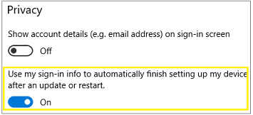
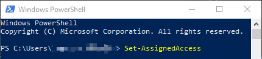

<!--8107263-->

# Set up a single-app kiosk

A single-app kiosk uses the Assigned Access feature to run a single app above the lock screen. When the kiosk account signs in, the app is launched automatically. The person using the kiosk cannot do anything on the device outside of the kiosk app.


>[!IMPORTANT]
>[User account control (UAC)](/windows/security/identity-protection/user-account-control/user-account-control-overview) must be turned on to enable kiosk mode.
>
>Kiosk mode is not supported over a remote desktop connection. Your kiosk users must sign in on the physical device that is set up as a kiosk. Apps that run in kiosk mode cannot use copy and paste.

You have several options for configuring your single-app kiosk.

- [Locally, in Settings](#local):  The **Set up a kiosk** (previously named **Set up assigned access**) option in **Settings** is a quick and easy method to set up a single device as a kiosk for a local standard user account.

  This option supports:

  - Windows 10 Pro, Enterprise, and Education
  - Windows 11

- [PowerShell](#powershell): You can use Windows PowerShell cmdlets to set up a single-app kiosk. First, you need to [create the user account](https://support.microsoft.com/help/4026923/windows-create-a-local-user-or-administrator-account-in-windows-10) on the device and install the kiosk app for that account.

  This option supports:

  - Windows 10 Pro, Enterprise, and Education
  - Windows 11

- [The kiosk wizard in Windows Configuration Designer](#wizard): Windows Configuration Designer is a tool that produces a *provisioning package*. A provisioning package includes configuration settings that can be applied to one or more devices during the first-run experience (OOBE), or after OOBE is done (runtime). Using the kiosk wizard, you can also create the kiosk user account, install the kiosk app, and configure more useful settings.

  This option supports:

  - Windows 10 Pro version 1709+, Enterprise, and Education
  - Windows 11

- [Microsoft Intune or other mobile device management (MDM) provider](#mdm): For devices managed by your organization, you can use MDM to set up a kiosk configuration.

  This option supports:

  - Windows 10 Pro version 1709+, Enterprise, and Education
  - Windows 11

> [!TIP]
> You can also configure a kiosk account and app for single-app kiosk within [XML in a provisioning package](lock-down-windows-10-to-specific-apps.md) by using a [kiosk profile](lock-down-windows-10-to-specific-apps.md#profile).

>
> Be sure to check the [configuration recommendations](kiosk-prepare.md) before you set up your kiosk.

<span id="local"/>

## Set up a kiosk in local Settings

>App type:

> - UWP
>
>OS:
> - Windows 10 Pro, Ent, Edu
> - Windows 11
>
>Account type:
> - Local standard user

You can use **Settings** to quickly configure one or a few devices as a kiosk.

When your kiosk is a local device that isn't managed by Active Directory or Microsoft Entra ID, there is a default setting that enables automatic sign-in after a restart. That means that when the device restarts, the last signed-in user will be signed in automatically. If the last signed-in user is the kiosk account, the kiosk app will be launched automatically after the device restarts.

- If you want the kiosk account to sign in automatically, and the kiosk app launched when the device restarts, then you don't need to do anything.

- If you don't want the kiosk account to sign in automatically when the device restarts, then you must change the default setting before you configure the device as a kiosk. Sign in with the account that you will assign as the kiosk account. Open the **Settings** app > **Accounts** > **Sign-in options**. Set the **Use my sign-in info to automatically finish setting up my device after an update or restart** setting to **Off**. After you change the setting, you can apply the kiosk configuration to the device.

  

### Windows 10 version 1809+ / Windows 11

When you set up a kiosk (also known as *assigned access*) in **Settings** for Windows client, you create the kiosk user account at the same time. To set up assigned access in PC settings:

Open the **Settings** app > **Accounts**. Select **Other users** or **Family and other users**.

1. Select **Set up a kiosk > Assigned access**, and then select **Get started**.

1. Enter a name for the new account.

    >[!NOTE]
    >If there are any local standard user accounts on the device already, the **Create an account** page will offer the option to **Choose an existing account**.

1. Choose the app that will run when the kiosk account signs in. Only apps that can run above the lock screen will be available in the list of apps to choose from. For more information, see [Guidelines for choosing an app for assigned access](guidelines-for-assigned-access-app.md). If you select **Microsoft Edge** as the kiosk app, you configure the following options:

    - Whether Microsoft Edge should display your website full-screen (digital sign) or with some browser controls available (public browser)
    - Which URL should be displayed when the kiosk accounts signs in
    - When Microsoft Edge should restart after a period of inactivity (if you select to run as a public browser)

1. Select **Close**.

To remove assigned access, select the account tile on the **Set up a kiosk** page, and then select **Remove kiosk**.

### Windows 10 version 1803 and earlier

When you set up a kiosk (also known as *assigned access*) in **Settings** for Windows 10 version 1803 and earlier, you must select an existing local standard user account. [Learn how to create a local standard user account.](https://support.microsoft.com/help/4026923/windows-create-a-local-user-or-administrator-account-in-windows-10)


**To set up assigned access in PC settings**

1. Go to **Start** > **Settings** > **Accounts** > **Other people**.
1. Select **Set up assigned access**.
1. Choose an account.
1. Choose an app. Only apps that can run above the lock screen will be available in the list of apps to choose from. For more information, see [Guidelines for choosing an app for assigned access](guidelines-for-assigned-access-app.md).
1. Close **Settings** - your choices are saved automatically, and will be applied the next time that user account signs in.
To remove assigned access, choose **Turn off assigned access and sign out of the selected account**.

## Set up a kiosk using Windows PowerShell

App type:

- UWP

OS:

- Windows 10 Pro, Ent, Edu
- Windows 11

Account type:

- Local standard user



You can use any of the following PowerShell cmdlets to set up assigned access on multiple devices.

Before you run the cmdlet:

1. Sign in as administrator.
1. [Create the user account](https://support.microsoft.com/help/4026923/windows-create-a-local-user-or-administrator-account-in-windows-10) for Assigned Access.
1. Sign in as the Assigned Access user account.
1. Install the Universal Windows app that follows the assigned access/above the lock guidelines.
1. Sign out as the Assigned Access user account.
1. Sign in as administrator.

To open PowerShell on Windows client, search for PowerShell, and find **Windows PowerShell Desktop app** in the results. Run PowerShell as administrator.

- **Configure assigned access by AppUserModelID and user name**: `Set-AssignedAccess -AppUserModelId <AUMID> -UserName <username>`
- **Configure assigned access by AppUserModelID and user SID**: `Set-AssignedAccess -AppUserModelId <AUMID> -UserSID <usersid>`
- **Configure assigned access by app name and user name**: `Set-AssignedAccess -AppName <CustomApp> -UserName <username>`
- **Configure assigned access by app name and user SID**: `Set-AssignedAccess -AppName <CustomApp> -UserSID <usersid>`

> [!NOTE]
> To set up assigned access using `-AppName`, the user account that you enter for assigned access must have signed in at least once.

[Learn how to get the AUMID](./find-the-application-user-model-id-of-an-installed-app.md).

[Learn how to get the AppName](/powershell/module/assignedaccess/set-assignedaccess) (see **Parameters**).

To remove assigned access, using PowerShell, run the following cmdlet:

```powershell
Clear-AssignedAccess
```

<span id="wizard" />

## Set up a kiosk using the kiosk wizard in Windows Configuration Designer

App type:

- UWP
- Windows desktop application

OS:

- Windows 10 Pro version 1709+ for UWP only
- Windows 10 Ent, Edu for UWP and Windows desktop applications
- Windows 11

Account type:

- Local standard user
- Active Directory


>[!IMPORTANT]
>When Exchange Active Sync (EAS) password restrictions are active on the device, the autologon feature does not work. This behavior is by design. For more informations, see [How to turn on automatic logon in Windows](/troubleshoot/windows-server/user-profiles-and-logon/turn-on-automatic-logon).

When you use the **Provision kiosk devices** wizard in Windows Configuration Designer, you can configure the kiosk to run either a Universal Windows app or a Windows desktop application.

[Install Windows Configuration Designer](../provisioning-packages/provisioning-install-icd.md), then open Windows Configuration Designer and select **Provision kiosk devices**. After you name your project, and select **Next**, configure the following settings:

1. Enable device setup:

    :::image type="content" source="images/set-up-device-details.png" alt-text="In Windows Configuration Designer, enable device setup, enter the device name, the product key to upgrade, turn off shared use, and remove preinstalled software.":::

    If you want to enable device setup, select **Set up device**, and configure the following settings:

    - **Device name**: Required. Enter a unique 15-character name for the device. You can use variables to add unique characters to the name, such as `Contoso-%SERIAL%` and `Contoso-%RAND:5%`.
    - **Enter product key**: Optional. Select a license file to upgrade Windows client to a different edition. For more information, see [the permitted upgrades](/windows/deployment/upgrade/windows-10-edition-upgrades).
    - **Configure devices for shared use**: This setting optimizes Windows client for shared use scenarios, and isn't necessary for a kiosk scenario. Set this value to **No**, which may be the default.
    - **Remove pre-installed software**: Optional. Select **Yes** if you want to remove preinstalled software.

1. Set up the network:

    :::image type="content" source="images/set-up-network-details.png" alt-text="In Windows Configuration Designer, turn on wireless connectivity, enter the network SSID, and network type.":::

    If you want to enable network setup, select **Set up network**, and configure the following settings:

    - **Set up network**: To enable wireless connectivity, select **On**.
    - **Network SSID**: Enter the Service Set Identifier (SSID) of the network.
    - **Network type**: Select **Open** or **WPA2-Personal**. If you select **WPA2-Personal**, enter the password for the wireless network.

1. Enable account management:

    :::image type="content" source="images/account-management-details.png" alt-text="In Windows Configuration Designer, join Active Directory, Microsoft Entra ID, or create a local admin account.":::

    If you want to enable account management, select **Account Management**, and configure the following settings:

    - **Manage organization/school accounts**: Choose how devices are enrolled. Your options:
      - **Active Directory**: Enter the credentials for a least-privileged user account to join the device to the domain.
      - **Microsoft Entra ID**: Before you use a Windows Configuration Designer wizard to configure bulk Microsoft Entra enrollment, [set up Microsoft Entra join in your organization](/azure/active-directory/active-directory-azureadjoin-setup). In your Microsoft Entra tenant, the **maximum number of devices per user** setting determines how many times the bulk token in the wizard can be used.

        If you select this option, enter a friendly name for the bulk token you get using the wizard. Set an expiration date for the token. The maximum is 180 days from the date you get the token. Select **Get bulk token**. In **Let's get you signed in**, enter an account that has permissions to join a device to Microsoft Entra ID, and then the password. Select **Accept** to give Windows Configuration Designer the necessary permissions.

        You must run Windows Configuration Designer on Windows client to configure Microsoft Entra enrollment using any of the wizards.

      - **Local administrator**: If you select this option, enter a user name and password. If you create a local account in the provisioning package, you must change the password using the **Settings** app every 42 days. If the password isn't changed during that period, the account might be locked out, and unable to sign in.

1. Add applications:

    :::image type="content" source="images/add-applications-details.png" alt-text="In Windows Configuration Designer, add an application that will run in kiosk mode.":::

    To add applications to the devices, select **Add applications**. You can install multiple applications in a provisioning package, including Windows desktop applications (Win32) and Universal Windows Platform (UWP) apps. The settings in this step vary depending on the application you select. For help with the settings, see [Provision PCs with apps](../provisioning-packages/provision-pcs-with-apps.md).

    > [!WARNING]
    > If you select the plus button to add an application, you must enter an application for the provisioning package to validate. If you select the plus button by mistake, then:
    >
    > 1. In **Installer Path**, select any executable file.
    > 1. When the **Cancel** button shows, select it.
    >
    > These steps let you complete the provisioning package without adding an application.

1. Add certificates:

    :::image type="content" source="images/add-certificates-details.png" alt-text="In Windows Configuration Designer, add a certificate.":::

    To add a certificate to the devices, select **Add certificates**, and configure the following settings:

    - **Certificate name**: Enter a name for the certificate.
    - **Certificate path**: Browse and select the certificate you want to add.

1. Configure the kiosk account, and the kiosk mode app:

    :::image type="content" source="images/kiosk-account-details.png" alt-text="In Windows Configuration Designer, the Configure kiosk common settings button is shown when provisioning a kiosk device.":::

    To add the account that runs the app and choose the app type, select **Configure kiosk account and app**, and configure the following settings:

    - **Create a local standard user account to run the kiosk mode app**: Select **Yes** to create a local standard user account, and enter the **User name** and **Password**. This user account runs the app. If you select **No**, make sure you have an existing user account to run the kiosk app.
    - **Auto sign-in**: Select **Yes** to automatically sign in the account when the device starts. **No** doesn't automatically sign in the account. If there are issues with auto sign-in after you apply the provisioning package, then check the Event Viewer logs for auto logon issues (`Applications and Services Logs\Microsoft\Windows\Authentication User Interface\Operational`).
    - **Configure the kiosk mode app**: Enter the **User name** of the account that will run the kiosk mode app. In **App type**, select the type of app to run. Your options:
      - **Windows desktop application**: Enter the path or filename. If the file path is in the PATH environment variable, then you can use the filename. Otherwise, the full path is required.
      - **Universal Windows app**: Enter the AUMID.

1. Configure kiosk common settings:

    :::image type="content" source="images/kiosk-common-details.png" alt-text="In Windows Configuration Designer, set tablet mode, configure the welcome and shutdown screens, and turn off the power timeout settings.":::

    To configure the tablet mode, configure welcome and shutdown screens, and set the power settings, select **Configure kiosk common settings**, and configure the following settings:

    - **Set tablet mode**
    - **Customize user experience**
    - **Configure power settings**

1. Finish:

    :::image type="content" source="images/finish-details.png" alt-text="In Windows Configuration Designer, protect your package with a password.":::

    To complete the wizard, select **Finish**, and configure the following setting:

    - **Protect your package**: Select **Yes** to password protect your provisioning package. When you apply the provisioning package to a device, you must enter this password.

>[!NOTE]
>If you want to use [the advanced editor in Windows Configuration Designer](../provisioning-packages/provisioning-create-package.md#configure-settings), specify the user account and app (by AUMID) in **Runtime settings** > **AssignedAccess** > **AssignedAccessSettings**

>[!IMPORTANT]
>When you build a provisioning package, you may include sensitive information in the project files and in the provisioning package (.ppkg) file. Although you have the option to encrypt the .ppkg file, project files are not encrypted. You should store the project files in a secure location and delete the project files when they are no longer needed.

[Learn how to apply a provisioning package.](../provisioning-packages/provisioning-apply-package.md)

<span id="mdm" />

## Set up a kiosk or digital sign using Microsoft Intune or other MDM service

>App type:

> - UWP
>
>OS:

> - Windows 10 Pro version 1709+, Ent, Edu
> - Windows 11
>
>Account type:
> - Local standard user
> - Microsoft Entra ID

Microsoft Intune and other MDM services enable kiosk configuration through the [AssignedAccess configuration service provider (CSP)](/windows/client-management/mdm/assignedaccess-csp). Assigned Access has a `KioskModeApp` setting. In the `KioskModeApp` setting, you enter the user account name and the [AUMID](/windows-hardware/customize/enterprise/find-the-application-user-model-id-of-an-installed-app) for the app to run in kiosk mode.

>[!TIP]
>A ShellLauncher node has been added to the [AssignedAccess CSP](/windows/client-management/mdm/assignedaccess-csp).

To configure a kiosk in Microsoft Intune, see [Windows client and Windows Holographic for Business device settings to run as a dedicated kiosk using Intune](/intune/kiosk-settings). For other MDM services, see the documentation for your provider.


## Sign out of assigned access

To exit the assigned access (kiosk) app, press **Ctrl + Alt + Del**, and then sign in using another account. When you press **Ctrl + Alt + Del** to sign out of assigned access, the kiosk app will exit automatically. If you sign in again as the assigned access account or wait for the sign in screen timeout, the kiosk app relaunches. The assigned access user will remain signed in until an admin account opens **Task Manager** > **Users** and signs out the user account.

If you press **Ctrl + Alt + Del** and do not sign in to another account, after a set time, assigned access will resume. The default time is 30 seconds, but you can change that in the following registry key:

`HKEY_LOCAL_MACHINE\SOFTWARE\Microsoft\Windows\CurrentVersion\Authentication\LogonUI`

To change the default time for assigned access to resume, add *IdleTimeOut* (DWORD) and enter the value data as milliseconds in hexadecimal.

> [!NOTE]
> **IdleTimeOut** doesn't apply to the new Microsoft Edge kiosk mode.

The Breakout Sequence of **Ctrl + Alt + Del** is the default, but this sequence can be configured to be a different sequence of keys. The breakout sequence uses the format **modifiers + keys**. An example breakout sequence would look something like **Shift + Alt + a**, where **Shift** and **Alt** are the modifiers and **a** is the key value. For more information, see [Microsoft Edge kiosk XML sample](/windows/configuration/kiosk-xml#microsoft-edge-kiosk-xml-sample).
