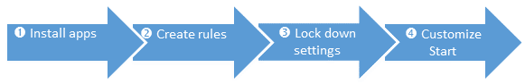

# Use AppLocker to create a Windows 10 kiosk that runs multiple apps


**Applies to**

-   Windows 10

Learn how to configure a device running Windows 10 Enterprise or Windows 10 Education, version 1703 and earlier, so that users can only run a few specific apps. The result is similar to [a kiosk device](set-up-a-device-for-anyone-to-use.md), but with multiple apps available. For example, you might set up a library computer so that users can search the catalog and browse the Internet, but can't run any other apps or change computer settings.

>[!NOTE]
>For devices running Windows 10, version 1709, we recommend the [multi-app kiosk method](lock-down-windows-10-to-specific-apps.md).

You can restrict users to a specific set of apps on a device running Windows 10 Enterprise or Windows 10 Education by using [AppLocker](/windows/device-security/applocker/applocker-overview). AppLocker rules specify which apps are allowed to run on the device.

AppLocker rules are organized into collections based on file format. If no AppLocker rules for a specific rule collection exist, all files with that file format are allowed to run. However, when an AppLocker rule for a specific rule collection is created, only the files explicitly allowed in a rule are permitted to run. For more information, see [How AppLocker works](/windows/device-security/applocker/how-applocker-works-techref).

This topic describes how to lock down apps on a local device. You can also use AppLocker to set rules for applications in a domain by using Group Policy.



## Install apps


First, install the desired apps on the device for the target user account(s). This works for both Unified Windows Platform (UWP) apps and Windows desktop apps. For UWP apps, you must log on as that user for the app to install. For desktop apps, you can install an app for all users without logging on to the particular account.

## Use AppLocker to set rules for apps


After you install the desired apps, set up AppLocker rules to only allow specific apps, and block everything else.

1.  Run Local Security Policy (secpol.msc) as an administrator.

2.  Go to **Security Settings** &gt; **Application Control Policies** &gt; **AppLocker**, and select **Configure rule enforcement**.

    

3.  Check **Configured** under **Executable rules**, and then click **OK**.

4.  Right-click **Executable Rules** and then click **Automatically generate rules**.

    

5.  Select the folder that contains the apps that you want to permit, or select C:\\ to analyze all apps.

6.  Type a name to identify this set of rules, and then click **Next**.

7.  On the **Rule Preferences** page, click **Next**. Be patient, it might take awhile to generate the rules.

8.  On the **Review Rules** page, click **Create**. The wizard will now create a set of rules allowing the installed set of apps.

9.  Read the message and click **Yes**.

    

10. (optional) If you want a rule to apply to a specific set of users, right-click on the rule and select **Properties**. Then use the dialog to choose a different user or group of users.

11. (optional) If rules were generated for apps that should not be run, you can delete them by right-clicking on the rule and selecting **Delete**.

12. Before AppLocker will enforce rules, the **Application Identity** service must be turned on. To force the Application Identity service to automatically start on reset, open a command prompt and run:

    ``` syntax
    sc config appidsvc start=auto
    ```

13. Restart the device.

## Other settings to lock down


In addition to specifying the apps that users can run, you should also restrict some settings and functions on the device. For a more secure experience, we recommend that you make the following configuration changes to the device:

-   Remove **All apps**.

    Go to **Group Policy Editor** &gt; **User Configuration** &gt; **Administrative Templates\\Start Menu and Taskbar\\Remove All Programs list from the Start menu**.

-   Hide **Ease of access** feature on the logon screen.

    Go to **Control Panel** &gt; **Ease of Access** &gt; **Ease of Access Center**, and turn off all accessibility tools.

-   Disable the hardware power button.

    Go to **Power Options** &gt; **Choose what the power button does**, change the setting to **Do nothing**, and then **Save changes**.

-   Disable the camera.

    Go to **Settings** &gt; **Privacy** &gt; **Camera**, and turn off **Let apps use my camera**.

-   Turn off app notifications on the lock screen.

    Go to **Group Policy Editor** &gt; **Computer Configuration** &gt; **Administrative Templates\\System\\Logon\\Turn off app notifications on the lock screen**.

-   Disable removable media.

    Go to **Group Policy Editor** &gt; **Computer Configuration** &gt; **Administrative Templates\\System\\Device Installation\\Device Installation Restrictions**. Review the policy settings available in **Device Installation Restrictions** for the settings applicable to your situation.

    **Note**  
    To prevent this policy from affecting a member of the Administrators group, in **Device Installation Restrictions**, enable **Allow administrators to override Device Installation Restriction policies**.

     

To learn more about locking down features, see [Customizations for Windows 10 Enterprise](https://go.microsoft.com/fwlink/p/?LinkId=691442).

## Customize Start screen layout for the device (recommended)


Configure the Start menu on the device to only show tiles for the permitted apps. You will make the changes manually, export the layout to an .xml file, and then apply that file to devices to prevent users from making changes. For instructions, see [Manage Windows 10 Start layout options](windows-10-start-layout-options-and-policies.md).
