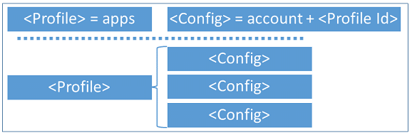
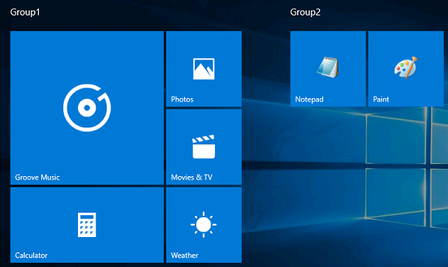
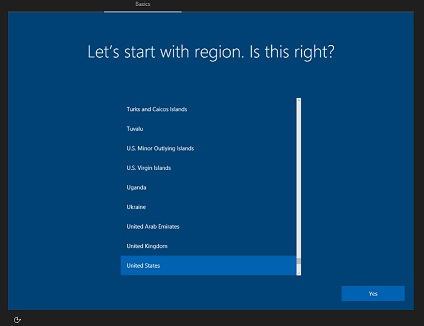
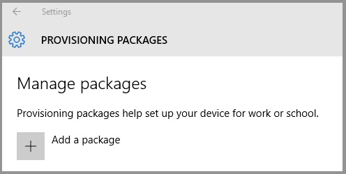

# Set up a multi-app kiosk

**Applies to**

- Windows 10 Pro, Enterprise, and Education

A [kiosk device](set-up-a-kiosk-for-windows-10-for-desktop-editions.md) typically runs a single app, and users are prevented from accessing any features or functions on the device outside of the kiosk app. In Windows 10, version 1709, the [AssignedAccess configuration service provider (CSP)](https://docs.microsoft.com/windows/client-management/mdm/assignedaccess-csp) was expanded to make it easy for administrators to create kiosks that run more than one app. The benefit of a kiosk that runs only one or more specified apps is to provide an easy-to-understand experience for individuals by putting in front of them only the things they need to use, and removing from their view the things they don’t need to access.

The following table lists changes to multi-app kiosk in recent updates.

|                                                                                                                            New features and improvements                                                                                                                             |                                                                                                           In update                                                                                                           |
|--------------------------------------------------------------------------------------------------------------------------------------------------------------------------------------------------------------------------------------------------------------------------------------|-------------------------------------------------------------------------------------------------------------------------------------------------------------------------------------------------------------------------------|
|                     - Configure [a single-app kiosk profile](#profile) in your XML file<br><br>- Assign [group accounts to a config profile](#config-for-group-accounts)<br><br>- Configure [an account to sign in automatically](#config-for-autologon-account)                     |                                                                                                   Windows 10, version 1803                                                                                                    |
| - Explicitly allow [some known folders when user opens file dialog box](#fileexplorernamespacerestrictions)<br><br>- [Automatically launch an app](#allowedapps) when the user signs in<br><br>- Configure a [display name for the autologon account](#config-for-autologon-account) | Windows 10, version 1809<br><br>**Important:** To use features released in Windows 10, version 1809, make sure that [your XML file](#create-xml-file) references `http://schemas.microsoft.com/AssignedAccess/201810/config`. |

>[!WARNING]
>The assigned access feature is intended for corporate-owned fixed-purpose devices, like kiosks. When the multi-app assigned access configuration is applied on the device, [certain policies](kiosk-policies.md) are enforced system-wide, and will impact other users on the device. Deleting the kiosk configuration will remove the assigned access lockdown profiles associated with the users, but it cannot revert all the enforced policies (such as Start layout). A factory reset is needed to clear all the policies enforced via assigned access.

You can configure multi-app kiosks using [Microsoft Intune](#intune) or a [provisioning package](#provision).

>[!TIP]
>Be sure to check the [configuration recommendations](kiosk-prepare.md) before you set up your kiosk.

<span id="intune"/>

## Configure a kiosk in Microsoft Intune

To configure a kiosk in Microsoft Intune, see [Windows 10 and Windows Holographic for Business device settings to run as a dedicated kiosk using Intune](https://docs.microsoft.com/intune/kiosk-settings). For explanations of the specific settings, see [Windows 10 and later device settings to run as a kiosk in Intune](https://docs.microsoft.com/intune/kiosk-settings-windows).

<span id="provision" />

## Configure a kiosk using a provisioning package

Process:

1. [Create XML file](#create-xml-file)
2. [Add XML file to provisioning package](#add-xml)
3. [Apply provisioning package to device](#apply-ppkg)

Watch how to use a provisioning package to configure a multi-app kiosk.

>[!VIDEO https://www.microsoft.com/videoplayer/embed/fa125d0f-77e4-4f64-b03e-d634a4926884?autoplay=false]

If you don't want to use a provisioning package, you can deploy the configuration XML file using [mobile device management (MDM)](#alternate-methods) or you can configure assigned access using the [MDM Bridge WMI Provider](kiosk-mdm-bridge.md).

### Prerequisites

- Windows Configuration Designer (Windows 10, version 1709 or later)
- The kiosk device must be running Windows 10 (S, Pro, Enterprise, or Education), version 1709 or later

>[!NOTE]
>For devices running versions of Windows 10 earlier than version 1709, you can [create AppLocker rules](lock-down-windows-10-applocker.md) to configure a multi-app kiosk.

### Create XML file

Let's start by looking at the basic structure of the XML file.

- A configuration xml can define multiple *profiles*. Each profile has a unique **Id** and defines a set of applications that are allowed to run, whether the taskbar is visible, and can include a custom Start layout.

- A configuration xml can have multiple *config* sections. Each config section associates a non-admin user account to a default profile **Id**.

- Multiple config sections can be associated to the same profile.

- A profile has no effect if it’s not associated to a config section.

    

You can start your file by pasting the following XML (or any other examples in this topic) into a XML editor, and saving the file as *filename*.xml. Each section of this XML is explained in this topic. You can see a full sample version in the [Assigned access XML reference.](kiosk-xml.md)

```xml
<?xml version="1.0" encoding="utf-8" ?>
<AssignedAccessConfiguration
    xmlns="http://schemas.microsoft.com/AssignedAccess/2017/config"
    xmlns:rs5="http://schemas.microsoft.com/AssignedAccess/201810/config"
    >
    <Profiles>
        <Profile Id="">
            <AllAppsList>
                <AllowedApps/>
            </AllAppsList>
            <StartLayout/>
            <Taskbar/>
        </Profile>
    </Profiles>
    <Configs>
        <Config>
            <Account/>
            <DefaultProfile Id=""/>
        </Config>
    </Configs>
</AssignedAccessConfiguration>
```

#### Profile

There are two types of profiles that you can specify in the XML:

- **Lockdown profile**: Users assigned a lockdown profile will see the desktop in tablet mode with the specific apps on the Start screen.
- **Kiosk profile**: New in Windows 10, version 1803, this profile replaces the KioskModeApp node of the [AssignedAccess CSP](https://docs.microsoft.com/windows/client-management/mdm/assignedaccess-csp). Users assigned a kiosk profile will not see the desktop, but only the kiosk app running in full-screen mode.

A lockdown profile section in the XML has the following entries:

- [**Id**](#id)

- [**AllowedApps**](#allowedapps)

- [**FileExplorerNamespaceRestrictions**](#fileexplorernamespacerestrictions)

- [**StartLayout**](#startlayout)

- [**Taskbar**](#taskbar)

A kiosk profile in the XML has the following entries:

- [**Id**](#id)

- [**KioskModeApp**](#kioskmodeapp)

##### Id

The profile **Id** is a GUID attribute to uniquely identify the profile. You can create a GUID using a GUID generator. The GUID just needs to be unique within this XML file.

```xml
<Profiles>
  <Profile Id="{9A2A490F-10F6-4764-974A-43B19E722C23}">…</Profile>
</Profiles>
```

##### AllowedApps

**AllowedApps** is a list of applications that are allowed to run. Apps can be Universal Windows Platform (UWP) apps or Windows desktop applications. In Windows 10, version 1809, you can configure a single app in the **AllowedApps** list to run automatically when the assigned access user account signs in.

- For UWP apps, you need to provide the App User Model ID (AUMID). [Learn how to get the AUMID](https://go.microsoft.com/fwlink/p/?LinkId=614867), or [get the AUMID from the Start Layout XML](#startlayout).
- For desktop apps, you need to specify the full path of the executable, which can contain one or more system environment variables in the form of %variableName% (i.e. %systemroot%, %windir%).
- If an app has a dependency on another app, both must be included in the allowed apps list. For example, Internet Explorer 64-bit has a dependency on Internet Explorer 32-bit, so you must allow both "C:\Program Files\internet explorer\iexplore.exe" and “C:\Program Files (x86)\Internet Explorer\iexplore.exe”.
- To configure a single app to launch automatically when the user signs in, include `rs5:AutoLaunch="true"` after the AUMID or path. You can also include arguments to be passed to the app. For an example, see [the AllowedApps sample XML](#apps-sample).

When the multi-app kiosk configuration is applied to a device, AppLocker rules will be generated to allow the apps that are listed in the configuration. Here are the predefined assigned access AppLocker rules for **UWP apps**:

1. Default rule is to allow all users to launch the signed package apps.
2. The package app deny list is generated at runtime when the assigned access user signs in. Based on the installed/provisioned package apps available for the user account, assigned access generates the deny list. This list will exclude the default allowed inbox package apps which are critical for the system to function, and then exclude the allowed packages that enterprises defined in the assigned access configuration. If there are multiple apps within the same package, all these apps will be excluded. This deny list will be used to prevent the user from accessing the apps which are currently available for the user but not in the allowed list.

    >[!NOTE]
    >You cannot manage AppLocker rules that are generated by the multi-app kiosk configuration in [MMC snap-ins](https://technet.microsoft.com/library/hh994629.aspx#BKMK_Using_Snapins). Avoid creating AppLocker rules that conflict with AppLocker rules that are generated by the multi-app kiosk configuration.
    >
    >Multi-app kiosk mode doesn’t block the enterprise or the users from installing UWP apps. When a new UWP app is installed during the current assigned access user session, this app will not be in the deny list. When the user signs out and signs in again, the app will be included in the deny list. If this is an enterprise-deployed line-of-business app and you want to allow it to run, update the assigned access configuration to include it in the allowed app list.

Here are the predefined assigned access AppLocker rules for **desktop apps**:

1. Default rule is to allow all users to launch the desktop programs signed with Microsoft Certificate in order for the system to boot and function. The rule also allows the admin user group to launch all desktop programs.
2. There is a predefined inbox desktop app deny list for the assigned access user account, and this deny list is adjusted based on the desktop app allow list that you defined in the multi-app configuration.
3. Enterprise-defined allowed desktop apps are added in the AppLocker allow list.

The following example allows Groove Music, Movies & TV, Photos, Weather, Calculator, Paint, and Notepad apps to run on the device, with Notepad configured to automatically launch and create a file called `123.text` when the user signs in.

<span id="apps-sample" />
```xml
&lt;AllAppsList&gt;
        &lt;AllowedApps&gt;
          &lt;App AppUserModelId=&quot;Microsoft.ZuneMusic_8wekyb3d8bbwe!Microsoft.ZuneMusic&quot; /&gt;
          &lt;App AppUserModelId=&quot;Microsoft.ZuneVideo_8wekyb3d8bbwe!Microsoft.ZuneVideo&quot; /&gt;
          &lt;App AppUserModelId=&quot;Microsoft.Windows.Photos_8wekyb3d8bbwe!App&quot; /&gt;
          &lt;App AppUserModelId=&quot;Microsoft.BingWeather_8wekyb3d8bbwe!App&quot; /&gt;
          &lt;App AppUserModelId=&quot;Microsoft.WindowsCalculator_8wekyb3d8bbwe!App&quot; /&gt;
          &lt;App DesktopAppPath=&quot;%windir%\system32\mspaint.exe&quot; /&gt;
          &lt;App DesktopAppPath=&quot;C:\Windows\System32\notepad.exe&quot; rs5:AutoLaunch=&quot;true&quot; rs5:AutoLaunchArguments=&quot;123.txt&quot;/&gt;
        &lt;/AllowedApps&gt;
&lt;/AllAppsList&gt;</code>
```

##### FileExplorerNamespaceRestrictions

Starting in Windows 10, version 1809, you can explicitly allow some known folders to be accessed when the user tries to open the file dialog box in multi-app assigned access by including **FileExplorerNamespaceRestrictions** in your XML file. Currently, **Downloads** is the only folder supported.  This can also be set using Microsoft Intune.

The following example shows how to allow user access to the Downloads folder in the common file dialog box.

>[!TIP]
> To grant access to the Downloads folder through File Explorer, add "Explorer.exe" to the list of allowed apps, and pin a file explorer shortcut to the kiosk start menu.

```xml
<?xml version="1.0" encoding="utf-8" ?>
<AssignedAccessConfiguration
    xmlns="http://schemas.microsoft.com/AssignedAccess/2017/config"
    xmlns:rs5="http://schemas.microsoft.com/AssignedAccess/201810/config"
>     <Profiles>
        <Profile Id="{9A2A490F-10F6-4764-974A-43B19E722C23}">
            <AllAppsList>
                <AllowedApps>
                    ...
                </AllowedApps>
            </AllAppsList>
            <rs5:FileExplorerNamespaceRestrictions>
                <rs5:AllowedNamespace Name="Downloads"/>
            </rs5:FileExplorerNamespaceRestrictions>
            <StartLayout>
                ...
            </StartLayout>
            <Taskbar ShowTaskbar="true"/>
        </Profile>
    </Profiles>
</AssignedAccessConfiguration>
```
FileExplorerNamespaceRestriction has been extended in current Windows 10 Prerelease for finer granularity and easier use, see in the [Assigned access XML reference.](kiosk-xml.md) for full samples. The changes will allow IT Admin to configure if user can access Downloads folder, Removable drives, or no restriction at all by using certain new elements. Note that FileExplorerNamesapceRestrictions and AllowedNamespace:Downloads are available in namespace http://schemas.microsoft.com/AssignedAccess/201810/config, AllowRemovableDrives and NoRestriction are defined in a new namespace http://schemas.microsoft.com/AssignedAccess/2020/config.

* When FileExplorerNamespaceRestrictions node is not used, or used but left empty, user will not be able to access any folder in common dialog (e.g. Save As in Microsoft Edge browser).
* When Downloads is mentioned in allowed namespace, user will be able to access Downloads folder.
* When AllowRemovableDrives is used, user will be to access removable drives.
* When NoRestriction is used, no restriction will be applied to the dialog.
* AllowRemovableDrives and AllowedNamespace:Downloads can be used at the same time.

##### StartLayout

After you define the list of allowed applications, you can customize the Start layout for your kiosk experience. You can choose to pin all the allowed apps on the Start screen or just a subset, depending on whether you want the end user to directly access them on the Start screen.

The easiest way to create a customized Start layout to apply to other Windows 10 devices is to set up the Start screen on a test device and then export the layout. For detailed steps, see [Customize and export Start layout](customize-and-export-start-layout.md).

A few things to note here:

- The test device on which you customize the Start layout should have the same OS version that is installed on the device where you plan to deploy the multi-app assigned access configuration.
- Since the multi-app assigned access experience is intended for fixed-purpose devices, to ensure the device experiences are consistent and predictable, use the *full* Start layout option instead of the *partial* Start layout.
- There are no apps pinned on the taskbar in the multi-app mode, and it is not supported to configure Taskbar layout using the `<CustomTaskbarLayoutCollection>` tag in a layout modification XML as part of the assigned access configuration.
- The following example uses DesktopApplicationLinkPath to pin the desktop app to start. When the desktop app doesn’t have a shortcut link on the target device, [learn how to provision .lnk files using Windows Configuration Designer](#lnk-files).

This example pins Groove Music, Movies & TV, Photos, Weather, Calculator, Paint, and Notepad apps on Start.

```xml
<StartLayout>
        <![CDATA[<LayoutModificationTemplate xmlns:defaultlayout="http://schemas.microsoft.com/Start/2014/FullDefaultLayout" xmlns:start="http://schemas.microsoft.com/Start/2014/StartLayout" Version="1" xmlns="http://schemas.microsoft.com/Start/2014/LayoutModification">
                      <LayoutOptions StartTileGroupCellWidth="6" />
                      <DefaultLayoutOverride>
                        <StartLayoutCollection>
                          <defaultlayout:StartLayout GroupCellWidth="6">
                            <start:Group Name="Group1">
                              <start:Tile Size="4x4" Column="0" Row="0" AppUserModelID="Microsoft.ZuneMusic_8wekyb3d8bbwe!Microsoft.ZuneMusic" />
                              <start:Tile Size="2x2" Column="4" Row="2" AppUserModelID="Microsoft.ZuneVideo_8wekyb3d8bbwe!Microsoft.ZuneVideo" />
                              <start:Tile Size="2x2" Column="4" Row="0" AppUserModelID="Microsoft.Windows.Photos_8wekyb3d8bbwe!App" />
                              <start:Tile Size="2x2" Column="4" Row="4" AppUserModelID="Microsoft.BingWeather_8wekyb3d8bbwe!App" />
                              <start:Tile Size="4x2" Column="0" Row="4" AppUserModelID="Microsoft.WindowsCalculator_8wekyb3d8bbwe!App" />
                            </start:Group>
                            <start:Group Name="Group2">
                              <start:DesktopApplicationTile Size="2x2" Column="2" Row="0" DesktopApplicationLinkPath="%ALLUSERSPROFILE%\Microsoft\Windows\Start Menu\Programs\Accessories\Paint.lnk" />
                              <start:DesktopApplicationTile Size="2x2" Column="0" Row="0" DesktopApplicationLinkPath="%APPDATA%\Microsoft\Windows\Start Menu\Programs\Accessories\Notepad.lnk" />
                            </start:Group>
                          </defaultlayout:StartLayout>
                        </StartLayoutCollection>
                      </DefaultLayoutOverride>
                    </LayoutModificationTemplate>
                ]]>
</StartLayout>
```

>[!NOTE]
>If an app is not installed for the user but is included in the Start layout XML, the app will not be shown on the Start screen.



##### Taskbar

Define whether you want to have the taskbar present in the kiosk device. For tablet-based or touch-enabled all-in-one kiosks, when you don’t attach a keyboard and mouse, you can hide the taskbar as part of the multi-app experience if you want.

The following example exposes the taskbar to the end user:

```xml
<Taskbar ShowTaskbar="true"/>
```

The following example hides the taskbar:

```xml
<Taskbar ShowTaskbar="false"/>
```

>[!NOTE]
>This is different from the **Automatically hide the taskbar** option in tablet mode, which shows the taskbar when swiping up from or moving the mouse pointer down to the bottom of the screen. Setting **ShowTaskbar** as **false** will always keep the taskbar hidden.

##### KioskModeApp

**KioskModeApp** is used for a [kiosk profile](#profile) only. Enter the AUMID for a single app. You can only specify one kiosk profile in the XML.

```xml
<KioskModeApp AppUserModelId="Microsoft.WindowsCalculator_8wekyb3d8bbwe!App"/>
```

>[!IMPORTANT]
>The kiosk profile is designed for public-facing kiosk devices. We recommend that you use a local, non-administrator account. If the device is connected to your company network, using a domain or Azure Active Directory account could potentially compromise confidential information.  

#### Configs

Under **Configs**, define which user account will be associated with the profile. When this user account signs in on the device, the associated assigned access profile will be enforced, including the allowed apps, Start layout, and taskbar configuration, as well as other local group policies or mobile device management (MDM) policies set as part of the multi-app experience.

The full multi-app assigned access experience can only work for non-admin users. It’s not supported to associate an admin user with the assigned access profile; doing this in the XML file will result in unexpected/unsupported experiences when this admin user signs in.

You can assign:

- [A local standard user account that signs in automatically](#config-for-autologon-account) (Applies to Windows 10, version 1803 only)
- [An individual account, which can be local, domain, or Azure Active Directory (Azure AD)](#config-for-individual-accounts)
- [A group account, which can be local, Active Directory (domain), or Azure AD](#config-for-group-accounts) (Applies to Windows 10, version 1803 only).

>[!NOTE]
>Configs that specify group accounts cannot use a kiosk profile, only a lockdown profile. If a group is configured to a kiosk profile, the CSP will reject the request.

##### Config for AutoLogon Account

When you use `<AutoLogonAccount>` and the configuration is applied to a device, the specified account (managed by Assigned Access) is created on the device as a local standard user account. The specified account is signed in automatically after restart.

The following example shows how to specify an account to sign in automatically.

```xml
<Configs>
  <Config>
    <AutoLogonAccount/>
    <DefaultProfile Id="{9A2A490F-10F6-4764-974A-43B19E722C23}"/>
  </Config>
</Configs>
```

In Windows 10, version 1809, you can configure the display name that will be shown when the user signs in. The following example shows how to create an AutoLogon Account that shows the name "Hello World".

```xml
<Configs>
  <Config>
    <AutoLogonAccount rs5:DisplayName="Hello World"/>
    <DefaultProfile Id="{9A2A490F-10F6-4764-974A-43B19E722C23}"/>
  </Config>
</Configs>
```

On domain-joined devices, local user accounts aren't shown on the sign-in screen by default. To show the **AutoLogonAccount** on the sign-in screen, enable the following Group Policy setting: **Computer Configuration > Administrative Templates > System > Logon > Enumerate local users on domain-joined computers**. (The corresponding MDM policy setting is [WindowsLogon/EnumerateLocalUsersOnDomainJoinedComputers in the Policy CSP](https://docs.microsoft.com/windows/client-management/mdm/policy-csp-windowslogon#windowslogon-enumeratelocalusersondomainjoinedcomputers).)

>[!IMPORTANT]
>When Exchange Active Sync (EAS) password restrictions are active on the device, the autologon feature does not work. This behavior is by design. For more informations, see [How to turn on automatic logon in Windows](https://support.microsoft.com/help/324737/how-to-turn-on-automatic-logon-in-windows).

##### Config for individual accounts

Individual accounts are specified using `<Account>`.

- Local account can be entered as `machinename\account` or `.\account` or just `account`.
- Domain account should be entered as `domain\account`.
- Azure AD account must be specified in this format: `AzureAD\{email address}`. **AzureAD** must be provided AS IS (consider it’s a fixed domain name), then follow with the Azure AD email address, e.g. <strong>AzureAD\someone@contoso.onmicrosoft.com</strong>.

>[!WARNING]
>Assigned access can be configured via WMI or CSP to run its applications under a domain user or service account, rather than a local account.  However, use of domain user or service accounts introduces risks that an attacker subverting the assigned access application might gain access to sensitive domain resources that have been inadvertently left accessible to any domain account. We recommend that customers proceed with caution when using domain accounts with assigned access, and consider the domain resources potentially exposed by the decision to do so.

Before applying the multi-app configuration, make sure the specified user account is available on the device, otherwise it will fail.

>[!NOTE]
>For both domain and Azure AD accounts, it’s not required that target account is explicitly added to the device. As long as the device is AD-joined or Azure AD-joined, the account can be discovered in the domain forest or tenant that the device is joined to. For local accounts, it is required that the account exist before you configure the account for assigned access.

```xml
<Configs>
  <Config>
    <Account>MultiAppKioskUser</Account>
    <DefaultProfile Id="{9A2A490F-10F6-4764-974A-43B19E722C23}"/>
  </Config>
</Configs>
```

##### Config for group accounts

Group accounts are specified using `<UserGroup>`. Nested groups are not supported. For example, if user A is member of Group 1, Group 1 is member of Group 2, and Group 2 is used in `<Config/>`, user A will not have the kiosk experience.

- Local group: Specify the group type as **LocalGroup** and put the group name in Name attribute. Any Azure AD accounts that are added to the local group will not have the kiosk settings applied.

  ```xml
  <Config>
    <UserGroup Type="LocalGroup" Name="mygroup" />
    <DefaultProfile Id="{9A2A490F-10F6-4764-974A-43B19E722C23}"/>
  </Config>
  ```

- Domain group: Both security and distribution groups are supported. Specify the group type as <strong>ActiveDirectoryGroup</strong>. Use the domain name as the prefix in the name attribute.

  ```xml
  <Config>
    <UserGroup Type="ActiveDirectoryGroup" Name="mydomain\mygroup" />
    <DefaultProfile Id="{9A2A490F-10F6-4764-974A-43B19E722C23}"/>
  </Config>
  ```

- Azure AD group: Use the group object ID from the Azure portal to uniquely identify the group in the Name attribute. You can find the object ID on the overview page for the group in **Users and groups** > **All groups**. Specify the group type as **AzureActiveDirectoryGroup**. The kiosk device must have internet connectivity when users that belong to the group sign in.

  ```xml
  <Config>
    <UserGroup Type="AzureActiveDirectoryGroup" Name="a8d36e43-4180-4ac5-a627-fb8149bba1ac" />
    <DefaultProfile Id="{9A2A490F-10F6-4764-974A-43B19E722C23}"/>
  </Config>
  ```

  >[!NOTE]
  >If an Azure AD group is configured with a lockdown profile on a device, a user in the Azure AD group must change their password (after the account has been created with default password on the portal) before they can sign in to this device. If the user uses the default password to sign in to the device, the user will be immediately signed out.

<span id="add-xml" />

#### [Preview] Global Profile
Global profile is added in curernt Windows 10 Prerelease. There are times when IT Admin wants to everyone who logging into a specific devices are assigned access users, even there is no dedicated profile for that user, or there are times that Assigned Access could not identify a profile for the user and a fallback profile is wished to use. Global Profile is designed for these scenarios.

Usage is demonstrated below, by using the new xml namespace and specify GlobalProfile from that namespace. When GlobalProfile is configured, a non-admin account logs in, if this user does not have designated profile in Assigned Access, or Assigned Access fails to determine a profile for current user, global profile will be applied for the user.

Note:
1. GlobalProfile can only be multi-app profile
2. Only one GlobalProfile can be used in one AssignedAccess Configuration Xml
3. GlobalProfile can be used as the only config, or it can be used among with regular user or group Config.

```xml
<?xml version="1.0" encoding="utf-8" ?>
<AssignedAccessConfiguration
    xmlns="http://schemas.microsoft.com/AssignedAccess/2017/config"
    xmlns:v2="http://schemas.microsoft.com/AssignedAccess/201810/config"
    xmlns:v3="http://schemas.microsoft.com/AssignedAccess/2020/config"
>
    <Profiles>
        <Profile Id="{9A2A490F-10F6-4764-974A-43B19E722C23}">
            <AllAppsList>
                <AllowedApps>
                    <App AppUserModelId="Microsoft.Microsoft3DViewer_8wekyb3d8bbwe!Microsoft.Microsoft3DViewer" v2:AutoLaunch="true" v2:AutoLaunchArguments="123"/>
                    <App AppUserModelId="Microsoft.BingWeather_8wekyb3d8bbwe!App" />
                    <App AppUserModelId="Microsoft.MicrosoftEdge_8wekyb3d8bbwe!MicrosoftEdge" />
                    <App DesktopAppPath="%SystemRoot%\system32\notepad.exe" />
                </AllowedApps>
            </AllAppsList>
            <StartLayout>
                <![CDATA[<LayoutModificationTemplate xmlns:defaultlayout="http://schemas.microsoft.com/Start/2014/FullDefaultLayout" xmlns:start="http://schemas.microsoft.com/Start/2014/StartLayout" Version="1" xmlns="http://schemas.microsoft.com/Start/2014/LayoutModification">
                      <LayoutOptions StartTileGroupCellWidth="6" />
                      <DefaultLayoutOverride>
                        <StartLayoutCollection>
                          <defaultlayout:StartLayout GroupCellWidth="6">
                            <start:Group Name="Life at a glance">
                              <start:Tile Size="2x2" Column="0" Row="0" AppUserModelID="microsoft.windowscommunicationsapps_8wekyb3d8bbwe!microsoft.windowsLive.calendar" />
                              <start:Tile Size="4x2" Column="0" Row="4" AppUserModelID="Microsoft.WindowsStore_8wekyb3d8bbwe!App" />
                              <!-- A link file is required for desktop applications to show on start layout, the link file can be placed under
                                   "%AllUsersProfile%\Microsoft\Windows\Start Menu\Programs" if the link file is shared for all users or
                                   "%AppData%\Microsoft\Windows\Start Menu\Programs" if the link file is for the specific user only 
                                   see document https://docs.microsoft.com/windows/configuration/start-layout-xml-desktop
                              -->
                              <!-- for inbox desktop applications, a link file might already exist and can be used directly -->
                              <start:DesktopApplicationTile Size="2x2" Column="2" Row="0" DesktopApplicationLinkPath="%AllUsersProfile%\Microsoft\Windows\Start Menu\Programs\Accessories\paint.lnk" />
                              <!-- for 3rd party desktop application, place the link file under appropriate folder -->
                              <start:DesktopApplicationTile Size="2x2" Column="4" Row="0" DesktopApplicationLinkPath="%AppData%\Microsoft\Windows\Start Menu\Programs\MyLOB.lnk" />
                            </start:Group>
                          </defaultlayout:StartLayout>
                        </StartLayoutCollection>
                      </DefaultLayoutOverride>
                    </LayoutModificationTemplate>
                ]]>
            </StartLayout>
            <Taskbar ShowTaskbar="true"/>
        </Profile>
    </Profiles>
    <Configs>
        <v3:GlobalProfile Id="{9A2A490F-10F6-4764-974A-43B19E722C23}"/>
    </Configs>
</AssignedAccessConfiguration>
```

### Add XML file to provisioning package

Before you add the XML file to a provisioning package, you can [validate your configuration XML against the XSD](kiosk-xml.md#xsd-for-assignedaccess-configuration-xml).

Use the Windows Configuration Designer tool to create a provisioning package. [Learn how to install Windows Configuration Designer.](provisioning-packages/provisioning-install-icd.md)

>[!IMPORTANT]
>When you build a provisioning package, you may include sensitive information in the project files and in the provisioning package (.ppkg) file. Although you have the option to encrypt the .ppkg file, project files are not encrypted. You should store the project files in a secure location and delete the project files when they are no longer needed.

1. Open Windows Configuration Designer (by default, %systemdrive%\\Program Files (x86)\\Windows Kits\\10\\Assessment and Deployment Kit\\Imaging and Configuration Designer\\x86\\ICD.exe).

2. Choose **Advanced provisioning**.

3. Name your project, and click **Next**.

4. Choose **All Windows desktop editions** and click **Next**.

5. On **New project**, click **Finish**. The workspace for your package opens.

6. Expand **Runtime settings** &gt; **AssignedAccess** &gt; **MultiAppAssignedAccessSettings**.

7. In the center pane, click **Browse** to locate and select the assigned access configuration XML file that you created.

   

8. (**Optional**: If you want to apply the provisioning package after device initial setup and there is an admin user already available on the kiosk device, skip this step.) Create an admin user account in **Runtime settings** &gt; **Accounts** &gt; **Users**. Provide a **UserName** and **Password**, and select **UserGroup** as **Administrators**. With this account, you can view the provisioning status and logs if needed.

9. (**Optional**: If you already have a non-admin account on the kiosk device, skip this step.) Create a local standard user account in **Runtime settings** &gt; **Accounts** &gt; **Users**. Make sure the **UserName** is the same as the account that you specify in the configuration XML. Select **UserGroup** as **Standard Users**.

10. On the **File** menu, select **Save.**

11. On the **Export** menu, select **Provisioning package**.

12. Change **Owner** to **IT Admin**, which will set the precedence of this provisioning package higher than provisioning packages applied to this device from other sources, and then select **Next.**

13. Optional. In the **Provisioning package security** window, you can choose to encrypt the package and enable package signing.

    - **Enable package encryption** - If you select this option, an auto-generated password will be shown on the screen.

    - **Enable package signing** - If you select this option, you must select a valid certificate to use for signing the package. You can specify the certificate by clicking **Browse** and choosing the certificate you want to use to sign the package.

14. Click **Next** to specify the output location where you want the provisioning package to go when it's built. By default, Windows Imaging and Configuration Designer (ICD) uses the project folder as the output location.

    Optionally, you can click **Browse** to change the default output location.

15. Click **Next**.

16. Click **Build** to start building the package. The provisioning package doesn't take long to build. The project information is displayed in the build page and the progress bar indicates the build status.

    If you need to cancel the build, click **Cancel**. This cancels the current build process, closes the wizard, and takes you back to the **Customizations Page**.

17. If your build fails, an error message will show up that includes a link to the project folder. You can scan the logs to determine what caused the error. Once you fix the issue, try building the package again.

    If your build is successful, the name of the provisioning package, output directory, and project directory will be shown.

    - If you choose, you can build the provisioning package again and pick a different path for the output package. To do this, click **Back** to change the output package name and path, and then click **Next** to start another build.
    - If you are done, click **Finish** to close the wizard and go back to the **Customizations Page**.

18. Copy the provisioning package to the root directory of a USB drive.

<span id="apply-ppkg" />

### Apply provisioning package to device

Provisioning packages can be applied to a device during the first-run experience (out-of-box experience or "OOBE") and after ("runtime").

>[!TIP]
>In addition to the methods below, you can use the PowerShell comdlet [install-provisioningpackage](https://docs.microsoft.com/powershell/module/provisioning/Install-ProvisioningPackage?view=win10-ps) with `-LogsDirectoryPath` to get logs for the operation.

#### During initial setup, from a USB drive

1. Start with a computer on the first-run setup screen. If the PC has gone past this screen, reset the PC to start over. To reset the PC, go to **Settings** > **Update & security** > **Recovery** > **Reset this PC**.

    

2. Insert the USB drive. Windows Setup will recognize the drive and ask if you want to set up the device. Select **Set up**.

    

3. The next screen asks you to select a provisioning source. Select **Removable Media** and tap **Next**.

    

4. Select the provisioning package (\*.ppkg) that you want to apply, and tap **Next**.

    

5. Select **Yes, add it**.

    

#### After setup, from a USB drive, network folder, or SharePoint site

1. Sign in with an admin account.
2. Insert the USB drive to a desktop computer, navigate to **Settings** > **Accounts** > **Access work or school** > **Add or remove a provisioning package** > **Add a package**, and select the package to install. For a provisioning package stored on a network folder or on a SharePoint site, navigate to the provisioning package and double-click it to begin installation.

>[!NOTE]
>if your provisioning package doesn’t include the assigned access user account creation, make sure the account you specified in the multi-app configuration XML exists on the device.



<span id="alternate-methods" />
### Use MDM to deploy the multi-app configuration

Multi-app kiosk mode is enabled by the [AssignedAccess configuration service provider (CSP)](https://docs.microsoft.com/windows/client-management/mdm/assignedaccess-csp). Your MDM policy can contain the assigned access configuration XML.

If your device is enrolled with a MDM server which supports applying the assigned access configuration, you can use it to apply the setting remotely.

The OMA-URI for multi-app policy is `./Device/Vendor/MSFT/AssignedAccess/Configuration`.

## Considerations for Windows Mixed Reality immersive headsets

With the advent of [mixed reality devices (video link)](https://www.youtube.com/watch?v=u0jqNioU2Lo), you might want to create a kiosk that can run mixed reality apps.

To create a multi-app kiosk that can run mixed reality apps, you must include the following apps in the [AllowedApps list](#allowedapps):

```xml
<App AppUserModelId="MixedRealityLearning_cw5n1h2txyewy!MixedRealityLearning" />
<App AppUserModelId="HoloShell_cw5n1h2txyewy!HoloShell" />
<App AppUserModelId="Microsoft.Windows.HolographicFirstRun_cw5n1h2txyewy!App" />
```

These are in addition to any mixed reality apps that you allow.

**Before your kiosk user signs in:** An admin user must sign in to the PC, connect a mixed reality device, and complete the guided setup for the Mixed Reality Portal. The first time that the Mixed Reality Portal is set up, some files and content are downloaded. A kiosk user would not have permissions to download and so their setup of the Mixed Reality Portal would fail.

After the admin has completed setup, the kiosk account can sign in and repeat the setup. The admin user may want to complete the kiosk user setup before providing the PC to employees or customers.

There is a difference between the mixed reality experiences for a kiosk user and other users. Typically, when a user connects a mixed reality device, they begin in the [Mixed Reality home](https://developer.microsoft.com/windows/mixed-reality/navigating_the_windows_mixed_reality_home). The Mixed Reality home is a shell that runs in "silent" mode when the PC is configured as a kiosk. When a kiosk user connects a mixed reality device, they will see only a blank display in the device, and will not have access to the features and functionality available in the home. To run a mixed reality app, the kiosk user must launch the app from the PC Start screen.

## Policies set by multi-app kiosk configuration

It is not recommended to set policies enforced in assigned access multi-app mode to different values using other channels, as the multi-app mode has been optimized to provide a locked-down experience.

When the multi-app assigned access configuration is applied on the device, certain policies are enforced system-wide, and will impact other users on the device.

### Group Policy

The following local policies affect all **non-administrator** users on the system, regardless whether the user is configured as an assigned access user or not.  This includes local users, domain users, and Azure Active Directory users.

| Setting | Value |
| --- | --- |
Remove access to the context menus for the task bar | Enabled
Clear history of recently opened documents on exit |    Enabled
Prevent users from customizing their Start Screen | Enabled
Prevent users from uninstalling applications from Start |       Enabled
Remove All Programs list from the Start menu |      Enabled
Remove Run menu from Start Menu  |  Enabled
Disable showing balloon notifications as toast |        Enabled
Do not allow pinning items in Jump Lists |      Enabled
Do not allow pinning programs to the Taskbar |      Enabled
Do not display or track items in Jump Lists from remote locations |     Enabled
Remove Notifications and Action Center |        Enabled
Lock all taskbar settings |     Enabled
Lock the Taskbar     |  Enabled
Prevent users from adding or removing toolbars |        Enabled
Prevent users from resizing the taskbar  |  Enabled
Remove frequent programs list from the Start Menu |     Enabled
Remove ‘Map Network Drive’ and ‘Disconnect Network Drive’ | Enabled
Remove the Security and Maintenance icon     |  Enabled
Turn off all balloon notifications |        Enabled
Turn off feature advertisement balloon notifications     |  Enabled
Turn off toast notifications |      Enabled
Remove Task Manager |       Enabled
Remove Change Password option in Security Options UI |      Enabled
Remove Sign Out option in Security Options UI    |  Enabled
Remove All Programs list from the Start Menu     |  Enabled – Remove and disable setting
Prevent access to drives from My Computer    |  Enabled - Restrict all drivers

>[!NOTE]
>When **Prevent access to drives from My Computer** is enabled, users can browse the directory structure in File Explorer, but they cannot open folders and access the contents. Also, they cannot use the **Run** dialog box or the **Map Network Drive** dialog box to view the directories on these drives. The icons representing the specified drives still appear in File Explorer, but if users double-click the icons, a message appears explaining that a setting prevents the action. This setting does not prevent users from using programs to access local and network drives. It does not prevent users from using the Disk Management snap-in to view and change drive characteristics.

### MDM policy

Some of the MDM policies based on the [Policy configuration service provider (CSP)](https://docs.microsoft.com/windows/client-management/mdm/policy-configuration-service-provider) affect all users on the system (i.e. system-wide).

Setting |   Value   | System-wide
 --- | --- | ---
[Experience/AllowCortana](https://docs.microsoft.com/windows/client-management/mdm/policy-csp-experience#experience-allowcortana)       | 0 - Not allowed   |   Yes
[Start/AllowPinnedFolderDocuments](https://docs.microsoft.com/windows/client-management/mdm/policy-csp-start#start-allowpinnedfolderdocuments) |    0 - Shortcut is hidden and disables the setting in the Settings app |   Yes
[Start/AllowPinnedFolderDownloads](https://docs.microsoft.com/windows/client-management/mdm/policy-csp-start#start-allowpinnedfolderdownloads) |    0 - Shortcut is hidden and disables the setting in the Settings app |   Yes
[Start/AllowPinnedFolderFileExplorer](https://docs.microsoft.com/windows/client-management/mdm/policy-csp-start#start-allowpinnedfolderfileexplorer) |  0 - Shortcut is hidden and disables the setting in the Settings app |   Yes
[Start/AllowPinnedFolderHomeGroup](https://docs.microsoft.com/windows/client-management/mdm/policy-csp-start#start-allowpinnedfolderhomegroup) |    0 - Shortcut is hidden and disables the setting in the Settings app |   Yes
[Start/AllowPinnedFolderMusic](https://docs.microsoft.com/windows/client-management/mdm/policy-csp-start#start-allowpinnedfoldermusic) |    0 - Shortcut is hidden and disables the setting in the Settings app |   Yes
[Start/AllowPinnedFolderNetwork](https://docs.microsoft.com/windows/client-management/mdm/policy-csp-start#start-allowpinnedfoldernetwork) |    0 - Shortcut is hidden and disables the setting in the Settings app |   Yes
[Start/AllowPinnedFolderPersonalFolder](https://docs.microsoft.com/windows/client-management/mdm/policy-csp-start#start-allowpinnedfolderpersonalfolder) |  0 - Shortcut is hidden and disables the setting in the Settings app |   Yes
[Start/AllowPinnedFolderPictures](https://docs.microsoft.com/windows/client-management/mdm/policy-csp-start#start-allowpinnedfolderpictures) |  0 - Shortcut is hidden and disables the setting in the Settings app |   Yes
[Start/AllowPinnedFolderSettings](https://docs.microsoft.com/windows/client-management/mdm/policy-csp-start#start-allowpinnedfoldersettings)    |   0 - Shortcut is hidden and disables the setting in the Settings app |   Yes
[Start/AllowPinnedFolderVideos](https://docs.microsoft.com/windows/client-management/mdm/policy-csp-start#start-allowpinnedfoldervideos) |  0 - Shortcut is hidden and disables the setting in the Settings app |   Yes
Start/DisableContextMenus | 1 - Context menus are hidden for Start apps | No
[Start/HidePeopleBar](https://docs.microsoft.com/windows/client-management/mdm/policy-csp-start#start-hidepeoplebar)        | 1 - True (hide)   |   No
[Start/HideChangeAccountSettings](https://docs.microsoft.com/windows/client-management/mdm/policy-csp-start#start-hidechangeaccountsettings)        | 1 - True (hide) | Yes
[WindowsInkWorkspace/AllowWindowsInkWorkspace](https://docs.microsoft.com/windows/client-management/mdm/policy-csp-windowsinkworkspace#windowsinkworkspace-allowwindowsinkworkspace)    |   0 - Access to ink workspace is disabled and the feature is turned off   |   Yes
[Start/StartLayout](https://docs.microsoft.com/windows/client-management/mdm/policy-csp-start#start-startlayout)    | Configuration dependent   |   No
[WindowsLogon/DontDisplayNetworkSelectionUI](https://docs.microsoft.com/windows/client-management/mdm/policy-csp-windowslogon#windowslogon-dontdisplaynetworkselectionui)   |   &lt;Enabled/&gt;    |   Yes

<span id="lnk-files" />

## Provision .lnk files using Windows Configuration Designer

First, create your desktop app's shortcut file by installing the app on a test device, using the default installation location. Right-click the installed application, and choose **Send to** > **Desktop (create shortcut)**. Rename the shortcut to `<appName>.lnk`

Next, create a batch file with two commands. If the desktop app is already installed on the target device, skip the first command for MSI install.

```PowerShell
msiexec /I "<appName>.msi" /qn /norestart
copy <appName>.lnk "%AllUsersProfile%\Microsoft\Windows\Start Menu\Programs\<appName>.lnk"
```

In Windows Configuration Designer, under **ProvisioningCommands** > **DeviceContext**:

- Under **CommandFiles**, upload your batch file, your .lnk file, and your desktop app installation file.

  >[!IMPORTANT]
  >Paste the full file path to the .lnk file in the **CommandFiles** field. If you browse to and select the .lnk file, the file path will be changed to the path of the target of the .lnk.

- Under **CommandLine**, enter `cmd /c *FileName*.bat`.

## Other methods

Environments that use WMI can use the [MDM Bridge WMI Provider to configure a kiosk](kiosk-mdm-bridge.md).
