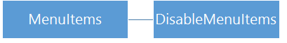

# Configure Windows 10 Mobile using Lockdown XML


**Applies to**

-   Windows 10 Mobile

Windows 10 Mobile allows enterprises to lock down a device, define multiple user roles, and configure custom layouts on a device. For example, the enterprise can lock down a device so that only applications and settings in an allow list are available.

This is accomplished using Lockdown XML, an XML file that contains settings for Windows 10 Mobile. When you deploy the lockdown XML file to a device, it is saved on the device as **wehlockdown.xml**. When the device boots, it looks for wehlockdown.xml and applies any settings configured in the file. 

In this topic, you'll learn how to create an XML file that contains all lockdown entries available in the AssignedAccessXml area of the [EnterpriseAssignedAccess configuration service provider (CSP)](https://msdn.microsoft.com/windows/hardware/commercialize/customize/mdm/enterpriseassignedaccess-csp). This topic provides example XML that you can use in your own lockdown XML file that can be included in a provisioning package or when using a mobile device management (MDM) solution to push lockdown settings to enrolled devices. You can also use the [Lockdown Designer app](mobile-lockdown-designer.md) to configure and export your lockdown XML file.

> [!NOTE]
>  On Windows 10 desktop editions, *assigned access* is a feature that lets you configure the device to run a single app above the lockscreen ([kiosk mode](../set-up-a-device-for-anyone-to-use.md)). On a Windows 10 Mobile device, assigned access refers to the lockdown settings in AssignedAccessXml in the [EnterpriseAssignedAccess configuration service provider (CSP)](https://go.microsoft.com/fwlink/p/?LinkID=618601).

If you're not familiar with CSPs, read [Introduction to configuration service providers (CSPs)](../provisioning-packages/how-it-pros-can-use-configuration-service-providers.md) first.

## Overview of the lockdown XML file

Let's start by looking at the basic structure of the lockdown XML file. You can start your file by pasting the following XML (or any other examples in this topic) into a text or XML editor, and saving the file as *filename*.xml.

```xml
<?xml version="1.0" encoding="utf-8"?>
<HandheldLockdown version="1.0" >
	<Default>
		<ActionCenter/>
		<Apps/>
		<Buttons/>
		<CSPRunner/>
		<MenuItems/>
		<Settings/>
		<Tiles/>
		<StartScreenSize/>
	</Default>
</HandheldLockdown>
```

**Default** and the entries beneath it establish the default device settings that are applied for every user. The device will always boot to this Default role. You can create additional roles on the device, each with its own settings, in the same XML file. [Learn how to add roles.](#configure-additional-roles)

The settings for the Default role and other roles must be listed in your XML file in the order presented in this topic. All of the entries are optional. If you don't include a setting, that aspect of the device will operate as it would for an nonconfigured device.

>[!TIP]
>Keep your XML file easy to work with and to understand by using proper indentation and adding comments for each setting you configure.

## Action Center


The Action Center setting controls whether the user can open the Action Center on the device. When the Action Center is disabled, notifications on the lockscreen and toasts are also disabled. You can use optional attributes with the Action Center element to change that behavior for either notifications, toasts, or both.

In the following example, the Action Center is enabled and both policies are disabled.

```xml
<ActionCenter enabled="true" aboveLockToastEnabled="0" actionCenterNotificationEnabled="0"/>
```

In the following example, Action Center and the toast policy are enabled, and the notifications policy is disabled.

```xml
<ActionCenter enabled="true" aboveLockToastEnabled="1" actionCenterNotificationEnabled="0"/>
```

The following example is a complete lockdown XML file that disables Action Center, notifications, and toasts. 

```xml
<?xml version="1.0" encoding="utf-8"?>
<HandheldLockdown version="1.0" >
    <Default>
	<!-- disable Action Center -->
        <ActionCenter enabled="false" />
    </Default>
</HandheldLockdown>
```

## Apps


The Apps setting serves as an allow list and specifies the applications that will be available in the All apps list. Apps that are not included in this setting are hidden from the user and blocked from running. 

You provide the App User Model ID (AUMID) and product ID for each app in your file. The product ID identifies an app package, and an app package can contain multiple apps, so you also provide the ADUMID to differentiate the app. Optionally, you can set an app to run automatically. [Get product ID and AUMID for apps in Windows 10 Mobile.](product-ids-in-windows-10-mobile.md)

The following example makes Outlook Calendar available on the device.

```xml
<Apps>
    <!-- Outlook Calendar -->
    <Application productId="{A558FEBA-85D7-4665-B5D8-A2FF9C19799B}" aumid="microsoft.windowscommunicationsapps_8wekyb3d8bbwe!microsoft.windowslive.calendar">
    </Application>
</Apps>
```

When you list an app, you can also set the app to be pinned to the Start screen by specifying the tile size and location. Tip: draw a grid and mark your app tiles on it to make sure you get the result you want. The width (X axis) in the following example is the limit for Windows 10 Mobile, but the length (Y axis) is unlimited. The number of columns available to you depends on the value for [StartScreenSize](#start-screen-size).


Tile sizes are:
* Small: 1x1
* Medium: 2x2
* Large: 2x4

Based on 6 columns, you can pin six small tiles or three medium tiles on a single row. A large tile can be combined with two small tiles or one medium tile on the same row. Obviously, you cannot set a medium tile for LocationX=5, or a large tile for LocationX=3, 4, or 5.

If the tile configuration in your file exceeds the available width, such as setting a large tile to start at position 3 on the X axis, that tile is appended to the bottom of the Start screen. Also, if the tile configuration in your file would result in tiles overlapping each other, the overlapping tiles are instead appended to the bottom of the Start screen.

In the following example, Outlook Calendar and Outlook Mail are pinned to the Start screen, and the Store app is allowed but is not pinned to Start.

```xml
<Apps>
    <!-- Outlook Calendar -->
    <Application productId="{A558FEBA-85D7-4665-B5D8-A2FF9C19799B}" aumid="microsoft.windowscommunicationsapps_8wekyb3d8bbwe!microsoft.windowslive.calendar">
        <PinToStart>
            <Size>Large</Size>
            <Location>
                <LocationX>0</LocationX>
                <LocationY>0</LocationY>
            </Location>
        </PinToStart>
    </Application>
    <!-- Outlook Mail-->
    <Application productId="{A558FEBA-85D7-4665-B5D8-A2FF9C19799B}" aumid="microsoft.windowscommunicationsapps_8wekyb3d8bbwe!microsoft.windowslive.mail">
        <PinToStart>
            <Size>Medium</Size>
            <Location>
                <LocationX>4</LocationX>
                <LocationY>0</LocationY>
            </Location>
        </PinToStart>
    </Application>
	<!-- Store -->
	<Application productId="7D47D89A-7900-47C5-93F2-46EB6D94C159" aumid="Microsoft.WindowsStore_8wekyb3d8bbwe!App" />
</Apps>
```

That layout would appear on a device like this:


You can create and pin folders to Start by using the Apps setting. Each folder requires a **folderId**, which must be a consecutive positive integer starting with `1`. You can also specify a **folderName** (optional) which will be displayed on Start.

```xml
<Apps>
    <!-- Management folder -->
    <Application folderId="1" folderName="Management">
	  <PinToStart>
            <Size>Medium</Size>
            <Location>
                <LocationX>4</LocationX>
                <LocationY>0</LocationY>
            </Location>
        </PinToStart>
    </Application>
</Apps>
```

To add apps to the folder, include **ParentFolderId** in the application XML, as shown in the following example:

```xml
<Apps>
    <!-- Outlook Calendar -->
    <Application productId="{A558FEBA-85D7-4665-B5D8-A2FF9C19799B}" aumid="microsoft.windowscommunicationsapps_8wekyb3d8bbwe!microsoft.windowslive.calendar">
        <PinToStart>
            <Size>Large</Size>
            <Location>
                <LocationX>0</LocationX>
                <LocationY>0</LocationY>
            </Location>
			<ParentFolderId>1</ParentFolderId>
        </PinToStart>
    </Application>
    <!-- Outlook Mail-->
    <Application productId="{A558FEBA-85D7-4665-B5D8-A2FF9C19799B}" aumid="microsoft.windowscommunicationsapps_8wekyb3d8bbwe!microsoft.windowslive.mail">
        <PinToStart>
            <Size>Medium</Size>
            <Location>
                <LocationX>4</LocationX>
                <LocationY>0</LocationY>
            </Location>
			<ParentFolderId>1</ParentFolderId>
        </PinToStart>
    </Application>
</Apps>
```
When an app is contained in a folder, its **PinToStart** configuration (tile size and location) applies to its appearance when the folder is opened.

## Buttons


In the Buttons setting, you use ButtonLockdownList to disable hardware buttons and ButtonRemapList to change button events to open an app that you specify. 

### ButtonLockdownList

When a user taps a button that is in the lockdown list, nothing will happen. The following table lists which events can be disabled for each button.

Button | Press | PressAndHold | All
---|:---:|:---:|:--:|-
Start |  |  | 
Back |  |  |  
Search |  |  | 
Camera |  |  | 
Custom 1, 2, and 3 |  |  | 

> [!NOTE]
>  Custom buttons are hardware buttons that can be added to devices by OEMs.

In the following example, press-and-hold is disabled for the Back button.

```xml
<Buttons>
	<ButtonLockdownList>
		<Button name="Back">
			<ButtonEvent name="PressAndHold" />
		</Button>
	</ButtonLockdownList>
</Buttons>
```

If you don't specify a button event, all actions for the button are disabled. In the next example, all actions are disabled for the camera button.

```xml
<Buttons>
	<ButtonLockdownList>
		<Button name="Camera">
		</Button>
	</ButtonLockdownList>
</Buttons>
```

### ButtonRemapList

ButtonRemapList lets you change the app that a button will run. You can remap the Search button and any custom buttons included by the OEM. You can't remap the Back, Start, or Camera buttons.

> [!WARNING]
>  Button remapping can enable a user to open an application that is not in the allow list for that user role. Use button lock down to prevent application access for a user role.
 
To remap a button, you specify the button, the event, and the product ID for the app that you want the event to open. 
In the following example, when a user presses the Search button, the phone dialer will open instead of the Search app.

```xml
<Buttons>
	<ButtonRemapList>
		<Button name="Search">
			<ButtonEvent name="Press">
				<!-- Phone dialer -->
				<Application productID="{F41B5D0E-EE94-4F47-9CFE-3D3934C5A2C7 }" parameters="" />
			</ButtonEvent>
		</Button>
	</ButtonRemapList>
</Buttons>
```

## CSPRunner


You can use CSPRunner to include settings that are not defined in AssignedAccessXML. For example, you can include settings from other sections of EnterpriseAssignedAccess CSP, such as lockscreen, theme, and time zone. You can also include settings from other CSPs, such as [Wi-Fi CSP](https://go.microsoft.com/fwlink/p/?LinkID=717460) or [Policy CSP](https://msdn.microsoft.com/library/windows/hardware/dn904962%28v=vs.85%29.aspx).
 
CSPRunner is helpful when you are configuring a device to support multiple roles. It lets you apply different policies according to the role that is signed on. For example, Wi-Fi could be enabled for a supervisor role and disabled for a stocking clerk role. 

In CSPRunner, you specify the CSP and settings using SyncML, a standardized markup language for device management. A SyncML section can include multiple settings, or you can use multiple SyncML sections -- it's up to you how you want to organize settings in this section.

> [!NOTE]
> This description of SyncML is just the information that you need to use SyncML in a lockdown XML file. To learn more about SyncML, see [Structure of OMA DM provisioning files](https://msdn.microsoft.com/windows/hardware/dn914774.aspx).

Let's start with the structure of SyncML in the following example:

```xml
SyncML>
	<SyncBody>
		<Add>|<Replace>
			<CmdID>#</CmdID>
			<Item>
				<Target>
					<LocURI>CSP Path</LocURI>
				</Target>
				<Meta>
					<Format xmlns="syncml:metinf">Data Type</Format>
				</Meta>
				<Data>Value</Data>
			</Item>
		</Add>|</Replace>
		<Final/>
	</SyncBody>
</SyncML>
```

This table explains the parts of the SyncML structure.

SyncML entry | Description
---|---
**Add** or **Replace** | Use **Add** to apply a setting or policy that is not already configured. Use **Replace** to change an existing setting or policy.
**CmdID** | SyncBody can contain multiple commands. Each command in a lockdown XML file must have a different **CmdID** value.
**Item** | **Item** is a wrapper for a single setting. You can include multiple items for the command if they all use the same **Add** or **Replace** operation.
**Target > LocURI** | **LocURI** is the path to the CSP. 
**Meta > Format** | The data format required by the CSP.
**Data** | The value for the setting.


## Menu items



Use DisableMenuItems to prevent use of the context menu, which is displayed when a user presses and holds an application in the All Apps list. You can include this entry in the default profile and in any additional user role profiles that you create.

```xml
  <MenuItems>
      <DisableMenuItems/>
  </MenuItems>
```

## Settings


The **Settings** section contains an `allow` list of pages in the Settings app and quick actions. The following example allows all settings.

```xml
 <Settings>
     <!-- Allow all settings -->
 </Settings>
 ```
In earlier versions of Windows 10, you used the page name to define allowed settings. Starting in Windows 10, version 1703, you use the settings URI.

In the following example for Windows 10, version 1703, all system setting pages that have a settings URI are enabled.

```xml
<Settings> 
  <System name="ms-settings:screenrotation" /> 
  <System name="ms-settings:notifications" /> 
  <System name="ms-settings:phone" />
  <System name="ms-settings:messaging" />
  <System name="ms-settings:batterysaver" /> 
  <System name="ms-settings:batterysaver-usagedetails" /> 
  <System name="ms-settings:about" /> 
  <System name="ms-settings:deviceencryption" /> 
  <System name="ms-settings:maps" /> 
 </Settings>
```

If you list a setting or quick action in **Settings**, all settings and quick actions that are not listed are blocked. To remove access to all of the settings in the system, do not include the settings application in [Apps](#apps).

For a list of the settings and quick actions that you can allow or block, see [Settings and quick actions that can be locked down in Windows 10 Mobile](settings-that-can-be-locked-down.md).

 
 ## Tiles
 
 
 
 By default, under Assigned Access, tile manipulation is turned off (blocked) and only available if enabled in the user’s profile. If tile manipulation is enabled in the user’s profile, they can pin/unpin, move, and resize tiles based on their preferences. When multiple people use one device and you want to enable tile manipulation for multiple users, you must enable it for each user in their user profile. 
 
 > [!IMPORTANT]
 > If a device is turned off then back on, the tiles reset to their predefined layout. If a device has only one profile, the only way to reset the tiles is to turn off then turn on the device. If a device has multiple profiles, the device resets the tiles to the predefined layout based on the logged-in user’s profile. 
 
 ```xml
 <Tiles>
     <EnableTileManipulation/>
 </Tiles>
 ```
 
 ## Start screen size
 
 Specify the size of the Start screen. In addition to 4/6 columns, you can also use 4/6/8 depending on screen resolutions. Valid values: 
 
 - Small sets the width to 4 columns on devices with short axis (less than 400epx) or 6 columns on devices with short axis (greater than or equal to 400epx).
 - Large sets the width to 6 columns on devices with short axis (less than 400epx) or 8 columns on devices with short axis (greater than or equal to 400epx).
  
 If you have existing lockdown xml, you must update start screen size if your device has >=400epx on its short axis so that tiles on Start can fill all 8 columns if you want to use all 8 columns instead of 6, or use 6 columns instead of 4. 
 
 [Learn about effective pixel width (epx) for different device size classes.](https://go.microsoft.com/fwlink/p/?LinkId=733340)
 
 
## Configure additional roles
 
You can add custom configurations by role. In addition to the role configuration, you must also install a login application on the device. The app displays a list of available roles on the device; the user taps a role, such as "Manager"; the configuration defined for the "Manager" role is applied.
 
[Learn how to create a login application that will work with your Lockdown XML file.](https://github.com/Microsoft/Windows-universal-samples/tree/master/Samples/DeviceLockdownAzureLogin) For reference, see the [Windows.Embedded.DeviceLockdown API](https://msdn.microsoft.com/library/windows/apps/windows.embedded.devicelockdown).
 
In the XML file, you define each role with a GUID and name, as shown in the following example:
 
```xml
<Role guid="{7bb62e8c-81ba-463c-b691-74af68230b42}" name="Manager">
```

You can create a GUID using a GUID generator -- free tools are available online. The GUID needs to be unique within this XML file.
 
You can configure the same settings for each role as you did for the default role, except Start screen size which can only be configured for the default role. If you use CSPRunner with roles, be aware that the last CSP setting applied will be retained across roles unless explicitly changed in each role configuration. CSP settings applied by CSPRunner may conflict with settings applied by MDM. 
 
```xml
<?xml version "1.0" encoding "utf-8"?>
<HandheldLockdown version "1.0" >
	<Default>
		<ActionCenter/>
		<Apps/>
		<Buttons/>
		<CSPRunner/>
		<MenuItems/>
		<Settings/>
		<Tiles/>
		<StartScreenSize/>
	</Default>
		<RoleList>
			<Role>
				<ActionCenter/>
				<Apps/>
				<Buttons/>
				<CSPRunner/>
				<MenuItems/>
				<Settings/>
				<Tiles/>
			</Role>
		</RoleList>
</HandheldLockdown>
```

## Validate your XML

You can validate your lockdown XML file against the [EnterpriseAssignedAccess XSD](https://msdn.microsoft.com/windows/hardware/commercialize/customize/mdm/enterpriseassignedaccess-xsd).
 
## Add lockdown XML to a provisioning package


Use the Windows ICD tool included in the Windows Assessment and Deployment Kit (ADK) for Windows 10 to create a provisioning package. [Install the ADK.](https://go.microsoft.com/fwlink/p/?LinkId=526740)

1.  Follow the instructions at [Build and apply a provisioning package](https://go.microsoft.com/fwlink/p/?LinkID=629651) to create a project, selecting **Common to all Windows mobile editions** for your project.

2.  In **Available customizations**, go to **Runtime settings** &gt; **EmbeddedLockdownProfiles** &gt; **AssignedAccessXml**.

3.  In the center pane, click **Browse** to locate and select the lockdown XML file that you created.

    

4.  On the **File** menu, select **Save.**

5.  On the **Export** menu, select **Provisioning package**.

6.  Change **Owner** to **IT Admin**, which will set the precedence of this provisioning package higher than provisioning packages applied to this device from other sources, and then select **Next.**

7.  Optional. In the **Provisioning package security** window, you can choose to encrypt the package and enable package signing.

    -   **Enable package encryption** - If you select this option, an auto-generated password will be shown on the screen.

    -   **Enable package signing** - If you select this option, you must select a valid certificate to use for signing the package. You can specify the certificate by clicking **Select** and choosing the certificate you want to use to sign the package.

8.  Click **Next** to specify the output location where you want the provisioning package to go when it's built. By default, Windows ICD uses the project folder as the output location.

    Optionally, you can click **Browse** to change the default output location.

9.  Click **Next**.

10. Click **Build** to start building the package. The provisioning package doesn't take long to build. The project information is displayed in the build page and the progress bar indicates the build status.

    If you need to cancel the build, click **Cancel**. This cancels the current build process, closes the wizard, and takes you back to the **Customizations Page**.

11. If your build fails, an error message will show up that includes a link to the project folder. You can scan the logs to determine what caused the error. Once you fix the issue, try building the package again.

    If your build is successful, the name of the provisioning package, output directory, and project directory will be shown.

    -   If you choose, you can build the provisioning package again and pick a different path for the output package. To do this, click **Back** to change the output package name and path, and then click **Next** to start another build.
    -   If you are done, click **Finish** to close the wizard and go back to the **Customizations Page**.

After you build the provisioning package, follow the instructions for [applying a provisioning package at runtime to Windows 10 Mobile](https://go.microsoft.com/fwlink/p/?LinkID=619164).

## Push lockdown XML using MDM


After you deploy your devices, you can still configure lockdown settings through your MDM solution if it supports the [EnterpriseAssignedAccess CSP](https://go.microsoft.com/fwlink/p/?LinkID=618601).

To push lockdown settings to enrolled devices, use the AssignedAccessXML setting and use the lockdown XML as the value. The lockdown XML will be in a HandheldLockdown section that becomes XML embedded in XML, so the XML that you enter must use escaped characters (such as `&lt;` in place of &lt;). After the MDM provider pushes your lockdown settings to the device, the CSP processes the file and updates the device.

## Full Lockdown.xml example

```xml
<?xml version="1.0" encoding="utf-8"?>
<HandheldLockdown version="1.0" >
    <Default>
        <ActionCenter enabled="true" />
        <Apps>
            <!-- Settings -->
            <Application productId="{2A4E62D8-8809-4787-89F8-69D0F01654FB}">
                <PinToStart>
                    <Size>Large</Size>
                    <Location>
                        <LocationX>0</LocationX>
                        <LocationY>0</LocationY>
                    </Location>
                </PinToStart>
            </Application>
            <!-- Outlook Calendar -->
            <Application productId="{A558FEBA-85D7-4665-B5D8-A2FF9C19799B}" aumid="microsoft.windowscommunicationsapps_8wekyb3d8bbwe!microsoft.windowslive.calendar">
                <PinToStart>
                    <Size>Small</Size>
                    <Location>
                        <LocationX>0</LocationX>
                        <LocationY>2</LocationY>
                    </Location>
                </PinToStart>
            </Application>
            <!-- Photos -->
            <Application productId="{FCA55E1B-B9A4-4289-882F-084EF4145005}">
                <PinToStart>
                    <Size>Medium</Size>
                    <Location>
                        <LocationX>2</LocationX>
                        <LocationY>2</LocationY>
                    </Location>
                </PinToStart>
            </Application>
            <!-- Edge -->
            <Application productId="{395589FB-5884-4709-B9DF-F7D558663FFD}" />
            <!-- Login App -->
            <Application productId="{C85DC60D-30D4-4C67-A4B4-58282F1D152C}" />
        </Apps>
        <Buttons>
            <ButtonLockdownList>
                <!-- Lockdown all buttons -->
                <Button name="Search">
                </Button>
                <Button name="Camera">
                </Button>
                <Button name="Custom1">
                </Button>
                <Button name="Custom2">
                </Button>
                <Button name="Custom3">
                </Button>
            </ButtonLockdownList>
            <ButtonRemapList>
                <Button name="Search">
                    <ButtonEvent name="Press">
                        <!-- Edge-->
                        <Application productId="{395589FB-5884-4709-B9DF-F7D558663FFD}" parameters="" />
                    </ButtonEvent>
                </Button>
            </ButtonRemapList>
        </Buttons>
        <CSPRunner>
            <SyncML xmlns="SYNCML:SYNCML1.2">
                <SyncBody>
                    <Replace>
                        <CmdID>1</CmdID>
                        <Item>
                            <Target>
                                <LocURI>./Vendor/MSFT/EnterpriseAssignedAccess/Theme/ThemeAccentColorID</LocURI>
                            </Target>
                            <Meta>
                                <Format xmlns="syncml:metinf">int</Format>
                            </Meta>
                            <!-- zero based index of available theme colors -->
                            <Data>7</Data>
                        </Item>
                    </Replace>
                    <Final/>
                </SyncBody>
            </SyncML>
            <SyncML xmlns="SYNCML:SYNCML1.2">
                <SyncBody>
                    <Replace>
                        <CmdID>1</CmdID>
                        <Item>
                            <Target>
                                <LocURI>./Vendor/MSFT/EnterpriseAssignedAccess/Theme/ThemeBackground</LocURI>
                            </Target>
                            <Meta>
                                <Format xmlns="syncml:metinf">int</Format>
                            </Meta>
                            <!-- 0 for "light", 1 for "dark" -->
                            <Data>1</Data>
                        </Item>
                    </Replace>
                    <Final/>
                </SyncBody>
            </SyncML>
            <SyncML xmlns="SYNCML:SYNCML1.2">
                <SyncBody>
                    <Replace>
                        <CmdID>2</CmdID>
                        <Item>
                            <Target>
                                <LocURI>./Vendor/MSFT/EnterpriseAssignedAccess/LockScreenWallpaper/BGFileName</LocURI>
                            </Target>
                            <Meta>
                                <Format xmlns="syncml:metinf">chr</Format>
                                <Type xmlns="syncml:metinf">text/plain</Type>
                            </Meta>
                            <Data>c:\windows\system32\lockscreen\480x800\Wallpaper_05.jpg</Data>
                        </Item>
                    </Replace>
                    <Final/>
                </SyncBody>
            </SyncML>
        </CSPRunner>
        <MenuItems>
            <DisableMenuItems/>
        </MenuItems>
        <Settings>
            <!-- Quick actions: Brightness, Rotation -->
            <System name="SystemSettings_System_Display_QuickAction_Brightness"/>
            <System name="SystemSettings_System_Display_Internal_Rotation"/>
            <!-- Rotation, About -->
            <System name="ms-settings:screenrotation"/>
            <System name="ms-settings:about"/>
            <!-- Ringtones, sounds -->
            <System name="ms-settings:personalizationn"/>
            <System name="ms-settings:sounds"/>
        </Settings>
        <Tiles>
            <EnableTileManipulation/>
        </Tiles>
        <StartScreenSize>Small</StartScreenSize>
    </Default>
    <RoleList>
        <Role guid="{88501844-3b51-4c9f-9da7-7ca745e7da6b}" name="Associate">
            <ActionCenter enabled="0"/>
            <Apps>
                <!-- Settings -->
                <Application productId="{2A4E62D8-8809-4787-89F8-69D0F01654FB}">
                    <PinToStart>
                        <Size>Small</Size>
                        <Location>
                            <LocationX>0</LocationX>
                            <LocationY>0</LocationY>
                        </Location>
                    </PinToStart>
                </Application>
                <!-- Outlook Calendar -->
                <Application productId="{A558FEBA-85D7-4665-B5D8-A2FF9C19799B}" aumid="microsoft.windowscommunicationsapps_8wekyb3d8bbwe!microsoft.windowslive.calendar">
                    <PinToStart>
                        <Size>Large</Size>
                        <Location>
                            <LocationX>0</LocationX>
                            <LocationY>2</LocationY>
                        </Location>
                    </PinToStart>
                </Application>
                <!-- Login App -->
                <Application productId="{C85DC60D-30D4-4C67-A4B4-58282F1D152C}" />
            </Apps>
            <Buttons />
            <CSPRunner>
                <SyncML xmlns="SYNCML:SYNCML1.2">
                    <SyncBody>
                        <Replace>
                            <CmdID>1</CmdID>
                            <Item>
                                <Target>
                                    <LocURI>./Vendor/MSFT/EnterpriseAssignedAccess/Theme/ThemeAccentColorID</LocURI>
                                </Target>
                                <Meta>
                                    <Format xmlns="syncml:metinf">int</Format>
                                </Meta>
                                <!-- zero based index of available theme colors -->
                                <Data>10</Data>
                            </Item>
                        </Replace>
                        <Final/>
                    </SyncBody>
                </SyncML>
                <SyncML xmlns="SYNCML:SYNCML1.2">
                    <SyncBody>
                        <Replace>
                            <CmdID>1</CmdID>
                            <Item>
                                <Target>
                                    <LocURI>./Vendor/MSFT/EnterpriseAssignedAccess/Theme/ThemeBackground</LocURI>
                                </Target>
                                <Meta>
                                    <Format xmlns="syncml:metinf">int</Format>
                                </Meta>
                                <!-- 0 for "light", 1 for "dark" -->
                                <Data>0</Data>
                            </Item>
                        </Replace>
                        <Final/>
                    </SyncBody>
                </SyncML>
                <SyncML xmlns="SYNCML:SYNCML1.2">
                    <SyncBody>
                        <Replace>
                            <CmdID>2</CmdID>
                            <Item>
                                <Target>
                                    <LocURI>./Vendor/MSFT/EnterpriseAssignedAccess/LockScreenWallpaper/BGFileName</LocURI>
                                </Target>
                                <Meta>
                                    <Format xmlns="syncml:metinf">chr</Format>
                                    <Type xmlns="syncml:metinf">text/plain</Type>
                                </Meta>
                                <Data>c:\windows\system32\lockscreen\480x800\Wallpaper_08.jpg</Data>
                            </Item>
                        </Replace>
                        <Final/>
                    </SyncBody>
                </SyncML>
            </CSPRunner>
            <MenuItems>
                <DisableMenuItems/>
            </MenuItems>
            <Settings>
                <!-- Rotation, Notifications, About -->
                <System name="ms-settings:screenrotation"/>
                <System name="ms-settings:notifications"/>
                <System name="ms-settings:about"/>
                <!-- Ringtones, sounds -->
                <System name="ms-settings:personalization"/>
                <System name="ms-settings:sounds"/>
                <!-- Workplace -->
                <System name="ms-settings:workplace"/>
                <System name="ms-settings:emailandaccounts"/>
            </Settings>
        </Role>
        <Role guid="{7bb62e8c-81ba-463c-b691-74af68230b42}" name="Manager">
            <ActionCenter enabled="true" />
            <Apps>
                <!-- Alarms and Clock -->
                <Application productId="{44F7D2B4-553D-4BEC-A8B7-634CE897ED5F}">
                    <PinToStart>
                        <Size>Small</Size>
                        <Location>
                            <LocationX>0</LocationX>
                            <LocationY>0</LocationY>
                        </Location>
                    </PinToStart>
                </Application>
                <!-- Settings -->
                <Application productId="{2A4E62D8-8809-4787-89F8-69D0F01654FB}">
                    <PinToStart>
                        <Size>Small</Size>
                        <Location>
                            <LocationX>1</LocationX>
                            <LocationY>0</LocationY>
                        </Location>
                    </PinToStart>
                </Application>
                <!-- Outlook Calendar -->
                <Application productId="{A558FEBA-85D7-4665-B5D8-A2FF9C19799B}" aumid="microsoft.windowscommunicationsapps_8wekyb3d8bbwe!microsoft.windowslive.calendar">
                    <PinToStart>
                        <Size>Medium</Size>
                        <Location>
                            <LocationX>2</LocationX>
                            <LocationY>0</LocationY>
                        </Location>
                    </PinToStart>
                </Application>
                <!-- Calculator -->
                <Application productId="{B58171C6-C70C-4266-A2E8-8F9C994F4456}" />
                <!-- Photos -->
                <Application productId="{FCA55E1B-B9A4-4289-882F-084EF4145005}">
                    <PinToStart>
                        <Size>Small</Size>
                        <Location>
                            <LocationX>0</LocationX>
                            <LocationY>2</LocationY>
                        </Location>
                    </PinToStart>
                </Application>
                <!-- Store -->
                <Application productId="{7D47D89A-7900-47C5-93F2-46EB6D94C159}">
                    <PinToStart>
                        <Size>Medium</Size>
                        <Location>
                            <LocationX>2</LocationX>
                            <LocationY>2</LocationY>
                        </Location>
                    </PinToStart>
                </Application>
                <!-- Login App -->
                <Application productId="{C85DC60D-30D4-4C67-A4B4-58282F1D152C}" />
            </Apps>
            <Buttons />
            <CSPRunner>
                <SyncML xmlns="SYNCML:SYNCML1.2">
                    <SyncBody>
                        <Replace>
                            <CmdID>1</CmdID>
                            <Item>
                                <Target>
                                    <LocURI>./Vendor/MSFT/EnterpriseAssignedAccess/Theme/ThemeAccentColorID</LocURI>
                                </Target>
                                <Meta>
                                    <Format xmlns="syncml:metinf">int</Format>
                                </Meta>
                                <!-- zero based index of available theme colors -->
                                <Data>2</Data>
                            </Item>
                        </Replace>
                        <Final/>
                    </SyncBody>
                </SyncML>
                <SyncML xmlns="SYNCML:SYNCML1.2">
                    <SyncBody>
                        <Replace>
                            <CmdID>1</CmdID>
                            <Item>
                                <Target>
                                    <LocURI>./Vendor/MSFT/EnterpriseAssignedAccess/Theme/ThemeBackground</LocURI>
                                </Target>
                                <Meta>
                                    <Format xmlns="syncml:metinf">int</Format>
                                </Meta>
                                <!-- 0 for "light", 1 for "dark" -->
                                <Data>1</Data>
                            </Item>
                        </Replace>
                        <Final/>
                    </SyncBody>
                </SyncML>
                <SyncML xmlns="SYNCML:SYNCML1.2">
                    <SyncBody>
                        <Replace>
                            <CmdID>2</CmdID>
                            <Item>
                                <Target>
                                    <LocURI>./Vendor/MSFT/EnterpriseAssignedAccess/LockScreenWallpaper/BGFileName</LocURI>
                                </Target>
                                <Meta>
                                    <Format xmlns="syncml:metinf">chr</Format>
                                    <Type xmlns="syncml:metinf">text/plain</Type>
                                </Meta>
                                <Data>c:\windows\system32\lockscreen\480x800\Wallpaper_015.jpg</Data>
                            </Item>
                        </Replace>
                        <Final/>
                    </SyncBody>
                </SyncML>
            </CSPRunner>
            <MenuItems>
                <DisableMenuItems/>
            </MenuItems>
            <Settings>
                <!-- Allow all settings -->
            </Settings>
            <Tiles>
                <EnableTileManipulation/>
            </Tiles>
        </Role>
    </RoleList>
</HandheldLockdown>

```

## Learn more

[Customizing Your Device Experience with Assigned Access](https://channel9.msdn.com/Events/Build/2016/P508)

## Related topics


[Settings and quick actions that can be locked down in Windows 10 Mobile](settings-that-can-be-locked-down.md)

[Product IDs in Windows 10 Mobile](product-ids-in-windows-10-mobile.md)
