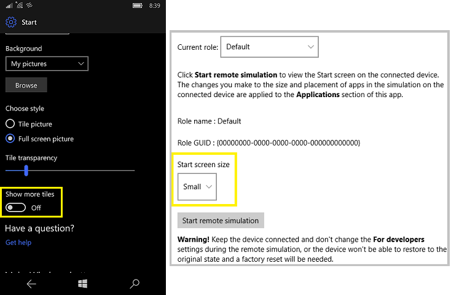

# Use the Lockdown Designer app to create a Lockdown XML file

Windows 10 Mobile allows enterprises to lock down a device, define multiple user roles, and configure custom layouts on a device. For example, the enterprise can lock down a device so that only applications and settings in an allow list are available. This is accomplished using Lockdown XML, an XML file that contains settings for Windows 10 Mobile. 

When you deploy the lockdown XML file to a device, it is saved on the device as **wehlockdown.xml**. When the device boots, it looks for wehlockdown.xml and applies any settings configured in the file. You can deploy the lockdown XML file by [adding it to a provisioning package](lockdown-xml.md#add-lockdown-xml-to-a-provisioning-package) or [by using mobile device management (MDM)](lockdown-xml.md#push-lockdown-xml-using-mdm).

The Lockdown Designer app helps you configure and create a lockdown XML file that you can apply to devices running Windows 10 Mobile, version 1703, and includes a remote simulation to help you determine the layout for tiles on the Start screen. Lockdown Designer also validates the XML. Using Lockdown Designer is easier than [manually creating a lockdown XML file](lockdown-xml.md).

## Overview

Lockdown Designer can be installed on a PC running Windows 10, version 1607 or later. After you install the app, you connect a mobile device running Windows 10 Mobile, version 1703, to the PC. 

>[!NOTE]
>Lockdown Designer will not make any changes to the connected device, but we recommend that you use a test device.

Lockdown Designer will populate the available settings and apps to configure from the connected device. Using the different pages in the app, you select the settings, apps, and layout to be included in the lockdown XML.

When you're done, you export the configuration to a lockdown XML file. This configuration can be applied to any device running Windows 10 Mobile, version 1703.

>[!NOTE]
>You can also import an existing WEHLockdown.xml file to Lockdown Designer and modify it in the app.

## Prepare the test mobile device

Perform these steps on the device running Windows 10 Mobile that you will use to supply the settings, apps, and layout to Lockdown Designer.

1. Install all apps on the device that you want to include in the configuration, including line-of-business apps.

2. On the mobile device, go to **Settings** > **Update & security** > **For developers**, enable **Developer mode**. 

3. Read the disclaimer, then click **Yes** to accept the change.

4. Enable **Device discovery**, and then turn on **Device Portal**. 

>[!IMPORTANT]
>Check **Settings > Personalization > Start > Show more tiles** on the test mobile device. If **Show more tiles** is **On**, you must select **Large** on the [**Start screen** page](#start) in Lockdown Designer. If you want to apply a **Small** layout, set **Show more tiles** on the test mobile device to **Off**.
>
> 

## Prepare the PC

[Install Lockdown Designer](https://www.microsoft.com/store/r/9nblggh40753) on the PC. 

If the PC and the test mobile device are on the same Wi-Fi network, you can connect the devices using Wi-Fi. 

If you want to connect the PC and the test mobile device using a USB cable, perform the following steps on the PC:

1. [Install the Windows 10 Software Development Kit (SDK)](https://developer.microsoft.com/windows/downloads/windows-10-sdk). This enables the **Windows Phone IP over USB Transport (IpOverUsbSvc)** service.

2. Open a command prompt as an administrator and run `checknetisolation  LoopbackExempt -a -n=microsoft.lockdowndesigner_8wekyb3d8bbwe`

    >[!NOTE]
    >Loopback is permitted only for development purposes. To remove the loopback exemption when you're done using Lockdown Designer, run `checknetisolation  LoopbackExempt -d -n=microsoft.lockdowndesigner_8wekyb3d8bbwe`

## Connect the mobile device to Lockdown Designer

**Using Wi-Fi**

1. Open Lockdown Designer.

2. Click **Create new project**.

3. On the test mobile device, go to **Settings** > **Update & security** > **For developers** > **Connect using:** and get the IP address listed for **Wi-Fi**.

2. On the **Project setting** > **General settings** page, in **Remote device IP address**, enter the IP address for the test mobile device, using `https://`.

3. Click **Pair**. 

    

    **Connect to remote device** appears. 

4. On the mobile device, under **Device discovery**, tap **Pair**. A case-sensitive code is displayed.

5. On the PC, in **Connect to remote device**, enter the code from the mobile device.

6. Next, click **Sync** to pull information from the device in to Lockdown Designer.

    

7. Click the **Save** icon and enter a name for your project. 

**Using a USB cable**

1. Open Lockdown Designer.

2. Click **Create new project**.

2. Connect a Windows 10 Mobile device to the PC by USB and unlock the device.

3. On the **Project setting** > **General settings** page, click **Pair**. 

    

    **Connect to remote device** appears. 

4. On the mobile device, under **Device discovery**, tap **Pair**. A case-sensitive code is displayed.

5. On the PC, in **Connect to remote device**, enter the code from the mobile device.

6. Next, click **Sync** to pull information from the device in to Lockdown Designer.

    

7. Click the **Save** icon and enter a name for your project. 

## Configure your lockdown XML settings

The apps and settings available in the pages of Lockdown Designer should now be populated from the test mobile device. The following table describes what you can configure on each page.

| Page | Description |
| --- | --- |
|  | Each app from the test mobile device is listed. Select the apps that you want visible to users.  You can select an app to run automatically when a user signs in to the device. The **Select Auto-Run** menu is populated by the apps that you select to allow on the device. |
|  | CSPRunner enables you to include settings and policies that are not defined in other sections of the app. To make use of CSPRunner, you must create the SyncML block that contains the settings, and then import the SyncML in Lockdown Designer. [Learn how to use CSPRunner and author SyncML.](lockdown-xml.md#csprunner)  |
|   |  On this page, you select the settings that you want visible to users. See the [ms settings: URI scheme reference](https://docs.microsoft.com/windows/uwp/launch-resume/launch-settings-app#ms-settings-uri-scheme-reference) to see which Settings page maps to a URI.  |
|   |  On this page, you select the settings that you want visible to users. |
|   |  Each hardware button on a mobile device has different actions that can be disabled. In addition, the behavior for **Search** button can be changed to open an app other than **Search**.  Some devices may have additional hardware buttons provided by the OEM. These are listed as Custom1, Custom2, and Custom3. If your device has custom hardware buttons, contact your equipment provider to identify how their custom buttons are defined. |
|   | This page contains several settings that you can configure:  - The context menu is displayed when a user presses and holds an application in the All Apps list. You can enable or disable the context menu.  - Tile manipulation allows users to pin, unpin, move, and resize tiles on the Start screen. You can enable or disable tile manipulation.  - The Action Center setting controls whether the user can open the Action Center on the device. When the Action Center is disabled, notifications on the lockscreen and toasts are also disabled. You can use optional attributes with the Action Center element to change that behavior for either notifications, toasts, or both.  |
|   | On this page, you can start a remote simulation session with the test mobile device. Click **Start remote simulation**. You will see a **Start screen remote simulation in progress** message on the PC. (If the **Start remote simulation** button is not active, [pair the mobile device with the PC again](#pair).)  On the test mobile device, tiles for the apps that you allowed on the **Applications** page are displayed on the screen. You can move, resize, or unpin these tiles to achieve the desired layout.  When you are done changing the layout on the test mobile device, click **Accept** on the PC. |

## Validate and export

On the **Validate and export** page, click **Validate** to make sure your lockdown XML is valid. 

>[!WARNING]
>Lockdown Designer cannot validate SyncML that you imported to CSPRunner.

Click **Export** to generate the XML file for your project. You can select the location to save the file.

## Create and configure multiple roles

You can create additional roles for the device and have unique configurations for each role. For example, you could have one configuration for a **Manager** role and a different configuration for a **Salesperson** role.

>[!NOTE]
>Using multiple roles on a device requires a login application that displays the list of roles and allows users to sign in to Azure Active Directory. [Learn how to create a login application that will work with your Lockdown XML file.](https://github.com/Microsoft/Windows-universal-samples/tree/master/Samples/DeviceLockdownAzureLogin) 

**For each role:**

1. On the **Project setting** page, click **Role management**.

2. Click **Add a role**.

3. Enter a name for the role, and then click **Save**.

4. Configure the settings for the role as above, but make sure on each page that you select the correct role.

    

