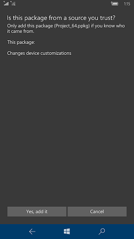

# Use Windows Configuration Designer to configure Windows 10 Mobile devices 

Windows provisioning makes it easy for IT administrators to configure end-user devices without imaging. Using provisioning packages, ayou can easily specify desired configuration, settings, and information required to enroll the devices into management, and then apply that configuration to target devices in a matter of minutes. 

A provisioning package (.ppkg) is a container for a collection of configuration settings. Using Windows Configuration Designer, you can create provisioning packages that let you quickly and efficiently configure a device without having to install a new image.

Windows Configuration Designer can be installed from the [Windows Assessment and Deployment Kit (ADK) for Windows 10](https://developer.microsoft.com/windows/hardware/windows-assessment-deployment-kit). Windows Configuration Designer is also available as an app in the Microsoft Store. [Learn more about installing Windows Configuration Designer.](../provisioning-packages/provisioning-install-icd.md)

## Create a provisioning package using the wizard

The **Provision Windows mobile devices** wizard lets you configure common settings for devices running Windows 10 Mobile in a simple, graphical workflow.

### Start a new project

1. Open Windows Configuration Designer:
    - From either the Start screen or Start menu search, type 'Windows Configuration Designer' and click the Windows Configuration Designer shortcut, 
    
    or
    
    - If you installed Windows Configuration Designer from the ADK, navigate to `C:\Program Files (x86)\Windows Kits\10\Assessment and Deployment Kit\Imaging and Configuration Designer\x86` (on an x64 computer) or `C:\Program Files\Windows Kits\10\Assessment and Deployment Kit\Imaging and Configuration Designer\x86\ICD.exe` (on an x86 computer), and then double-click **ICD.exe**.

2. On the **Start** page, choose **Provision Windows mobile devices**.

3. Enter a name for your project, and then click **Next**.

### Configure settings in the wizard

<table>
<tr><td style="width:45%" valign="top">  Enter a device name.   Optionally, you can enter a product key to upgrade the device from Windows 10 Mobile to Windows 10 Mobile Enterprise. </td><td></td></tr>
<tr><td style="width:45%" valign="top">    Toggle **On** or **Off** for wireless network connectivity.   If you select **On**, enter the SSID, network type (**Open** or **WPA2-Personal**), and (if **WPA2-Personal**) the password for the wireless network.</td><td></td></tr>
<tr><td style="width:45%" valign="top">    Before you use a Windows Configuration Designer wizard to configure bulk Azure AD enrollment, [set up Azure AD join in your organization](https://docs.microsoft.com/azure/active-directory/active-directory-azureadjoin-setup). The **maximum number of devices per user** setting in your Azure AD tenant determines how many times the bulk token that you get in the wizard can be used.    Set an expiration date for the token (maximum is 180 days from the date you get the token). Click **Get bulk token**. In the **Let's get you signed in** window, enter an account that has permissions to join a device to Azure AD, and then the password. Click **Accept** to give Windows Configuration Designer the necessary permissions.  **Warning:** You must run Windows Configuration Designer on Windows 10 to configure Azure Active Directory enrollment using any of the wizards. </td><td></td></tr>
<tr><td style="width:45%" valign="top">   You can set a password to protect your provisioning package. You must enter this password when you apply the provisioning package to a device.</td><td></td></tr>
</table>

After you're done, click **Create**. It only takes a few seconds. When the package is built, the location where the package is stored is displayed as a hyperlink at the bottom of the page.

### Apply provisioning package

You can apply a provisioning package to a device running Windows 10 Mobile by using:

- removable media 
- copying the provisioning package to the device
- [NFC tags](provisioning-nfc.md)
- [barcodes](provisioning-package-splitter.md)

### Using removable media

1. Insert an SD card containing the provisioning package into the device.
2. Navigate to **Settings** > **Accounts** > **Access work or school** > **Add or remove a provisioning package** > **Add a package**, and select the package to install. 

    

3. Click **Add**.

4. On the device, the **Is this package from a source you trust?** message will appear. Tap **Yes, add it**.

    
    
### Copying the provisioning package to the device

1. Connect the device to your PC through USB.

2. On the PC, select the provisioning package that you want to use to provision the device and then drag and drop the file to your device.

3. On the device, the **Is this package from a source you trust?** message will appear. Tap **Yes, add it**.

    

## Related topics

- [NFC-based device provisioning](provisioning-nfc.md)
- [Use the package splitter tool](provisioning-package-splitter.md)
