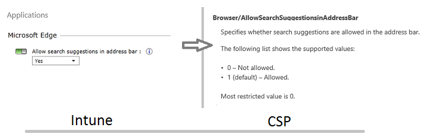
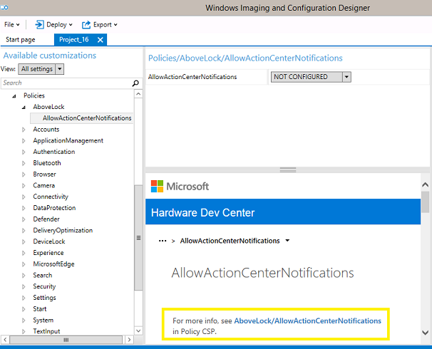

# Introduction to configuration service providers (CSPs) for IT pros

**Applies to**

-   Windows 10
-   Windows 10 Mobile

Configuration service providers (CSPs) expose device configuration settings in Windows 10. This topic is written for people who have no experience with CSPs.

The CSPs are documented on the [Hardware Dev Center](https://go.microsoft.com/fwlink/p/?LinkId=717390) because CSPs are used by mobile device management (MDM) service providers. This topic explains how IT pros and system administrators can take advantage of many settings available through CSPs to configure devices running Windows 10 and Windows 10 Mobile in their organizations.

>[!NOTE]
>This explanation of CSPs and CSP documentation also applies to Windows Mobile 5, Windows Mobile 6, Windows Phone 7, and Windows Phone 8, but links to current CSPs are for Windows 10 and Windows 10 Mobile.

 [See what's new for CSPs in Windows 10, version 1809.](https://docs.microsoft.com/windows/client-management/mdm/new-in-windows-mdm-enrollment-management#whatsnew1809)

## What is a CSP?

A CSP is an interface in the client operating system, between configuration settings specified in a provisioning document, and configuration settings on the device. CSPs are similar to Group Policy client-side extensions, in that they provide an interface to read, set, modify, or delete configuration settings for a given feature. Typically, these settings map to registry keys, files or permissions. Some of these settings are configurable, and some are read-only.

Starting with Windows Mobile 5.0, CSPs were used to manage Windows mobile devices. On the Windows 10 platform, the management approach for both desktop and mobile devices converges, taking advantage of the same CSPs to configure and manage all devices running Windows 10.

Each CSP provides access to specific settings. For example, the [Wi-Fi CSP](https://go.microsoft.com/fwlink/p/?LinkId=717438) contains the settings to create a Wi-Fi profile.

CSPs are behind many of the management tasks and policies for Windows 10, both in Microsoft Intune and in non-Microsoft MDM service providers. For example, in Intune, the policy to allow search suggestions in the Microsoft Edge address bar uses **Browser/AllowSearchSuggestionsinAddressBar** in the [Policy CSP](https://go.microsoft.com/fwlink/p/?LinkID=623244).



CSPs receive configuration policies in the XML-based SyncML format, pushed from an MDM-compliant management server, such as Microsoft Intune. Traditional enterprise management systems, such as System Center Configuration Manager, can also target CSPs, by using a client-side WMI-to-CSP bridge.

### Synchronization Markup Language (SyncML)

The Open Mobile Alliance Device Management (OMA-DM) protocol uses the XML-based Synchronization Markup Language (SyncML) for data exchange between compliant servers and clients. SyncML offers an open standard to use as an alternative to vendor-specific management solutions (such as WMI). The value for enterprises adopting industry standard management protocols is that it allows the management of a broader set of vendor devices using a single platform (such as Microsoft Intune). Device policies, including VPN connection profiles, are delivered to client devices formatted as in SyncML. The target CSP reads this information and applies the necessary configurations.

### The WMI-to-CSP Bridge

The WMI-to-CSP Bridge is a component allowing configuration of Windows 10 CSPs via scripts and traditional enterprise management software, such as Configuration Manager using Windows Management Instrumentation (WMI). The bridge is responsible for reading WMI commands and through a component called the common device configurator pass them to a CSP for application on the device.

[Learn how to use the WMI Bridge Provider with PowerShell.](https://go.microsoft.com/fwlink/p/?LinkId=761090)

## Why should you learn about CSPs?

Generally, enterprises rely on Group Policy or MDM to configure and manage devices. For devices running Windows, MDM services use CSPs to configure your devices.

In addition, you may have unmanaged devices, or a large number of devices that you want to configure before enrolling them in management. You may also want to apply custom settings that aren't available through your MDM service. The [CSP documentation](#bkmk-csp-doc) can help you understand the settings that can be configured or queried.

Some of the topics in the [Windows 10 and Windows 10 Mobile](/windows/windows-10) library on Technet include links to applicable CSP reference topics, such as [Cortana integration in your business or enterprise](../cortana-at-work/cortana-at-work-overview.md), which links to the [Policy CSP](https://go.microsoft.com/fwlink/p/?LinkID=623244). In the CSP topics, you can learn about all of the available configuration settings.

### CSPs in Windows Configuration Designer

You can use Windows Configuration Designer to create [provisioning packages](https://go.microsoft.com/fwlink/p/?LinkId=717466) to apply settings to devices during the out-of-box-experience (OOBE), and after the devices are set up. You can also use provisioning packages to configure a device's connectivity and enroll the device in MDM. Many of the runtime settings in Windows Configuration Designer are based on CSPs.

Many settings in Windows Configuration Designer will display documentation for that setting in the center pane, and will include a reference to the CSP if the setting uses one, as shown in the following image.



[Provisioning packages in Windows 10](provisioning-packages.md) explains how to use the Windows Configuration Designer tool to create a runtime provisioning package.

### CSPs in MDM

Most, if not all, CSPs are surfaced through your MDM service. If you see a CSP that provides a capability that you want to make use of and cannot find that capability in your MDM service, contact your MDM provider for assistance. It might simply be named differently than you expected. You can see the CSPs supported by MDM in the [Configuration service provider reference](https://go.microsoft.com/fwlink/p/?LinkId=717390).

When a CSP is available but is not explicitly included in your MDM solution, you may be able to make use of the CSP by using OMA-URI settings. In Intune, for example, you can use [custom policy settings](https://go.microsoft.com/fwlink/p/?LinkID=616316) to deploy settings. Intune documents [a partial list of settings](https://go.microsoft.com/fwlink/p/?LinkID=616317) that you can enter in the **OMA-URI Settings** section of a custom policy, if your MDM service provides that extension. You'll notice that the list doesn't explain the meanings of the allowed and default values, so use the [CSP reference documentation](https://go.microsoft.com/fwlink/p/?LinkId=717390) to locate that information.

### CSPs in Lockdown XML

Lockdown XML can be used to configure devices running Windows 10 Mobile. You can manually author a [Lockdown XML file](../mobile-devices/lockdown-xml.md) to make use of the configuration settings available through the [EnterpriseAssignedAccess configuration service provider (CSP)](https://go.microsoft.com/fwlink/p/?LinkID=618601). In Windows 10, version 1703, you can also use the new [Lockdown Designer app](../mobile-devices/mobile-lockdown-designer.md) to configure your Lockdown XML.

## <a href="" id="bkmk-csp-doc"></a>How do you use the CSP documentation?

All CSPs in Windows 10 are documented in the [Configuration service provider reference](https://go.microsoft.com/fwlink/p/?LinkId=717390).

The [main CSP topic](https://go.microsoft.com/fwlink/p/?LinkId=717390) tells you which CSPs are supported on each edition of Windows 10, and links to the documentation for each individual CSP.


The documentation for each CSP follows the same structure. After an introduction that explains the purpose of the CSP, a diagram shows the parts of the CSP in tree format.

The full path to a specific configuration setting is represented by its Open Mobile Alliance - Uniform Resource Identifier (OMA-URI). The URI is relative to the devices’ root node (MSFT, for example). Features supported by a particular CSP can be set by addressing the complete OMA-URI path.

The following example shows the diagram for the [AssignedAccess CSP](https://go.microsoft.com/fwlink/p/?LinkID=626608). The diagram maps to the XML for that CSP. Notice the different shapes in the diagram: rounded elements are nodes, and rectangular elements are settings or policies for which a value must be supplied.


The element in the tree diagram after the root node tells you the name of the CSP. Knowing this structure, you would recognize in XML the parts of the URI path for that CSP and, if you saw it in XML, you would know which CSP reference to look up. For example, in the following OMS-URI path for the kiosk mode app settings, you can see that it uses the [AssignedAccess CSP](https://go.microsoft.com/fwlink/p/?LinkID=626608).

```XML
./Vendor/MSFT/AssignedAccess/KioskModeApp
```

When an element in the diagram uses _italic_ font, it indicates a placeholder for specific information, such as the tenant ID in the following example.


After the diagram, the documentation describes each element. For each policy or setting, the valid values are listed.

For example, in the [AssignedAccess CSP](https://go.microsoft.com/fwlink/p/?LinkID=626608), the setting is **KioskModeApp**. The documentation tells you that the value for **KioskModeApp** is a JSON string that contains the user account name and Application User Model ID (AUMID) of the Kiosk mode app.

The documentation for most CSPs will also include an XML example.

## CSP examples

CSPs provide access to a number of settings useful to enterprises. This section introduces two CSPs that an enterprise might find particularly useful.

-   [EnterpriseAssignedAccess CSP](https://go.microsoft.com/fwlink/p/?LinkID=618601)

    The EnterpriseAssignedAccess configuration service provider allows IT administrators to configure settings on a Windows 10 Mobile device. An enterprise can make use of this CSP to create single-use or limited-use mobile devices, such as a handheld device that only runs a price-checking app.

    In addition to lockscreen wallpaper, theme, time zone, and language, the EnterpriseAssignedAccess CSP includes AssignedAccessXml which can be used to lock down the device through the following settings:

    -   Enabling or disabling the Action Center.
    -   Configuring the number of tile columns in the Start layout.
    -   Restricting the apps that will be available on the device.
    -   Restricting the settings that the user can access.
    -   Restricting the hardware buttons that will be operable.
    -   Restricting access to the context menu.
    -   Enabling or disabling tile manipulation.
    -   Creating role-specific configurations.
-   [Policy CSP](https://go.microsoft.com/fwlink/p/?LinkID=623244)

    The Policy configuration service provider enables the enterprise to configure policies on Windows 10 and Windows 10 Mobile. Some of these policy settings can also be applied using Group Policy, and the CSP documentation lists the equivalent Group Policy settings.

    Some of the settings available in the Policy CSP include the following:

    -   **Accounts**, such as whether a non-Microsoft account can be added to the device
    -   **Application management**, such as whether only Microsoft Store apps are allowed
    -   **Bluetooth**, such as the services allowed to use it
    -   **Browser**, such as restricting InPrivate browsing
    -   **Connectivity**, such as whether the device can be connected to a computer by USB
    -   **Defender** (for desktop only), such as day and time to scan
    -   **Device lock**, such as the type of PIN or password required to unlock the device
    -   **Experience**, such as allowing Cortana
    -   **Security**, such as whether provisioning packages are allowed
    -   **Settings**, such as allowing the user to change VPN settings
    -   **Start**, such as applying a standard Start layout
    -   **System**, such as allowing the user to reset the device
    -   **Text input**, such as allowing the device to send anonymized user text input data samples to Microsoft
    -   **Update**, such as specifying whether the device could use Microsoft Update, Windows Server Update Services (WSUS), or Microsoft Store
    -   **WiFi**, such as whether to enable Internet sharing

Here is a list of CSPs supported on Windows 10 Enterprise, Windows 10 Mobile Enterprise, or both:

-   [ActiveSync CSP](https://go.microsoft.com/fwlink/p/?LinkId=723219)
-   [Application CSP](https://go.microsoft.com/fwlink/p/?LinkId=723220)
-   [AppLocker CSP](https://go.microsoft.com/fwlink/p/?LinkID=626609)
-   [AssignedAccess CSP](https://go.microsoft.com/fwlink/p/?LinkID=626608)
-   [Bootstrap CSP](https://go.microsoft.com/fwlink/p/?LinkId=723224)
-   [BrowserFavorite CSP](https://go.microsoft.com/fwlink/p/?LinkId=723428)
-   [CellularSettings CSP](https://go.microsoft.com/fwlink/p/?LinkId=723427)
-   [CertificateStore CSP](https://go.microsoft.com/fwlink/p/?LinkId=723225)
-   [ClientCertificateInstall CSP](https://go.microsoft.com/fwlink/p/?LinkId=723226)
-   [CM\_CellularEntries CSP](https://go.microsoft.com/fwlink/p/?LinkId=723426)
-   [CM\_ProxyEntries CSP](https://go.microsoft.com/fwlink/p/?LinkId=723425)
-   [CMPolicy CSP](https://go.microsoft.com/fwlink/p/?LinkId=723424)
-   [Defender CSP](https://go.microsoft.com/fwlink/p/?LinkId=723227)
-   [DevDetail CSP](https://go.microsoft.com/fwlink/p/?LinkId=723228)
-   [DeviceInstanceService CSP](https://go.microsoft.com/fwlink/p/?LinkId=723275)
-   [DeviceLock CSP](https://go.microsoft.com/fwlink/p/?LinkId=723370)
-   [DeviceStatus CSP](https://go.microsoft.com/fwlink/p/?LinkId=723229)
-   [DevInfo CSP](https://go.microsoft.com/fwlink/p/?LinkId=723230)
-   [DiagnosticLog CSP](https://go.microsoft.com/fwlink/p/?LinkId=723231)
-   [DMAcc CSP](https://go.microsoft.com/fwlink/p/?LinkId=723232)
-   [DMClient CSP](https://go.microsoft.com/fwlink/p/?LinkId=723233)
-   [Email2 CSP](https://go.microsoft.com/fwlink/p/?LinkId=723234)
-   [EnterpriseAPN CSP](https://go.microsoft.com/fwlink/p/?LinkId=723235)
-   [EnterpriseAppManagement CSP](https://go.microsoft.com/fwlink/p/?LinkId=723237)
-   [EnterpriseAssignedAccess CSP](https://go.microsoft.com/fwlink/p/?LinkID=618601)
-   [EnterpriseDesktopAppManagement CSP](https://go.microsoft.com/fwlink/p/?LinkId=723236)
-   [EnterpriseExt CSP](https://go.microsoft.com/fwlink/p/?LinkId=723423)
-   [EnterpriseExtFileSystem CSP](https://go.microsoft.com/fwlink/p/?LinkID=703716)
-   [EnterpriseModernAppManagement CSP](https://go.microsoft.com/fwlink/p/?LinkId=723257)
-   [FileSystem CSP](https://go.microsoft.com/fwlink/p/?LinkId=723422)
-   [HealthAttestation CSP](https://go.microsoft.com/fwlink/p/?LinkId=723258)
-   [HotSpot CSP](https://go.microsoft.com/fwlink/p/?LinkId=723421)
-   [Maps CSP](https://go.microsoft.com/fwlink/p/?LinkId=723420)
-   [NAP CSP](https://go.microsoft.com/fwlink/p/?LinkId=723419)
-   [NAPDEF CSP](https://go.microsoft.com/fwlink/p/?LinkId=723371)
-   [NodeCache CSP]( https://go.microsoft.com/fwlink/p/?LinkId=723265)
-   [PassportForWork CSP](https://go.microsoft.com/fwlink/p/?LinkID=692070)
-   [Policy CSP](https://go.microsoft.com/fwlink/p/?LinkID=623244)
-   [PolicyManager CSP]( https://go.microsoft.com/fwlink/p/?LinkId=723418)
-   [Provisioning CSP](https://go.microsoft.com/fwlink/p/?LinkId=723266)
-   [Proxy CSP]( https://go.microsoft.com/fwlink/p/?LinkId=723372)
-   [PXLOGICAL CSP](https://go.microsoft.com/fwlink/p/?LinkId=723374)
-   [Registry CSP](https://go.microsoft.com/fwlink/p/?LinkId=723417)
-   [RemoteFind CSP](https://go.microsoft.com/fwlink/p/?LinkId=723267)
-   [RemoteWipe CSP](https://go.microsoft.com/fwlink/p/?LinkID=703714)
-   [Reporting CSP](https://go.microsoft.com/fwlink/p/?LinkId=723375)
-   [RootCATrustedCertificates CSP](https://go.microsoft.com/fwlink/p/?LinkId=723270)
-   [SecurityPolicy CSP](https://go.microsoft.com/fwlink/p/?LinkId=723376)
-   [Storage CSP](https://go.microsoft.com/fwlink/p/?LinkId=723377)
-   [SUPL CSP](https://go.microsoft.com/fwlink/p/?LinkId=723378)
-   [UnifiedWriteFilter CSP](https://go.microsoft.com/fwlink/p/?LinkId=723272)
-   [Update CSP](https://go.microsoft.com/fwlink/p/?LinkId=723271)
-   [VPN CSP](https://go.microsoft.com/fwlink/p/?LinkId=723416)
-   [VPNv2 CSP](https://go.microsoft.com/fwlink/p/?LinkID=617588)
-   [Wi-Fi CSP](https://go.microsoft.com/fwlink/p/?LinkID=71743)
-   [WindowsLicensing CSP](https://go.microsoft.com/fwlink/p/?LinkId=723274)
-   [WindowsSecurityAuditing CSP](https://go.microsoft.com/fwlink/p/?LinkId=723415)
