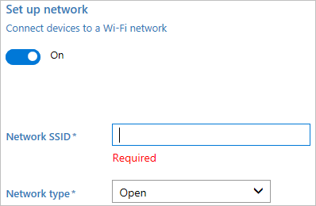

# Provision PCs with common settings for initial deployment (desktop wizard)

**Applies to**

-   Windows 10

This topic explains how to create and apply a provisioning package that contains common enterprise settings to a device running all desktop editions of Windows 10 except Windows 10 Home.

You can apply a provisioning package on a USB drive to off-the-shelf devices during setup, making it fast and easy to configure new devices. 

## Advantages
-   You can configure new devices without reimaging.

-   Works on both mobile and desktop devices.

-   No network connectivity required.

-   Simple to apply.

[Learn more about the benefits and uses of provisioning packages.](provisioning-packages.md)

## What does the desktop wizard do?

The desktop wizard helps you configure the following settings in a provisioning package:

- Set device name
- Upgrade product edition
- Configure the device for shared use
- Remove pre-installed software
- Configure Wi-Fi network 
- Enroll device in Active Directory or Azure Active Directory 
- Create local administrator account 
- Add applications and certificates

>[!WARNING]
>You must run Windows Configuration Designer on Windows 10 to configure Azure Active Directory enrollment using any of the wizards.

Provisioning packages can include management instructions and policies, installation of specific apps, customization of network connections and policies, and more. 

> [!TIP]
> Use the desktop wizard to create a package with the common settings, then switch to the advanced editor to add other settings, apps, policies, etc.
>
>

## Create the provisioning package

Use the Windows Configuration Designer tool to create a provisioning package. [Learn how to install Windows Configuration Designer.](provisioning-install-icd.md)

1. Open Windows Configuration Designer (by default, %windir%\Program Files (x86)\Windows Kits\10\Assessment and Deployment Kit\Imaging and Configuration Designer\x86\ICD.exe).

2. Click **Provision desktop devices**.

      

3. Name your project and click **Finish**. The pages for desktop provisioning will walk you through the following steps.

   
  
> [!IMPORTANT]
> When you build a provisioning package, you may include sensitive information in the project files and in the provisioning package (.ppkg) file. Although you have the option to encrypt the .ppkg file, project files are not encrypted. You should store the project files in a secure location and delete the project files when they are no longer needed.

## Configure settings

<table>
<tr><td style="width:45%" valign="top">  Enter a name for the device.  (Optional) Select a license file to upgrade Windows 10 to a different edition. <a href="https://technet.microsoft.com/itpro/windows/deploy/windows-10-edition-upgrades" data-raw-source="[See the permitted upgrades.](https://technet.microsoft.com/itpro/windows/deploy/windows-10-edition-upgrades)">See the permitted upgrades.</a>  Toggle <strong>Yes</strong> or <strong>No</strong> to <strong>Configure devices for shared use</strong>. This setting optimizes Windows 10 for shared use scenarios. <a href="../set-up-shared-or-guest-pc.md" data-raw-source="[Learn more about shared PC configuration.](../set-up-shared-or-guest-pc.md)">Learn more about shared PC configuration.</a>  You can also select to remove pre-installed software from the device. </td><td></td></tr>
<tr><td style="width:45%" valign="top">    Toggle <strong>On</strong> or <strong>Off</strong> for wireless network connectivity. If you select <strong>On</strong>, enter the SSID, the network type (<strong>Open</strong> or <strong>WPA2-Personal</strong>), and (if <strong>WPA2-Personal</strong>) the password for the wireless network.</td><td></td></tr>
<tr><td style="width:45%" valign="top">    Enable account management if you want to configure settings on this page.   You can enroll the device in Active Directory, enroll in Azure Active Directory, or create a local administrator account on the device  To enroll the device in Active Directory, enter the credentials for a least-privileged user account to join the device to the domain.  Before you use a Windows Configuration Designer wizard to configure bulk Azure AD enrollment, <a href="https://docs.microsoft.com/azure/active-directory/active-directory-azureadjoin-setup" data-raw-source="[set up Azure AD join in your organization](https://docs.microsoft.com/azure/active-directory/active-directory-azureadjoin-setup)">set up Azure AD join in your organization</a>. The <strong>maximum number of devices per user</strong> setting in your Azure AD tenant determines how many times the bulk token that you get in the wizard can be used. To enroll the device in Azure AD, select that option and enter a friendly name for the bulk token you will get using the wizard. Set an expiration date for the token (maximum is 180 days from the date you get the token). Click <strong>Get bulk token</strong>. In the <strong>Let&#39;s get you signed in</strong> window, enter an account that has permissions to join a device to Azure AD, and then the password. Click <strong>Accept</strong> to give Windows Configuration Designer the necessary permissions.   To create a local administrator account, select that option and enter a user name and password.   <strong>Important:</strong> If you create a local account in the provisioning package, you must change the password using the <strong>Settings</strong> app every 42 days. If the password is not changed during that period, the account might be locked out and unable to sign in.  </td><td></td></tr>
<tr><td style="width:45%" valign="top">   You can install multiple applications, both Windows desktop applications (Win32) and Universal Windows Platform (UWP) apps, in a provisioning package. The settings in this step vary according to the application that you select. For help with the settings, see <a href="provision-pcs-with-apps.md" data-raw-source="[Provision PCs with apps](provision-pcs-with-apps.md)">Provision PCs with apps</a>. </td><td></td></tr>
<tr><td style="width:45%" valign="top">   To provision the device with a certificate, click <strong>Add a certificate</strong>. Enter a name for the certificate, and then browse to and select the certificate to be used.</td><td></td></tr> 
<tr><td style="width:45%" valign="top">    You can set a password to protect your provisioning package. You must enter this password when you apply the provisioning package to a device.</td><td></td></tr>
</table>

After you're done, click **Create**. It only takes a few seconds. When the package is built, the location where the package is stored is displayed as a hyperlink at the bottom of the page.

 **Next step**: [How to apply a provisioning package](provisioning-apply-package.md)   

## Learn more

-   Watch the video: [Provisioning Windows 10 Devices with New Tools](https://go.microsoft.com/fwlink/p/?LinkId=615921)

-   Watch the video: [Windows 10 for Mobile Devices: Provisioning Is Not Imaging](https://go.microsoft.com/fwlink/p/?LinkId=615922)

 
## Related topics

- [Provisioning packages for Windows 10](provisioning-packages.md)
- [How provisioning works in Windows 10](provisioning-how-it-works.md)
- [Install Windows Configuration Designer](provisioning-install-icd.md)
- [Create a provisioning package](provisioning-create-package.md)
- [Apply a provisioning package](provisioning-apply-package.md)
- [Settings changed when you uninstall a provisioning package](provisioning-uninstall-package.md)
- [Use a script to install a desktop app in provisioning packages](provisioning-script-to-install-app.md)
- [PowerShell cmdlets for provisioning Windows 10 (reference)](provisioning-powershell.md)
- [NFC-based device provisioning](../mobile-devices/provisioning-nfc.md)
- [Use the package splitter tool](../mobile-devices/provisioning-package-splitter.md)
- [Windows Configuration Designer command-line interface (reference)](provisioning-command-line.md)
- [Create a provisioning package with multivariant settings](provisioning-multivariant.md)

