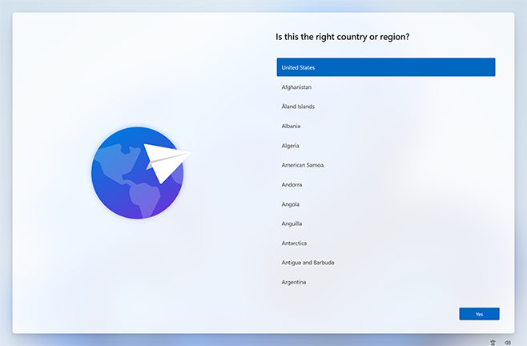
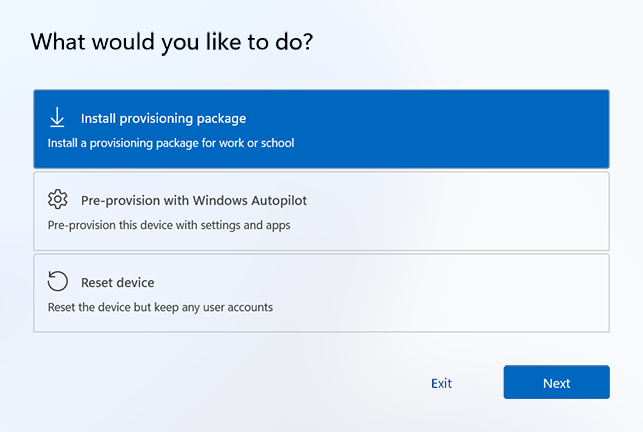
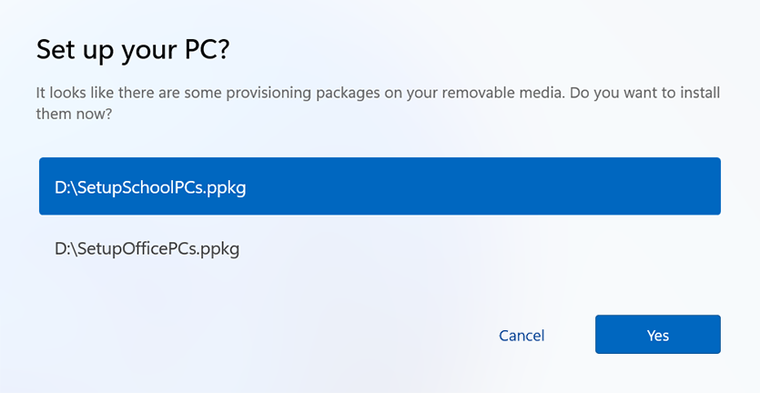
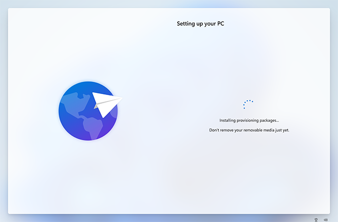
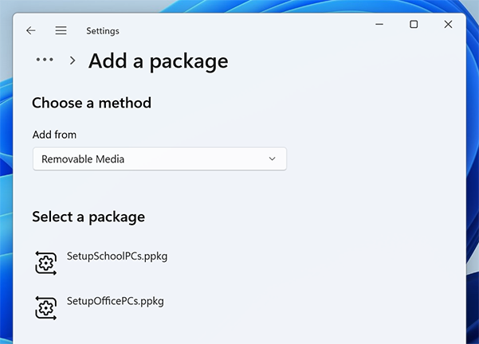
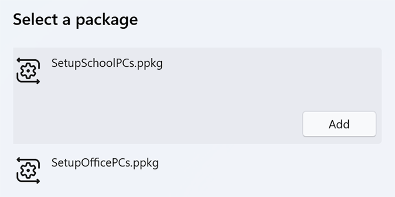
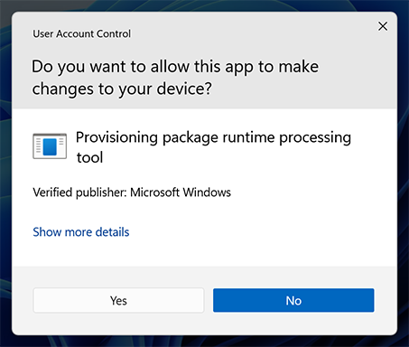
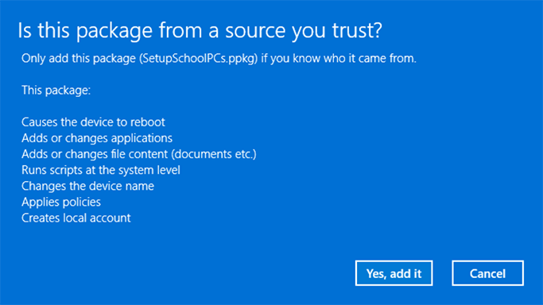

# Apply a provisioning package

**Applies to**

-   Windows 10
-   Windows 11

Provisioning packages can be applied to client devices during initial setup (out-of-box experience or "OOBE") and after ("runtime").

>[!NOTE]
>
> - Applying a provisioning package to a desktop device requires administrator privileges on the device.
> - You can interrupt a long-running provisioning process by pressing ESC.

## During initial setup

To apply a provisioning package from a USB drive during initial setup:

1. Start with a device on the initial setup screen. If the device has gone past this screen, reset the device to start over. To reset, go to **Settings** > **System** > [**Recovery**](ms-settings:recovery) > **Reset this PC**.

   

2. Insert the USB drive. If nothing happens when you insert the USB drive, press the Windows key five times.

   - If there is only one provisioning package on the USB drive, the provisioning package is applied. See step #5.
   - If there is more than one provisioning package on the USB drive, Windows setup will recognize the drive and ask how you want to provision the device. Select **Install provisioning package** and select **Next**.

   

3. Select the provisioning package (`.ppkg`) that you want to apply, and select **Yes**.

    

4. The selected provisioning package will install and apply to the device.

   

5. Wait for the device to load and begin applying the provisioning package. Once you see "You can remove your removable media now!" you can remove your USB drive. Windows will continue provisioning the device.

## After initial setup

Provisioning packages can be applied after initial setup during runtime by user initiation. This can be done trough Windows settings or by simply double-clicking a provisioning package.

### Windows Settings

1. Insert the USB drive, then navigate to **Settings** > **Accounts** > [**Access work or school**](ms-settings:workplace) > **Add or remove a provisioning package** > **Add a package**.

   

2. Choose the method you want to use, such as **Removable Media**.

   

3. Select the provisioning package (`.ppkg`) that you want to apply, and select **Add**.

   

4. Provisioning packages require administrator privileges as it can modify system policies and run scripts at the system level. Ensure you trust the package you are installing before you accept the UAC prompt. Select **Yes**.

   

5. The provisioning runtime will ask if the package is from a source you trust. Verify that you are applying the correct package and that it is trusted. Select **Yes, add it**.

   

Insert the USB drive to a desktop computer, navigate to **Settings** > **Accounts** > **Access work or school** > **Add or remove a provisioning package** > **Add a package**, and select the package to install. For a provisioning package stored on a network folder or on a SharePoint site, navigate to the provisioning package and double-click it to begin installation.

## Related articles

- [Provisioning packages for Windows client](provisioning-packages.md)
- [How provisioning works in Windows client](provisioning-how-it-works.md)
- [Install Windows Configuration Designer](provisioning-install-icd.md)
- [Create a provisioning package](provisioning-create-package.md)
- [Settings changed when you uninstall a provisioning package](provisioning-uninstall-package.md)
- [Provision PCs with common settings for initial deployment (simple provisioning)](provision-pcs-for-initial-deployment.md)
- [Use a script to install a desktop app in provisioning packages](provisioning-script-to-install-app.md)
- [PowerShell cmdlets for provisioning Windows client (reference)](provisioning-powershell.md)
- [Windows Configuration Designer command-line interface (reference)](provisioning-command-line.md)
- [Create a provisioning package with multivariant settings](provisioning-multivariant.md)
