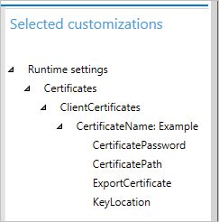
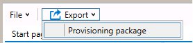

# Create a provisioning package for Windows 10

**Applies to**

-   Windows 10
-   Windows 10 Mobile

You use Windows Configuration Designer to create a provisioning package (.ppkg) that contains customization settings. You can apply the provisioning package to a device running Windows 10 or Windows 10 Mobile. 

>[Learn how to install Windows Configuration Designer.](provisioning-install-icd.md)

>[!TIP]
>We recommend creating a local admin account when developing and testing your provisioning package. We also recommend using a “least privileged” domain user account to join devices to the Active Directory domain.

## Start a new project

1. Open Windows Configuration Designer:
   - From either the Start screen or Start menu search, type 'Windows Configuration Designer' and click on the Windows Configuration Designer shortcut, 

     or

   - If you installed Windows Configuration Designer from the ADK, navigate to `C:\Program Files (x86)\Windows Kits\10\Assessment and Deployment Kit\Imaging and Configuration Designer\x86` (on an x64 computer) or `C:\Program Files\Windows Kits\10\Assessment and Deployment Kit\Imaging and Configuration Designer\x86\ICD.exe` (on an x86 computer), and then double-click **ICD.exe**.

2. Select your desired option on the **Start** page, which offers multiple options for creating a provisioning package, as shown in the following image:

    

    - The wizard options provide a simple interface for configuring common settings for desktop, mobile, and kiosk devices. Wizards are also available for creating provisioning packages for Microsoft Surface Hub and Microsoft HoloLens devices. For a summary of the settings available in the desktop, mobile, and kiosk devices, see [What you can configure using Configuration Designer wizardS](provisioning-packages.md#configuration-designer-wizards). 

        - [Instructions for the desktop wizard](provision-pcs-for-initial-deployment.md)
        - [Instructions for the mobile wizard](../mobile-devices/provisioning-configure-mobile.md)
        - [Instructions for the kiosk wizard](../kiosk-single-app.md#wizard)
        - [Instructions for HoloLens wizard](https://technet.microsoft.com/itpro/hololens/hololens-provisioning)
        - [Instructions for Surface Hub wizard](https://technet.microsoft.com/itpro/surface-hub/provisioning-packages-for-certificates-surface-hub)

    - The **Advanced provisioning** option opens a new project with all **Runtime settings** available. *The rest of this procedure uses advanced provisioning.*

        >[!TIP]
        > You can start a project in the simple wizard editor and then switch the project to the advanced editor.
        >
        > 

3. Enter a name for your project, and then click **Next**.

4. Select the settings you want to configure, based on the type of device, and then click **Next**. The following table describes the options.

   |          Windows edition          |              Settings available for customization               |                                              Provisioning package can apply to                                              |
   |-----------------------------------|-----------------------------------------------------------------|-----------------------------------------------------------------------------------------------------------------------------|
   |       All Windows editions        |                         Common settings                         |                                                   All Windows 10 devices                                                    |
   |   All Windows desktop editions    |    Common settings and settings specific to desktop devices     |                All Windows 10 desktop editions (Home, Pro, Enterprise, Pro Education, Enterprise Education)                 |
   |    All Windows mobile editions    |     Common settings and settings specific to mobile devices     |                                                All Windows 10 Mobile devices                                                |
   |        Windows 10 IoT Core        |  Common settings and settings specific to Windows 10 IoT Core   |                                               All Windows 10 IoT Core devices                                               |
   |      Windows 10 Holographic       | Common settings and settings specific to Windows 10 Holographic |                  [Microsoft HoloLens](https://technet.microsoft.com/itpro/hololens/hololens-provisioning)                   |
   | Common to Windows 10 Team edition |    Common settings and settings specific to Windows 10 Team     | [Microsoft Surface Hub](https://technet.microsoft.com/itpro/surface-hub/provisioning-packages-for-certificates-surface-hub) |

5. On the **Import a provisioning package (optional)** page, you can click **Finish** to create your project, or browse to and select an existing provisioning packge to import to your project, and then click **Finish**.

>[!TIP]
>**Import a provisioning package** can make it easier to create different provisioning packages that all have certain settings in common. For example, you could create a provisioning package that contains the settings for your organization's network, and then import it into other packages you create so you don't have to reconfigure those common settings repeatedly.

After you click **Finish**, Windows Configuration Designer will open the **Available customizations** pane and you can then configure settings for the package. 

## Configure settings

For an advanced provisioning project, Windows Configuration Designer opens the **Available customizations** pane. The example in the following image is based on **All Windows desktop editions** settings.

The settings in Windows Configuration Designer are based on Windows 10 configuration service providers (CSPs). To learn more about CSPs, see [Introduction to configuration service providers (CSPs) for IT pros](https://technet.microsoft.com/itpro/windows/manage/how-it-pros-can-use-configuration-service-providers).

The process for configuring settings is similar for all settings. The following table shows an example.

<table>
<tr><td> Expand a category.</td><td></td></tr>
<tr><td> Select a setting.</td><td></td></tr>
<tr><td> Enter a value for the setting. Click <strong>Add</strong> if the button is displayed.</td><td></td></tr>
<tr><td> Some settings, such as this example, require additional information. In <strong>Available customizations</strong>, select the value you just created, and additional settings are displayed.</td><td></td></tr> 
<tr><td> When the setting is configured, it is displayed in the <strong>Selected customizations</strong> pane.</td><td></td></tr>
</table>

For details on each specific setting, see [Windows Provisioning settings reference](https://msdn.microsoft.com/library/windows/hardware/dn965990.aspx). The reference topic for a setting is also displayed in Windows Configuration Designer when you select the setting, as shown in the following image.

 

 ## Build package

1. After you're done configuring your customizations, click **Export** and select **Provisioning Package**.

    

2. In the **Describe the provisioning package** window, enter the following information, and then click **Next**:
    - **Name** - This field is pre-populated with the project name. You can change this value by entering a different name in the **Name** field.
    - **Version (in Major.Minor format** - - Optional. You can change the default package version by specifying a new value in the **Version** field. 
    - **Owner** - Select **IT Admin**. For more information, see [Precedence for provisioning packages](provisioning-how-it-works.md#precedence-for-provisioning-packages).
    - **Rank (between 0-99)** - Optional. You can select a value between 0 and 99, inclusive. The default package rank is 0.

3. In the **Select security details for the provisioning package** window, you can select to encrypt and/or sign a provisioning package with a selected certificate. Both selections are optional. Click **Next** after you make your selections.

   - **Encrypt package** -  If you select this option, an auto-generated password will be shown on the screen.
   - **Sign package** - If you select this option, you must select a valid certificate to use for signing the package. You can specify the certificate by clicking **Select** and choosing the certificate you want to use to sign the package.

     >[!NOTE]
     >You should only configure provisioning package security when the package is used for device provisioning and the package has contents with sensitive security data such as certificates or credentials that should be prevented from being compromised. When applying an encrypted and/or signed provisioning package, either during OOBE or through the setting UI, the package can be decrypted, and if signed, be trusted without explicit user consent. An IT administrator can set policy on a user device to restrict the removal of required packages from the device, or the provisioning of potentially harmful packages on the device. 
     >
     >If a provisioning package is signed by a trusted provisioner, it can be installed on a device without a prompt for user consent. In order to enable trusted provider certificates, you must set the **TrustedProvisioners** setting prior to installing the trusted provisioning package. This is the only way to install a package without user consent. To provide additional security, you can also set **RequireProvisioningPackageSignature**, which prevents users from installing provisioning packages that are not signed by a trusted provisioner.

4. In the **Select where to save the provisioning package** window, specify the output location where you want the provisioning package to go once it's built, and then click **Next**. By default, Windows Configuration Designer uses the project folder as the output location.

5. In the **Build the provisioning package** window, click **Build**. The provisioning package doesn't take long to build. The project information is displayed in the build page and the progress bar indicates the build status. 

    If you need to cancel the build, click Cancel. This cancels the current build process, closes the wizard, and takes you back to the Customizations Page.

6. If your build fails, an error message will show up that includes a link to the project folder. You can scan the logs to determine what caused the error. Once you fix the issue, try building the package again.

    If your build is successful, the name of the provisioning package, output directory, and project directory will be shown. 

    If you choose, you can build the provisioning package again and pick a different path for the output package. To do this, click **Back** to change the output package name and path, and then click **Next** to start another build.

7. When you are done, click **Finish** to close the wizard and go back to the Customizations page.

**Next step**: [How to apply a provisioning package](provisioning-apply-package.md)

## Learn more

- Watch the video: [Provisioning Windows 10 Devices with New Tools](https://go.microsoft.com/fwlink/p/?LinkId=615921)

- Watch the video: [Windows 10 for Mobile Devices: Provisioning Is Not Imaging](https://go.microsoft.com/fwlink/p/?LinkId=615922)

- [How to bulk-enroll devices with On-premises Mobile Device Management in System Center Configuration Manager](https://docs.microsoft.com/sccm/mdm/deploy-use/bulk-enroll-devices-on-premises-mdm)

## Related topics

- [Provisioning packages for Windows 10](provisioning-packages.md)
- [How provisioning works in Windows 10](provisioning-how-it-works.md)
- [Install Windows Configuration Designer](provisioning-install-icd.md)
- [Apply a provisioning package](provisioning-apply-package.md)
- [Settings changed when you uninstall a provisioning package](provisioning-uninstall-package.md)
- [Provision PCs with common settings for initial deployment (simple provisioning)](provision-pcs-for-initial-deployment.md)
- [Use a script to install a desktop app in provisioning packages](provisioning-script-to-install-app.md)
- [PowerShell cmdlets for provisioning Windows 10 (reference)](provisioning-powershell.md)
- [Windows Configuration Designer command-line interface (reference)](provisioning-command-line.md)
- [Create a provisioning package with multivariant settings](provisioning-multivariant.md)
