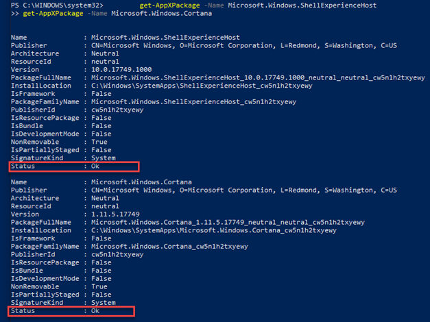
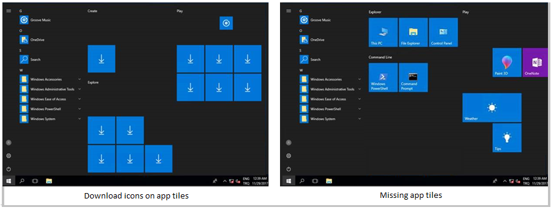
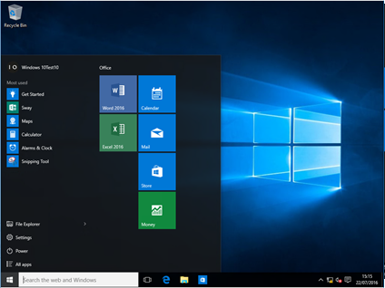
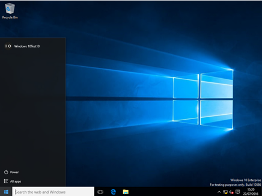
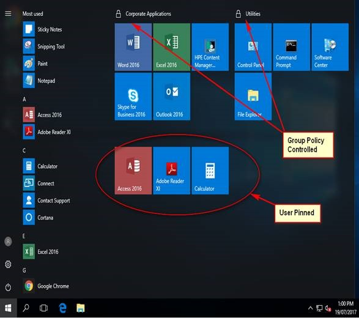
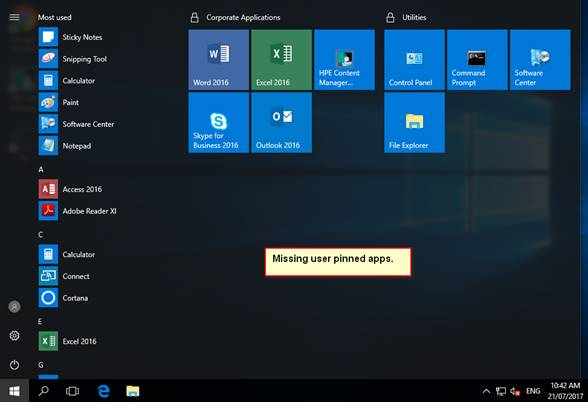
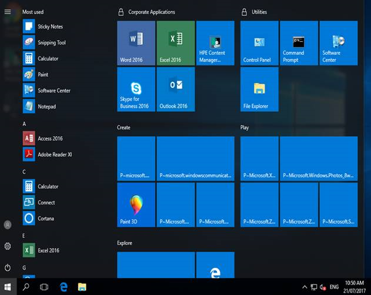

# Troubleshoot Start Menu errors

Start failures can be organized into these categories:

- **Deployment/Install issues** - Easiest to identify but difficult to recover. This failure is consistent and usually permanent. Reset, restore from backup, or rollback to recover.
- **Performance issues** - More common with older hardware, low-powered machines. Symptoms include: High CPU utilization, disk contention, memory resources. This makes Start very slow to respond. Behavior is intermittent depending on available resources.
- **Crashes** - Also easy to identify. Crashes in Shell Experience Host or related can be found in System or Application event logs. This can be a code defect or related to missing or altered permissions to files or registry keys by a program or incorrect security tightening configurations. Determining permissions issues can be time consuming but a [SysInternals tool called Procmon](https://docs.microsoft.com/sysinternals/downloads/procmon) will show **Access Denied**. The other option is to get a dump of the process when it crashes and depending on comfort level, review the dump in the debugger, or have support review the data.
- **Hangs** in Shell Experience host or related. These are the hardest issues to identify as there are few events logged, but behavior is typically intermittent or recovers with a reboot. If a background application or service hangs, Start will not have resources to respond in time. Clean boot may help identify if the issue is related to additional software. Procmon is also useful in this scenario.
- **Other issues** - Customization, domain policies, deployment issues.

## Basic troubleshooting
	
When troubleshooting basic Start issues (and for the most part, all other Windows apps), there are a few things to check if they are not working as expected. When experiencing issues where the Start Menu or sub-component are not working, there are some quick tests to narrow down where the issue may reside.

### Check the OS and update version

- Is the system running the latest Feature and Cumulative Monthly update?
- Did the issue start immediately after an update? Ways to check:
  - Powershell:[System.Environment]::OSVersion.Version
  - WinVer from CMD.exe


### Check if Start is installed

- If Start fails immediately after a feature update, on thing to check is if the App package failed to install successfully.

- If Start was working and just fails intermittently, it's likely that Start is installed correctly, but the issue occurs downstream. The way to check for this is to look for output from these two PS commands:

  - `get-AppXPackage -Name Microsoft.Windows.ShellExperienceHost`
  - `get-AppXPackage -Name Microsoft.Windows.Cortana`

    

    Failure messages will appear if they are not installed

- If Start is not installed the fastest resolution is to revert to a known good configuration. This can be rolling back the update, resetting the PC to defaults (where there is a choice to save to delete user data), or restoring from backup. There is no supported method to install Start Appx files. The results are often problematic and unreliable.

### Check if Start is running

If either component is failing to start on boot, reviewing the event logs for errors or crashes during boot may pin point the problem. Booting with MSCONFIG and using a selective or diagnostic startup option will eliminate and/or identify possible interference from additional applications.
- `get-process -name shellexperiencehost`
- `get-process -name searchui`

If it is installed but not running, test booting into safe mode or use MSCONFIG to eliminate 3rd party or additional drivers and applications.

### Check whether the system a clean install or upgrade

- Is this system an upgrade or clean install?
  - Run `test-path "$env:windir\panther\miglog.xml"`
  - If that file does not exist, the system is a clean install.
- Upgrade issues can be found by running `test-path "$env:windir\panther\miglog.xml"`


### Check if Start is registered or activated

- Export the following Event log to CSV and do a keyword search in a text editor or spreadsheet:
  - Microsoft-Windows-TWinUI/Operational for Microsoft.Windows.ShellExperienceHost or Microsoft.Windows.Cortana
    - "Package was not found"
    - "Invalid value for registry"
    - "Element not found"
    - "Package could not be registered"
    
If these events are found, Start is not activated correctly. Each event will have more detail in the description and should be investigated further. Event messages can vary.

### Other things to consider

When did this start?

- Top issues for Start Menu failure are triggered
  - After an update
  - After installation of an application
  - After joining a domain or applying a domain policy
- Many of those issues are found to be
  - Permission changes on Registry keys or folders
  - Start or related component crashes or hangs
  - Customization failure

To narrow this down further, it's good to note:

- What is the install background?
  - Was this a deployment, install from media, other
  - Using customizations?
    - DISM
    - Group Policy or MDM
    - copyprofile
    - Sysprep
    - Other
    
- Domain-joined
  - Group policy settings that restrict access or permissions to folders or registry keys can cause issues with Start performance.
  - Some Group Policies intended for Windows 7 or older have been known to cause issues with Start
  - Untested Start Menu customizations can cause unexpected behavior by typically not complete Start failures. 
  
- Is this a virtualized environment? 
  - VMware
  - Citrix
  - Other
  
## Check Event logs that record Start Issues:

- System Event log
- Application Event log
- Microsoft/Windows/Shell-Core*
- Microsoft/Windows/Apps/
- Microsoft-Windows-TWinUI*
- Microsoft/Windows/AppReadiness*
- Microsoft/Windows/AppXDeployment*
- Microsoft-Windows-PushNotification-Platform/Operational
- Microsoft-Windows-CoreApplication/Operational
- Microsoft-Windows-ShellCommon-StartLayoutPopulation*
- Microsoft-Windows-CloudStore*


- Check for crashes that may be related to Start (explorer.exe, taskbar, etc)
  - Application log event 1000, 1001
  - Check WER reports
    - C:\ProgramData\Microsoft\Windows\WER\ReportArchive\
    - C:\ProgramData\Micrt\Windowsosof\WER\ReportQueue\
    
If there is a component of Start that is consistently crashing, capture a dump which can be reviewed by Microsoft Support.

## Common errors and mitigation

The following list provides information about common errors you might run into with Start Menu, as well as steps to help you mitigate them.

### Symptom: Start Menu doesn't respond on Windows 2012 R2, Windows 10, or Windows 2016

**Cause**: Background Tasks Infrastructure Service (BrokerInfrastructure) service is not started.

**Resolution**: Ensure that Background Tasks Infrastructure Service is set to automatic startup in Services MMC.

If Background Tasks Infrastructure Service fails to start, verify that the Power Dependency Coordinator Driver (PDC) driver and registry key are not disabled or deleted. If either are missing, restore from backup or the installation media.

To verify the PDC Service, run `C:\>sc query pdc` in a command prompt. The results will be similar to the following:

>SERVICE_NAME: pdc
>TYPE          : 1 KERNEL_DRIVER
>STATE          : 4 RUNNING
>  (STOPPABLE, NOT_PAUSABLE, IGNORES_SHUTDOWN)
>WIN32_EXIT_CODE     : 0 (0x0)
>SERVICE_EXIT_CODE    : 0 (0x0)
>CHECKPOINT       : 0x0
>WAIT_HINT        : 0x0

The PDC service uses pdc.sys located in the %WinDir%\system32\drivers.

The PDC registry key is:
`HKEY_LOCAL_MACHINE\SYSTEM\CurrentControlSet\Services\pdc`
**Description**="@%SystemRoot%\\system32\\drivers\\pdc.sys,-101"
**DisplayName**="@%SystemRoot%\\system32\\drivers\\pdc.sys,-100"
**ErrorControl**=dword:00000003
**Group**="Boot Bus Extender"
**ImagePath**=hex(2):73,00,79,00,73,00,74,00,65,00,6d,00,33,00,32,00,5c,00,64,00,\
 72,00,69,00,76,00,65,00,72,00,73,00,5c,00,70,00,64,00,63,00,2e,00,73,00,79,\
 00,73,00,00,00
**Start**=dword:00000000
**Type**=dword:00000001

In addition to the listed dependencies for the service, Background Tasks Infrastructure Service requires the Power Dependency Coordinator Driver to be loaded. If the PDC does not load at boot, Background Tasks Infrastructure Service will fail and affect Start Menu.
Events for both PDC and Background Tasks Infrastructure Service will be recorded in the event logs. PDC should not be disabled or deleted. BrokerInfrastructure is an automatic service. This Service is required for all these operating Systems as running to have a stable Start Menu.

>[!NOTE]
>You cannot stop this automatic service when machine is running (C:\windows\system32\svchost.exe -k DcomLaunch -p).


### Symptom: After upgrading from 1511 to 1607 versions of Windows, the Group Policy "Remove All Programs list from the Start Menu" may not work

**Cause**: There was a change in the All Apps list between Windows 10, versions 1511 and 1607. These changes mean the original Group Policy and corresponding registry key no longer apply.

**Resolution**: This issue was resolved in the June 2017 updates. Please update Windows 10, version 1607 to the latest cumulative or feature updates.

>[!Note] 
>When the Group Policy is enabled, the desired behavior also needs to be selected. By default, it is set to **None**.


### Symptom: Application tiles like Alarm, Calculator, and Edge are missing from Start Menu and the Settings app fails to open on Windows 10, version 1709 when a local user profile is deleted



**Cause**: This is a known issue where the first-time logon experience is not detected and does not trigger the install of some Apps.

**Resolution**: This issue has been fixed for Windows 10, version 1709 in [KB 4089848](https://support.microsoft.com/help/4089848) March 22, 2018—KB4089848 (OS Build 16299.334)

### Symptom: When attempting to customize Start Menu layout, the customizations do not apply or results are not expected

**Cause**: There are two main reasons for this issue:

- Incorrect format: Editing the xml file incorrectly by adding an extra space or spaces, entering a bad character, or saving in the wrong format.
  - To tell if the format is incorrect, check for **Event ID: 22** in the "Applications and Services\Microsoft\Windows\ShellCommon-StartLayoutPopulation\Operational" log.
  - Event ID 22 is logged when the xml is malformed, meaning the specified file simply isn’t valid xml.
  - When editing the xml file, it should be saved in UTF-8 format.

- Unexpected information: This occurs when possibly trying to add a tile via unexpected or undocumented method.
  - **Event ID: 64** is logged when the xml is valid but has unexpected values.
  - For example: The following error occurred while parsing a layout xml file: The attribute 'LayoutCustomizationRestrictiontype' on the element '{http://schemas.microsoft.com/Start/2014/LayoutModification}DefaultLayoutOverride' is not defined in the DTD/Schema.

XML files can and should be tested locally on a Hyper-V or other virtual machine before deployment or application by Group Policy

### Symptom: Start menu no longer works after a PC is refreshed using F12 during start up 

**Description**: If a user is having problems with a PC, is can be refreshed, reset, or restored. Refreshing the PC is a beneficial option because it maintains personal files and settings.	When users have trouble starting the PC, "Change PC settings" in Settings is not accessible. So, to access the System Refresh, users may use the F12 key at start up. Refreshing the PC finishes, but Start Menu is not accessible.

**Cause**: This is a known issue and has been resolved in a cumulative update released August 30th 2018. 

**Resolution**: Install corrective updates; a fix is included in the [September 11, 2018-KB4457142 release](https://support.microsoft.com/help/4457142).

### Symptom: The All Apps list is missing from Start menu

**Cause**: “Remove All Programs list from the Start menu" Group Policy is enabled.

**Resolution**: Disable the “Remove All Programs list from the Start menu" Group Policy.

### Symptom: Tiles are missing from the Start Menu when using Windows 10, version 1703 or older, Windows Server 2016, and Roaming User Profiles with a Start layout

**Description**: There are two different Start Menu issues in Windows 10:
- Administrator configured tiles in the start layout fail to roam.
- User-initiated changes to the start layout are not roamed.

Specifically, behaviors include
 - Applications (apps or icons) pinned to the start menu are missing.
 - Entire tile window disappears.
 - The start button fails to respond.
 - If a new roaming user is created, the first logon appears normal, but on subsequent logons, tiles are missing.




*Working layout on first sign-in of a new roaming user profile*



*Failing layout on subsequent sign-ins*


**Cause**: A timing issue exists where the Start Menu is ready before the data is pulled locally from the Roaming User Profile. The issue does not occur on first logons of a new roaming user, as the code path is different and slower.

**Resolution**: This issue has been resolved in Windows 10, versions 1703 and 1607, cumulative updates [as of March 2017](https://support.microsoft.com/help/4013429).


### Symptom: Start Menu layout customizations are lost after upgrading to Windows 10, version 1703

**Description**:

Before the upgrade:
 
  

After the upgrade the user pinned tiles are missing:

  
 
Additionally, users may see blank tiles if logon was attempted without network connectivity.

  
 

**Resolution**: This is fixed in [October 2017 update](https://support.microsoft.com/en-us/help/4041676).

### Symptom: Tiles are missing after upgrade from Windows 10, version 1607 to version 1709 for users with Roaming User Profiles (RUP) enabled and managed Start Menu layout with partial lockdown

**Resolution** The April 2018 LCU must be applied to Windows 10, version 1709 before a user logs on. 

### Symptom: Start Menu and/or Taskbar layout customizations are not applied if CopyProfile option is used in an answer file during Sysprep

**Resolution**: CopyProfile is no longer supported when attempting to customize Start Menu or taskbar with a layoutmodification.xml.

### Symptom: Start Menu issues with Tile Data Layer corruption 

**Cause**: Windows 10, version 1507 through the release of version 1607 uses a database for the Tile image information. This is called the Tile Data Layer database (The feature was deprecated in [Windows 10 1703](https://support.microsoft.com/help/4014193/features-that-are-removed-or-deprecated-in-windows-10-creators-update)). 

**Resolution** There are steps you can take to fix the icons, first is to confirm that is the issue that needs to be addressed.

1. The App or Apps work fine when you click on the tiles.
2. The tiles are blank, have a generic placeholder icon, have the wrong or strange title information.
3. The app is missing, but listed as installed via Powershell and works if you launch via URI.
  - Example: `windows-feedback://`
4. In some cases, Start can be blank, and Action Center and Cortana do not launch.

>[!Note]
>Corruption recovery removes any manual pins from Start. Apps should still be visible, but you’ll need to re-pin any secondary tiles and/or pin app tiles to the main Start view. Aps that you have installed that are completely missing from “all apps” is unexpected, however. That implies the re-registration didn’t work.

- Open a command prompt, and run the following command:

```
C:\Windows\System32\tdlrecover.exe -reregister -resetlayout -resetcache
```

Although a reboot is not required, it may help clear up any residual issues after the command is run.

### Symptoms: Start Menu and Apps cannot start after upgrade to Windows 10 version 1809 when Symantec Endpoint Protection is installed

**Description** Start Menu, Search and Apps do not start after you upgrade a Windows 7-based computer that has Symantec Endpoint Protection installed to Windows 10 version 1809.

**Cause** This occurs because of a failure to load sysfer.dll.  During upgrade, the setup process does not set the privilege group "All Application Packages" on sysfer.dll and other Symantec modules.

**Resolution** This issue was fixed by the Windows Cumulative Update that were released on December 5, 2018—KB4469342 (OS Build 17763.168).

If you have already encountered this issue, use one of the following two options to fix the issue:

**Option 1** Remove sysfer.dll from system32 folder and copy it back. Windows will set privilege automatically.

**Option 2** 

1. Locate the directory C:\Windows\system32.

2. Right-click on sysfer.dll and choose **Properties**.

3. Switch to the **Security** tab.

4. Confirm that **All Application Packages** group is missing.

5. Click **Edit**, and then click **Add** to add the group.

6. Test Start and other Apps.


