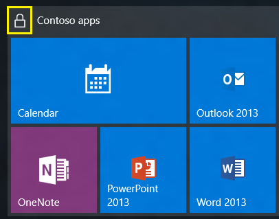

# Customize and export the Start layout

This article describes how to customize the Windows Start menu, export its configuration, and deploy the customization to other devices. The article is intended for IT professionals who manage devices in a business or educational environment.\
If you are looking for OEM information, see the article [Customize the Start layout](/windows-hardware/customize/desktop/customize-the-windows-11-start-menu)

::: zone pivot="windows-11"

Your organization can deploy a customized Start layout to your Windows 11 devices. Customizing the Start layout is common when you have similar devices used by many users, or you want to pin specific apps.

For example, you can override the default set of apps with your own a set of pinned apps, and in the order you choose. As an administrator, use this feature to pin apps, remove default pinned apps, order the apps, and more.

To add apps you want pinned to the Start menu, you use a JSON file. In previous Windows versions, IT administrators used an XML file to customize the Start menu. The XML file isn't available on Windows 11 and later ***unless*** [you're an OEM](/windows-hardware/customize/desktop/customize-the-windows-11-start-menu).

This article shows you how to export an existing Start menu layout, and use the JSON in a Microsoft Intune policy.

## Before you begin

When you customize the Start layout, you overwrite the entire full layout. Users can pin and unpin apps, and uninstall apps from Start. When a user signs in or Explorer restarts, Windows reapplies the MDM policy. This action restores the specified layout and doesn't retain any user changes.

## Start menu features and areas

The Start menu consistes of set of links to applications, folders, or files that are arranged in a grid of pages.

:::row:::
:::column span="3":::
The Start menu has the following areas:

- **Pinned**: Shows pinned apps, or a subset of all of the apps installed on the device. You can create a list of pinned apps you want on the devices using the **ConfigureStartPins** policy. **ConfigureStartPins** overrides the entire layout, which also removes apps that are pinned by default
- **All apps**: Users select this option to see an alphabetical list of all the apps installed on the device.
- **Recommended**: Shows recently opened files and recently installed apps
    :::column-end:::
    :::column:::
    :::image type="content" source="./images/start-windows-11-components.png" alt-text="Sample start menu layout with its components highlighted." border="false" lightbox="./images/windows-11-components.png":::
    :::column-end:::
:::row-end:::

## Create the JSON file

On an existing Windows 11 device, set up your own Start layout with the pinned apps you want users to see. Then, use the [Windows PowerShell Export-StartLayout](/powershell/module/startlayout/export-startlayout) cmdlet to export the existing layout to a `LayoutModification.json` file.

The JSON file controls the Start menu layout, and lists all the apps that are pinned. You can update the JSON file to:

- Change the order of existing apps. The apps in the JSON file are shown on Start in the same order.
- Add more apps by entering the app ID. For more information, see [Get the pinnedList JSON](#get-the-pinnedlist-json) (in this article).

If you're familiar with creating JSON files, you can create your own `LayoutModification.json` file. But, it's easier and faster to export the layout from an existing device.

### Export an existing Start layout

1. Create a folder to save the `.json` file. For example, create the `C:\Layouts` folder.
1. On a Windows 11 device, open the Windows PowerShell app.
1. Run the following cmdlet. Name the file `LayoutModification.json`.

    ```powershell
    Export-StartLayout -Path "C:\Layouts\LayoutModification.json"
    ```

### Get the pinnedList JSON

1. Open the `LayoutModification.json` file in a JSON editor, such as Visual Studio Code or Notepad. For more information, see [edit JSON with Visual Studio Code](https://code.visualstudio.com/docs/languages/json).
1. In the file, you see the `pinnedList` section. This section includes all of the pinned apps. Copy the `pinnedList` content in the JSON file. You'll use it in the next section.

    In the following example, you see that Microsoft Edge, Microsoft Word, the Microsoft Store app, and Notepad are pinned:

    ```json
    {
      "pinnedList": [
        { "desktopAppId": "MSEdge" },
        { "desktopAppId": "Microsoft.Office.WINWORD.EXE.15" },
        { "packagedAppId": "Microsoft.WindowsStore_8wekyb3d8bbwe!App" },
        { "packagedAppId": "Microsoft.WindowsNotepad_8wekyb3d8bbwe!App" }
      ]
    }
    ```

1. Use the `ConfigureStartPins` policy setting to configure the Start menu, by using a JSON `LayoutModification.json` file to add apps to the Pinned section. In your JSON file, you can add more apps to this section using the following keys:

| Key | Description |
|--|--|
| packagedAppID | Use this option for Universal Windows Platform apps. To pin a UWP app, use the app's AUMID. |
| desktopAppID | Use this option for unpackaged Win32 apps. To pin a Win32 app, use the app's AUMID. If the app doesn't have an AUMID, then enter the `desktopAppLink` instead. |
| desktopAppLink | Use this option for unpackaged Win32 apps that don't have an associated AUMID. To pin this type of app, use the path to the `.lnk` shortcut that points to the app. |

## Use MDM to create and deploy a pinned list policy

Now that you have the JSON syntax, you're ready to deploy your customized Start layout to devices in your organization.

MDM providers can deploy policies to devices managed by the organization, including organization-owned devices, and personal or bring your own device (BYOD).  Using an MDM provider, such as Microsoft Intune, you can deploy a policy that configures the pinned list.

This section shows you how to create a pinned list policy in Intune. There isn't a Group Policy to create a pinned list.

[!INCLUDE [intune-settings-catalog-1](../../../includes/configure/intune-settings-catalog-1.md)]

| Category | Setting name | Value |
|--|--|--|
| **Start** | Configure Start Pins | Content of the JSON file|
| **Start** | Configure Start Pins (User) | Content of the JSON file|

[!INCLUDE [intune-settings-catalog-2](../../../includes/configure/intune-settings-catalog-2.md)]

Alternatively, you can configure devices using a [custom policy][INT-1] with the [File Explorer CSP][CSP-1].

| Setting |
|--|
| - **OMA-URI:** `./User/Vendor/MSFT/Policy/Config/Start/`[ConfigureStartPins](/windows/client-management/mdm/policy-csp-Start?WT.mc_id=Portal-Microsoft_Intune_Workflows#configurestartpins)<br>- **String:** <br>- **Value:** content of the JSON file |
| - **OMA-URI:** `./Device/Vendor/MSFT/Policy/Config/Start/`[ConfigureStartPins](/windows/client-management/mdm/policy-csp-Start?WT.mc_id=Portal-Microsoft_Intune_Workflows#configurestartpins)<br>- **Data type:** <br>- **Value:** content of the JSON file |

::: zone-end

::: zone pivot="windows-10"

The easiest method for creating a customized Start layout to apply to other Windows 10 devices is to set up the Start screen on a test computer and then export the layout.

After you export the layout, decide whether you want to apply a *full* Start layout or a *partial* Start layout.

When a full Start layout is applied, the users can't pin, unpin, or uninstall apps from Start. Users can view and open all apps in the **All Apps** view, but they can't pin any apps to Start.

When [a partial Start layout](#configure-a-partial-start-layout) is applied, the contents of the specified tile groups can't be changed, but users can move those groups, and can also create and customize their own groups.

## Customize the Start screen on your test computer

To prepare a Start layout for export, you simply customize the Start layout on a test computer.

To prepare a test computer:

1. Set up a test computer on which to customize the Start layout. Your test computer should have the operating system that is installed on the users' computers (Windows 10 Pro, Enterprise, or Education). Install all apps and services that the Start layout should display.
1. Create a new user account that you'll use to customize the Start layout.

To customize Start:

1. Sign in to your test computer with the user account that you created.
1. Customize the Start layout as you want users to see it by using the following techniques:

    - **Pin apps to Start**. From Start, type the name of the app. When the app appears in the search results, right-click the app, and then select **Pin to Start**.
        To view all apps, select **All apps** in the bottom-left corner of Start. Right-click any app, and pin or unpin it from Start.
    - **Unpin apps** that you don't want to display. To unpin an app, right-click the app, and then select **Unpin from Start**.
    - **Drag tiles** on Start to reorder or group apps.
    - **Resize tiles**. To resize tiles, right-click the tile and then select **Resize.**
    - **Create your own app groups**. Drag the apps to an empty area. To name a group, select above the group of tiles and then type the name in the **Name group** field that appears above the group.

> [!IMPORTANT]
> If the Start layout includes tiles for apps that are not installed on the device that the layout is later applied to, the tiles for those apps will be blank. The blank tiles will persist until the next time the user signs in, at which time the blank tiles are removed. Some system events may cause the blank tiles to be removed before the next sign-in.

### Export the Start layout

When you have the Start layout that you want your users to see, use the [Export-StartLayout](/powershell/module/startlayout/export-startlayout) cmdlet in Windows PowerShell to export the Start layout to an .xml file. Start layout is located by default at C:\Users\username\AppData\Local\Microsoft\Windows\Shell\

> [!IMPORTANT]
> If you include secondary Microsoft Edge tiles (tiles that link to specific websites in Microsoft Edge), see [Add custom images to Microsoft Edge secondary tiles](start-secondary-tiles.md) for instructions.

To export the Start layout to an .xml file:

1. While signed in with the same account that you used to customize Start, right-click Start, and select **Windows PowerShell**.
1. Run `Export-StartLayout` with the switch `-UseDesktopApplicationID`. For example:

    ```PowerShell
    Export-StartLayout -UseDesktopApplicationID -Path layout.xml
    ```

    In the previous command, `-path` is a required parameter that specifies the path and file name for the export file. You can specify a local path or a UNC path (for example, `\\FileServer01\StartLayouts\StartLayoutMarketing.xml`).

    Use a file name of your choice—for example, StartLayoutMarketing.xml. Include the .xml file name extension. The [Export-StartLayout](/powershell/module/startlayout/export-startlayout) cmdlet doesn't append the file name extension, and the policy settings require the extension.


1. (Optional) Edit the .xml file to add [a taskbar configuration](../taskbar/configure.md) or to [modify the exported layout](start-layout-xml-desktop.md). When you make changes to the exported layout, be aware that [the order of the elements in the .xml file is critical.](start-layout-xml-desktop.md#required-order)

> [!IMPORTANT]
> If the Start layout that you export contains tiles for desktop (Win32) apps or .url links, **Export-StartLayout** will use **DesktopApplicationLinkPath** in the resulting file. Use a text or XML editor to change **DesktopApplicationLinkPath** to **DesktopApplicationID**. See [Specify Start tiles](start-layout-xml-desktop.md#specify-start-tiles) for details on using the app ID in place of the link path.

> [!NOTE]
> All clients that the start layout applies to must have the apps and other shortcuts present on the local system in the same location as the source for the Start layout.
>
> For scripts and application tile pins to work correctly, follow these rules:
>
>- Executable files and scripts should be listed in \Program Files or wherever the installer of the app places them.
>- Shortcuts that will pinned to Start should be placed in \ProgramData\Microsoft\Windows\Start Menu\Programs.
>- If you place executable files or scripts in the \ProgramData\Microsoft\Windows\Start Menu\Programs folder, they will not pin to Start.
>- Start on Windows 10 does not support subfolders. We only support one folder. For example, \ProgramData\Microsoft\Windows\Start Menu\Programs\Folder. If you go any deeper than one folder, Start will compress the contents of all the subfolder to the top level.
>- Three additional shortcuts are pinned to the start menu after the export. These are shortcuts to %ALLUSERSPROFILE%\Microsoft\Windows\Start Menu\Programs, %APPDATA%\Microsoft\Windows\Start Menu\Programs, and %APPDATA%\Microsoft\Windows\Start Menu\Programs\System Tools\.

### Configure a partial Start layout

A partial Start layout enables you to add one or more customized tile groups to users' Start screens or menus, while still allowing users to make changes to other parts of the Start layout. All groups that you add are *locked*, meaning users can't change the contents of those tile groups, however users can change the location of those groups. Locked groups are identified with an icon, as shown in the following image.



When a partial Start layout is applied for the first time, the new groups are added to the users' existing Start layouts. If an app tile is in both an existing group and in a new locked group, the duplicate app tile is removed from the existing (unlocked) group.

When a partial Start layout is applied to a device that already has a StartLayout.xml applied, groups that were added previously are removed and the groups in the new layout are added.

If the Start layout is applied by Group Policy or MDM, and the policy is removed, the groups remain on the devices but become unlocked.

To configure a partial Start screen layout:

1. [Customize the Start layout](#customize-the-start-screen-on-your-test-computer).
1. [Export the Start layout](#export-the-start-layout).
1. Open the layout .xml file. There is a `<DefaultLayoutOverride>` element. Add `LayoutCustomizationRestrictionType="OnlySpecifiedGroups"` to the **DefaultLayoutOverride** element as follows:

    ```xml
    <DefaultLayoutOverride LayoutCustomizationRestrictionType="OnlySpecifiedGroups">
    ```

1. Save the file and apply using any of the deployment methods.

> [!NOTE]
> Office 2019 tiles might be removed from the Start menu when you upgrade Office 201. This only occurs if Office 2019 app tiles are in a custom group in the Start menu and only contains the Office 2019 app tiles. To avoid this problem, place another app tile in the Office 2019 group prior to the upgrade. For example, add Notepad.exe or calc.exe to the group. This issue occurs because Office 2019 removes and reinstalls the apps when they are upgraded. Start removes empty groups when it detects that all apps for that group have been removed.

You can deploy the resulting .xml file to devices using one of the following methods:

- Configuration Service Provider (CSP)
- Group Policy
- Provisioning package

[!INCLUDE [tab-intro](../../../includes/configure/tab-intro.md)]

#### [:::image type="icon" source="../images/icons/intune.svg"::: **Intune/CSP**](#tab/intune)

You can use a mobile device management (MDM) policy to deploy a customized Start and taskbar layout to users. No reimaging is required. The layout can be updated simply by overwriting the `.xml` file that contains the layout. This feature enables you to customize Start layouts for different departments or organizations, with minimal management overhead.

**Before you begin**: [Customize and export Start layout](customize-and-export-start-layout.md).

>[!WARNING]
>When a full Start layout is applied with this method, the users cannot pin, unpin, or uninstall apps from Start. Users can view and open all apps in the **All Apps** view, but they cannot pin any apps to Start. When a partial Start layout is applied, the contents of the specified tile groups cannot be changed, but users can move those groups, and can also create and customize their own groups.

Two features enable Start layout control:

- The **Export-StartLayout** cmdlet in Windows PowerShell exports a description of the current Start layout in .xml file format.

    >[!NOTE]
    >To import the layout of Start to a mounted Windows image, use the [Import-StartLayout](/powershell/module/startlayout/import-startlayout) cmdlet.

- In Microsoft Intune, you select the Start layout XML file and add it to a device configuration profile.

    >[!NOTE]
    >Please do not include XML Prologs like \<?xml version="1.0" encoding="utf-8"?\> in the Start layout XML file. The settings may not be reflected correctly.

## <a href="" id="bkmk-domaingpodeployment"></a>Create a policy for your customized Start layout

The following example uses Microsoft Intune to configure an MDM policy that applies a customized Start layout:

1. Sign in to the [Intune admin center](https://go.microsoft.com/fwlink/?linkid=2109431).

1. Select **Devices** > **Configuration profiles** > **Create profile**.

1. Enter the following properties:

    - **Platform**: Select **Windows 10 and later**.
    - **Profile type**: Select **Templates** > **Device restrictions** > **Create**.

1. In **Basics**, enter the following properties:

    - **Name**: Enter a descriptive name for the profile. Name your profiles so you can easily identify it later. For example, a good profile name is **Customize Start menu and taskbar**.
    - **Description**: Enter a description for the profile. This setting is optional, but recommended.

1. Select **Next**.

1. In **Configuration settings**, select **Start**:

    - If you're using an XML file, select **Start menu layout**. Browse to and select your Start layout XML file.
    - If you don't have an XML file, configure the others settings. For more information on these settings, see [Start settings in Microsoft Intune](/mem/intune/configuration/device-restrictions-windows-10#start).

1. Select **Next**.
1. In **Scope tags**, select **Next**. For more information about scope tags, see [Use RBAC and scope tags for distributed IT](/mem/intune/fundamentals/scope-tags).
1. In **Assignments**, select the user or groups that will receive your profile. Select **Next**. For more information on assigning profiles, see [Assign user and device profiles](/mem/intune/configuration/device-profile-assign).
1. In **Review + create**, review your settings. When you select **Create**, your changes are saved, and the profile is assigned. The policy is also shown in the profiles list.

> [!NOTE]
> For third party partner MDM solutions, you may need to use an OMA-URI setting for Start layout, based on the [Policy configuration service provider (CSP)](/windows/client-management/mdm/policy-configuration-service-provider). The OMA-URI setting is `./User/Vendor/MSFT/Policy/Config/Start/StartLayout`.

#### [:::image type="icon" source="../images/icons/provisioning-package.svg"::: **PPKG**](#tab/ppkg)

You can use a provisioning package that you create with Windows Configuration Designer to deploy a customized Start and taskbar layout to users. No reimaging is required, and the Start and taskbar layout can be updated by overwriting the .xml file that contains the layout. The provisioning package can be applied to a running device. This enables you to customize Start and taskbar layouts for different departments or organizations, with minimal management overhead.

> [!IMPORTANT]
> If you use a provisioning package to configure the taskbar, your configuration will be reapplied each time the explorer.exe process restarts. If your configuration pins an app and the user unpins that app, the user's change will be overwritten the next time the configuration is applied. To apply a taskbar configuration and allow users to make changes that will persist, apply your configuration by using Group Policy.

**Before you begin**: [Customize and export Start layout](customize-and-export-start-layout.md) for desktop editions.

Three features enable Start and taskbar layout control:

- The **Export-StartLayout** cmdlet in Windows PowerShell exports a description of the current Start layout in .xml file format.

    > [!NOTE]
    > To import the layout of Start to a mounted Windows image, use the [Import-StartLayout](/powershell/module/startlayout/import-startlayout) cmdlet.

- [You can modify the Start .xml file](../taskbar/configure.md) to include  `<CustomTaskbarLayoutCollection>` or create an .xml file just for the taskbar configuration.

- In Windows Configuration Designer, you use the **Policies/Start/StartLayout** setting to provide the contents of the .xml file that defines the Start and taskbar layout.

## Prepare the Start layout XML file

The **Export-StartLayout** cmdlet produces an XML file. Because Windows Configuration Designer produces a customizations.xml file that contains the configuration settings, adding the Start layout section to the customizations.xml file directly would result in an XML file embedded in an XML file. Before you add the Start layout section to the customizations.xml file, you must replace the markup characters in your layout.xml with escape characters.

1. Copy the contents of layout.xml into an online tool that escapes characters
1. During the procedure to create a provisioning package, you will copy the text with the escape characters and paste it in the customizations.xml file for your project

## PPKG

1. Expand **Runtime settings** > **Policies** > **Start**, and click **StartLayout**.


#### [:::image type="icon" source="../images/icons/group-policy.svg"::: **GPO**](#tab/gpo)

You can use a Group Policy Object (GPO) to deploy a customized Start and taskbar layout to users in a domain. No reimaging is required, and the layout can be updated simply by overwriting the .xml file that contains the layout. This enables you to customize Start and taskbar layouts for different departments or organizations, with minimal management overhead.

This topic describes how to update Group Policy settings to display a customized Start and taskbar layout when the users sign in. By creating a domain-based GPO with these settings, you can deploy a customized Start and taskbar layout to users in a domain.

>[!WARNING]
>When a full Start layout is applied with this method, the users cannot pin, unpin, or uninstall apps from Start. Users can view and open all apps in the **All Apps** view, but they cannot pin any apps to Start. When a partial Start layout is applied, the contents of the specified tile groups cannot be changed, but users can move those groups, and can also create and customize their own groups. When you apply a taskbar layout, users will still be able to pin and unpin apps, and change the order of pinned apps.

**Before you begin**: [Customize and export Start layout](customize-and-export-start-layout.md)

## Operating system requirements

The GPO can be configured from any computer on which the necessary ADMX and ADML files (StartMenu.admx and StartMenu.adml) for Windows 10 are installed. In Group Policy, ADMX files are used to define Registry-based policy settings in the Administrative Templates category. To find out how to create a central store for Administrative Templates files, see [article 929841, written for Windows Vista and still applicable](/troubleshoot/windows-server/group-policy/create-central-store-domain-controller) in the Microsoft Knowledge Base.

Three features enable Start and taskbar layout control:

- The [Export-StartLayout](/powershell/module/startlayout/export-startlayout) cmdlet in Windows PowerShell exports a description of the current Start layout in .xml file format.
    >[!NOTE]
    >To import the layout of Start to a mounted Windows image, use the [Import-StartLayout](/powershell/module/startlayout/import-startlayout) cmdlet.
- [You can modify the Start .xml file](../taskbar/configure.md) to include  `<CustomTaskbarLayoutCollection>` or create an .xml file just for the taskbar configuration.
- In Group Policy, you use the **Start Layout** settings for the **Start Menu and Taskbar** administrative template to set a Start and taskbar layout from an .xml file when the policy is applied. The Group Policy object doesn't support an empty tile layout, so the default tile layout for Windows is loaded in that case.

>[!NOTE]
>To learn how customize Start to include your line-of-business apps when you deploy Windows 10, see [Customize the Windows 10 Start layout]( https://go.microsoft.com/fwlink/p/?LinkId=620863).

## <a href="" id="bkmk-domaingpodeployment"></a>Use Group Policy to apply a customized Start layout in a domain

To apply the Start and taskbar layout to users in a domain, use the Group Policy Management Console (GPMC) to configure a domain-based Group Policy Object (GPO) that sets **Start Layout** policy settings in the **Start Menu and Taskbar** administrative template for users in a domain.

The GPO applies the Start and taskbar layout at the next user sign-in. Each time the user signs in, the timestamp of the .xml file with the Start and taskbar layout is checked and if a newer version of the file is available, the settings in the latest version of the file are applied.

The GPO can be configured from any computer on which the necessary ADMX and ADML files (StartMenu.admx and StartMenu.adml) for Windows 10 are installed.

The .xml file with the Start and taskbar layout must be located on shared network storage that is available to the users' computers when they sign in and the users must have Read-only access to the file. If the file is not available when the first user signs in, Start and the taskbar are not customized during the session, but the user will be prevented from making changes to Start. On subsequent sign-ins, if the file is available at sign-in, the layout it contains will be applied to the user's Start and taskbar.

For information about deploying GPOs in a domain, see [Working with Group Policy Objects](/previous-versions/windows/it-pro/windows-server-2008-R2-and-2008/cc731212(v=ws.11)).

## <a href="" id="bkmk-localgpimport"></a>Use Group Policy to apply a customized Start layout on the local computer

You can use the Local Group Policy Editor to provide a customized Start and taskbar layout for any user who signs in on the local computer. To display the customized Start and taskbar layout for any user who signs in, configure **Start Layout** policy settings for the **Start Menu and Taskbar** administrative template. You can use the **Start Menu and Taskbar** administrative template in **User Configuration** or **Computer Configuration**.

>[!NOTE]
>This procedure applies the policy settings on the local computer only. For information about deploying the Start and taskbar layout to users in a domain, see [Use Group Policy to deploy a customized Start layout in a domain](#bkmk-domaingpodeployment).
>
>This procedure creates a Local Group Policy that applies to all users on the computer. To configure Local Group Policy that applies to a specific user or group on the computer, see [Step-by-Step Guide to Managing Multiple Local Group Policy Objects](/previous-versions/windows/it-pro/windows-vista/cc766291(v=ws.10)). The guide was written for Windows Vista and the procedures still apply to Windows 10.

This procedure adds the customized Start and taskbar layout to the user configuration, which overrides any Start layout settings in the local computer configuration when a user signs in on the computer.

To configure Start Layout policy settings in Local Group Policy Editor:

1. On the test computer, press the Windows key, type **gpedit**, and then select **Edit group policy (Control panel)**.
1. Go to **User Configuration** or **Computer Configuration** > **Administrative Templates** >**Start Menu and Taskbar**.
   
1. Right-click **Start Layout** in the right pane, and click **Edit**.
   This opens the **Start Layout** policy settings.
   
1. Enter the following settings, and then click **OK**:
   1. Select **Enabled**.
   1. Under **Options**, specify the path to the .xml file that contains the Start and taskbar layout. For example, type **C:\\Users\\Test01\\StartScreenMarketing.xml**.
   1. Optionally, enter a comment to identify the Start and taskbar layout.

   > [!IMPORTANT]
   > If you disable Start Layout policy settings that have been in effect and then re-enable the policy, users will not be able to make changes to Start, however the layout in the .xml file will not be reapplied unless the file has been updated. In Windows PowerShell, you can update the timestamp on a file by running the following command:
   >
   > `(ls <path>).LastWriteTime = Get-Date`

---

::: zone-end

The Windows OS exposes many CSPs that apply to the Start menu. For a list, see [Supported CSP policies for Windows 11 Start menu](supported-csp-start-menu-layout-windows.md).

## Start layout example

Here you can find an example of Start layout that you can use as a reference:

[!INCLUDE [example-start-layout](includes/example-start-layout.md)]

## User experience

After the settings are applied, sign in to the device. You'll see the Start layout that you configured:

::: zone pivot="windows-11"
:::image type="content" source="images/windows-11.png" alt-text="Screenshot of the Windows 11 Start menu." border="false":::

::: zone-end

::: zone pivot="windows-10"
:::image type="content" source="images/restricted-user-experience-windows-10.png" alt-text="Screenshot of the Windows 10 desktop used for the quickstart." border="false":::

::: zone-end