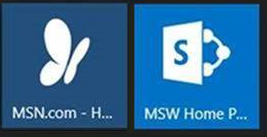

---
title: Add image for secondary Microsoft Edge tiles
description: Add app tiles on Windows 10 that's a secondary tile. 
ms.topic: article 
ms.date: 12/31/2017
--- 

# Add image for secondary Microsoft Edge tiles  

App tiles are the Start screen tiles that represent and launch an app. A tile that allows a user to go to a specific location in an app is a *secondary tile*. Some examples of secondary tiles include: 

- Weather updates for a specific city in a weather app
- A summary of upcoming events in a calendar app
- Status and updates from an important contact in a social app
- A website in Microsoft Edge

In a Start layout for Windows 10, version 1703, you can include secondary tiles for Microsoft Edge that display a custom image, rather than a tile with the standard Microsoft Edge logo.  

Suppose that the [Start layout that you export](customize-and-export-start-layout.md) had two secondary tiles, such as in the following image: 

 

In prior versions of Windows 10, when you applied the Start layout to a device, the tiles would display as shown in the following image: 

 

In Windows 10, version 1703, by using the PowerShell cmdlet `export-StartLayoutEdgeAssets` and the policy setting `ImportEdgeAssets`, the tiles will now display the same as they did on the device from which you exported the Start layout. 

 

**Example of secondary tiles in XML generated by Export-StartLayout** 


```xml
<start:SecondaryTile 

    AppUserModelID="Microsoft.MicrosoftEdge.Stable_8wekyb3d8bbwe!App" 

    TileID="-9513911450" 

    DisplayName="Bing" 

    Size="2x2" 

    Column="0" 

    Row="0" 

    Arguments="-contentTile -formatVersion 0x00000003 -pinnedTimeLow 0x36a8c2e4 -pinnedTimeHigh 0x01d0919b -securityFlags 0x00000000 -tileType 0x00000000 -url 0x00000014 http://www.bing.com/" Square150x150LogoUri="ms-appdata:///local/PinnedTiles/-9513911450/lowres.png" 

    Wide310x150LogoUri="ms-appx:///" 

    ShowNameOnSquare150x150Logo="true" 

    ShowNameOnWide310x150Logo="true" 

    BackgroundColor="#7fffffff" 

  />
``` 

## Export Start layout and assets 

1. Follow the instructions in [Customize and export Start layout](customize-and-export-start-layout.md#customize-the-start-screen-on-your-test-computer) to customize the Start screen on your test computer.
2. Open Windows PowerShell as an administrator and enter the following command: 

    ```powershell
    Export-StartLayout -path <path><file name>.xml
    ``` 

    In the previous command, `-path` is a required parameter that specifies the path and file name for the export file. You can specify a local path or a UNC path (for example, \\\\FileServer01\\StartLayouts\\StartLayoutMarketing.xml). 

    Use a file name of your choice—for example, StartLayoutMarketing.xml. Include the .xml file name extension. The [Export-StartLayout](/powershell/module/startlayout/export-startlayout) cmdlet doesn't append the file name extension, and the policy settings require the extension. 

3. If you'd like to change the image for a secondary tile to your own custom image, open the layout.xml file, and look for the images that the tile references.
   - For example, your layout.xml contains `Square150x150LogoUri="ms-appdata:///local/PinnedTiles/21581260870/hires.png" Wide310x150LogoUri="ms-appx:///"` 

   - Open `C:\Users\<username>\AppData\Local\Packages\Microsoft.MicrosoftEdge_8wekyb3d8bbwe\LocalState\PinnedTiles\21581260870\` and replace those images with your customized images. 

4. In Windows PowerShell, enter the following command:
 

    ```powershell
    Export-StartLayoutEdgeAssets assets.xml
    ``` 

## Configure policy settings 

You can apply the customized Start layout with images for secondary tiles by using [mobile device management](customize-windows-10-start-screens-by-using-mobile-device-management.md) or [a provisioning package](customize-windows-10-start-screens-by-using-provisioning-packages-and-icd.md). However, because you're including the images for secondary tiles, you must configure another setting to import the Edge assets. 

### Using MDM 

In Microsoft Intune, you create a device restrictions policy to apply to device group. For other MDM solutions, you may need to use an OMA-URI setting for Start layout, based on the [Policy configuration service provider (CSP)](/windows/client-management/mdm/policy-configuration-service-provider). The OMA-URI setting is `./User/Vendor/MSFT/Policy/Config/Start/StartLayout`. 

1. Sign in to the [Intune admin center](https://go.microsoft.com/fwlink/?linkid=2109431).
2. Select **Devices** > **Configuration profiles** > **Create profile**.
3. Enter the following properties: 

    - **Platform**: Select **Windows 10 and later**.
    - **Profile**: Select **Templates** > **Device restrictions**. 

4. Select **Create**.
5. In **Basics**, enter the following properties: 

    - **Name**: Enter a descriptive name for the policy. Name your policies so you can easily identify them later.
    - **Description**: Enter a description for the policy. This setting is optional, but recommended. 

6. Select **Next**. 

7. In **Configuration settings**, select **Start**. Configure the following properties: 

    - **Start menu layout**: Browse to, and select your Start layout XML file.
    - **Pin websites to tiles in Start menu**: Browse to, and select your assets XML file. 

    There are more Start menu settings you can configure. For more information on these settings, see [Start settings in Intune](/intune/device-restrictions-windows-10#start) 

8. Select **Next**.
9. In **Scope tags** (optional), assign a tag to filter the profile to specific IT groups, such as `US-NC IT Team` or `JohnGlenn_ITDepartment`. For more information about scope tags, see [Use RBAC and scope tags for distributed IT](/mem/intune/fundamentals/scope-tags). 

    Select **Next**. 

10. In **Assignments**, select the users or groups that will receive your profile. For more information on assigning profiles, see [Assign user and device profiles](/mem/intune/configuration/device-profile-assign). 

    Select **Next**. 

11. In **Review + create**, review your settings. When you select **Create**, your changes are saved, and the profile is assigned. The policy is also shown in the profiles list. 

### Using a provisioning package 

#### <a href="" id="escape"></a>Prepare the Start layout and Edge assets XML files 

The **export-StartLayout** and **export-StartLayoutEdgeAssets** cmdlets produce XML files. Because Windows Configuration Designer produces a customizations.xml file that contains the configuration settings, adding the Start layout and Edge assets sections to the customizations.xml file directly would result in an XML file embedded in an XML file. Before you add the Start layout and Edge assets sections to the customizations.xml file, you must replace the markup characters in your layout.xml with escape characters.  

 

1. Copy the contents of layout.xml into an online tool that escapes characters. 

2. Copy the contents of assets.xml into an online tool that escapes characters. 

3. When you create a provisioning package, you'll copy the text with the escape characters and paste it in the customizations.xml file for your project.  

#### Create a provisioning package that contains a customized Start layout 

 

Use the Windows Configuration Designer tool to create a provisioning package. [Learn how to install Windows Configuration Designer.](../provisioning-packages/provisioning-install-icd.md) 

>[!IMPORTANT]
>When you build a provisioning package, you may include sensitive information in the project files and in the provisioning package (.ppkg) file. Although you have the option to encrypt the .ppkg file, project files are not encrypted. You should store the project files in a secure location and delete the project files when they are no longer needed. 

1. Open Windows Configuration Designer (by default, %systemdrive%\\Program Files (x86)\\Windows Kits\\10\\Assessment and Deployment Kit\\Imaging and Configuration Designer\\x86\\ICD.exe). 

2. Choose **Advanced provisioning**. 

3. Name your project, and select **Next**. 

4. Choose **All Windows desktop editions** and select **Next**. 

5. On **New project**, select **Finish**. The workspace for your package opens. 

6. Expand **Runtime settings** &gt; **Policies** &gt; **Start**, and select **StartLayout**. 

   >[!TIP]
   >If **Start** is not listed, check the type of settings you selected in step 4. You must create the project using settings for **All Windows desktop editions**. 

7. Enter **layout.xml**. This value creates a placeholder in the customizations.xml file that you'll replace with the contents of the layout.xml file in a later step. 

8. In the **Available customizations** pane, select **ImportEdgeAssets**. 

9. Enter **assets.xml**. This value creates a placeholder in the customizations.xml file that you'll replace with the contents of the assets.xml file in a later step. 

10. Save your project and close Windows Configuration Designer. 

11. In File Explorer, open the project's directory. (The default location is C:\Users\\*user name*\Documents\Windows Imaging and Configuration Designer (WICD)\\*project name*)  

12. Open the customizations.xml file in a text editor. The **&lt;Customizations&gt;** section will look like this: 

      

13. Replace **layout.xml** with the text from the layout.xml file, [with markup characters replaced with escape characters](#escape). 

14. Replace **assets.xml** with the text from the assets.xml file, [with markup characters replaced with escape characters](#escape). 

15. Save and close the customizations.xml file. 

16. Open Windows Configuration Designer and open your project. 

17. On the **File** menu, select **Save.** 

18. On the **Export** menu, select **Provisioning package**. 

19. Change **Owner** to **IT Admin**, which will set the precedence of this provisioning package higher than provisioning packages applied to this device from other sources, and then select **Next.** 

20. Optional. In the **Provisioning package security** window, you can choose to encrypt the package and enable package signing. 

    - **Enable package encryption** - If you select this option, an auto-generated password will be shown on the screen. 

    - **Enable package signing** - If you select this option, you must select a valid certificate to use for signing the package. You can specify the certificate by clicking **Select...** and choosing the certificate you want to use to sign the package. 

21. Select **Next** to specify the output location where you want the provisioning package to go when it's built. By default, Windows Imaging and Configuration Designer (ICD) uses the project folder as the output location. 

    Optionally, you can select **Browse** to change the default output location. 

22. Select **Next**. 

23. Select **Build** to start building the package. The provisioning package doesn't take long to build. The project information is displayed in the build page and the progress bar indicates the build status. 

    If you need to cancel the build, select **Cancel**. It cancels the current build process, closes the wizard, and takes you back to the **Customizations Page**. 

24. If your build fails, an error message will show up that includes a link to the project folder. You can scan the logs to determine what caused the error. Once you fix the issue, try building the package again. 

    If your build is successful, the name of the provisioning package, output directory, and project directory will be shown. 

    - If you choose, you can build the provisioning package again and pick a different path for the output package. To change the path, select **Back** to change the output package name and path, and then select **Next** to start another build.
    - If you're done, select **Finish** to close the wizard and go back to the **Customizations Page**. 

25. Copy the provisioning package to the target device. 

26. Double-click the ppkg file and allow it to install. 

## Related articles
 

- [Manage Windows 10 Start and taskbar layout](windows-10-start-layout-options-and-policies.md)
- [Configure Windows 10 taskbar](configure-windows-10-taskbar.md)
- [Customize and export Start layout](customize-and-export-start-layout.md)
- [Start layout XML for desktop editions of Windows 10 (reference)](start-layout-xml-desktop.md)
- [Customize Windows 10 Start and taskbar with Group Policy](customize-windows-10-start-screens-by-using-group-policy.md)
- [Customize Windows 10 Start and taskbar with provisioning packages](customize-windows-10-start-screens-by-using-provisioning-packages-and-icd.md)
- [Customize Windows 10 Start and taskbar with mobile device management (MDM)](customize-windows-10-start-screens-by-using-mobile-device-management.md)
- [Changes to Start policies in Windows 10](changes-to-start-policies-in-windows-10.md)    

