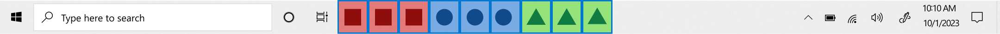
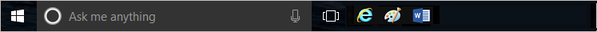

# Configure Windows Taskbar

::: zone pivot="windows-10"

Starting in Windows 10, version 1607, administrators can pin more apps to the taskbar and remove default pinned apps from the taskbar by adding a `<TaskbarLayout>` section to a layout modification XML file. This method never removes user-pinned apps from the taskbar.

> [!NOTE]
> The only aspect of the taskbar that can currently be configured by the layout modification XML file is the layout.

You can specify different taskbar configurations based on device locale and region. There's no limit on the number of apps that you can pin. You specify apps using the [Application User Model ID (AUMID)](../kiosk/find-the-application-user-model-id-of-an-installed-app.md) or Desktop Application Link Path (the local path to the application).

If you specify an app to be pinned that isn't provisioned for the user on the computer, the pinned icon won't appear on the taskbar.

The order of apps in the XML file dictates the order of pinned apps on the taskbar from left to right, starting to the right of any existing apps pinned by the user.

> [!NOTE]
> In operating systems configured to use a right-to-left language, the taskbar order will be reversed.

The following example shows how apps will be pinned: Windows default apps to the left (blue circle), apps pinned by the user in the center (orange triangle), and apps that you pin using the XML file to the right (green square).



## Configure taskbar (general)

To configure the taskbar:

1. Create the XML file
    - If you're also [customizing the Start layout](../start/customize-and-export-start-layout.md), use `Export-StartLayout` to create the XML, and then add the `<CustomTaskbarLayoutCollection>` section from [the following sample](#sample-taskbar-configuration-added-to-start-layout-xml-file) to the file.
    - If you're only configuring the taskbar, use [the following sample](#sample-taskbar-configuration-xml-file) to create a layout modification XML file
1. Edit and save the XML file. You can use [AUMID](../kiosk/find-the-application-user-model-id-of-an-installed-app.md) or Desktop Application Link Path to identify the apps to pin to the taskbar
    - Add `xmlns:taskbar="http://schemas.microsoft.com/Start/2014/TaskbarLayout"` to the first line of the file, before the closing \>.
    - Use `<taskbar:UWA>` and [AUMID](../kiosk/find-the-application-user-model-id-of-an-installed-app.md) to pin Universal Windows Platform apps
    - Use `<taskbar:DesktopApp>` and Desktop Application Link Path to pin desktop applications
1. Apply the layout modification XML file to devices using [Group Policy](../start/customize-windows-10-start-screens-by-using-group-policy.md) or a [provisioning package created in Windows Imaging and Configuration Designer (Windows ICD)](../start/customize-windows-10-start-screens-by-using-provisioning-packages-and-icd.md).

>[!IMPORTANT]
>If you use a provisioning package or import-startlayout to configure the taskbar, your configuration will be reapplied each time the explorer.exe process restarts. If your configuration pins an app and the user then unpins that app, the user's change will be overwritten the next time the configuration is applied. To apply a taskbar configuration that allows users to make changes that will persist, apply your configuration by using Group Policy.
>
>If you use Group Policy and your configuration only contains a taskbar layout, the default Windows tile layout will be applied and cannot be changed by users. If you use Group Policy and your configuration includes taskbar and a full Start layout, users can only make changes to the taskbar. If you use Group Policy and your configuration includes taskbar and a [partial Start layout](../start/customize-and-export-start-layout.md#configure-a-partial-start-layout), users can make changes to the taskbar and to tile groups not defined in the partial Start layout.

### Tips for finding AUMID and Desktop Application Link Path

In the layout modification XML file, you'll need to add entries for applications in the XML markup. In order to pin an application, you need either its AUMID or Desktop Application Link Path.

The easiest way to find this data for an application is to:

1. Pin the application to the Start menu on a reference or testing PC
1. Open Windows PowerShell and run the `Export-StartLayout` cmdlet
1. Open the generated XML file
1. Look for an entry corresponding to the app you pinned
1. Look for a property labeled `AppUserModelID` or `DesktopApplicationLinkPath`

### Sample taskbar configuration XML file

```xml
<?xml version="1.0" encoding="utf-8"?>
<LayoutModificationTemplate
    xmlns="http://schemas.microsoft.com/Start/2014/LayoutModification"
    xmlns:defaultlayout="http://schemas.microsoft.com/Start/2014/FullDefaultLayout"
    xmlns:start="http://schemas.microsoft.com/Start/2014/StartLayout"
    xmlns:taskbar="http://schemas.microsoft.com/Start/2014/TaskbarLayout"
    Version="1">
  <CustomTaskbarLayoutCollection>
    <defaultlayout:TaskbarLayout>
      <taskbar:TaskbarPinList>
        <taskbar:UWA AppUserModelID="Microsoft.MicrosoftEdge_8wekyb3d8bbwe!MicrosoftEdge" />
        <taskbar:DesktopApp DesktopApplicationLinkPath="%APPDATA%\Microsoft\Windows\Start Menu\Programs\System Tools\File Explorer.lnk" />
      </taskbar:TaskbarPinList>
    </defaultlayout:TaskbarLayout>
 </CustomTaskbarLayoutCollection>
</LayoutModificationTemplate>
```

### Sample taskbar configuration added to Start layout XML file

```xml
<?xml version="1.0" encoding="utf-8"?>
<LayoutModificationTemplate
    xmlns="http://schemas.microsoft.com/Start/2014/LayoutModification"
    xmlns:defaultlayout="http://schemas.microsoft.com/Start/2014/FullDefaultLayout"
    xmlns:start="http://schemas.microsoft.com/Start/2014/StartLayout"
    xmlns:taskbar="http://schemas.microsoft.com/Start/2014/TaskbarLayout"
    Version="1">
  <LayoutOptions StartTileGroupCellWidth="6" StartTileGroupsColumnCount="1" />
  <DefaultLayoutOverride>
    <StartLayoutCollection>
      <defaultlayout:StartLayout GroupCellWidth="6" xmlns:defaultlayout="http://schemas.microsoft.com/Start/2014/FullDefaultLayout">
        <start:Group Name="Life at a glance" xmlns:start="http://schemas.microsoft.com/Start/2014/StartLayout">
          <start:Tile Size="2x2" Column="0" Row="0" AppUserModelID="Microsoft.MicrosoftEdge_8wekyb3d8bbwe!MicrosoftEdge" />
          <start:Tile Size="2x2" Column="4" Row="0" AppUserModelID="Microsoft.Windows.Cortana_cw5n1h2txyewy!CortanaUI" />
          <start:Tile Size="2x2" Column="2" Row="0" AppUserModelID="Microsoft.BingWeather_8wekyb3d8bbwe!App" />
        </start:Group>

      </defaultlayout:StartLayout>
    </StartLayoutCollection>
  </DefaultLayoutOverride>
    <CustomTaskbarLayoutCollection>
      <defaultlayout:TaskbarLayout>
        <taskbar:TaskbarPinList>
          <taskbar:UWA AppUserModelID="Microsoft.MicrosoftEdge_8wekyb3d8bbwe!MicrosoftEdge" />
          <taskbar:DesktopApp DesktopApplicationLinkPath="%APPDATA%\Microsoft\Windows\Start Menu\Programs\System Tools\File Explorer.lnk" />
        </taskbar:TaskbarPinList>
      </defaultlayout:TaskbarLayout>
    </CustomTaskbarLayoutCollection>
</LayoutModificationTemplate>
```

## Keep default apps and add your own

The `<CustomTaskbarLayoutCollection>` section will append listed apps to the taskbar by default. The following sample keeps the default apps pinned and adds pins for Paint, Microsoft Reader, and a command prompt.

```xml
<?xml version="1.0" encoding="utf-8"?>
<LayoutModificationTemplate
    xmlns="http://schemas.microsoft.com/Start/2014/LayoutModification"
    xmlns:defaultlayout="http://schemas.microsoft.com/Start/2014/FullDefaultLayout"
    xmlns:start="http://schemas.microsoft.com/Start/2014/StartLayout"
    xmlns:taskbar="http://schemas.microsoft.com/Start/2014/TaskbarLayout"
    Version="1">
  <CustomTaskbarLayoutCollection>
    <defaultlayout:TaskbarLayout>
      <taskbar:TaskbarPinList>
        <taskbar:DesktopApp DesktopApplicationLinkPath="%ALLUSERSPROFILE%\Microsoft\Windows\Start Menu\Programs\Accessories\Paint.lnk" />
        <taskbar:UWA AppUserModelID="Microsoft.Reader_8wekyb3d8bbwe!Microsoft.Reader" />
        <taskbar:DesktopApp DesktopApplicationLinkPath="%appdata%\Microsoft\Windows\Start Menu\Programs\System Tools\Command Prompt.lnk" />
      </taskbar:TaskbarPinList>
    </defaultlayout:TaskbarLayout>
  </CustomTaskbarLayoutCollection>
</LayoutModificationTemplate>
```

**Before:**


**After:**

 

## Remove default apps and add your own

By adding `PinListPlacement="Replace"` to `<CustomTaskbarLayoutCollection>`, you remove all default pinned apps; only the apps that you specify will be pinned to the taskbar.

If you only want to remove some of the default pinned apps, you would use this method to remove all default pinned apps and then include the default app that you want to keep in your list of pinned apps.

```xml
<?xml version="1.0" encoding="utf-8"?>
<LayoutModificationTemplate
    xmlns="http://schemas.microsoft.com/Start/2014/LayoutModification"
    xmlns:defaultlayout="http://schemas.microsoft.com/Start/2014/FullDefaultLayout"
    xmlns:start="http://schemas.microsoft.com/Start/2014/StartLayout"
    xmlns:taskbar="http://schemas.microsoft.com/Start/2014/TaskbarLayout"
    Version="1">
  <CustomTaskbarLayoutCollection PinListPlacement="Replace">
    <defaultlayout:TaskbarLayout>
      <taskbar:TaskbarPinList>
        <taskbar:DesktopApp DesktopApplicationLinkPath="%APPDATA%\Microsoft\Windows\Start Menu\Programs\Accessories\Internet Explorer.lnk"/>
        <taskbar:DesktopApp DesktopApplicationLinkPath="%ALLUSERSPROFILE%\Microsoft\Windows\Start Menu\Programs\Accessories\Paint.lnk" />
        <taskbar:UWA AppUserModelID="Microsoft.Office.Word_8wekyb3d8bbwe!microsoft.word" />
      </taskbar:TaskbarPinList>
    </defaultlayout:TaskbarLayout>
  </CustomTaskbarLayoutCollection>
</LayoutModificationTemplate>
```

**Before:**


**After:**



## Remove default apps

By adding `PinListPlacement="Replace"` to `<CustomTaskbarLayoutCollection>`, you remove all default pinned apps.

```xml
<?xml version="1.0" encoding="utf-8"?>
<LayoutModificationTemplate
    xmlns="http://schemas.microsoft.com/Start/2014/LayoutModification"
    xmlns:defaultlayout="http://schemas.microsoft.com/Start/2014/FullDefaultLayout"
    xmlns:start="http://schemas.microsoft.com/Start/2014/StartLayout"
    xmlns:taskbar="http://schemas.microsoft.com/Start/2014/TaskbarLayout"
    Version="1">
  <CustomTaskbarLayoutCollection PinListPlacement="Replace">
    <defaultlayout:TaskbarLayout>
      <taskbar:TaskbarPinList>
        <taskbar:DesktopApp DesktopApplicationLinkPath="#leaveempty"/>
      </taskbar:TaskbarPinList>
    </defaultlayout:TaskbarLayout>
  </CustomTaskbarLayoutCollection>
</LayoutModificationTemplate>
```

## Configure taskbar by country or region

The following example shows you how to configure taskbars by country or region. When the layout is applied to a computer, if there's no `<TaskbarPinList>` node with a region tag for the current region, the first `<TaskbarPinList>` node that has no specified region will be applied. When you specify one or more countries or regions in a `<TaskbarPinList>` node, the specified apps are pinned on computers configured for any of the specified countries or regions.

```xml
<?xml version="1.0" encoding="utf-8"?>
<LayoutModificationTemplate
    xmlns="http://schemas.microsoft.com/Start/2014/LayoutModification"
    xmlns:defaultlayout="http://schemas.microsoft.com/Start/2014/FullDefaultLayout"
    xmlns:start="http://schemas.microsoft.com/Start/2014/StartLayout"
    xmlns:taskbar="http://schemas.microsoft.com/Start/2014/TaskbarLayout"
    Version="1">

  <CustomTaskbarLayoutCollection PinListPlacement="Replace">
    <defaultlayout:TaskbarLayout region="US|UK">
      <taskbar:TaskbarPinList >
        <taskbar:UWA AppUserModelID="Microsoft.MicrosoftEdge_8wekyb3d8bbwe!MicrosoftEdge" />
        <taskbar:DesktopApp DesktopApplicationLinkPath="%APPDATA%\Microsoft\Windows\Start Menu\Programs\System Tools\File Explorer.lnk" />
        <taskbar:UWA AppUserModelID="Microsoft.Office.Word_8wekyb3d8bbwe!microsoft.word" />
        <taskbar:DesktopApp DesktopApplicationLinkPath="%ALLUSERSPROFILE%\Microsoft\Windows\Start Menu\Programs\Accessories\Paint.lnk"/>
        <taskbar:UWA AppUserModelID="Microsoft.Reader_8wekyb3d8bbwe!Microsoft.Reader" />
      </taskbar:TaskbarPinList>
    </defaultlayout:TaskbarLayout>
    <defaultlayout:TaskbarLayout region="DE|FR">
      <taskbar:TaskbarPinList>
        <taskbar:DesktopApp DesktopApplicationLinkPath="%APPDATA%\Microsoft\Windows\Start Menu\Programs\System Tools\File Explorer.lnk" />
        <taskbar:UWA AppUserModelID="Microsoft.Office.Word_8wekyb3d8bbwe!microsoft.word" />
        <taskbar:UWA AppUserModelID="Microsoft.Office.Excel_8wekyb3d8bbwe!microsoft.excel" />
        <taskbar:DesktopApp DesktopApplicationLinkPath="%ALLUSERSPROFILE%\Microsoft\Windows\Start Menu\Programs\Accessories\Paint.lnk"/>
        <taskbar:UWA AppUserModelID="Microsoft.Reader_8wekyb3d8bbwe!Microsoft.Reader" />
      </taskbar:TaskbarPinList>
    </defaultlayout:TaskbarLayout>
    <defaultlayout:TaskbarLayout>
      <taskbar:TaskbarPinList>
        <taskbar:DesktopApp DesktopApplicationLinkPath="%APPDATA%\Microsoft\Windows\Start Menu\Programs\System Tools\File Explorer.lnk" />
        <taskbar:UWA AppUserModelID="Microsoft.Office.Word_8wekyb3d8bbwe!microsoft.word" />
        <taskbar:DesktopApp DesktopApplicationLinkPath="%ALLUSERSPROFILE%\Microsoft\Windows\Start Menu\Programs\Accessories\Paint.lnk"/>
        <taskbar:UWA AppUserModelID="Microsoft.Reader_8wekyb3d8bbwe!Microsoft.Reader" />
      </taskbar:TaskbarPinList>
    </defaultlayout:TaskbarLayout>
  </CustomTaskbarLayoutCollection>
</LayoutModificationTemplate>
```

When the preceding example XML file is applied, the resulting taskbar for computers in the US or UK:


The resulting taskbar for computers in Germany or France:


The resulting taskbar for computers in any other country region:


> [!NOTE]
> [Look up country and region codes (use the ISO Short column)](/previous-versions/commerce-server/ee799297(v=cs.20))

## Layout Modification Template schema definition

```xml
<?xml version="1.0" encoding="utf-8"?>
<xsd:schema xmlns:xsd="http://www.w3.org/2001/XMLSchema"
            xmlns:local="http://schemas.microsoft.com/Start/2014/TaskbarLayout"
            targetNamespace="http://schemas.microsoft.com/Start/2014/TaskbarLayout"
            elementFormDefault="qualified">

  <xsd:complexType name="ct_PinnedUWA">
    <xsd:attribute name="AppUserModelID" type="xsd:string" />
  </xsd:complexType>

  <xsd:complexType name="ct_PinnedDesktopApp">
    <xsd:attribute name="DesktopApplicationID" type="xsd:string" />
    <xsd:attribute name="DesktopApplicationLinkPath" type="xsd:string" />
  </xsd:complexType>

  <xsd:complexType name="ct_TaskbarPinList">
    <xsd:sequence>
      <xsd:choice minOccurs="1" maxOccurs="unbounded">
        <xsd:element name="UWA" type="local:ct_PinnedUWA" />
        <xsd:element name="DesktopApp" type="local:ct_PinnedDesktopApp" />
      </xsd:choice>
    </xsd:sequence>
    <xsd:attribute name="Region" type="xsd:string" use="optional" />
  </xsd:complexType>

  <xsd:simpleType name="st_TaskbarPinListPlacement">
    <xsd:restriction base="xsd:string">
      <xsd:enumeration value="Append" />
      <xsd:enumeration value="Replace" />
    </xsd:restriction>
  </xsd:simpleType>

  <xsd:attributeGroup name="ag_SelectionAttributes">
    <xsd:attribute name="SKU" type="xsd:string" use="optional"/>
    <xsd:attribute name="Region" type="xsd:string" use="optional"/>
  </xsd:attributeGroup>

  <xsd:complexType name="ct_TaskbarLayout">
    <xsd:sequence>
      <xsd:element name="TaskbarPinList" type="local:ct_TaskbarPinList" minOccurs="1" maxOccurs="1" />
    </xsd:sequence>
    <xsd:attributeGroup ref="local:ag_SelectionAttributes"/>
  </xsd:complexType>

</xsd:schema>
```

::: zone-end

::: zone pivot="windows-11"


> **Looking for OEM information?** See [Customize the Taskbar](/windows-hardware/customize/desktop/customize-the-windows-11-taskbar) and [Customize the Start layout](/windows-hardware/customize/desktop/customize-the-windows-11-start-menu).

Your organization can deploy a customized taskbar to your Windows devices. Customizing the taskbar is common when your organization uses a common set of apps, or wants to bring attention to specific apps. You can also remove the default pinned apps.

For example, you can override the default set of apps with your own a set of pinned apps, and in the order you choose. As an administrator, use this feature to pin apps, remove default pinned apps, order the apps, and more on the taskbar.

To add apps you want pinned to the taskbar, you use an XML file. You can use an existing XML file, or create a new file. If you have an XML file that's used on Windows 10 devices, you can also use it on Windows 11 devices. You may have to update the App IDs.

This article shows you how to create the XML file, add apps to the XML, and deploy the XML file. To learn how to customize the taskbar buttons, see [CSP policies to customize Windows 11 taskbar buttons](supported-csp-taskbar-windows.md#csp-policies-to-customize-windows-11-taskbar-buttons).

## Before you begin

- There isn't a limit on the number of apps that you can pin. In the XML file, add apps using the [Application User Model ID (AUMID)](../kiosk/find-the-application-user-model-id-of-an-installed-app.md) or Desktop Application Link Path (the local path to the app).
- There are some situations that an app pinned in your XML file won't be pinned in the taskbar. For example, if an app isn't approved or installed for a user, then the pinned icon won't show on the taskbar.
- The order of apps in the XML file dictates the order of pinned apps on the taskbar, from left to right, and to the right of any existing apps pinned by the user. If the OS is configured to use a right-to-left language, then the taskbar order is reversed.
- Some classic Windows applications are packaged differently than they were in previous versions of Windows, including Notepad and File Explorer. Be sure to enter the correct AppID. For more information, see [Application User Model ID (AUMID)](../kiosk/find-the-application-user-model-id-of-an-installed-app.md) and [Get the AUMID and Desktop app link path](#get-the-aumid-and-desktop-app-link-path) (in this article).
- It's recommended to use a Mobile Device Management (MDM) provider. MDM providers help manage your devices, and help manage apps on your devices. You can use Microsoft Intune. Intune is a family of products that include Microsoft Intune, which is a cloud service, and Configuration Manager, which is on-premises.

  In this article, we mention these services. If you're not managing your devices using an MDM provider, the following resources may help you get started:

  - [Endpoint Management at Microsoft](/mem/endpoint-manager-overview)
  - [What is Microsoft Intune](/mem/intune/fundamentals/what-is-intune) and [Microsoft Intune planning guide](/mem/intune/fundamentals/intune-planning-guide)
  - [What is Configuration Manager?](/mem/configmgr/core/understand/introduction)

## Create the XML file

1. In a text editor, such as Visual Studio Code, create a new XML file. To help you get started, you can copy and paste the following XML sample. The sample pins 2 apps to the taskbar - File Explorer and the Command Prompt:

    ```xml
    <?xml version="1.0" encoding="utf-8"?>
    <LayoutModificationTemplate
        xmlns="http://schemas.microsoft.com/Start/2014/LayoutModification"
        xmlns:defaultlayout="http://schemas.microsoft.com/Start/2014/FullDefaultLayout"
        xmlns:start="http://schemas.microsoft.com/Start/2014/StartLayout"
        xmlns:taskbar="http://schemas.microsoft.com/Start/2014/TaskbarLayout"
        Version="1">
      <CustomTaskbarLayoutCollection>
        <defaultlayout:TaskbarLayout>
          <taskbar:TaskbarPinList>
            <taskbar:DesktopApp DesktopApplicationID="Microsoft.Windows.Explorer" />
            <taskbar:DesktopApp DesktopApplicationLinkPath="%APPDATA%\Microsoft\Windows\Start Menu\Programs\System Tools\Command Prompt.lnk" />
          </taskbar:TaskbarPinList>
        </defaultlayout:TaskbarLayout>
     </CustomTaskbarLayoutCollection>
    </LayoutModificationTemplate>
    ```

1. In the `<taskbar:TaskbarPinList>` node, add (or remove) the apps you want pinned. You can pin Universal Windows Platform (UWP) apps and desktop apps:

    - `<taskbar:UWA>`: Select this option for UWP apps. Add the [AUMID](../kiosk/find-the-application-user-model-id-of-an-installed-app.md) of the UWP app.
    - `<taskbar:DesktopApp>`: Select this option for desktop apps. Add the Desktop Application Link Path of the desktop app.

    You can pin as many apps as you want.  Just keep adding them to the list. Remember, the app order in the list is the same order the apps are shown on the taskbar.

    For more information, see [Get the AUMID and Desktop app link path](#get-the-aumid-and-desktop-app-link-path) (in this article).

1. In the `<CustomTaskbarLayoutCollection>` node, the apps you add are pinned after the default apps. If you want to remove the default apps, and only show the apps you add in the XML file, then add `PinListPlacement="Replace"`:

    - `<CustomTaskbarLayoutCollection>`: Keeps the default pinned apps. After the default apps, the apps you add are pinned.
    - `<CustomTaskbarLayoutCollection PinListPlacement="Replace">`: Unpins the default apps. Only the apps you add are pinned.

    If you want to remove some of the default pinned apps, then add `PinListPlacement="Replace"`. When you add your apps to `<taskbar:TaskbarPinList>`, include the default apps you still want pinned.

1. In the `<defaultlayout:TaskbarLayout>` node, use `region=" | "` to use different taskbar configurations based on the device locale and region.

    In the following XML example, two regions are added: `US|UK` and `DE|FR`:

    ```xml
    <?xml version="1.0" encoding="utf-8"?>
    <LayoutModificationTemplate
        xmlns="http://schemas.microsoft.com/Start/2014/LayoutModification"
        xmlns:defaultlayout="http://schemas.microsoft.com/Start/2014/FullDefaultLayout"
        xmlns:start="http://schemas.microsoft.com/Start/2014/StartLayout"
        xmlns:taskbar="http://schemas.microsoft.com/Start/2014/TaskbarLayout"
        Version="1">

      <CustomTaskbarLayoutCollection PinListPlacement="Replace">
        <defaultlayout:TaskbarLayout region="US|UK">
          <taskbar:TaskbarPinList >
            <taskbar:DesktopApp DesktopApplicationID="MSEdge"/>
            <taskbar:DesktopApp DesktopApplicationID="Microsoft.Windows.Explorer"/>
            <taskbar:DesktopApp DesktopApplicationID="Microsoft.Office.WINWORD.EXE.15" />
            <taskbar:DesktopApp DesktopApplicationLinkPath="%APPDATA%\Microsoft\Windows\Start Menu\Programs\System Tools\Command Prompt.lnk"/>
          </taskbar:TaskbarPinList>
        </defaultlayout:TaskbarLayout>
        <defaultlayout:TaskbarLayout region="DE|FR">
          <taskbar:TaskbarPinList>
            <taskbar:DesktopApp DesktopApplicationID="Microsoft.Windows.Explorer"/>
            <taskbar:DesktopApp DesktopApplicationID="Microsoft.Office.WINWORD.EXE.15" />
            <taskbar:DesktopApp DesktopApplicationID="Microsoft.Office.EXCEL.EXE.15" />
            <taskbar:UWA AppUserModelID="Microsoft.WindowsTerminal_8wekyb3d8bbwe!App" />
          </taskbar:TaskbarPinList>
        </defaultlayout:TaskbarLayout>
        <defaultlayout:TaskbarLayout>
          <taskbar:TaskbarPinList>
            <taskbar:DesktopApp DesktopApplicationID="Microsoft.Windows.Explorer"/>
            <taskbar:DesktopApp DesktopApplicationID="Microsoft.Office.WINWORD.EXE.15" />
            <taskbar:UWA AppUserModelID="Microsoft.WindowsTerminal_8wekyb3d8bbwe!App" />
          </taskbar:TaskbarPinList>
        </defaultlayout:TaskbarLayout>
      </CustomTaskbarLayoutCollection>
    </LayoutModificationTemplate>
    ```

    The taskbar applies when:

    - If the `<TaskbarPinList>` node has a country or region, then the apps are pinned on devices configured for that country or region.
    - If the `<TaskbarPinList>` node doesn't have a region tag for the current region, then the first `<TaskbarPinList>` node with no region is applied.

1. Save the file, and name the file so you know what it is. For example, name the file something like `TaskbarLayoutModification.xml`. Once you have the file, it's ready to be deployed to your Windows devices.

## Use Group Policy or MDM to create and deploy a taskbar policy

Now that you have the XML file with your customized taskbar, you're ready to deploy it to devices in your organization. You can deploy your taskbar XML file using Group Policy, or using an MDM provider, like Microsoft Intune.

This section shows you how to deploy the XML both ways.

### Use Group Policy to deploy your XML file

Use the following steps to add your XML file to a group policy, and apply the policy:

1. Open your policy editor. For example, open Group Policy Management Console (GPMC) for domain-based group policies, or open `gpedit` for local policies.
1. Go to one of the following policies:

    - `Computer Configuration\Administrative Templates\Start Menu and Taskbar\Start Layout`
    - `User Configuration\Administrative Templates\Start Menu and Taskbar\Start Layout`

1. Double-select `Start Layout` > **Enable**. Enter the fully qualified path to your XML file, including the XML file name. You can enter a local path, like `C:\StartLayouts\TaskbarLayoutModification.xml`, or a network path, like `\\Server\Share\TaskbarLayoutModification.xml`. Be sure you enter the correct file path. If using a network share, be sure to give users read access to the XML file. If the file isn't available when the user signs in, then the taskbar isn't changed. Users can't customize the taskbar when this setting is enabled.

    Your policy looks like the following policy:

    :::image type="content" source="images/start-layout-group-policy.png" alt-text="Add your taskbar layout XML file to the Start Layout policy on Windows devices.":::

    The `User Configuration\Administrative Templates\Start Menu and Taskbar` policy includes other settings that control the taskbar. Some policies may not work as expected. Be sure to test your policies before broadly deploying them across your devices.

1. When you apply the policy, the taskbar includes your changes. The next time users sign in, they'll see the changes.

    For more information on using group policies, see [Implement Group Policy Objects](/training/modules/implement-group-policy-objects/).

### Create a Microsoft Intune policy to deploy your XML file

MDM providers can deploy policies to devices managed by the organization, including organization-owned devices, and personal or bring your own device (BYOD). Using an MDM provider, such as Microsoft Intune, you can deploy a policy that configures the pinned list.

Use the following steps to create an Intune policy that deploys your taskbar XML file:

1. Sign in to the [Intune admin center](https://go.microsoft.com/fwlink/?linkid=2109431).

1. Select **Devices** > **Configuration profiles** > **Create profile**.

1. Enter the following properties:

    - **Platform**: Select **Windows 10 and later**.
    - **Profile type**: Select **Templates** > **Device restrictions** > **Create**.

1. In **Basics**, enter the following properties:

    - **Name**: Enter a descriptive name for the profile. Name your profiles so you can easily identify it later. For example, a good profile name is **Win11: Custom taskbar**.
    - **Description**: Enter a description for the profile. This setting is optional, and recommended.

1. Select **Next**.

1. In **Configuration settings**, select **Start** > **Start menu layout**. Browse to, and select your taskbar XML file.

1. Select **Next**, and configure the rest of the policy settings. For more specific information, see [Configure device restriction settings](/mem/intune/configuration/device-restrictions-configure).

1. When the policy is created, you can deploy it now, or deploy it later. Since this policy is a customized taskbar, the policy can also be deployed before users sign in the first time.

    For more information and guidance on assigning policies using Microsoft Intune, see [Assign user and device profiles](/mem/intune/configuration/device-profile-assign).

> [!NOTE]
> For third party partner MDM solutions, you may need to use an OMA-URI setting for Start layout, based on the [Policy configuration service provider (CSP)](/windows/client-management/mdm/policy-configuration-service-provider). The OMA-URI setting is `./User/Vendor/MSFT/Policy/Config/Start/StartLayout`.

## Get the AUMID and Desktop app link path

In the layout modification XML file, you add apps in the XML markup. To pin an app, you enter the AUMID or Desktop Application Link Path. The easiest way to find this app information is to use the [Export-StartLayout](/powershell/module/startlayout/export-startlayout) Windows PowerShell cmdlet:

1. On an existing Windows 11 device, pin the app to the Start menu.
1. Create a folder to save an output file. For example, create the `C:\Layouts` folder.
1. Open the Windows PowerShell app, and run the following cmdlet:

    ```powershell
    Export-StartLayout -Path "C:\Layouts\GetIDorPath.xml"
    ```

1. Open the generated GetIDorPath.xml file, and look for the app you pinned. When you find the app, get the AppID or Path. Add these properties to your XML file.

## Pin order for all apps

On a taskbar, the following apps are typically pinned:

- Apps pinned by the user
- Default Windows apps pinned during the OS installation, such as Microsoft Edge, File Explorer, and Microsoft Store.
- Apps pinned by your organization, such as in an unattended Windows setup.

  In an unattended Windows setup file, use the XML file you created in this article. It's not recommended to use [TaskbarLinks](/windows-hardware/customize/desktop/unattend/microsoft-windows-shell-setup-taskbarlinks).

Apps are pinned in the following order:

1. Windows default apps are pinned first.
1. User-pinned apps are pinned after the Windows default apps.
1. XML-pinned apps are pinned after the user-pinned apps.

If the OS is configured to use a right-to-left language, then the taskbar order is reversed.

## OS install and upgrade

- On a clean install of the Windows client, if you apply a taskbar layout, the following apps are pinned to the taskbar:

  - Apps you specifically add
  - Any default apps you don't remove

  After the taskbar layout is applied, users can pin more apps, change the order, and unpin apps.

- On a Windows client upgrade, apps are already pinned to the taskbar. These apps may have been pinned by a user, by an image, or by using Windows unattended setup. For upgrades, the taskbar layout applies the following behavior:

  - If users pinned apps to the taskbar, then those pinned apps remain. New apps are pinned after the existing user-pinned apps.
  - If the apps are pinned during the install or by a policy (not by a user), and the apps aren't pinned in an updated layout file, then the apps are unpinned.
  - If a user didn't pin an app, and the same app is pinned in the updated layout file, then the app is pinned after any existing pinned apps.
  - New apps in updated layout file are pinned after the user's pinned apps.

  After the layout is applied, users can pin more apps, change the order, and unpin apps.

::: zone-end
