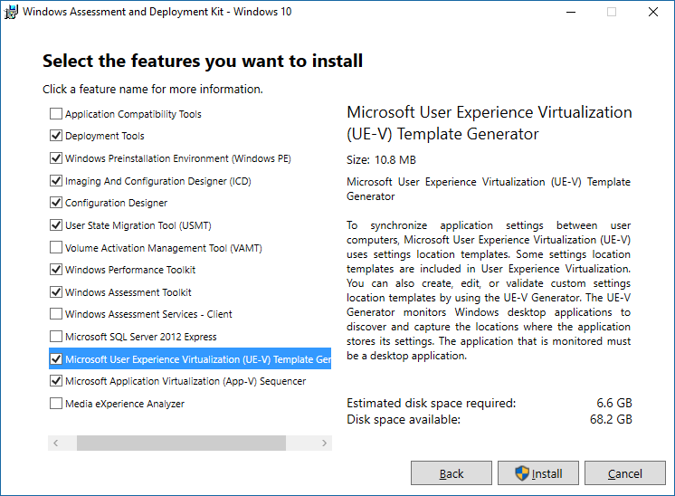

# Use UE-V with custom applications 

**Applies to**
-   Windows 10, version 1607

User Experience Virtualization (UE-V) uses XML files called ***settings location templates*** to monitor and synchronize application settings and Windows settings between user devices. By default, some settings location templates are included in UE-V. However, if you want to synchronize settings for desktop applications other than those included in the default templates, you can create your own custom settings location templates with the UE-V template generator.

After you’ve reviewed [Prepare a UE-V Deployment](uev-prepare-for-deployment.md) and decided that you want to synchronize settings for custom applications (third-party, line-of-business, e.g.), you’ll need to deploy the features of UE-V described in this topic.

To start, here are the main steps required to synchronize settings for custom applications:

-   [Install the UE-V template generator](#install-the-uev-template-generator)

    Use the UEV template generator to create custom XML settings location templates.

-   [Configure a UE-V settings template catalog](#deploy-a-settings-template-catalog)

    You can define this path where custom settings location templates are stored.

-   [Create custom settings location templates](#create-custom-settings-location-templates)

    These custom templates let users sync settings for custom applications.

-   [Deploy the custom settings location templates](#deploy-the-custom-settings-location-templates)

    After you test the custom template to ensure that settings are synced correctly, you can deploy these templates in one of these ways:

    -   With your existing electronic software distribution solution, such as Configuration Manager

    -   With Group Policy preferences

    -   With a UE-V settings template catalog

>**Note**
Templates that are deployed with electronic software distribution methods or Group Policy must be registered with UE-V Windows Management Instrumentation (WMI) or Windows PowerShell.

## Prepare to deploy UE-V for custom applications

Before you start deploying the UE-V features that handle custom applications, review the following important information.

### The UE-V template generator

Use the UE-V template generator to monitor, discover, and capture the locations where Win32 applications store settings. The template generator does not create settings location templates for the following types of applications:

-   Virtualized applications

-   Applications that are offered through Terminal Services

-   Java applications

-   Windows applications

>**Note**
UE-V settings location templates cannot be created from virtualized applications or Terminal Services applications. However, settings that are synchronized by using the templates can be applied to those applications. To create templates that support Virtual Desktop Infrastructure (VDI) and Terminal Services applications, open a version of the Windows Installer (.msi) package of the application by using the UE-V template generator. For more information about synchronizing settings for virtual applications, see [Using UE-V with virtual applications](uev-using-uev-with-application-virtualization-applications.md).

**Excluded Locations:** The discovery process excludes locations that commonly store application software files that do not synchronize settings well between user computers or computing environments. By default, these are excluded:

-   HKEY\_CURRENT\_USER registry keys and files to which the logged-on user cannot write values

-   HKEY\_CURRENT\_USER registry keys and files that are associated with the core functionality of the Windows operating system

-   All registry keys that are located in the HKEY\_LOCAL\_MACHINE hive

-   Files that are located in Program Files directories

-   Files that are located in Users \\ \[User name\] \\ AppData \\ LocalLow

-   Windows operating system files that are located in %Systemroot%

If registry keys and files that are stored in excluded locations are required to synchronize application settings, you can manually add the locations to the settings location template during the template creation process.

### Replace the default Microsoft templates

A default group of settings location templates for common Microsoft applications and Windows settings is included with Windows 10, version 1607. If you customize these templates, or create settings location templates to synchronize settings for custom applications, the UE-V service can be configured to use a settings template catalog to store the templates. In this case, you will need to include the default templates with the custom templates in the settings template catalog.

>**Important**
After you enable the UE-V service, you’ll need to register the settings location templates using the `Register-UevTemplate` cmdlet in Windows PowerShell.

When you use Group Policy to configure the settings template catalog path, you can choose to replace the default Microsoft templates. If you configure the policy settings to replace the default Microsoft templates, all of the default Microsoft templates that are installed with Windows 10, version 1607 are deleted and only the templates that are located in the settings template catalog are used.

**Note**
If there are customized templates in the settings template catalog that use the same ID as the default Microsoft templates, the Microsoft templates are ignored.

You can replace the default templates by using the UE-V Windows PowerShell features. To replace the default Microsoft template with Windows PowerShell, unregister all of the default Microsoft templates, and then register the customized templates.

Old settings packages remain in the settings storage location even if you deploy new settings location templates for an application. These packages are not read by the UE-V service, but neither are they automatically deleted.

### Install the UEV template generator

Use the UE-V template generator to create custom settings location templates that you can then distribute to user devices. You can also use the template generator to edit an existing template or validate a template that was created with another XML editor.

The UE-V template generator is included in the Windows Assessment and Deployment Kit (ADK) for Windows 10.

Install the UE-V template generator on a computer that you can use to create a custom settings location template. This computer should have the applications installed for which custom settings location templates need to be generated.

>**Important**
UE-V for Windows 10, version 1607 includes a new template generator. If you are upgrading from an existing UE-V installation, you’ll need to use the new generator to create settings location templates. Templates created with previous versions of the UE-V template generator will continue to work.

**To install the UE-V template generator**

1.  Go to [Download the Windows ADK](https://developer.microsoft.com/en-us/windows/hardware/windows-assessment-deployment-kit) to access the ADK.

2.  Select the **Get Windows ADK for Windows 10** button on this page to start the ADK installer. On the window pictured below, select **Microsoft User Experience Virtualization (UE-V) Template Generator** and then select Install.

<!-- PRESERVING ORIGINAL IMAGE CODING JUST IN CASE

-->

3.  To open the generator, select **Microsoft Application Virtualization Generator** from the **Start** menu. 

4. See [Working with Custom UE-V Templates and the UE-V Template Generator](uev-working-with-custom-templates-and-the-uev-generator.md) for information about how to use the template generator.

### Deploy a settings template catalog

The UE-V settings template catalog is a folder path on UE-V computers or a Server Message Block (SMB) network share that stores all the custom settings location templates. The UE-V service checks this location one time each day and updates its synchronization behavior, based on the templates in this folder.

The UE-V service checks this folder for templates that were added, updated, or removed. It registers new and changed templates and unregisters removed templates. By default, templates are registered and unregistered one time per day at 3:30 A.M. local time by the Task Scheduler and at system startup. To customize the frequency of this scheduled task, see [Changing the frequency of UE-V scheduled tasks](uev-changing-the-frequency-of-scheduled-tasks.md).

You can configure the settings template catalog path with command-line options, Group Policy, WMI, or Windows PowerShell. Templates stored at the settings template catalog path are automatically registered and unregistered by a scheduled task.

**To configure the settings template catalog for UE-V**

1.  Create a new folder on the computer that stores the UE-V settings template catalog.

2.  Set the following share-level (SMB) permissions for the settings template catalog folder.

    | **User account** | **Recommended permissions**  |
    |------------------|------------------------------|
    | Everyone         | No Permissions               |
    | Domain Computers | Read Permission Levels       |
    | Administrators   | Read/Write Permission Levels |

3.  Set the following NTFS file system permissions for the settings template catalog folder.

    | **User account** | **Recommended permissions**   | **Apply to**                      |
    |------------------|-------------------------------|-----------------------------------|
    | Creator/Owner    | Full Control                  | This Folder, Subfolders and Files |
    | Domain Computers | List Folder Contents and Read | This Folder, Subfolders and Files |
    | Everyone         | No Permissions                | No Permissions                    |
    | Administrators   | Full Control                  | This Folder, Subfolders and Files |

4.  Click **OK** to close the dialog boxes.

At a minimum, the network share must grant permissions for the Domain Computers group. In addition, grant access permissions for the network share folder to administrators who are to manage the stored templates.

### Create custom settings location templates

Use the UE-V template generator to create settings location templates for line-of-business applications or other custom applications. After you create the template for an application, deploy it to computers to synchronize settings for that application.

**To create a UE-V settings location template with the UE-V template generator**

1.  Click **Start** &gt; **All Programs** &gt; **Microsoft User Experience Virtualization** &gt; **Microsoft User Experience Virtualization template generator**.

2.  Click **Create a settings location template**.

3.  Specify the application. Browse to the file path of the application (.exe) or the application shortcut (.lnk) for which you want to create a settings location template. Specify the command-line arguments, if any, and working directory, if any.

4.  Click **Next** to continue.

    >**Note** Before the application is started, the system displays a prompt for **User Account Control**. Permission is required to monitor the registry and file locations that the application uses to store settings.

5.  After the application starts, close the application. The UE-V template generator records the locations where the application stores its settings.

6.  After the process is completed, click **Next** to continue.

7.  Review and select the appropriate registry settings locations and settings file locations to synchronize for this application. The list includes the following two categories for settings locations:

    -   **Standard**: Application settings that are stored in the registry under the HKEY\_CURRENT\_USER keys or in the file folders under \\ **Users** \\ \[User name\] \\ **AppData** \\ **Roaming**. The UE-V template generator includes these settings by default.

    -   **Nonstandard**: Application settings that are stored outside the locations are specified in the best practices for settings data storage (optional). These include files and folders under **Users** \\ \[User name\] \\ **AppData** \\ **Local**. Review these locations to determine whether to include them in the settings location template. Select the locations check boxes to include them.

8.  Click **Next** to continue.

9.  Review and edit any **Properties**, **Registry** locations, and **Files** locations for the settings location template.

    -   Edit the following properties on the **Properties** tab:

        -   **Application Name**: The application name that is written in the description of the program files properties.

        -   **Program name**: The name of the program that is taken from the program file properties. This name usually has the .exe file name extension.

        -   **Product version**: The product version number of the .exe file of the application. This property, in conjunction with the **File version**, helps determine which applications are targeted by the settings location template. This property accepts a major version number. If this property is empty, the settings location template applies to all versions of the product.

        -   **File version**: The file version number of the .exe file of the application. This property, in conjunction with the **Product version**, helps determine which applications are targeted by the settings location template. This property accepts a major version number. If this property is empty, the settings location template applies to all versions of the program.

        -   **template author name** (optional): The name of the settings location template author.

        -   **template author email** (optional): The email address of the settings location template author.

    -   The **Registry** tab lists the **Key** and **Scope** of the registry locations that are included in the settings location template. Edit the registry locations by using the **Tasks** drop-down menu. Tasks enable you to add new keys, edit the name or scope of existing keys, delete keys, and browse the registry where the keys are located. Use the **All Settings** scope to include all the registry settings under the specified key. Use the **All Settings and Subkeys** to include all the registry settings under the specified key, subkeys, and subkey settings.

    -   The **Files** tab lists the file path and file mask of the file locations that are included in the settings location template. Edit the file locations by use of the **Tasks** drop-down menu. Tasks for file locations enable you to add new files or folder locations, edit the scope of existing files or folders, delete files or folders, and open the selected location in Windows Explorer. Leave the file mask empty to include all files in the specified folder.

10.  Click **Create**, and then click **Save** to save the settings location template on the computer.

11.  Click **Close** to close the settings template wizard. Exit the UE-V template generator application.

12.  After you have created the settings location template for an application, test the template. Deploy the template in a lab environment before you put it into production in the enterprise.

See [Application template schema reference for UE-V](uev-application-template-schema-reference.md) for details about the XML structure of the UE-V settings location template and for guidance about editing these files.

### Deploy the Custom Settings Location templates

After you create a settings location template with the UE-V template generator, you should test it to ensure that the application settings are synchronized correctly. You can then safely deploy the settings location template to user devices in the enterprise.

You can deploy settings location templates using of these methods:

-   An electronic software distribution (ESD) system such as System Center Configuration Manager

-   Group Policy preferences

-   A UE-V settings template catalog

Templates that are deployed by using an ESD system or Group Policy objects must be registered using UE-V Windows Management Instrumentation (WMI) or Windows PowerShell. Templates that are stored in the settings template catalog location are automatically registered by the UE-V service.

**To deploy UE-V settings location templates with a settings template catalog path**

1.  Browse to the network share folder that you defined as the settings template catalog.

2.  Add, remove, or update settings location templates in the settings template catalog to reflect the UE-V service template configuration that you want for UE-V computers.

    >**Note**
    Templates on computers are updated daily. The update is based on changes to the settings template catalog.

3.  To manually update templates on a computer that runs the UE-V service, open an elevated command prompt, and browse to **Program Files\\Microsoft User Experience Virtualization \\ Agent \\ &lt;x86 or x64 &gt;**, and then run **ApplySettingstemplateCatalog.exe**.

    >**Note**
    This program runs automatically during computer startup and daily at 3:30 A. M. to gather any new templates that were recently added to the catalog.

## Related topics

- [Prepare a UE-V Deployment](uev-prepare-for-deployment.md)

- [Deploy Required UE-V Features](uev-deploy-required-features.md)

