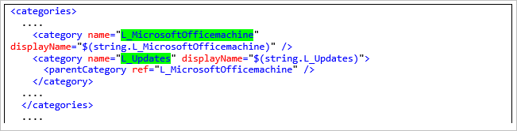

# ADMXIngestion (Windows Configuration Designer reference)

Starting in Windows 10, version 1703, you can import (*ingest*) select Group Policy administrative templates (ADMX files) and configure values for ADMX-backed policies in a provisioning package. To see which types of ADMX-backed policies can be applied, see [Win32 and Desktop Bridge app policy configuration overview](https://docs.microsoft.com/windows/client-management/mdm/win32-and-centennial-app-policy-configuration). 

- The settings under [ConfigADMXInstalledPolicy](#configadmxinstalledpolicy) allow you to set values for policies in the imported ADMX file. 
- The settings under [ConfigOperations](#configoperations) specify the ADMX file to be imported.


>[!IMPORTANT]
>Only per-device policies can be set using a provisioning package.

## Applies to

| Setting groups | Desktop editions | Mobile editions | Surface Hub | HoloLens | IoT Core |
| --- | :---: | :---: | :---: | :---: | :---: |
| [ConfigADMXInstalledPolicy](#configadmxinstalledpolicy)  | X |  |  |  |  |
| [ConfigOperations](#configoperations)  | X |   |  |   |   |

## ConfigADMXInstalledPolicy

>[!IMPORTANT]
>Configure the settings to import the ADMX file in [ConfigOperations](#configoperations) first. 

In **ConfigADMXInstalledPolicy**, you provide a policy setting and value for that policy from the imported ADMX. You will need information from the ADMX that you import in **ConfigOperations** to complete **ConfigADMXInstalledPolicy**.

1. Enter an area name, and then click **Add**. The structure of the area name is the following:

    `AppName (from ConfigOperations)`~`SettingType`~`category name from ADMX`
    
    See [Category and policy in ADMX](#category-and-policy-in-admx) for more information. A setting may have multiple levels of category names, as in the following example. 
    
    Example: `Office16~Policy~L_MicrosoftOfficemachine~L_Updates`
    
2. Select the area name in the Customization pane, enter a policy name from the ADMX, and then click **Add**. For example, `L_HideEnableDisableUpdates`.
3. Select the policy name in the Customization pane, and then enter a value from the ADMX in the text field. For example, `<disabled/>`.

## ConfigOperations

Use **ConfigOperations** to import an ADXM file or policies from an ADMX file.

1. Enter an app name, and then click **Add**. 

    This can be any name you assign, so choose something descriptive to help you identify its purpose. For example, if you are importing ADMX for Office 16, enter an app name of **Office 16**.

2. Select the app name in the Customizations pane, select a setting type, and then click **Add**. 

    The choices, **Policy** and **Preference**, have no impact on the behavior of the settings, and are only provided for your convenience should you want to categorize the settings you add. 
    
3. Select the setting type in the Customizations pane. In the **AdmxFileUid** field, enter the name of the ADMX file or a unique ID for the file, and then click **Add**.

    The **AdmxFileUid** can be any string, but must be unique in the provisioning package. Using the name of the ADMX file will help you identify the file in the future. 

4. Select the AdmxFileUid in the Customizations pane, and paste the contents of the ADMX file in the text field. Before copying the contents of the ADMX file, you must convert it to a single-line. See [Convert multi-line to single line](#convert) for instructions.

    >[!NOTE]
    >When you have a large ADMX file, you may want to only include specific settings. Instead of pasting in the entire ADMX file, you can paste just one or more specific policies (after converting them to single-line).  
    
5. Repeat for each ADMX, or set of ADMX policies, that you want to add, and then configure [ConfigADMXInstalledPolicy](#configadmxinstalledpolicy) for each one.


<span id="convert" />
## Convert multi-line to single line

Use the following PowerShell cmdlet to remove carriage returns and line feeds from a multi-line file to create a single-line file that you can paste in **AdmxFileUid**.

```PS
$path="file path"
(Get-Content $admxFile -Raw).Replace("`r`n","") | Set-Content $path -Force
```

## Category and policy in ADMX

The following images show snippets of the ADMX file for Office 16 that are used in the examples in the procedures above. The first image highlights the category names.



The next image highlights the specific policy.


## Related topics

- [Policy configuration service provider (CSP): ADMX-backed policies](https://msdn.microsoft.com/windows/hardware/commercialize/customize/mdm/policy-admx-backed)
- [Understanding ADMX-backed policies](https://msdn.microsoft.com/windows/hardware/commercialize/customize/mdm/understanding-admx-backed-policies)
