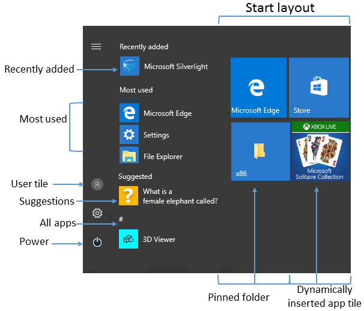

# Manage Windows 10 Start and taskbar layout

**Applies to**

-   Windows 10

> **Looking for consumer information?** See [Customize the Start menu](http://windows.microsoft.com/windows-10/getstarted-see-whats-on-the-menu) 

Organizations might want to deploy a customized Start and taskbar configuration to devices running Windows 10 Pro, Enterprise, or Education. A standard, customized Start layout can be useful on devices that are common to multiple users and devices that are locked down for specialized purposes. Configuring the taskbar allows the organization to pin useful apps for their employees and to remove apps that are pinned by default.

>[!NOTE]
>Taskbar configuration is available starting in Windows 10, version 1607.
>
>Start and taskbar configuration can be applied to devices running Windows 10 Pro, version 1703.
>
>Using the layout modification XML to configure Start is not supported with roaming user profiles. For more information, see [Deploy Roaming User Profiles](https://technet.microsoft.com/library/jj649079.aspx).

## Start options

Some areas of Start can be managed using Group Policy. The layout of Start tiles can be managed using either Group Policy or Mobile Device Management (MDM) policy.

The following table lists the different parts of Start and any applicable policy settings or Settings options. Group Policy settings are in the **User Configuration**\\**Administrative Templates**\\**Start Menu and Taskbar** path except where a different path is listed in the table.

| Start | Policy | Local setting |
| --- | --- | --- |
| User tile | MDM: **Start/HideUserTile** **Start/HideSwitchAccount** **Start/HideSignOut** **Start/HideLock** **Start/HideChangeAccountSettings**  Group Policy: **Remove Logoff on the Start menu** | none  |
| Most used | MDM: **Start/HideFrequentlyUsedApps**  Group Policy: **Remove frequent programs from the Start menu** | **Settings** &gt; **Personalization** &gt; **Start** &gt; **Show most used apps** |
| Suggestions -and- Dynamically inserted app tile | MDM: **Allow Windows Consumer Features**  Group Policy: **Computer Configuration\Administrative Templates\Windows Components\Cloud Content\Turn off Microsoft consumer experiences**  **Note:** This policy also enables or disables notifications for a user's Microsoft account and app tiles from Microsoft dynamically inserted in the default Start menu. | **Settings** &gt; **Personalization** &gt; **Start** &gt; **Occasionally show suggestions in Start** |
| Recently added | MDM: **Start/HideRecentlyAddedApps** | **Settings** &gt; **Personalization** &gt; **Start** &gt; **Show recently added apps** |
| Pinned folders | MDM: **AllowPinnedFolder** | **Settings** &gt; **Personalization** &gt; **Start** &gt; **Choose which folders appear on Start** |
| Power | MDM: **Start/HidePowerButton** **Start/HideHibernate** **Start/HideRestart** **Start/HideShutDown** **Start/HideSleep**  Group Policy: **Remove and prevent access to the Shut Down, Restart, Sleep, and Hibernate commands** | none |
| Start layout | MDM: **Start layout** **ImportEdgeAssets**  Group Policy: **Prevent users from customizing their Start screen**  **Note:** When a full Start screen layout is imported with Group Policy or MDM, the users cannot pin, unpin, or uninstall apps from the Start screen. Users can view and open all apps in the **All Apps** view, but they cannot pin any apps to the Start screen. When a partial Start screen layout is imported, users cannot change the tile groups applied by the partial layout, but can modify other tile groups and create their own.  **Start layout** policy can be used to pin apps to the taskbar based on an XML File that you provide. Users will be able to change the order of pinned apps, unpin apps, and pin additional apps to the taskbar. | none |
| Jump lists | MDM: **Start/HideRecentJumplists**  Group Policy: **Do not keep history of recently opened documents** | **Settings** &gt; **Personalization** &gt; **Start** &gt; **Show recently opened items in Jump Lists on Start or the taskbar** |
| Start size | MDM: **Force Start size**  Group Policy: **Force Start to be either full screen size or menu size** | **Settings** &gt; **Personalization** &gt; **Start** &gt; **Use Start full screen** |
| App list | MDM: **Start/HideAppList** | **Settings** &gt; **Personalization** &gt; **Start** &gt; **Show app list in Start menu** |
| All Settings | Group Policy: **Prevent changes to Taskbar and Start Menu Settings** | none |
| Taskbar | MDM: **Start/NoPinningToTaskbar** | none |

 ## Taskbar options

Starting in Windows 10, version 1607, you can pin additional apps to the taskbar and remove default pinned apps from the taskbar. You can specify different taskbar configurations based on device locale or region.

There are three categories of apps that might be pinned to a taskbar:
* Apps pinned by the user
* Default Windows apps, pinned during operating system installation (Microsoft Edge, File Explorer, Store)
* Apps pinned by the enterprise, such as in an unattended Windows setup

 >[!NOTE]
 >The earlier method of using [TaskbarLinks](https://go.microsoft.com/fwlink/p/?LinkId=761230) in an unattended Windows setup file is deprecated in Windows 10, version 1607.
   
The following example shows how apps will be pinned - Windows default apps to the left (blue circle), apps pinned by the user in the center (orange triangle), and apps that you pin using XML to the right (green square).

>[!NOTE]
>In operating systems configured to use a right-to-left language, the taskbar order will be reversed.

Whether you apply the taskbar configuration to a clean install or an update, users will still be able to:
* Pin additional apps
* Change the order of pinned apps
* Unpin any app

>[!NOTE]
>In Windows 10, version 1703, you can apply an MDM policy, `Start/NoPinningToTaskbar`, to prevents users from pinning and unpinning apps on the taskbar.

### Taskbar configuration applied to clean install of Windows 10

In a clean install, if you apply a taskbar layout, only the apps that you specify and default apps that you do not remove will be pinned to the taskbar. Users can pin additional apps to the taskbar after the layout is applied.

### Taskbar configuration applied to Windows 10 upgrades

When a device is upgraded to Windows 10, apps will be pinned to the taskbar already.  Some apps may have been pinned to the taskbar by a user, and others may have been pinned to the taskbar through a customized base image or by using Windows Unattend setup. 

The new taskbar layout for upgrades to Windows 10, version 1607 or later, will apply the following behavior:
* If the user pinned the app to the taskbar, those pinned apps remain and new apps will be added to the right.
* If the user didn't pin the app (it was pinned during installation or by policy) and the app is not in updated layout file, the app will be unpinned.
* If the user didn't pin the app and the app is in the updated layout file, the app will be pinned to the right.
* New apps specified in updated layout file are pinned to right of user's pinned apps.
  
[Learn how to onfigure Windows 10 taskbar](configure-windows-10-taskbar.md).

## Related topics

- [Configure Windows 10 taskbar](configure-windows-10-taskbar.md)
- [Customize and export Start layout](customize-and-export-start-layout.md)
- [Add image for secondary tiles](start-secondary-tiles.md)
- [Start layout XML for desktop editions of Windows 10 (reference)](start-layout-xml-desktop.md)
- [Customize Windows 10 Start and taskbar with Group Policy](customize-windows-10-start-screens-by-using-group-policy.md)
- [Customize Windows 10 Start and taskbar with provisioning packages](customize-windows-10-start-screens-by-using-provisioning-packages-and-icd.md)
- [Customize Windows 10 Start and tasbkar with mobile device management (MDM)](customize-windows-10-start-screens-by-using-mobile-device-management.md)
- [Changes to Start policies in Windows 10](changes-to-start-policies-in-windows-10.md)

 

