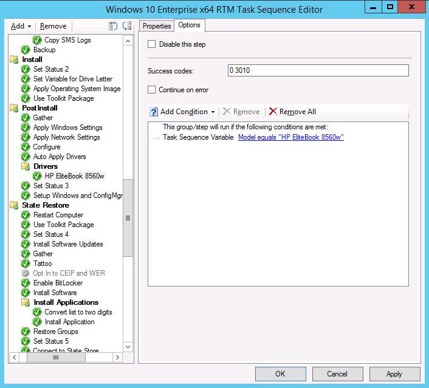

# Create a task sequence with Configuration Manager and MDT

**Applies to**

-   Windows 10

In this topic, you will learn how to create a Microsoft System Center 2012 R2 Configuration Manager task sequence with Microsoft Deployment Toolkit (MDT) integration using the MDT wizard. Creating task sequences in System Center 2012 R2 Configuration Manager requires many more steps than creating task sequences for MDT Lite Touch installation. Luckily, the MDT wizard helps you through the process and also guides you through creating the needed packages.

For the purposes of this topic, we will use two machines: DC01 and CM01. DC01 is a domain controller and CM01 is a machine running Windows Server 2012 R2 Standard, both of which are members of the domain contoso.com for the fictitious Contoso Corporation. For more details on the setup for this topic, please see [Deploy Windows 10 with the Microsoft Deployment Toolkit](deploy-windows-10-with-the-microsoft-deployment-toolkit.md).

## Create a task sequence using the MDT Integration Wizard

This section will walk you through the process of creating a System Center 2012 R2 Configuration Manager task sequence for production use.

1.  On CM01, using the Configuration Manager Console, in the Software Library workspace, expand **Operating Systems**, right-click **Task Sequences**, and select **Create MDT Task Sequence**.

2.  On the **Choose Template** page, select the **Client Task Sequence** template and click **Next**.

3.  On the **General** page, assign the following settings and then click **Next**:

    1.  Task sequence name: Windows 10 Enterprise x64 RTM

    2.  Task sequence comments: Production image with Office 2013

4.  On the **Details** page, assign the following settings and then click **Next**:

    1.  Join a Domain

    2.  Domain: contoso.com

        1.  Account: CONTOSO\\CM\_JD

        2.  Password: Passw0rd!

    3.  Windows Settings

        1.  User name: Contoso

        2.  Organization name: Contoso

        3.  Product key: &lt;blank&gt;

5.  On the **Capture Settings** page, accept the default settings, and click **Next**.

6.  On the **Boot Image** page, browse and select the **Zero Touch WinPE x64** boot image package. Then click **Next**.

7.  On the **MDT Package** page, select **Create a new Microsoft Deployment Toolkit Files package**, and in the **Package source folder to be created (UNC Path):** text box, type **\\\\CM01\\Sources$\\OSD\\MDT\\MDT 2013**. Then click **Next**.

8.  On the **MDT Details** page, assign the name **MDT 2013** and click **Next**.

9.  On the **OS Image** page, browse and select the **Windows 10 Enterprise x64 RTM** package. Then click **Next**.

10. On the **Deployment Method** page, accept the default settings and click **Next**.

11. On the **Client Package** page, browse and select the **OSD / Configuration Manager Client** package. Then click **Next**.

12. On the **USMT Package** page, browse and select **the OSD / Microsoft Corporation User State Migration Tool for Windows 8 10.0.10240.16384** package. Then click **Next**.

13. On the **Settings Package** page, select the **Create a new settings package** option, and in the **Package source folder to be created (UNC Path):** text box, type **\\\\CM01\\Sources$\\OSD\\Settings\\Windows 10 x64 Settings**. Then click **Next**.

14. On the **Settings Details** page, assign the name **Windows 10 x64 Settings** and click **Next**.

15. On the **Sysprep Package** page, click **Next** twice.

16. On the **Confirmation** page, click **Finish**.

## Edit the task sequence

After you create the task sequence, we recommend that you configure the task sequence for an optimal deployment experience. The configurations include enabling support for Unified Extensible Firmware Interface (UEFI), dynamic organizational unit (OU) allocation, computer replace scenarios, and more.

1.  On CM01, using the Configuration Manager Console, select **Task Sequences**, right-click **Windows 10 Enterprise x64 RTM** task sequence, and select **Edit**.

2.  In the **Install** group, select the **Set Variable for Drive Letter** action and configure the following:

    -   OSDPreserveDriveLetter: True

    **Note**  
    If you don't change this value, your Windows installation will end up in E:\\Windows.

     

3.  In the **Post Install** group, select **Apply Network Settings**, and configure the Domain OU value to use the **Contoso / Workstations** OU (browse for values).

4.  In the **Post Install** group, disable the **Auto Apply Drivers** action. (Disabling is done by selecting the action and, in the **Options** tab, selecting the **Disable this step** check box.)

5.  After the disabled **Post Install / Auto Apply Drivers** action, add a new group name: **Drivers**.

6.  After the **Post Install / Drivers** group, add an **Apply Driver Package** action with the following settings:

    1.  Name: HP EliteBook 8560w

    2.  Driver Package: Windows 10 x64 - HP EliteBook 8560w

    3.  Options: Task Sequence Variable: Model equals HP EliteBook 8560w

    **Note**  
    You also can add a Query WMI condition with the following query: SELECT \* FROM Win32\_ComputerSystem WHERE Model LIKE '%HP EliteBook 8560w%'

     

    

    Figure 24. The driver package options.

7.  In the **State Restore / Install Applications** group, select the **Install Application** action.

8.  Select the **Install the following applications** option, and add the OSD / Adobe Reader XI - OSD Install application to the list.

    

    Figure 25. Add an application to the Configuration Manager task sequence.

9.  In the **State Restore** group, after the **Set Status 5** action, add a **Request State Store** action with the following settings:

    1.  Restore state from another computer

    2.  If computer account fails to connect to state store, use the Network Access account

    3.  Options: Continue on error

    4.  Options / Condition:

        1.  Task Sequence Variable

        2.  USMTLOCAL not equals True

10. In the **State Restore** group, after the **Restore User State** action, add a **Release State Store** action with the following settings:

    1.  Options: Continue on error

    2.  Options / Condition:

        1.  Task Sequence Variable

        2.  USMTLOCAL not equals True

11. Click **OK**.

**Note**  
The Request State Store and Release State Store actions need to be added for common computer replace scenarios.

 

## Move the packages

While creating the task sequence with the MDT wizard, a few operating system deployment packages were created. To move these packages to the OSD folder, take the following steps.

1.  On CM01, using the Configuration Manager Console, in the Software Library workspace, expand **Application Management**, and then select **Packages**.

2.  Select the **MDT 2013** and **Windows 10 x64 Settings** packages, right-click and select **Move**.

3.  In the **Move Selected Items** dialog box, select the **OSD** folder, and click **OK**.

## Related topics

[Integrate Configuration Manager with MDT 2013 Update 2](integrate-configuration-manager-with-mdt-2013.md)

[Prepare for Zero Touch Installation of Windows 10 with Configuration Manager](prepare-for-zero-touch-installation-of-windows-10-with-configuration-manager.md)

[Create a custom Windows PE boot image with Configuration Manager](create-a-custom-windows-pe-boot-image-with-configuration-manager.md)

[Add a Windows 10 operating system image using Configuration Manager](add-a-windows-10-operating-system-image-using-configuration-manager.md)

[Create an application to deploy with Windows 10 using Configuration Manager](create-an-application-to-deploy-with-windows-10-using-configuration-manager.md)

[Add drivers to a Windows 10 deployment with Windows PE using Configuration Manager](add-drivers-to-a-windows-10-deployment-with-windows-pe-using-configuration-manager.md)

[Deploy Windows 10 using PXE and Configuration Manager](deploy-windows-10-using-pxe-and-configuration-manager.md)

[Refresh a Windows 7 SP1 client with Windows 10 using Configuration Manager](refresh-a-windows-7-client-with-windows-10-using-configuration-manager.md)

[Replace a Windows 7 SP1 client with Windows 10 using Configuration Manager](replace-a-windows-7-client-with-windows-10-using-configuration-manager.md)

 

 

