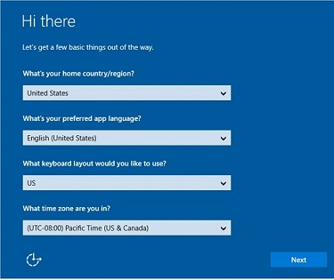
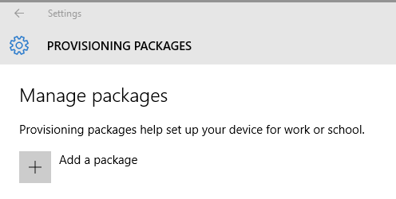

# Provision PCs with apps and certificates for initial deployment

**Applies to**

-   Windows 10

This topic explains how to create and apply a provisioning package that contains apps and certificates to a device running all desktop editions of Windows 10 except Windows 10 Home. Provisioning packages can include management instructions and policies, installation of specific apps, customization of network connections and policies, and more.

You can apply a provisioning package on a USB drive to off-the-shelf devices during setup, making it fast and easy to configure new devices. 

## Advantages
-   You can configure new devices without reimaging.

-   Works on both mobile and desktop devices.

-   No network connectivity required.

-   Simple to apply.

[Learn more about the benefits and uses of provisioning packages.](provisioning-packages.md)

## Create the provisioning package

Use the Windows Imaging and Configuration Designer (ICD) tool included in the Windows Assessment and Deployment Kit (ADK) for Windows 10 to create a provisioning package. [Install the ADK.](https://developer.microsoft.com/en-us/windows/hardware/windows-assessment-deployment-kit)

1. Open Windows ICD (by default, %windir%\Program Files (x86)\Windows Kits\10\Assessment and Deployment Kit\Imaging and Configuration Designer\x86\ICD.exe).

2. Click **Advanced provisioning**.

    
  
3. Name your project and click **Next**.

3. Select **All Windows desktop editions**, click **Next**, and then click **Finish**.  

### Add a desktop app to your package

1. In the **Available customizations** pane, go to **Runtime settings** > **ProvisioningCommands** > **DeviceContext** > **CommandFiles**. 

2. Add all the files required for the app install, including the data files and the installer.

3. Go to **Runtime settings** > **ProvisioningCommands** > **DeviceContext** > **CommandLine** and specify the command line that needs to be executed to install the app. This is a single command line (such as a script, executable, or msi) that triggers a silent install of your CommandFiles. Note that the install must execute silently (without displaying any UI). For MSI installers use, the `msiexec /quiet` option. 

> **Note**: If you are installing more than one app, then use CommandLine to invoke the script or batch file that orchestrates installation of the files. For more information, see [Install a Win32 app using a provisioning package](https://msdn.microsoft.com/en-us/library/windows/hardware/mt703295%28v=vs.85%29.aspx). 

### Add a universal app to your package

Universal apps that you can distribute in the provisioning package can be line-of-business (LOB) apps developed by your organization, Windows Store for Business apps that you acquire with [offline licensing](../manage/acquire-apps-windows-store-for-business.md), or third-party apps. This procedure will assume you are distributing apps from the Windows Store for Business. For other apps, obtain the necessary information (such as the package family name) from the app developer. 

1. In the **Available customizations** pane, go to **Runtime settings** > **UniversalAppInstall**. 

2. For **DeviceContextApp**, specify the **PackageFamilyName** for the app. In Windows Store for Business, the package family name is listed in the **Package details** section of the download page.

    

3. For **ApplicationFile**, click **Browse** to find and select the target app (either an \*.appx or \*.appxbundle).

4. For **DependencyAppxFiles**, click **Browse** to find and add any dependencies for the app. In Windows Store for Business, any dependencies for the app are listed in the **Required frameworks** section of the download page. 

    

5. For **DeviceContextAppLicense**, enter the **LicenseProductID**. In Windows Store for Business, you generate the license for the app on the app's download page.

    

[Learn more about distributing offline apps from the Windows Store for Business.](../manage/distribute-offline-apps.md)

> **Note:** Removing a provisioning package will not remove any apps installed by device context in that provisioning package.

### Add a certificate to your package

1. In the **Available customizations** pane, go to **Runtime settings** > **Certificates** > **ClientCertificates**. 

2. Enter a **CertificateName** and then click **Add**. 

2. Enter the **CertificatePassword**. 

3. For **CertificatePath**, browse and select the certificate to be used. 

4. Set **ExportCertificate** to **False**.

5. For **KeyLocation**, select **Software only**. 

### Add other settings to your package 

For details about the settings you can customize in provisioning packages, see [Windows Provisioning settings reference]( http://go.microsoft.com/fwlink/p/?LinkId=619012).

### Build your package

1. When you are done configuring the provisioning package, on the **File** menu, click **Save**.

2. Read the warning that project files may contain sensitive information, and click **OK**.
> **Important**  When you build a provisioning package, you may include sensitive information in the project files and in the provisioning package (.ppkg) file. Although you have the option to encrypt the .ppkg file, project files are not encrypted. You should store the project files in a secure location and delete the project files when they are no longer needed.

3. On the **Export** menu, click **Provisioning package**.

1. Change **Owner** to **IT Admin**, which will set the precedence of this provisioning package higher than provisioning packages applied to this device from other sources, and then select **Next.**

10. Set a value for **Package Version**.

    **Tip**  
    You can make changes to existing packages and change the version number to update previously applied packages.

11. Optional. In the **Provisioning package security** window, you can choose to encrypt the package and enable package signing.

    -   **Enable package encryption** - If you select this option, an auto-generated password will be shown on the screen.

    -   **Enable package signing** - If you select this option, you must select a valid certificate to use for signing the package. You can specify the certificate by clicking **Select...** and choosing the certificate you want to use to sign the package.

        **Important**  
        We recommend that you include a trusted provisioning certificate in your provisioning package. When the package is applied to a device, the certificate is added to the system store and any package signed with that certificate thereafter can be applied silently. 

12. Click **Next** to specify the output location where you want the provisioning package to go once it's built. By default, Windows ICD uses the project folder as the output location.

Optionally, you can click **Browse** to change the default output location.

13. Click **Next**.

14. Click **Build** to start building the package. The project information is displayed in the build page and the progress bar indicates the build status.

If you need to cancel the build, click **Cancel**. This cancels the current build process, closes the wizard, and takes you back to the **Customizations Page**.

15. If your build fails, an error message will show up that includes a link to the project folder. You can scan the logs to determine what caused the error. Once you fix the issue, try building the package again.

If your build is successful, the name of the provisioning package, output directory, and project directory will be shown.

    -   If you choose, you can build the provisioning package again and pick a different path for the output package. To do this, click **Back** to change the output package name and path, and then click **Next** to start another build.
    
    -   If you are done, click **Finish** to close the wizard and go back to the **Customizations Page**.

16. Select the **output location** link to go to the location of the package. You can provide that .ppkg to others through any of the following methods:

    -   Shared network folder

    -   SharePoint site

    -   Removable media (USB/SD)

    -   Email

    -   USB tether (mobile only)

    -   NFC (mobile only)

## Apply package

**During initial setup, from a USB drive**

1. Start with a computer on the first-run setup screen. If the PC has gone past this screen, reset the PC to start over. To reset the PC, go to **Settings** > **Update & security** > **Recovery** > **Reset this PC**.

    

2. Insert the USB drive and press the Windows key five times. Windows Setup will recognize the drive and ask if you want to set up the device. Select **Set up**.

    

3. The next screen asks you to select a provisioning source. Select **Removable Media** and tap **Next**.

    
    
4. Select the provisioning package (\*.ppkg) that you want to apply, and tap **Next**.

    

5. Select **Yes, add it**.

    
    
6. Read and accept the Microsoft Software License Terms.  

    
    
7. Select **Use Express settings**.

    

8. If the PC doesn't use a volume license, you'll see the **Who owns this PC?** screen. Select **My work or school owns it** and tap **Next**.

    

9. On the **Choose how you'll connect** screen, select **Join Azure AD** or **Join a domain** and tap **Next**.

    

10. Sign in with  your domain, Azure AD,  or Office 365 account and password. When you see the progress ring, you can remove the USB drive.

    
    

**After setup, from a USB drive, network folder, or SharePoint site**

On a desktop computer, navigate to **Settings** &gt; **Accounts** &gt; **Work access** &gt; **Add or remove a management package** &gt; **Add a package**, and select the package to install. 

## Learn more
-   [Build and apply a provisioning package]( http://go.microsoft.com/fwlink/p/?LinkId=629651)

-   Watch the video: [Provisioning Windows 10 Devices with New Tools](http://go.microsoft.com/fwlink/p/?LinkId=615921)

-   Watch the video: [Windows 10 for Mobile Devices: Provisioning Is Not Imaging](http://go.microsoft.com/fwlink/p/?LinkId=615922)
 

