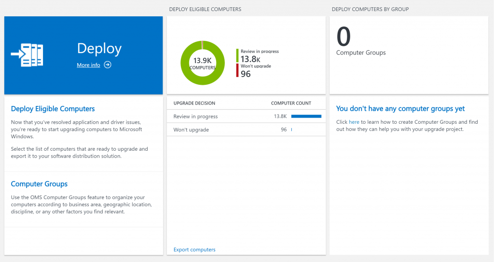
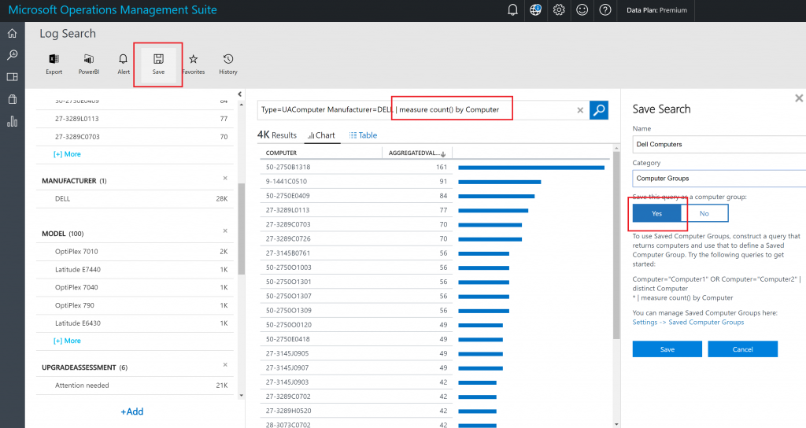

# Additional insights

This topic provides information on additional features that are available in Upgrade Analytics that provide insights for your environment. These include:

- [Site discovery](#site-discovery): An inventory of web sites that are accessed by client computers running Windows 7 or Windows 8.1 using Internet Explorer.
- [Computer groups](#computer-groups): Computer groups is a feature available in OMS and enabled in Upgrade Analytics that enables you to segment client systems in your environment into custom groups.

## Site discovery

This feature of Upgrade Analytics workflow provides an inventory of web sites that are being used by client computers that run Internet Explorer on Windows 8.1 and Windows 7 in your environment. This inventory information is provided as optional data related to upgrading to Windows 10 and Internet Explorer 11, and is meant to help prioritize compatibility testing for web applications. You can make more informed decisions about testing based on usage data. Data from Microsoft Edge is not collected. 

> Note: Site discovery data is disabled by default; you can find documentation on what is collected in the [Windows 7, Windows 8, and Windows 8.1 appraiser telemetry events and fields](https://go.microsoft.com/fwlink/?LinkID=822965). After you turn on this feature, data is collected on all sites visited by Internet Explorer, except during InPrivate sessions. In addition, the data collection process is silent, without notification to the employee. You are responsible for ensuring that your use of this feature complies with all applicable local laws and regulatory requirements, including any requirements to provide notice to employees.

### Install prerequisite security update for Internet Explorer

Ensure the following prerequisites are met before using site discovery:

1. Install the latest [Windows Monthly Rollup](http://catalog.update.microsoft.com/v7/site/Search.aspx?q=security%20monthly%20quality%20rollup). This functionality has been included in Internet Explorer 11 starting with the July 2016 Cumulative Update. 
2. Install the update for customer experience and diagnostic telemetery ([KB3080149](https://support.microsoft.com/kb/3080149)).
3. Enable Internet Explorer data collection, which is disabled by default. The best way to enable it is to modify the [Upgrade Analytics deployment script](upgrade-analytics-get-started.md#run-the-upgrade-analytics-deployment-script) to allow Internet Explorer data collection before you run it. 

    If necessary, you can also enable it by creating the following registry entry. 

    HKLM\Software\Microsoft\Windows\CurrentVersion\Policies\DataCollection 

    Entry name: IEDataOptIn

    Data type: DWORD

    Values:

    > *IEOptInLevel = 0 Internet Explorer data collection is disabled*
    >
    > *IEOptInLevel = 1 Data collection is enabled for sites in the Local intranet + Trusted sites + Machine local zones*
    >
    > *IEOptInLevel = 2 Data collection is enabled for sites in the Internet + Restricted sites zones*
    >
    > *IEOptInLevel = 3 Data collection is enabled for all sites*

    For more information about Internet Explorer Security Zones, see [About URL Security Zones](https://msdn.microsoft.com/library/ms537183.aspx). 

    

### Review most active sites

This blade indicates the most visited sites by computers in your environment. Review this list to determine which web applications and sites are used most frequently. The number of visits is based on the total number of views, and not by the number of unique devices accessing a page.

For each site, the fully qualified domain name will be listed. You can sort the data by domain name or by URL. 

 

Click the name of any site in the list to drill down into more details about the visits, including the time of each visit and the computer name. 


### Review document modes in use 

This blade provides information about which document modes are used in the sites that are visited in your environment. Document modes are used to provide compatibility with older versions of Internet Explorer. Sites that use older technologies may require additional testing and are less likely to be compatible with Microsoft Edge. Counts are based on total page views and not the number of unique devices. For more information about document modes, see [Deprecated document modes](https://technet.microsoft.com/itpro/internet-explorer/ie11-deploy-guide/deprecated-document-modes).


### Run browser-related queries 

You can run predefined queries to capture more info, such as sites that have Enterprise Mode enabled, or the number of unique computers that have visited a site. For example, this query returns the most used ActiveX controls. You can modify and save the predefined queries. 


## Computer groups

We are happy to announce that Computer Groups are now available in Upgrade Analytics. Computer Groups allow you to segment your environment by creating Computer Groups based on OMS Log Search results or by importing Groups from Active Directory, WSUS or System Center Configuration Manager. Computer Groups are an OMS feature, more information is available here. 

In our initial release of the Computer Groups feature for Upgrade Analytics, we recommend you use query based Computer Groups. We are working with the Configuration Manager create a feature in the Configuration Manager Upgrade Analytics Connector that allows you to sync ConfigMgr Collections as Computer Groups into OMS.

### Getting started with Computer Groups

When you log in to OMS, you will see a new Computer Groups blade.



In order to create a Computer Group, head over to Log Search and create a query based on the Type UAComputer, for example:

```
Type=UAComputer Manufacturer=DELL
```


Once you are satisfied with your computer query, add

```
| measure count() by Computer
```

This will ensure every computer only shows up once. Then save your group using the save button.



You will now see your new Computer Group in Upgrade Analytics.


### Using Computer Groups

When you drill into a Computer Group, you will see that we split the Computers by UpgradeDecision. Note that for Computers with the status “Review in Progress” or “Won’t Upgrade” you have an option of drilling into the issues that cause computers to be in that category or show the list of the computers with that UpgradeDecision. For Computers that are “Ready to Upgrade, you can go directly to the list of Computers that are ready.


Drilling into the computers in a certain status is self-explanatory, so let’s look at what happens when you click the details link – on “Review in Progress” in this case:


As you can see, the next step is to select if you want to see Application Issues or Driver issues. Let’s select UAApp:


And there you have it: A list of the apps you still need to review in order to get the your Dell Computers ready to upgrade to Windows 10.

We hope you like Computer Groups in Upgrade Analytics. If you have feedback, please use Windows Feedback Hub, our Category is Windows Installation, Update, and Recovery -> Upgrade Analytics for Enterprise. 

## Related topics

[Upgrade Analytics release notes](upgrade-analytics-requirements#important-information-about-this-release)
