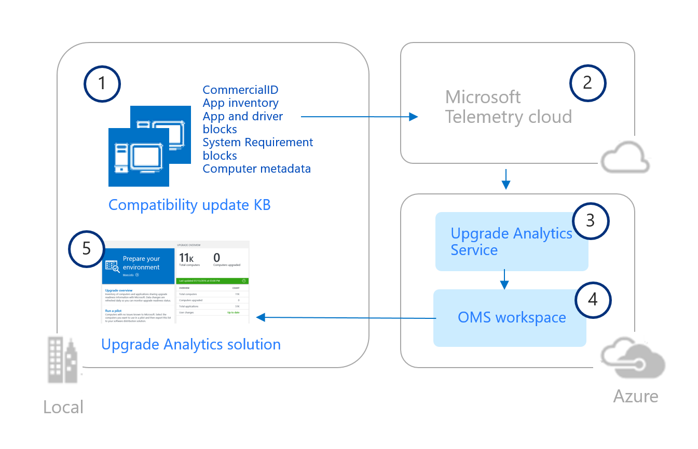

---
title: Upgrade Analytics architecture (Windows 10)
description: Describes Upgrade Analytics architecture.
ms.prod: w10
author: MaggiePucciEvans
---

# Upgrade Analytics architecture

Microsoft analyzes system, application, and driver telemetry data to help you determine when computers are upgrade-ready, allowing you to simplify and accelerate Windows upgrades in your organization. The diagram below illustrates how Upgrade Analytics components work together in a typical installation. 

<!-- PRESERVING ORIGINAL IMAGE CODING JUST IN CASE 

-->

After you enable Windows telemetry on user computers and install the compatibility update KB (1), user computers send computer, application and driver telemetry data to a secure Microsoft data center through the Microsoft Data Management Service (2). After you configure Upgrade Analytics, telemetry data is analyzed by the Upgrade Analytics Service (3) and pushed to your OMS workspace (4). You can then use the Upgrade Analytics solution (5) to plan and manage Windows upgrades.

For more information about what telemetry data Microsoft collects and how that data is used and protected by Microsoft, see:

[Configure Windows telemetry in your organization](https://technet.microsoft.com/itpro/windows/manage/configure-windows-telemetry-in-your-organization)

[Manage connections from Windows operating system components to Microsoft services](https://technet.microsoft.com/itpro/windows/manage/manage-connections-from-windows-operating-system-components-to-microsoft-services)

[Windows 7, Windows 8, and Windows 8.1 appraiser telemetry events and fields](https://go.microsoft.com/fwlink/?LinkID=822965)

##**Related topics**

[Upgrade Analytics requirements](upgrade-analytics-requirements.md)

[Upgrade Analytics release notes](upgrade-analytics-release-notes.md)

[Get started with Upgrade Analytics](upgrade-analytics-get-started.md)
