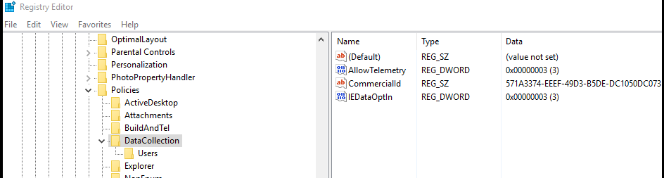
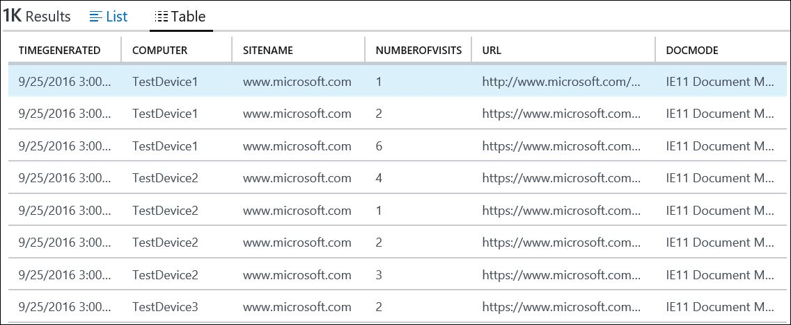

# Review site discovery

This section of the Upgrade Analytics workflow provides an inventory of web sites that are being used by client computers that run Internet Explorer on Windows 8.1 and Windows 7 in your environment. This inventory information is provided as optional data related to upgrading to Windows 10 and Internet Explorer 11, and is meant to help prioritize compatibility testing for web applications. You can make more informed decisions about testing based on usage data. Data from Edge browser is not collected. 

> Note: After you turn on this feature, data is collected on all sites visited by Internet Explorer, except during InPrivate sessions. In addition, the data collection process is silent, without notification to the employee. You are responsible for ensuring that your use of this feature complies with all applicable local laws and regulatory requirements, including any requirements to provide notice to employees.

## Install prerequisite security update for Internet Explorer

Ensure the following prerequisites are met before using site discovery:

1. Install the latest Internet Explorer 11 Cumulative Update. This update provides the capability for site discovery and is available in the [July 2016 cumulative update (KB3170106)](https://support.microsoft.com/kb/3170106) and later.
2. Install the update for customer experience and diagnostic telemetery ([KB3080149](https://support.microsoft.com/kb/3080149)).
3. Enable Internet Explorer data collection, which is disabled by default. The best way to enable it is to modify the [Upgrade Analytics deployment script](upgrade-analytics-get-started.md#run-the-upgrade-analytics-deployment-script) to allow Internet Explorer data collection before you run it. 

    If necessary, you can also enable it by creating the following registry entry. 

    HKLM\Software\Microsoft\Windows\CurrentVersion\Policies\DataCollection 

    Entry name: IEDataOptIn

    Data type: DWORD

    Values:

    > *IEOptInLevel = 0 Internet Explorer data collection is disabled*
    >
    > *IEOptInLevel = 1 Data collection is enabled for sites in the Local intranet + Trusted sites + Machine local zones*
    >
    > *IEOptInLevel = 2 Data collection is enabled for sites in the Internet + Restricted sites zones*
    >
    > *IEOptInLevel = 3 Data collection is enabled for all sites*

    For more information about Internet Explorer Security Zones, see [About URL Security Zones](https://msdn.microsoft.com/library/ms537183.aspx). 

    

## Review most active sites

This blade indicates the most visited sites by computers in your environment. Review this list to determine which web applications and sites are used most frequently. The number of visits is based on the total number of views, and not by the number of unique devices accessing a page.

For each site, the fully qualified domain name will be listed. You can sort the data by domain name or by URL. 

 

Click the name of any site in the list to drill down into more details about the visits, including the time of each visit and the computer name. 

## Review document modes in use 

This blade provides information about which document modes are used in the sites that are visited in your environment. Document modes are used to provide compatibility with older versions of Internet Explorer. Sites that use older technologies may require additional testing and are less likely to be compatible with Microsoft Edge. Counts are based on total page views and not the number of unique devices. For more information about document modes, see [Deprecated document modes](https://technet.microsoft.com/itpro/internet-explorer/ie11-deploy-guide/deprecated-document-modes).

## Run browser-related queries 

You can run predefined queries to capture more info, such as sites that have Enterprise Mode enabled, or the number of unique computers that have visited a site. For example, this query returns the most used ActiveX controls. You can modify and save the predefined queries. 

