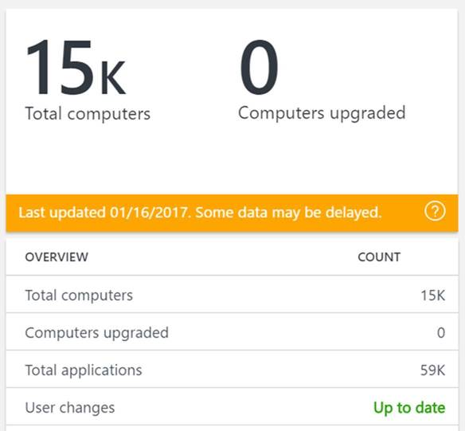

---
title: Upgrade Analytics - Upgrade Overview (Windows 10)
description: Displays the total count of computers sharing data and upgraded.
ms.prod: w10
author: greg-lindsay
---

# Upgrade Analytics - Upgrade overview

The first blade in the Upgrade Analytics solution is the **UPGRADE OVERVIEW** blade. This blade displays the total count of computers sharing data with Microsoft, and the count of computers upgraded. As you successfully upgrade computers, the count of computers upgraded increases.

Check this blade for data refresh status, including the date and time of the most recent data update and whether user changes are reflected. If a user change is pending when changing the upgrade assessment or importance level of an application or driver, **Data refresh pending** is displayed in amber. 

User changes are processed once every 24 hours and display as: **Up to date** in green when there are no pending changes.  A banner color of amber indicates that data processing is delayed. See the following examples:

<!-- PRESERVING ORIGINAL IMAGE CODING JUST IN CASE

-->

<TABLE BORDER=2>
<TH>Case 1: Default view<TH>Case 2: Outside of SLA
<TR><TD>Everything is running as expected.  Data has been refreshed within the past 24 hours.<TD>Data processing is delayed. Data has not been refreshed within the last 24 hours.
<TR><TD><TD>
</TABLE>

If data processing is delayed, you can continue using your workspace as normal. However, any changes or additional information that is added might not be displayed. Data is typically refreshed and the display will return to normal again within 24 hours.

Select **Total computers** for a list of computers and details about them, including:

-   Computer ID and computer name

-   Computer manufacturer

-   Computer model

-   Operating system version and build

-   Count of system requirement, application, and driver issues per computer

-   Upgrade assessment based on analysis of computer telemetry data

-   Upgrade decision status

Select **Total applications** for a list of applications discovered on user computers and details about them, including:

-   Application vendor

-   Application version

-   Count of computers the application is installed on

-   Count of computers that opened the application at least once in the past 30 days

-   Percentage of computers in your total computer inventory that opened the application in the past 30 days

-   Issues detected, if any

-   Upgrade assessment based on analysis of application data
   
-   Roll up level