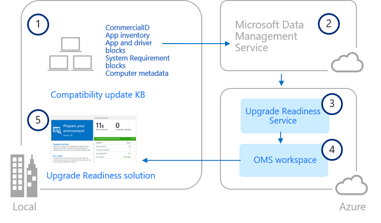

---
title: Upgrade Readiness architecture (Windows 10)
description: Describes Upgrade Readiness architecture.
ms.prod: w10
author: greg-lindsay
---

# Upgrade Readiness architecture

Microsoft analyzes system, application, and driver telemetry data to help you determine when computers are upgrade-ready, allowing you to simplify and accelerate Windows upgrades in your organization. The diagram below illustrates how Upgrade Readiness components work together in a typical installation. 

<!-- PRESERVING ORIGINAL IMAGE CODING JUST IN CASE 

-->

After you enable Windows telemetry on user computers and install the compatibility update KB (1), user computers send computer, application and driver telemetry data to a secure Microsoft data center through the Microsoft Data Management Service (2). After you configure Upgrade Readiness, telemetry data is analyzed by the Upgrade Readiness Service (3) and pushed to your OMS workspace (4). You can then use the Upgrade Readiness solution (5) to plan and manage Windows upgrades.

For more information about what telemetry data Microsoft collects and how that data is used and protected by Microsoft, see:

[Configure Windows telemetry in your organization](https://technet.microsoft.com/itpro/windows/manage/configure-windows-telemetry-in-your-organization) 
[Manage connections from Windows operating system components to Microsoft services](https://technet.microsoft.com/itpro/windows/manage/manage-connections-from-windows-operating-system-components-to-microsoft-services) 
[Windows 7, Windows 8, and Windows 8.1 appraiser telemetry events and fields](https://go.microsoft.com/fwlink/?LinkID=822965) 

##**Related topics**

[Upgrade Readiness requirements](upgrade-readiness-requirements.md) 
[Upgrade Readiness release notes](upgrade-readiness-release-notes.md) 
[Get started with Upgrade Readiness](upgrade-readiness-get-started.md) 
