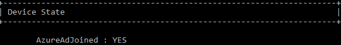

# Upgrade Windows 10 Pro edition to Windows 10 Enterprise E3

**Applies to**
-   Windows 10

## Introducing Windows 10 Enterprise E3

Windows 10 Enterprise E3 is a new offering that delivers exclusive features reserved for Windows Enterprise edition customers on a subscription basis.  This offering is available through the Cloud Solution Provider (CSP) channel via the Partner Center as an online service.

Customer benefits include:

1. Support for enterprise-grade scenarios and compliance that require exclusive Enterprise edition features such as Device Guard, Managed User Experience, etc.
2. Future features reserved for Enterprise edition. 
3. Seamless reboot-less upgrade from Windows 10 Pro to Windows 10 Enterprise.
4. Keyless activation (no KMS server or infrastructure required).

The user-based licensing model of this offering was previously not available to small and medium businesses, and aligns well with other offers in the CSP channel such as O365 and Enterprise Mobility Suite EMS.

CSP partners can upgrade their customers from Windows 10 Pro to Windows 10 Enterprise E3 using a flexible, per-user subscription model designed for small and medium sized organizations (from one to hundreds of users). Windows 10 Enterprise E3 for CSP is managed through the Partner Center portal. 

## Features included in Windows 10 Enterprise E3

Windows 10 Enterprise features include all the capabilities that customers get with Windows 10 Pro, plus premium features designed to provide the mobile productivity, security, manageability, and virtualization needs of today’s organizations.

With Windows 10 Enterprise E3, you can take advantage of the following features not available in Windows 10 Pro:

<table border="1" cellpadding="3">
    <tr>
        <td BGCOLOR="#cacdce">Windows 10 Enterprise feature</td>
        <td BGCOLOR="#cacdce">Description</td>
    </tr>
    <tr>
        <td>[DirectAccess](https://technet.microsoft.com/library/mt421256.aspx)</td>
        <td>DirectAccess is a feature that allows connectivity to organization network resources without the need for traditional Virtual Private Network (VPN) connections.</td>
    </tr>
    <tr>
        <td>[AppLocker](https://technet.microsoft.com/en-us/itpro/windows/keep-secure/applocker-overview)</td>
        <td>AppLocker helps you control which apps and files users can run.</td>
    </tr>
        <tr>
        <td>[Managed user experience](https://www.microsoft.com/en-us/WindowsForBusiness/windows-products?id=tab1)</td>
        <td>With the managed user experience capabilities included in Windows 10 Enterprise, you can create a consistent, predictable experience for users across the organization and configure devices for single-purpose scenarios.</td>
    </tr>
        <tr>
        <td>[Application Virtualization (App-V)](https://technet.microsoft.com/itpro/windows/manage/appv-for-windows)</td>
        <td>Microsoft Application Virtualization (App-V) for Windows 10 enables organizations to deliver Win32 applications to users as virtual applications.</td>
    </tr>
        <tr>
        <td>[User Experience Virtualization (UE-V)](https://technet.microsoft.com/en-us/itpro/windows/manage/uev-for-windows)</td>
        <td>With User Experience Virtualization (UE-V), you can capture user-customized Windows and application settings and store them on a centrally managed network file share.</td>
    </tr>
        <tr>
        <td>[Credential Guard](https://technet.microsoft.com/en-us/itpro/windows/keep-secure/credential-guard)</td>
        <td>Credential Guard uses virtualization-based security to isolate secrets so that only privileged system software can access them.</td>
    </tr>
        <tr>
        <td>[Device Guard](https://technet.microsoft.com/en-us/itpro/windows/keep-secure/device-guard-deployment-guide)</td>
        <td>Device Guard is a combination of enterprise-related hardware and software security features that, when configured together, will lock a device down so that it can only run trusted applications that you define in your code integrity policies.</td>
    </tr>
        <tr>
        <td>[Windows to Go](https://technet.microsoft.com/en-us/itpro/windows/plan/windows-to-go-overview)</td>
        <td>Windows To Go enables the creation of a Windows To Go workspace that can be booted from a USB-connected external drive on PCs, providing support for efficient use of resources for alternative workplace scenarios.</td>
    </tr>
        <tr>
        <td>[BranchCache](https://technet.microsoft.com/library/mt613461.aspx)</td>
        <td>BranchCache is a wide area network (WAN) bandwidth optimization technology.</td>
    </tr>

</table>

See [What’s new in Windows 10](https://technet.microsoft.com/en-us/itpro/windows/whats-new/index) for more information about features included with Windows 10. 

## How to get Windows 10 Enterprise E3

Starting with Windows 10 Anniversary Update, customers who purchased Windows 10 Enterprise E3 as an online service can move from Windows 10 Pro to Windows 10 Enterprise E3 easier than ever before – no keys and no reboots. When you sign in using Azure Active Directory credentials on a device running Windows 10 Pro, the operating system unlocks Windows 10 Enterprise features. When a subscription license expires or is transferred to another user, the Windows 10 Enterprise device seamlessly steps down to Windows 10 Pro.

Currently, this offering is only available through a Microsoft CSP. You cannot purchase Windows 10 Enterprise E3 using other volume licensing programs such as a Microsoft Products and Services Agreement (MPSA) or Enterprise Agreement (EA). 
- If you are a Microsoft partner, sign in to the [Microsoft Partner Center](https://partnercenter.microsoft.com/en-us/partner/home) to learn more.  
- If you are a customer looking to buy Windows 10 Enterprise E3 as an online service for your business, you can search for a Microsoft provider [here](https://pinpoint.microsoft.com/en-US/). 

If you are a Microsoft partner, follow the steps [here](https://msdn.microsoft.com/en-us/library/partnercenter/mt156989.aspx) to create and update customer subscriptions. Depending on your user role, you may not have access to manage customer subscriptions. In this case, clicking on the customer name in the customer list takes you to the customer's services page. For more information on roles, see [Set up your Partner Center account](https://msdn.microsoft.com/en-us/library/partnercenter/mt157015.aspx).

Partners are able to view and assign seats for Windows 10 Enterprise E3 via CSP.  In addition, IT administrators can assign seats using the Office365 IT Admin portal.

## Upgrading to Windows 10 Enterprise E3

In traditional volume licensing programs, customers are provided MAK and/or KMS keys for activation, and the operating system is provided as an ISO file to download and deploy.  With the Windows 10 Enterprise E3 in CSP, there are no keys to assign and manage and no deployment is necessary. Instead, users are assigned in the CSP portal (or using partner Center APIs). 
When an end user that has been assigned an Windows 10 Enterprise E3 subscription signs in to their device using Azure Active Directory credentials, the computer automatically runs Windows 10 Enterpriseunlocks all Enterprise edition features. Note: A single user can run Windows 10 Enterprise E3 on a maximum of five computers.

### License activation

To confirm that upgrade to Windows 10 Enterprise E3 was successful, check the activation status under Settings > Update & security > Activation. See the following example:

When a subscription license expires or is transferred to another user, the Windows 10 Enterprise device seamlessly changes back to Windows 10 Pro after a grace period of 3 months. 

>**Important**: Any features that are only available in the Enterprise edition will continue to be present, but configuration changes and management of these features is disabled when the Enterprise subscription is not valid. 

The Enterprise E3 subscription is tied closely to Windows 10 Pro. The subscription and activation status of a device can be determined by reviewing the status under Settings > Update & security > Activation. The four possible combinations of activation and subscription and the resulting client states are described in the following table:

<table border="0" cellpadding="3">
    <tr>
        <td></td>
        <td BGCOLOR="#cacdce">Pro activation: **Yes**</td>
        <td BGCOLOR="#cacdce">Pro activation: **No**</td>
    </tr>
    <tr>
        <td BGCOLOR="#cacdce">Enterprise E3 subscription: **Active**</td>
        <td style="border-right: 2px solid grey; border-bottom: 2px solid grey">Edition = Windows 10 Enterprise Subscription = active Activation = Windows is activated</td>
        <td style="border-left: 2px solid grey; border-bottom: 2px solid grey">Edition = Windows 10 Enterprise Subscription = active Activation = Windows is not activated</td>
    </tr>
    <tr>
        <td BGCOLOR="#cacdce">Enterprise E3 subscription: **Lapsed**</td>
        <td style="border-right: 2px solid grey">Edition = Windows 10 Pro Subscription = not valid Activation = Windows is activated</td>
        <td style="border-left: 2px solid grey">Edition = Windows 10 Pro Subscription = not valid Activation = Windows is not activated</td>
    </tr>

</table> 

**Note**: If no subscription information is displayed under Settings > Update & security > Activation, then there is no subscription entered for the user, either lapsed or active.

### Requirements

Devices must be running Windows 10 Pro version 1607 and be Azure Active Directory joined or domain joined with Azure AD Connect. Customers who are [federated](https://azure.microsoft.com/en-us/blog/windows-azure-now-supports-federation-with-windows-server-active-directory/) with Azure Active Directory are also eligible.
To determine if a device is Azure Active Directory joined:
1.	Open a command prompt and type dsregcmd /status.
2.	Review the output under Device State. 
3.	If the **AzureAdJoined** status is YES, the device is Azure Active Directory joined. See the following example:

    

To determine the version of Windows 10:
1.	Type winver at a command prompt. 
2.	A popup window will display the Windows 10 version number and detailed OS build information.

If a device is running a previous version of Windows 10 Pro (ex: 1511), it will not be upgraded to Windows 10 Enterprise E3 when a user signs in, even if the user has been assigned a subscription in the CSP portal.

## Related topics

[Connect domain-joined devices to Azure AD for Windows 10 experiences](https://azure.microsoft.com/en-us/documentation/articles/active-directory-azureadjoin-devices-group-policy/)
 [Compare Windows 10 editions](https://www.microsoft.com/en-us/WindowsForBusiness/Compare)
 [Windows for business](https://www.microsoft.com/en-us/windowsforbusiness/default.aspx)
 