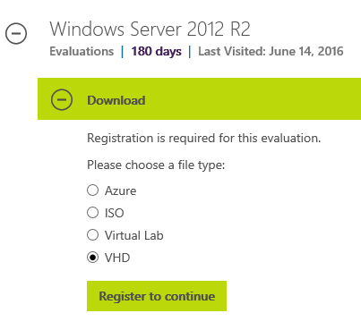

# Step by step guide: Deploy Windows 10 in a test lab

**Applies to**

-   Windows 10

<U>**Are you interested**</U> in upgrading to Windows 10 ...but are not sure how some devices and apps will be affected?<BR>
<U>**Did you know**</U> that you can test drive Windows 10 and check out the upgrade process for free without having to actually upgrade any production devices? 

If you have a computer running Windows 8 or a later OS with 16GB of RAM, you have everything you need to quickly set up a Windows 10 test lab. You can even clone computers from your network and see exactly what happens when they are upgraded to Windows 10. To see how, keep reading.

## In this guide

This guide provides step-by-step instructions for configuring a proof of concept (PoC) environment where you can deploy Windows 10. The PoC enviroment is configured using Hyper-V and a minimum amount of resources. Simple to use Windows PowerShell commands are provided for setting up the test lab.

The following topics and procedures are provided in this guide:

- [Hardware and software requirements](#hardware-and-software-requirements): Prerequisites to complete this guide.<BR>
- [Lab setup](#lab-setup): A description and diagram of the PoC environment that is configured.<BR>
- [Configure the PoC environment](#configure-the-poc-environment): Step by step guidance for the following procedures:
    - [Verify support and install Hyper-V](#verify-support-and-install-hyper-v): Verify that installation of Hyper-V is supported, and install the Hyper-V server role.
    - [Download VHD and ISO files](#download-vhd-and-iso-files): Download evaluation versions of Windows Server 2012 R2 and Windows 10 and prepare these files to be used on the Hyper-V host.
    - [Convert PC to VHD](#convert-pc-to-vhd): Convert a physical computer on your network to a VHDX file and prepare it to be used on the Hyper-V host.
    - [Configure Hyper-V](#configure-hyper-v): Create virtual switches, determine available RAM for virtual machines, and add virtual machines.
    - [Configure VHDs](#configure-vhds): Start virtual machines and configure all services and settings.

The following optional topics are also available:
- [Appendix A: Configuring Hyper-V on Windows Server 2008 R2](#appendix-a-configuring-hyper-v-on-windows-server-2008-r2): Steps to configure a Hyper-V host running Windows Server 2008 R2.
- [Appendix B: Verify the configuration](#verify-the-configuration): Verify and troubleshoot network connectivity and services in the PoC environment.

When you have completed the steps in this guide, see the following guides for step by step instructions to deploy Windows 10 using the PoC environment under common scenarios with current deployment tools:

- [Deploy Windows 10 in a test lab using MDT](windows-10-poc-mdt.md)
- [Deploy Windows 10 in a test lab using System Center](windows-10-poc-sccm.md)

## Hardware and software requirements

One computer that meets the hardware and software specifications below is required to complete the guide; A second computer is recommended to validate the upgrade process. 

The second computer is used to clone and mirror a client computer (computer 2) from your corporate network to the POC environment. Alternatively, you can use an arbitrary VM to represent this computer, therefore this computer is not required to complete the lab.

<table border="1" cellpadding="2">
    <tr>
        <td></td>
        <td BGCOLOR="#a0e4fa">**Computer 1** (required)</td>
        <td BGCOLOR="#a0e4fa">**Computer 2** (recommended)</td>
    </tr>
    <tr>
        <td BGCOLOR="#a0e4fa">Role</td>
        <td>Hyper-V host</td>
        <td>Client computer</td>
    </tr>
    <tr>
        <td BGCOLOR="#a0e4fa">Description</td>
        <td>This computer will run Hyper-V, the Hyper-V management tools, and the Hyper-V Windows PowerShell module.</td>
        <td>This computer is a Windows 7 or Windows 8/8.1 client on your corporate network that will be converted to a VHD for upgrade demonstration purposes.</td>
    </tr>
    <tr>
        <td BGCOLOR="#a0e4fa">OS</td>
        <td>Windows 8/8.1/10 or Windows Server 2012/2012 R2/2016<B>*</B></td>
        <td>Windows 7 or a later</td>
    </tr>
    <tr>
        <td BGCOLOR="#a0e4fa">Edition</td>
        <td>Enterprise, Professional, or Education</td>
        <td>Any</td>
    </tr>
    <tr>
        <td BGCOLOR="#a0e4fa">Architecture</td>
        <td>64-bit</td>
        <td>Any</td>
    </tr>
    <tr>
        <td BGCOLOR="#a0e4fa">RAM</td>
        <td>8 GB RAM (16 GB recommended)</td>
        <td>Any</td>
    </tr>
    <tr>
        <td BGCOLOR="#a0e4fa">Disk</td>
        <td>50 GB available hard disk space (100 GB recommended)</td>
        <td>Any</td>
    </tr>
    <tr>
        <td BGCOLOR="#a0e4fa">CPU</td>
        <td>SLAT-Capable CPU</td>
        <td>Any</td>
    </tr>
    <tr>
        <td BGCOLOR="#a0e4fa">Network</td>
        <td>Internet connection</td>
        <td>Any</td>
    </tr>
</table>

>Retaining applications and settings during the upgrade process requires that architecture (32 or 64-bit) is the same before and after the upgrade.

<B>*</B>The Hyper-V server role can also be installed on a computer running Windows Server 2008 R2. However, the Windows PowerShell module for Hyper-V is not available on Windows Server 2008 R2, therefore you cannot use many of the steps provided in this guide to configure Hyper-V. The performance and features of the Hyper-V role are also much improved on later operating systems. If your host must be running Windows Server 2008 R2, steps to configure Hyper-V using WMI or the Hyper-V manager console are provided separately in [Appendix A: Configuring Hyper-V settings on 2008 R2](#appendix-a-configuring-hyper-v-on-windows-server-2008-r2).

The Hyper-V role cannot be installed on Windows 7 or earlier versions of Windows.

## Lab setup

- The Hyper-V host computer (computer 1) is configured to host four VMs on a private, proof of concept network. 
    - Two VMs are running Windows Server 2012 R2 with required network services and tools installed.
    - Two VMs are client systems: One VM is intended to mirror a host on your corporate network (computer 2) and one VM is running Windows 10 Enterprise to demonstrate the hardware replacement scenario.
- Links are provided to download trial versions of Windows Server 2012, Windows 10 Enterprise, and all deployment tools necessary to complete the lab.

The lab architecture is summarized in the following diagram:


**Note**:
>If you have an existing Hyper-V host, you can use this host if desired and skip the Hyper-V installation section in this guide.

>The two Windows Server VMs can be combined into a single VM to conserve RAM and disk space if required. However, instructions in this guide assume two server systems are used. Using two servers enables Active Directory Domain Services and DHCP to be installed on a server that is not directly connected to the corporate network. This mitigates the risk of clients on the corporate network receiving DHCP leases from the PoC network (i.e. "rogue" DHCP), and limits NETBIOS service broadcasts to the corporate network.

## Configure the PoC environment

### Procedures in this section

[Verify support and install Hyper-V](#verify-support-and-install-hyper-v)<BR>
[Download VHD and ISO files](#download-vhd-and-iso-files)<BR>
[Configure Hyper-V](#configure-hyper-v)<BR>
[Convert PC to VHD](#convert-pc-to-vhd)<BR>
[Configure VHDs](#configure-vhds)<BR>
[Verify the configuration](#verify-the-configuration)

### Verify support and install Hyper-V

1. Verify that the computer supports Hyper-V.

    Starting with Windows 8, the host computer’s microprocessor must support second level address translation (SLAT) to install Hyper-V. See [Hyper-V: List of SLAT-Capable CPUs for Hosts](http://social.technet.microsoft.com/wiki/contents/articles/1401.hyper-v-list-of-slat-capable-cpus-for-hosts.aspx) for more information. To verify your computer supports SLAT, open an administrator command prompt,  type systeminfo, press ENTER, and review the section displayed at the bottom of the output, next to Hyper-V Requirements. 
    
    See the following example:
    
    ```
    C:\>systeminfo
    ...
    Hyper-V Requirements:      VM Monitor Mode Extensions: Yes
                               Virtualization Enabled In Firmware: Yes
                               Second Level Address Translation: Yes
                               Data Execution Prevention Available: Yes
    ```   
    In this example, the computer supports SLAT and Hyper-V. 
    
    If one or more requirements are evaluated as "No" then the computer does not support installing Hyper-V.  However, if only the virtualization setting is incompatible, you might be able to enable virtualization in the BIOS and change the "Virtualization Enabled In Firmware" setting from "No" to "Yes." The location of this setting will depend on the manufacturer and BIOS version, but is typically found associated with the BIOS security settings.

    You can also identify Hyper-V support using [tools](https://blogs.msdn.microsoft.com/taylorb/2008/06/19/hyper-v-will-my-computer-run-hyper-v-detecting-intel-vt-and-amd-v/) provided by the processor manufacturer, the [msinfo32](https://technet.microsoft.com/en-us/library/cc731397.aspx) tool, or you can download the [coreinfo](http://technet.microsoft.com/en-us/sysinternals/cc835722) utility and run it, as shown in the following example:

    ```
    C:\>coreinfo -v

    Coreinfo v3.31 - Dump information on system CPU and memory topology
    Copyright (C) 2008-2014 Mark Russinovich
    Sysinternals - www.sysinternals.com

    Intel(R) Core(TM) i7-2600 CPU @ 3.40GHz
    Intel64 Family 6 Model 42 Stepping 7, GenuineIntel
    Microcode signature: 0000001B
    HYPERVISOR      -       Hypervisor is present
    VMX             *       Supports Intel hardware-assisted virtualization
    EPT             *       Supports Intel extended page tables (SLAT)
    ```   

    Note: A 64-bit operating system is requried to run Hyper-V.

2. Enable Hyper-V.

    The Hyper-V feature is not installed by default. To install it, open an elevated Windows PowerShell window and type the following command:

    ```
    Enable-WindowsOptionalFeature -Online -FeatureName Microsoft-Hyper-V –All
    ```
    When you are prompted to restart the computer, choose Yes. The computer might restart more than once.
    
    You can also install Hyper-V using the Control Panel in Windows under **Turn Windows features on or off** (client OS), or using Server Manager's **Add Roles and Features Wizard** (server OS), as shown below:
    
    

    

### Download VHD and ISO files

1. Create a directory on your Hyper-V host named C:\VHD and download a single [Windows Server 2012 R2 VHD](https://www.microsoft.com/en-us/evalcenter/evaluate-windows-server-2012-r2) from the TechNet Evaluation Center to the C:\VHD directory. 

    **Important**: This guide assumes that VHDs are stored in the **C:\VHD** directory on the Hyper-V host. If you use a different directory to store VHDs, you must adjust steps in this guide appropriately.

    After completing registration you will be able to download the 7.47 GB Windows Server 2012 R2 evaluation VHD.

    

2. Rename the VHD file that you downloaded to **2012R2-poc-1.vhd**. This is not required, but is done to make the filename simpler to recognize.
3. Copy the VHD to a second file also in the C:\VHD directory and name this VHD **2012R2-poc-2.vhd**.
4. Download the [Windows 10 Enterprise ISO](https://www.microsoft.com/en-us/evalcenter/evaluate-windows-10-enterprise) from the TechNet Evaluation Center to the C:\VHD directory on your Hyper-V host. During registration, you must specify the type, version, and language of installation media to download. 
5. Rename the ISO file that you downloaded to **w10-enterprise.iso**. Again, this is done so that the filename is simpler to type and recognize.

    In this example, a Windows 10 Enterprise, 64 bit, English VHD is chosen. You can choose a different version if desired. Note that Windows 10 in-place upgrade is only possible if the source operating system and installation media are both 32-bit or both 64-bit, so you should download the file version that corresponds to the version of your source computer for upgrade testing. After completing registration you will be able to download the 3.63 GB Windows 10 Enterprise evaluation ISO. The following commands and output display the procedures described in this section:

    ```
    C:\>mkdir VHD

    C:\>cd VHD

    C:\VHD>ren 9600*.vhd 2012R2-poc-1.vhd

    C:\VHD>copy 2012R2-poc-1.vhd 2012R2-poc-2.vhd
            1 file(s) copied.

    C:\VHD ren *.iso w10-enterprise.iso
    C:\VHD>dir /B
    2012R2-poc-1.vhd
    2012R2-poc-2.vhd
    w10-enterprise.iso
    ```

### Convert PC to VHD

**Important**:Before you convert a PC to VHD, verify that you have access to a local administrator account on the computer. Alternatively you can use a domain account with administrative rights if these credentials are cached on the computer and your domain policy allows the use of cached credentials for login.

1. Download the [Disk2vhd utility](https://technet.microsoft.com/en-us/library/ee656415.aspx), extract the .zip file and copy disk2vhd.exe to a flash drive or other location that is accessible from the computer you wish to convert.
    >Note: You might experience timeouts if you attempt to run Disk2vhd from a network share, or specify a network share for the destination. To avoid timeouts, use local, portable media.
2. On the computer you wish to convert, double-click the disk2vhd utility to start the graphical user interface. 
3. Select checkboxes next to the volumes you wish to copy and specify a location to save the resulting VHD or VHDX file. If your Hyper-V host is running Windows Server 2008 R2 you must choose VHD, otherwise choose VHDX.
4. Click **Create** to start creating a VHDX file. See the following example: 

    

    In this example, the source computer has two hard drives, C: and E: and a system reserved partition. The VHDX file (w7.vhdx) is being saved to a flash drive (F:) in the F:\VHD directory.<BR> 
    >Disk2vhd can also save VHDs to local hard drives, even if they are the same as the volumes being converted. Performance is better however when the VHD is saved on a disk different than those being converted. 

    >If you have experience with Microsoft Virtual Machine Converter and prefer to use this tool instead of Disk2vhd, see [Appendix B: Microsoft Virtual Machine Converter](#appendix-b-microsoft-virtual-machine-converter).

5. When the Disk2vhd utility has completed converting the source computer to a VHD, copy the VHDX file (w7.vhdx) to your Hyper-V host in the C:\VHD directory. There should now be four files in this directory:

    ```
    C:\vhd>dir /B
    2012R2-poc-1.vhd
    2012R2-poc-2.vhd
    w10-enterprise.iso
    w7.VHDX
    ```

### Configure Hyper-V

Note: The Hyper-V Windows PowerShell module is not available on Windows Server 2008 R2. For more information, see [Appendix A: Configuring Hyper-V settings on 2008 R2](#appendix-a-configuring-hyper-v-on-windows-server-2008-r2).  

1. Open an elevated Windows PowerShell window and type the following command to create two virtual switches named "poc-internal" and "poc-external":

    ```
    New-VMSwitch -Name poc-internal -SwitchType Internal -Notes "PoC Network"
    New-VMSwitch -Name poc-external -NetAdapterName (Get-NetAdapter |?{$_.Status -eq "Up" -and $_.NdisPhysicalMedium -eq 14}).Name -Notes "PoC External"
    ```
    >Since an external virtual switch is associated to a physical NIC on the Hyper-V host, this NIC must be specified when adding the virtual switch. In the previous step, we attempt to automate this by filtering for active ethernet adapters. If your Hyper-V host is has multiple active ethernet adapters, this automation will not work and the second command above will fail. In this case, you will need to edit the command used to add the "poc-external" VM switch by inserting the specific value needed for the -NetAdapterName option (the name of the network interface you wish to use).

2. At the elevated Windows PowerShell prompt, type the following command to determine the megabytes of RAM that are currently available on the Hyper-V host:

    ```
    (Get-Counter -Counter @("\Memory\Available MBytes")).countersamples.cookedvalue
    ```
    >On a Hyper-V host computer with 16 GB of RAM installed, 12,000 MB of RAM or greater should be available if the computer is not also running other applications. If the computer has less than 12,000 MB of available RAM, try closing applications to free up more memory.

3. Determine the available memory for VMs by dividing the available RAM by 4.  For example:

    ```
    (Get-Counter -Counter @("\Memory\Available MBytes")).countersamples.cookedvalue/4
    2775.5
    ```
    In this example, VMs must use a maximum of 2700 MB of RAM so that you can run four VMs simultaneously. 

4. At the elevated Windows PowerShell prompt, type the following command to create three new VMs. The fourth VM will be added later. 
    >**Important**: Replace the value of 2700MB in the first command below with the RAM value that you calculated in the previous step:

    ```
    $maxRAM = 2700MB
    New-VM –Name "DC1" –VHDPath c:\vhd\2012R2-poc-1.vhd -SwitchName poc-internal
    Set-VMMemory -VMName "DC1" -DynamicMemoryEnabled $true -MinimumBytes 512MB -MaximumBytes $maxRAM -Buffer 20
    New-VM –Name "SRV1" –VHDPath c:\vhd\2012R2-poc-2.vhd -SwitchName poc-internal
    Add-VMNetworkAdapter -VMName "SRV1" -SwitchName "poc-external"
    Set-VMMemory -VMName "SRV1" -DynamicMemoryEnabled $true -MinimumBytes 512MB -MaximumBytes $maxRAM -Buffer 20
    New-VM –Name "PC1" –VHDPath c:\vhd\w7.vhdx -SwitchName poc-internal
    Set-VMMemory -VMName "PC1" -DynamicMemoryEnabled $true -MinimumBytes 512MB -MaximumBytes $maxRAM -Buffer 20
    ```
### Configure Windows Server 2012 R2 VHDs

1. Open an elevated Windows PowerShell window on the Hyper-V host and start the first VM by typing the following command:

    ```
    Start-VM DC1
    ```
2. Wait for the VM to complete starting up, and then connect to it either using the Hyper-V Manager console (virtmgmt.msc) or using an elevated command prompt on the Hyper-V host:
    ```
    vmconnect localhost DC1
    ```
3. Accept the default settings, read license terms and accept them, provide an administrator password of **pass@word1**, and click **Finish**. 
4. If DC1 is configured as described in this guide, it will currently be assigned an APIPA address, have a randomly generated hostname, and a single network adapter named "Ethernet." At an elevated Windows PowerShell prompt on DC1, type the following commands to provide a new hostname and configure a static IP address and gateway:

    ```
    Rename-Computer DC1
    New-NetIPAddress –InterfaceAlias Ethernet –IPAddress 192.168.0.1 –PrefixLength 24 -DefaultGateway 192.168.0.2
    Set-DnsClientServerAddress -InterfaceAlias Ethernet -ServerAddresses 192.168.0.1,192.168.0.2
    ```
    >The default gateway will be added to a member server at 192.168.0.2 later in this guide.
5. Install the Active Directory Domain Services role by typing the following command at an elevated Windows PowerShell prompt:

    ```
    Install-WindowsFeature -Name AD-Domain-Services -IncludeAllSubFeature -IncludeManagementTools
    ```

6. Before promoting DC1 to a Domain Controller, you must reboot so that the name change in step 3 above takes effect:

    ```
    Restart-Computer
    ```

7. When DC1 has rebooted, sign in again and open an elevated Windows PowerShell prompt. Now you can promote the server to be a domain controller. The directory services restore mode password must be entered as a secure string:

    ```
    $pass = "pass@word1" | ConvertTo-SecureString -AsPlainText -Force
    Install-ADDSForest -DomainName contoso.com -InstallDns -SafeModeAdministratorPassword $pass -Force
    ```
    Ignore any warnings that are displayed. The computer will automatically reboot upon completion.
8. When the reboot has completed, sign in using the CONTOSO\Administrator account, open an elevated Windows PowerShell prompt, and use the following commands to add a reverse lookup zone for the PoC network, add the DHCP Server role, authorize DHCP in Active Directory, and supress the post-DHCP-install alert:

    ```
    Add-DnsServerPrimaryZone -NetworkID "192.168.0.0/24" -ReplicationScope Forest
    Add-WindowsFeature -Name DHCP -IncludeManagementTools
    netsh dhcp add securitygroups
    Restart-Service DHCPServer
    Add-DhcpServerInDC  dc1.contoso.com  192.168.0.1
    Set-ItemProperty –Path registry::HKEY_LOCAL_MACHINE\SOFTWARE\Microsoft\ServerManager\Roles\12 –Name ConfigurationState –Value 2
    ```
9. Next, add a DHCP scope and set option values:
    ```
    Add-DhcpServerv4Scope -Name "PoC Scope" -StartRange 192.168.0.100 -EndRange 192.168.0.199 -SubnetMask 255.255.255.0 -Description "Windows 10 PoC" -State Active
    Set-DhcpServerv4OptionValue -ScopeId 192.168.0.0 -DnsDomain contoso.com -Router 192.168.0.2 -DnsServer 192.168.0.1,192.168.0.2 -Force
    ```
    >The -Force option is necessary when adding scope options to skip validation of 192.168.0.2 as a DNS server because we have not configured it yet. The scope should immediately begin issuing leases on the PoC network. The first DHCP lease that will be issued is to vEthernet interface on the Hyper-V host, which is a member of the internal network.
10. Lastly, add a user account to the contoso.com domain that can be used with client computers:
    ```
    New-ADUser -Name "User1" -UserPrincipalName user1 -AccountPassword (ConvertTo-SecureString "pass@word1" -AsPlainText -Force) -ChangePasswordAtLogon $false -Enabled $true
    ```
11. Minimize the DC1 VM window but **do not stop** the VM.

    Next, the client VM will be started and joined to the contoso.com domain. This is done before adding a gateway to the PoC network so that there is no danger of duplicate DNS registrations for the physical client and its cloned VM in the corporate domain.

12. Using an elevated Windows PowerShell prompt on the Hyper-V host, start the client VM (PC1), and connect to it:
    ```
    Start-VM PC1
    vmconnect localhost PC1
    ```
13. Sign on to PC1 using an account that has local administrator rights.<BR> 
    >PC1 will be disconnected from its current domain, so you cannot use a domain account to sign on unless these credentials are cached and the use of cached credentials is permitted by Group Policy. If cached credentials are available and permitted, you can use these credentials to sign in.
14. After signing in, the operating system detects that it is running in a new environment. New drivers will be automatically installed, including the network adapter driver. The network adapter driver must be updated before you can proceed, so that you will be able to join the contoso.com domain. Depending on the resources allocated to PC1, installing the network adapter driver might take a few minutes.

    

    >If the client was configured with a static address, you must change this to a dynamic one so that it can obtain a DHCP lease. 

15. When the new network adapter driver has completed installation, you will receive an alert to set a network location for the contoso.com network. Select **Work network** and then click **Close**. When you receive an alert that a restart is required, click **Restart Later**.
16. Open an elevated Windows PowerShell prompt on PC1 and verify that the client VM has received a DHCP lease and can communicate with the consoto.com domain controller.
    
    ```
    ipconfig

    Windows IP Configuration

    Ethernet adapter Local Area Connection 3:
        Connection-specific DNS Suffix  . : contoso.com
        Link-local IPv6 Address . . . . . : fe80::64c2:4d2a:7403:6e02%18
        Ipv4 Address. . . . . . . . . . . : 192.168.0.101
        Subnet Mask . . . . . . . . . . . : 255.255.255.0
        Default Gateway . . . . . . . . . : 192.168.0.2

    ping dc1.contoso.com

    Pingng dc1.contoso.com [192.168.0.1] with 32 bytes of data:
    Reply from 192.168.0.1: bytes=32 time<1ms TTL=128
    Reply from 192.168.0.1: bytes=32 time<1ms TTL=128
    Reply from 192.168.0.1: bytes=32 time<1ms TTL=128
    Reply from 192.168.0.1: bytes=32 time<1ms TTL=128

    nltest /dsgetdc:contoso
               DC: \\DC1
          Address: \\192.168.0.1
         Dom Guid: fdbd0643-d664-411b-aea0-fe343d7670a8
         Dom Name: CONTOSO
      Forest Name: contoso.com
     Dc Site Name: Default-First-Site-Name
    Our Site Name: Default-First-Site-Name
            Flags: PDC GC DS LDAP KDC TIMESERV WRITABLE DNS_FOREST CLOSE_SITE FULL_SECRET WS 0xC000
    ```
17. From an elevated Windows PowerShell prompt, type the following commands to forcibly remove the computer from its previous domain, join the contoso.com domain, and then restart the computer:
    ```
    (Get-WmiObject Win32_ComputerSystem).UnjoinDomainOrWorkgroup($null,$null,0)
    $pass = "pass@word1" | ConvertTo-SecureString -AsPlainText -Force
    $user = "contoso\administrator"
    $cred = New-Object System.Management.Automation.PSCredential($user,$pass)
    Add-Computer -DomainName contoso -Credential $cred
    Restart-Computer
    ```
    >PC1 is removed from its domain in this step while not connected to the corporate network so as to ensure the computer object in the corporate domain is unaffected. We have not also renamed PC1 to "PC1" here so that it maintains some of its mirrored identity. However, if desired you can also rename the computer.

18. After PC1 restarts, sign in to the contoso.com domain with the (user1) account you created in step 8.
19. Minimize the PC1 window but do not turn it off while the second Windows Server 2012 R2 VM (SRV1) is configured. This ensures that the Hyper-V host has enough resources to run all VMs simultaneously. Next, SRV1 will be started, joined to the contoso.com domain, and configured with RRAS and DNS services. 
20. On the Hyper-V host computer at an elevated Windows PowerShell prompt, type the following commands:
    ```
    Start-VM SRV1
    vmconnect localhost SRV1
    ```
21. Accept the default settings, read license terms and accept them, provide an administrator password of **pass@word1**, and click **Finish**. When you are prompted about finding PCs, devices, and content on the network, click **Yes**.
22. Sign in to the member server VM using the administrator account, open an elevated Windows PowerShell prompt, and type the following commands:
    ```
    Rename-Computer SRV1
    New-NetIPAddress –InterfaceAlias Ethernet –IPAddress 192.168.0.2 –PrefixLength 24
    Set-DnsClientServerAddress -InterfaceAlias Ethernet -ServerAddresses 192.168.0.1,192.168.0.2
    $pass = "pass@word1" | ConvertTo-SecureString -AsPlainText -Force
    $user = "contoso\administrator"
    $cred = New-Object System.Management.Automation.PSCredential($user,$pass)
    Add-Computer -DomainName contoso -Credential $cred
    Restart-Computer
    ```
23. Sign in to the contoso.com domain on SRV1 using the domain administrator account, open an elevated Windows PowerShell prompt, and type the following commands:
    ```
    Install-WindowsFeature -Name DNS -IncludeManagementTools
    Install-WindowsFeature -Name Routing -IncludeManagementTools
    Install-RemoteAccess -VpnType Vpn
    cmd /c netsh routing ip nat install
    cmd /c netsh routing ip nat add interface name="Ethernet 2" mode=FULL 
    cmd /c netsh routing ip nat add interface name="Ethernet" mode=PRIVATE
    cmd /c netsh routing ip nat add interface name="Internal" mode=PRIVATE
    ```
    >The previous commands assume that network interfaces were added to the SRV1 VM in the order specified by this guide, resulting in an interface alias of "Ethernet" for the private interface and an interface alias of "Ethernet 2" for the public interface. If the interfaces on SRV1 are not named the same, you must adjust these commands appropriately.

    To view a list of interfaces and their associated interface aliases on the VM, you use the Get-NetAdapter cmdlet. See the following example:

    ```
    Get-NetAdapter

    Name                      InterfaceDescription                    ifIndex Status       MacAddress             LinkSpeed
    ----                      --------------------                    ------- ------       ----------             ---------
    Ethernet 2                Microsoft Hyper-V Network Adapter #2         14 Up           00-15-5D-83-26-06         1 Gbps
    Ethernet                  Microsoft Hyper-V Network Adapter            12 Up           00-15-5D-83-26-05        10 Gbps
    ``` 
24. The DNS server role was installed on SRV1 so that we can forward DNS queries from DC1 to SRV1 to resolve Internet names without having to configure a forwarder outside the PoC network.  The last step to configure network services on the PoC network is to add this DNS forwarder. To add a server-level DNS forwarder on DC1, type the following command at an elevated command prompt on DC1:
    ```
    Add-DnsServerForwarder -IPAddress 192.168.0.2
    ```
25. If your corporate network has a firewall that filters recursive DNS queries, you might be forced to configure a DNS forwarder outside the PoC network in order to resolve Internet names. To do this, open an elevated Windows PowerShell prompt on SRV1 and type the following commands:
    ```
    Add-DnsServerForwarder -IPAddress (Get-DnsClientServerAddress -InterfaceAlias "Ethernet 2").ServerAddresses
    ```   
26. Verify that all three VMs on the PoC network can reach the Internet.
27. Because the client computer has different hardware after coping it to a VM, its Windows activation will be invalidated and you might receive a message that you must activate Windows in 3 days.  To extend this period to 30 days, type the following commands at an elevated Windows PowerShell prompt on PC1:
    ```
    slmgr -rearm
    Restart-Computer
    ```


## Appendix A: Configuring Hyper-V on Windows Server 2008 R2

If your Hyper-V host is running Windows Server 2008 R2, you can use the Hyper-V manager interface to configure Hyper-V, or you can use Hyper-V WMI. Some instructions to configure Hyper-V using WMI are also included in this section for convenience. 

For more information about the Hyper-V Manager interface in Windows Server 2008 R2, see [Hyper-V](https://technet.microsoft.com/library/cc730764.aspx) in the Windows Server TechNet Library.

To install Hyper-V on Windows Server 2008 R2, use the Add-WindowsFeature cmdlet:

```
Add-WindowsFeature -Name Hyper-V
```
Use the following Windows PowerShell commands to create a virtual switch on Windows Server 2008 R2:

```
$SwitchFriendlyName = "poc-internal"
$InternalEthernetPortFriendlyName = $SwitchFriendlyName
$InternalSwitchPortFriendlyName = "poc"
$SwitchName = [guid]::NewGuid().ToString()
$InternalSwitchPortName = [guid]::NewGuid().ToString()
$InternalEthernetPortName = [guid]::NewGuid().ToString()
$NumLearnableAddresses = 1024
$ScopeOfResidence = ""
$VirtualSwitchManagementService = gwmi Msvm_VirtualSwitchManagementService -namespace "root\virtualization"
$Result = $VirtualSwitchManagementService.CreateSwitch($SwitchName, $SwitchFriendlyName, $NumLearnableAddresses, $ScopeOfResidence) 
$Switch = [WMI]$Result.CreatedVirtualSwitch 
$Result = $VirtualSwitchManagementService.CreateSwitchPort($Switch, $InternalSwitchPortName, $InternalSwitchPortFriendlyName, $ScopeOfResidence)
$InternalSwitchPort = [WMI]$Result.CreatedSwitchPort 
$Result = $VirtualSwitchManagementService.CreateInternalEthernetPortDynamicMac($InternalEthernetPortName, $InternalEthernetPortFriendlyName)
$InternalEthernetPort = [WMI]$Result.CreatedInternalEthernetPort
$query = "Associators of {$InternalEthernetPort} Where ResultClass=CIM_LanEndpoint"
$InternalLanEndPoint = gwmi -namespace root\virtualization -query $query
$Result = $VirtualSwitchManagementService.ConnectSwitchPort($InternalSwitchPort, $InternalLanEndPoint)
$filter = "SettingID='" + $InternalEthernetPort.DeviceID +"'"
$NetworkAdapterConfiguration = gwmi Win32_NetworkAdapterConfiguration -filter $filter
```

Use the following Windows PowerShell commands to add VMs on Windows Server 2008 R2:

```
command here
```
## Appendix B: Verify the configuration

Use the following procedures to verify that the PoC environment is configured properly and working as expected.

1. On DC1, open an elevated Windows PowerShell prompt and type the following commands:

    ```
    Get-Service NTDS,DNS,DHCP
    DCDiag -a
    Get-DnsServerResourceRecord -ZoneName contoso.com -RRType A
    Get-DnsServerForwarder
    Resolve-DnsName -Server dc1.contoso.com -Name www.microsoft.com
    Get-DhcpServerInDC
    Get-DhcpServerv4Statistics
    ipconfig /all
    ```
    **Get-Service** displays a status of "Running" for all three services.<BR>
    **DCDiag** displays "passed test" for all tests.<BR>
    **Get-DnsServerResourceRecord** displays the correct DNS address records for DC1, SRV1, and the computername of PC1. Additional address records for the zone apex (@), DomainDnsZones, and ForestDnsZones will also be registered.<BR>
    **Get-DnsServerForwarder** displays a single forwarder of 192.168.0.2.<BR>
    **Resolve-DnsName** displays public IP address results for www.microsoft.com.<BR>
    **Get-DhcpServerInDC** displays 192.168.0.1, dc1.contoso.com.<BR>
    **Get-DhcpServerv4Statistics** displays 1 scope with 2 addresses in use (these belong to PC1 and the Hyper-V host).<BR>
    **ipconfig** displays a primary DNS suffix and suffix search list of contoso.com, IP address of 192.168.0.1, subnet mask of 255.255.255.0, default gateway of 192.168.0.2, and DNS server addresses of 192.168.0.1 and 192.168.0.2. 

2. On SRV1, open an elevated Windows PowerShell prompt and type the following commands:

    ```
    Get-Service DNS,RemoteAccess
    Get-DnsServerForwarder
    Resolve-DnsName -Server dc1.contoso.com -Name www.microsoft.com
    ipconfig /all
    netsh int ipv4 show address
    ```
    **Get-Service** displays a status of "Running" for both services.<BR>
    **Get-DnsServerForwarder** either displays no forwarders, or displays a list of forwarders you are required to use so that SRV1 can resolve Internet names.<BR>
    **Resolve-DnsName** displays public IP address results for www.microsoft.com.<BR>
    **ipconfig** displays a primary DNS suffix of contoso.com. The suffix search list contains contoso.com and your corporate domain. Two ethernet adapters are shown: Ethernet adapter "Ethernet" has an IP addresses of 192.168.0.2, subnet mask of 255.255.255.0, no default gateway, and DNS server addresses of 192.168.0.1 and 192.168.0.2. Ethernet adapter "Ethernet 2" has an IP address, subnet mask, and default gateway configured by DHCP on your corporate network.
    **netsh** displays three interfaces on the computer: interface "Ethernet 2" with DHCP enabled = Yes and IP address assigned by your corporate network, interface "Ethernet" with DHCP enabled = No and IP address of 192.168.0.2, and interface "Loopback Pseudo-Interface 1" with IP address of 127.0.0.1.

3. On PC1, open an elevated Windows PowerShell prompt and type the following commands:

    ```
    whoami
    hostname
    nslookup www.microsoft.com
    ping -n 1 dc1.contoso.com

    ```
## Related Topics

[Windows 10 deployment scenarios](windows-10-deployment-scenarios.md)
 

 


