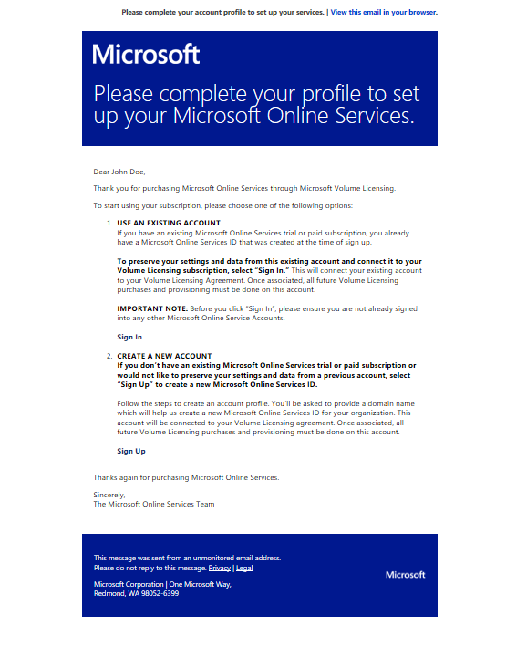
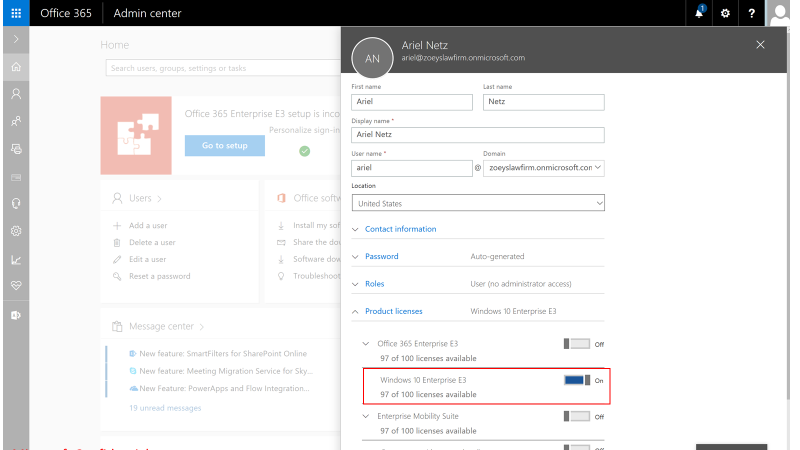
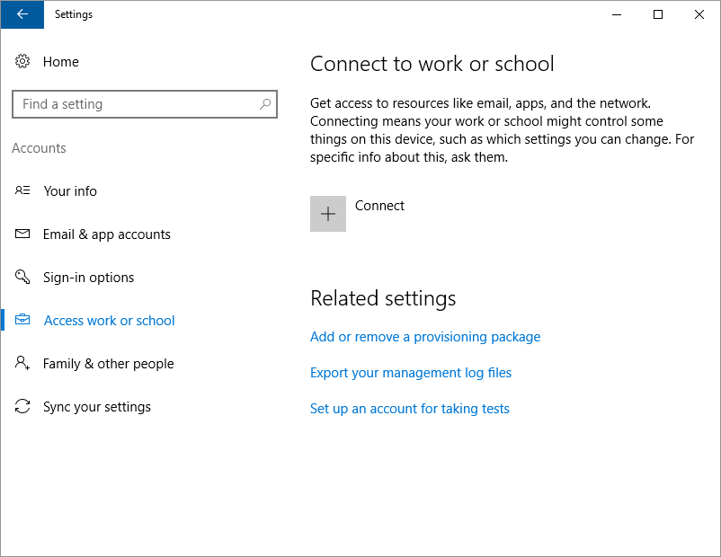
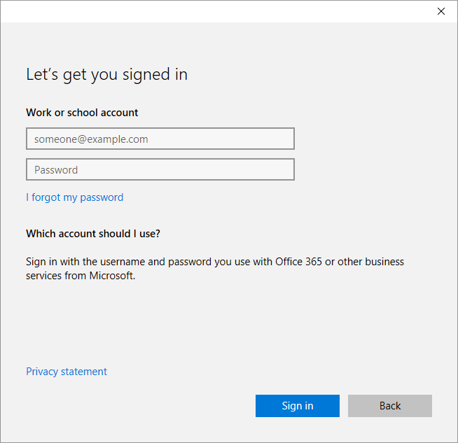
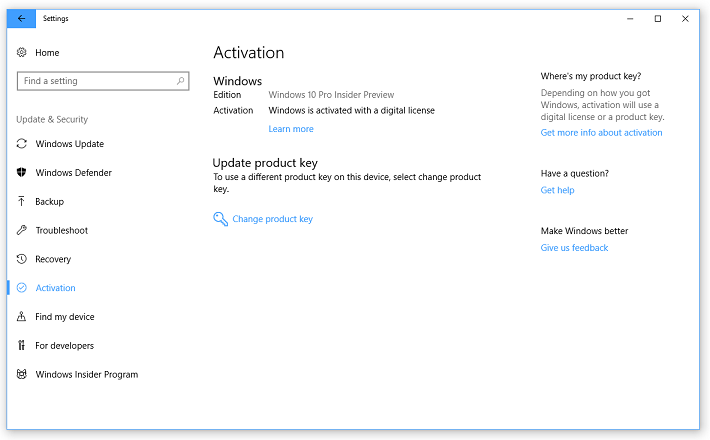

# Deploy Windows 10 Enterprise licenses

This topic describes how to deploy Windows 10 Enterprise E3 or E5 licenses with [Windows 10 Enterprise Subscription Activation](windows-10-subscription-activation.md) or [Windows 10 Enterprise E3 in CSP](windows-10-enterprise-e3-overview.md) and Azure Active Directory (Azure AD).

>[!NOTE]
>* Windows 10 Enterprise Subscription Activation (EA or MPSA) requires Windows 10 Pro, version 1703 or later.
>* Windows 10 Enterprise E3 in CSP requires Windows 10 Pro, version 1607 or later.
>* Automatic, non-KMS activation requires Windows 10, version 1803 or later, on a device with a firmware-embedded activation key.

## Firmware-embedded activation key

To determine if the computer has a firmware-embedded activation key, type the following command at an elevated Windows PowerShell prompt

```
(Get-WmiObject -query ‘select * from SoftwareLicensingService’).OA3xOriginalProductKey
```

If the device has a firmware-embedded activation key, it will be displayed in the output. If the output is blank, the device does not have a firmware embedded activation key. Most OEM-provided devices designed to run Windows 8 or later will have a firmware-embedded key.

## Enabling Subscription Activation with an existing EA

If you are an EA customer with an existing Office 365 tenant, use the following steps to enable Windows 10 Subscription licenses on your existing tenant:

1. Work with your reseller to place an order for one $0 SKU per user. There are two SKUs available, depending on their current Windows Enterprise SA license:
2. **AAA-51069** - Win10UsrOLSActv Alng MonthlySub Addon E3
3. **AAA-51068** - Win10UsrOLSActv Alng MonthlySub Addon E5
4. After placing an order, the OLS admin on the agreement will receive a service activation email, indicating their subscription licenses have been provisioned on the tenant.
5. The admin can now assign subscription licenses to users.

>Use the following process if you need to update contact information and retrigger activation in order to resend the activation email:

1. Sign in to the [Microsoft Volume Licensing Service Center](https://www.microsoft.com/Licensing/servicecenter/default.aspx).
2. Click on **Subscriptions**.
3. Click on **Online Services Agreement List**.
4. Enter your agreement number, and then click **Search**.
5. Click the **Service Name**.
6. In the **Subscription Contact** section, click the name listed under **Last Name**.
7. Update the contact information, then click **Update Contact Details**. This will trigger a new email.

Also in this article:
- [Explore the upgrade experience](#explore-the-upgrade-experience): How to upgrade devices using the deployed licenses.
- [Troubleshoot the user experience](#troubleshoot-the-user-experience): Examples of some license activation issues that can be encountered, and how to resolve them.

## Active Directory synchronization with Azure AD

You probably have on-premises Active Directory Domain Services (AD DS) domains. Users will use their domain-based credentials to sign in to the AD DS domain. Before you start deploying Windows 10 Enterprise E3 or E5 licenses to users, you need to synchronize the identities in the on-premises ADDS domain with Azure AD.

You might ask why you need to synchronize these identities. The answer is so that users will have a *single identity* that they can use to access their on-premises apps and cloud services that use Azure AD (such as Windows 10 Enterprise E3 or E5). This means that users can use their existing credentials to sign in to Azure AD and access the cloud services that you provide and manage for them.

**Figure 1** illustrates the integration between the on-premises AD DS domain with Azure AD. [Microsoft Azure Active Directory Connect](https://www.microsoft.com/en-us/download/details.aspx?id=47594) (Azure AD Connect) is responsible for synchronization of identities between the on-premises AD DS domain and Azure AD. Azure AD Connect is a service that you can install on-premises or in a virtual machine in Azure.


**Figure 1. On-premises AD DS integrated with Azure AD**

For more information about integrating on-premises AD DS domains with Azure AD, see the following resources:

-   [Integrating your on-premises identities with Azure Active Directory](https://azure.microsoft.com/documentation/articles/active-directory-aadconnect/)
-   [Azure AD + Domain Join + Windows 10](https://blogs.technet.microsoft.com/enterprisemobility/2016/02/17/azure-ad-domain-join-windows-10/)

>[!NOTE]
>If you are implementing Azure AD, and you already have an on-premises domain, you don't need to integrate with Azure AD, since your main authentication method is your internal AD. If you want to manage all your infrastructure in the cloud, you can safely configure your domain controller remotely to integrate your computers with Azure AD, but you won't be able to apply fine controls using GPO. Azure AD is best suited for the global administration of devices when you don't have any on-premises servers.

## Preparing for deployment: reviewing requirements

Devices must be running Windows 10 Pro, version 1703, and be Azure Active Directory joined, or hybrid domain joined with Azure AD Connect. Customers who are federated with Azure Active Directory are also eligible. For more information, see [Review requirements on devices](#review-requirements-on-devices), later in this topic.

## Assigning licenses to users

Upon acquisition of Windows 10 subscription has been completed (Windows 10 Business, E3 or E5), customers will receive an email that will provide guidance on how to use Windows as an online service:



The following methods are available to assign licenses:

1. When you have the required Azure AD subscription, [group-based licensing](https://docs.microsoft.com/azure/active-directory/active-directory-licensing-whatis-azure-portal) is the preferred method to assign Enterprise E3 or E5 licenses to users.
2. You can sign in to portal.office.com and manually assign licenses:

    

3. You can assign licenses by uploading a spreadsheet.
4. A per-user [PowerShell scripted method](https://social.technet.microsoft.com/wiki/contents/articles/15905.how-to-use-powershell-to-automatically-assign-licenses-to-your-office-365-users.aspx) of assigning licenses is available.
5. Organizations can use synchronized [AD groups](https://ronnydejong.com/2015/03/04/assign-ems-licenses-based-on-local-active-directory-group-membership/) to automatically assign licenses.

## Explore the upgrade experience

Now that your subscription has been established and Windows 10 Enterprise E3 or E5 licenses have been assigned to users, the users are ready to upgrade their devices running Windows 10 Pro, (version 1703 or later) to Windows 10 Enterprise. What will the users experience? How will they upgrade their devices?

### Step 1: Join Windows 10 Pro devices to Azure AD

Users can join a Windows 10 Pro device to Azure AD the first time they start the device (during setup), or they can join a device that they already use running Windows 10 Pro, version 1703.

**To join a device to Azure AD the first time the device is started**

1.  During the initial setup, on the **Who owns this PC?** page, select **My organization**, and then click **Next**, as illustrated in **Figure 2**.

    

    **Figure 2. The “Who owns this PC?” page in initial Windows 10 setup**

2.  On the **Choose how you’ll connect** page, select **Join Azure AD**, and then click **Next**, as illustrated in **Figure 3**.

    

    **Figure 3. The “Choose how you’ll connect” page in initial Windows 10 setup**

3.  On the **Let’s get you signed in** page, enter the Azure AD credentials, and then click **Sign in**, as illustrated in **Figure 4**.

    

    **Figure 4. The “Let’s get you signed in” page in initial Windows 10 setup**

Now the device is Azure AD joined to the company’s subscription.

**To join a device to Azure AD when the device already has Windows 10 Pro, version 1703 installed and set up**

>[!IMPORTANT]
>Make sure that the user you're signing in with is **not** a BUILTIN/Administrator. That user cannot use the `+ Connect` button to join a work or school account.

1.  Go to **Settings &gt; Accounts &gt; Access work or school**, as illustrated in **Figure 5**.

    

    **Figure 5. Connect to work or school configuration in Settings**

2.  In **Set up a work or school account**, click **Join this device to Azure Active Directory**, as illustrated in **Figure 6**.

    

    **Figure 6. Set up a work or school account**

3.  On the **Let’s get you signed in** page, enter the Azure AD credentials, and then click **Sign in**, as illustrated in **Figure 7**.

    

    **Figure 7. The “Let’s get you signed in” dialog box**

Now the device is Azure AD joined to the company’s subscription.

### Step 2: Pro edition activation

>[!IMPORTANT]
>If your device is running Windows 10, version 1803 or later, this step is not needed. From Windows 10, version 1803, the device will automatically activate Windows 10 Enterprise using the firmware-embedded activation key.
>If the device is running Windows 10, version 1703 or 1709, then Windows 10 Pro must be successfully activated in **Settings &gt; Update & Security &gt; Activation**, as illustrated in **Figure 7a**.

<span id="win-10-pro-activated"/>

<strong>Figure 7a - Windows 10 Pro activation in Settings</strong> 

Windows 10 Pro activation is required before Enterprise E3 or E5 can be enabled (Windows 10, versions 1703 and 1709 only).


### Step 3: Sign in using Azure AD account

Once the device is joined to your Azure AD subscription, the user will sign in by using his or her Azure AD account, as illustrated in **Figure 8**. The Windows 10 Enterprise E3 or E5 license associated with the user will enable Windows 10 Enterprise edition capabilities on the device.


**Figure 8. Sign in by using Azure AD account**

### Step 4: Verify that Enterprise edition is enabled

You can verify the Windows 10 Enterprise E3 or E5 subscription in **Settings &gt; Update & Security &gt; Activation**, as illustrated in **Figure 9**.

<span id="win-10-activated-subscription-active"/>


**Figure 9 - Windows 10 Enterprise subscription in Settings** 


If there are any problems with the Windows 10 Enterprise E3 or E5 license or the activation of the license, the **Activation** panel will display the appropriate error message or status. You can use this information to help you diagnose the licensing and activation process.

>[!NOTE]
>If you use slmgr /dli or /dlv commands to retrieve the activation information for the Windows 10 E3 or E5 license, the license information displayed will be the following:
>Name: Windows(R), Professional edition
>Description: Windows(R) Operating System, RETAIL channel
>Partial Product Key: 3V66T

## Virtual Desktop Access (VDA)

Subscriptions to Windows 10 Enterprise are also available for virtualized clients. Windows 10 Enterprise E3 and E5 are available for Virtual Desktop Access (VDA) in Windows Azure or in another [qualified multitenant hoster](https://www.microsoft.com/en-us/CloudandHosting/licensing_sca.aspx).

Virtual machines (VMs) must be configured to enable Windows 10 Enterprise subscriptions for VDA. Active Directory-joined and Azure Active Directory-joined clients are supported. See [Enable VDA for Enterprise Subscription Activation](vda-subscription-activation.md).

## Troubleshoot the user experience

In some instances, users may experience problems with the Windows 10 Enterprise E3 or E5 subscription. The most common problems that users may experience are as follows:

- The existing Windows 10 Pro, version 1703 or 1709 operating system is not activated. This problem does not apply to Windows 10, version 1803 or later.

- The Windows 10 Enterprise E3 or E5 subscription has lapsed or has been removed.

Use the following figures to help you troubleshoot when users experience these common problems:

- [Figure 9](#win-10-activated-subscription-active) (above) illustrates a device in a healthy state, where Windows 10 Pro is activated and the Windows 10 Enterprise subscription is active.

- [Figure 10](#win-10-not-activated) (below) illustrates a device on which Windows 10 Pro is not activated, but the Windows 10 Enterprise subscription is active.

- [Figure 11](#subscription-not-active) (below) illustrates a device on which Windows 10 Pro is activated, but the Windows 10 Enterprise subscription is lapsed or removed.

- [Figure 12](#win-10-not-activated-subscription-not-active) (below) illustrates a device on which Windows 10 Pro license is not activated and the Windows 10 Enterprise subscription is lapsed or removed.


<span id="win-10-not-activated"/>

<strong>Figure 10 - Windows 10 Pro, version 1703 edition not activated in Settings</strong>


<span id="subscription-not-active"/>

<strong>Figure 11 - Windows 10 Enterprise subscription lapsed or removed in Settings</strong>


<span id="win-10-not-activated-subscription-not-active"/>

<strong>Figure 12 - Windows 10 Pro, version 1703 edition not activated and Windows 10 Enterprise subscription lapsed or removed in Settings</strong>


### Review requirements on devices

Devices must be running Windows 10 Pro, version 1703, and be Azure Active Directory joined, or hybrid domain joined with Azure AD Connect. Customers who are federated with Azure Active Directory are also eligible. You can use the following procedures to review whether a particular device meets requirements.

**To determine if a device is Azure Active Directory joined:**

1.  Open a command prompt and type **dsregcmd /status**.

2.  Review the output under Device State. If the **AzureAdJoined** status is YES, the device is Azure Active Directory joined.

**To determine the version of Windows 10:**

-   At a command prompt, type:
    **winver**

    A popup window will display the Windows 10 version number and detailed OS build information.

    If a device is running a previous version of Windows 10 Pro (for example, version 1511), it will not be upgraded to Windows 10 Enterprise when a user signs in, even if the user has been assigned a subscription in the CSP portal.
