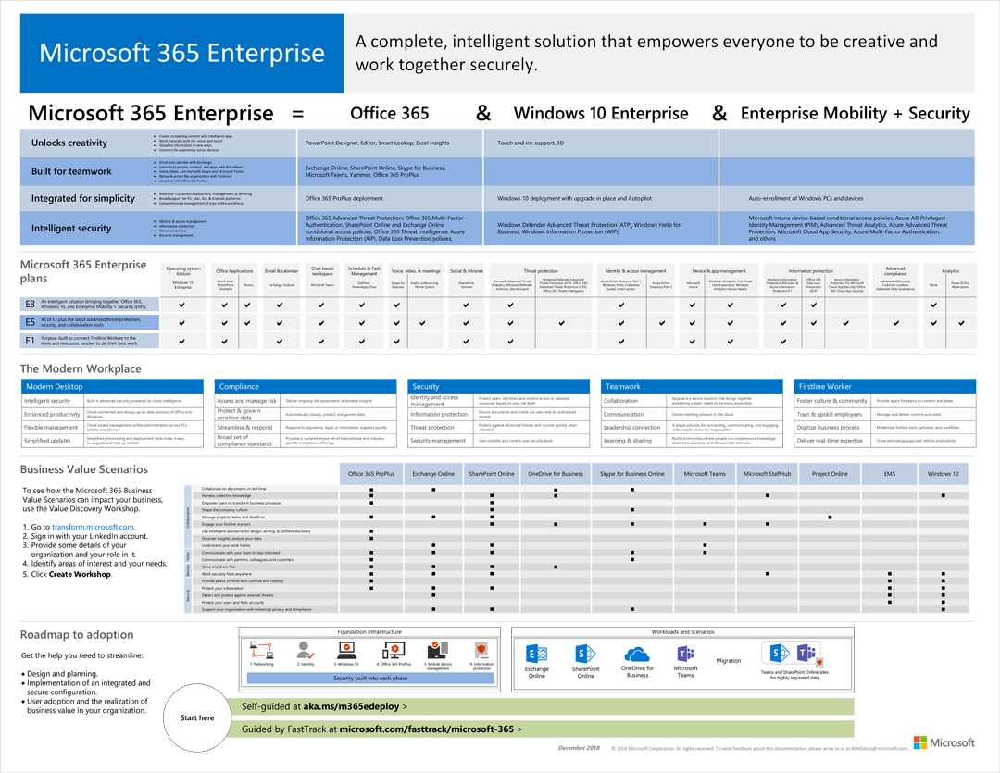

# Deploy Windows 10 with Microsoft 365

**Applies to**

-   Windows 10

This topic provides a brief overview of Microsoft 365 and describes how to use a free 90-day trial account to review some of the benefits of Microsoft 365.

[Microsoft 365](https://www.microsoft.com/microsoft-365) is a new offering from Microsoft that combines [Windows 10](https://www.microsoft.com/windows/features) with [Office 365](https://products.office.com/business/explore-office-365-for-business), and [Enterprise Mobility and Security](https://www.microsoft.com/cloud-platform/enterprise-mobility-security) (EMS). See the [M365 Enterprise poster](#m365-enterprise-poster) for an overview.

For Windows 10 deployment, Microsoft 365 includes a fantastic deployment advisor that can walk you through the entire process of deploying Windows 10. The wizard supports multiple Windows 10 deployment methods, including:

- Windows Autopilot
- In-place upgrade
- Deploying Windows 10 upgrade with Intune
- Deploying Windows 10 upgrade with System Center Configuration Manager
- Deploying a computer refresh with System Center Configuration Manager

## Free trial account

**If you already have a Microsoft services subscription account and access to the Microsoft 365 Admin Center**

From the [Microsoft 365 Admin Center](https://portal.office.com), go to Billing and then Purchase services.
In the Enterprise Suites section of the service offerings, you will find Microsoft 365 E3 and Microsoft 365 E5 tiles.
There are "Start Free Trial" options available for your selection by hovering your mouse over the tiles.

**If you do not already have a Microsoft services subscription**

You can check out the Microsoft 365 deployment advisor and other resources for free! Just follow the steps below. 

>[!NOTE]
>If you have not run a setup guide before, you will see the **Prepare your environment** guide first. This is to make sure you have basics covered like domain verification and a method for adding users. At the end of the "Prepare your environment" guide, there will be a **Ready to continue** button that sends you to the original guide that was selected.

1. [Obtain a free M365 trial](https://docs.microsoft.com/office365/admin/try-or-buy-microsoft-365).
2. Check out the [Microsoft 365 deployment advisor](https://portal.office.com/onboarding/Microsoft365DeploymentAdvisor#/).
3. Also check out the [Windows Analytics deployment advisor](https://portal.office.com/onboarding/WindowsAnalyticsDeploymentAdvisor#/). This advisor will walk you through deploying [Upgrade Readiness](https://docs.microsoft.com/windows/deployment/upgrade/manage-windows-upgrades-with-upgrade-readiness), [Update Compliance](https://docs.microsoft.com/windows/deployment/update/update-compliance-monitor), and [Device Health](https://docs.microsoft.com/windows/deployment/update/device-health-monitor). 

That's all there is to it! 

Examples of these two deployment advisors are shown below.

- [Microsoft 365 deployment advisor example](#microsoft-365-deployment-advisor-example)
- [Windows Analytics deployment advisor example](#windows-analytics-deployment-advisor-example)

## Microsoft 365 deployment advisor example

## Windows Analytics deployment advisor example

## M365 Enterprise poster

## Related Topics

[Windows 10 deployment scenarios](windows-10-deployment-scenarios.md) 
[Modern Desktop Deployment Center](https://docs.microsoft.com/microsoft-365/enterprise/desktop-deployment-center-home)

