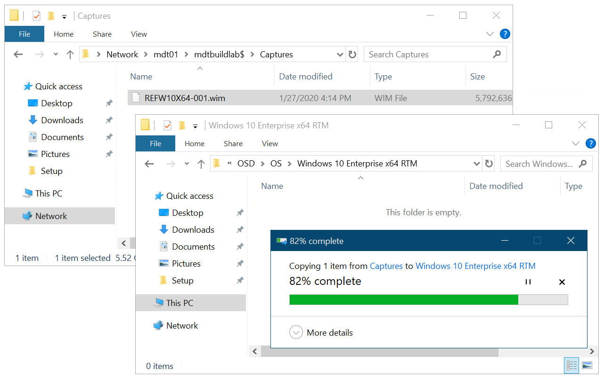

# Add a Windows 10 operating system image using Configuration Manager

**Applies to**

-   Windows 10

Operating system images are typically the production image used for deployment throughout the organization. This topic shows you how to add a Windows 10 operating system image created with Microsoft Endpoint Configuration Manager, and how to distribute the image to a distribution point.

## Infrastructure

For the purposes of this guide, we will use one server computer: CM01.
- CM01 is a domain member server and Configuration Manager software distribution point. In this guide CM01 is a standalone primary site server.
- CM01 is running Windows Server 2019. However, an earlier, supported version of Windows Server can also be used.  

An existing Configuration Manager infrastructure that is integrated with MDT is used for the following procedures. For more information about the setup for this article, see [Prepare for Zero Touch Installation of Windows 10 with Configuration Manager](prepare-for-zero-touch-installation-of-windows-10-with-configuration-manager.md).

>[!IMPORTANT]
>The procedures in this article require a reference image. Our reference images is named **REFW10-X64-001.wim**. If you have not already created a reference image, then perform all the steps in [Create a Windows 10 reference image](../deploy-windows-mdt/create-a-windows-10-reference-image.md) on CM01, replacing MDT01 with CM01. The final result will be a reference image located in the D:\MDTBuildLab\Captures folder that you can use for the procedure below.

 ## Add a Windows 10 operating system image

 On **CM01**:

1.  Using File Explorer, in the **D:\\Sources\\OSD\\OS** folder, create a subfolder named **Windows 10 Enterprise x64 RTM**.
2.  Copy the REFW10-X64-001.wim file to the **D:\\Sources\\OSD\\OS\\Windows 10 Enterprise x64 RTM** folder.

    

    The Windows 10 image being copied to the Sources folder structure.

3.  Using the Configuration Manager Console, in the Software Library workspace, right-click **Operating System Images**, and select **Add Operating System Image**.
4.  On the **Data Source** page, in the **Path:** text box, browse to \\\\CM01\\Sources$\\OSD\\OS\\Windows 10 Enterprise x64 RTM\\REFW10-X64-001.wim, select x64 next to Architecture and choose a language, then click **Next**.
5.  On the **General** page, assign the name Windows 10 Enterprise x64 RTM, click **Next** twice, and then click **Close**.
6.  Distribute the operating system image to the CM01 distribution point by right-clicking the **Windows 10 Enterprise x64 RTM** operating system image and then clicking **Distribute Content**.
7.  In the Distribute Content Wizard, add the CM01 distribution point, click **Next** and click **Close**.
8.  View the content status for the Windows 10 Enterprise x64 RTM package. Do not continue until the distribution is completed (it might take a few minutes). You also can review the D:\\Program Files\\Microsoft Configuration Manager\\Logs\\distmgr.log file and look for the **STATMSG: ID=2301** line.

    

    The distributed Windows 10 Enterprise x64 RTM package.

Next, see [Create an application to deploy with Windows 10 using Configuration Manager](create-an-application-to-deploy-with-windows-10-using-configuration-manager.md). 

## Related topics

[Prepare for Zero Touch Installation of Windows 10 with Configuration Manager](prepare-for-zero-touch-installation-of-windows-10-with-configuration-manager.md) 
[Create a custom Windows PE boot image with Configuration Manager](create-a-custom-windows-pe-boot-image-with-configuration-manager.md) 
[Create an application to deploy with Windows 10 using Configuration Manager](create-an-application-to-deploy-with-windows-10-using-configuration-manager.md) 
[Add drivers to a Windows 10 deployment with Windows PE using Configuration Manager](add-drivers-to-a-windows-10-deployment-with-windows-pe-using-configuration-manager.md) 
[Create a task sequence with Configuration Manager and MDT](./create-a-task-sequence-with-configuration-manager-and-mdt.md) 
[Deploy Windows 10 using PXE and Configuration Manager](deploy-windows-10-using-pxe-and-configuration-manager.md) 
[Refresh a Windows 7 SP1 client with Windows 10 using Configuration Manager](refresh-a-windows-7-client-with-windows-10-using-configuration-manager.md) 
[Replace a Windows 7 SP1 client with Windows 10 using Configuration Manager](replace-a-windows-7-client-with-windows-10-using-configuration-manager.md) 