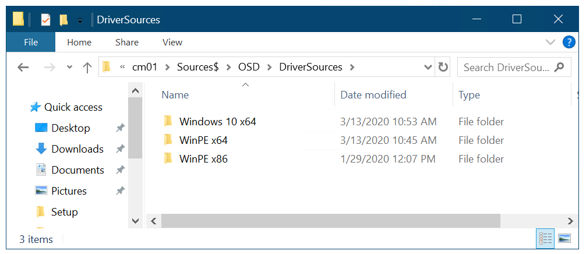
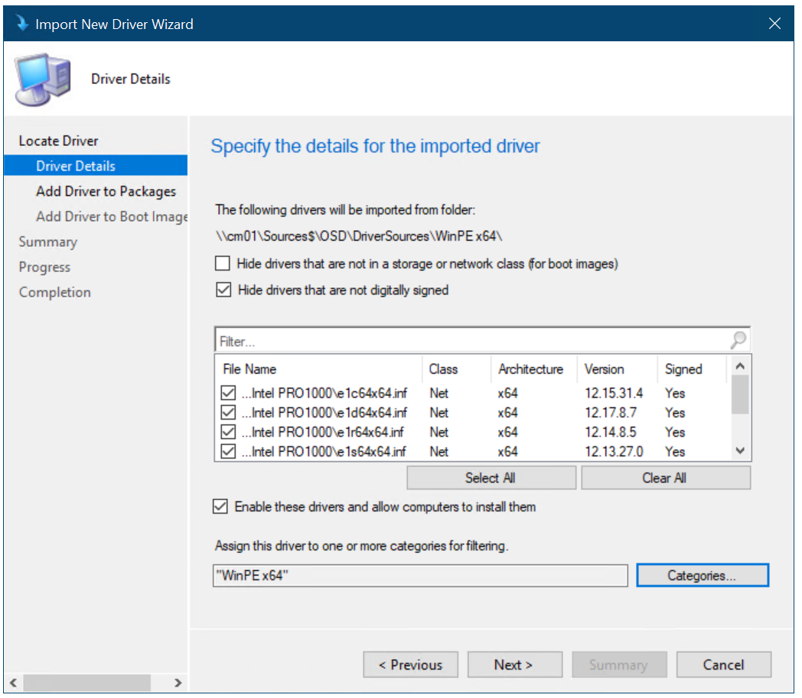
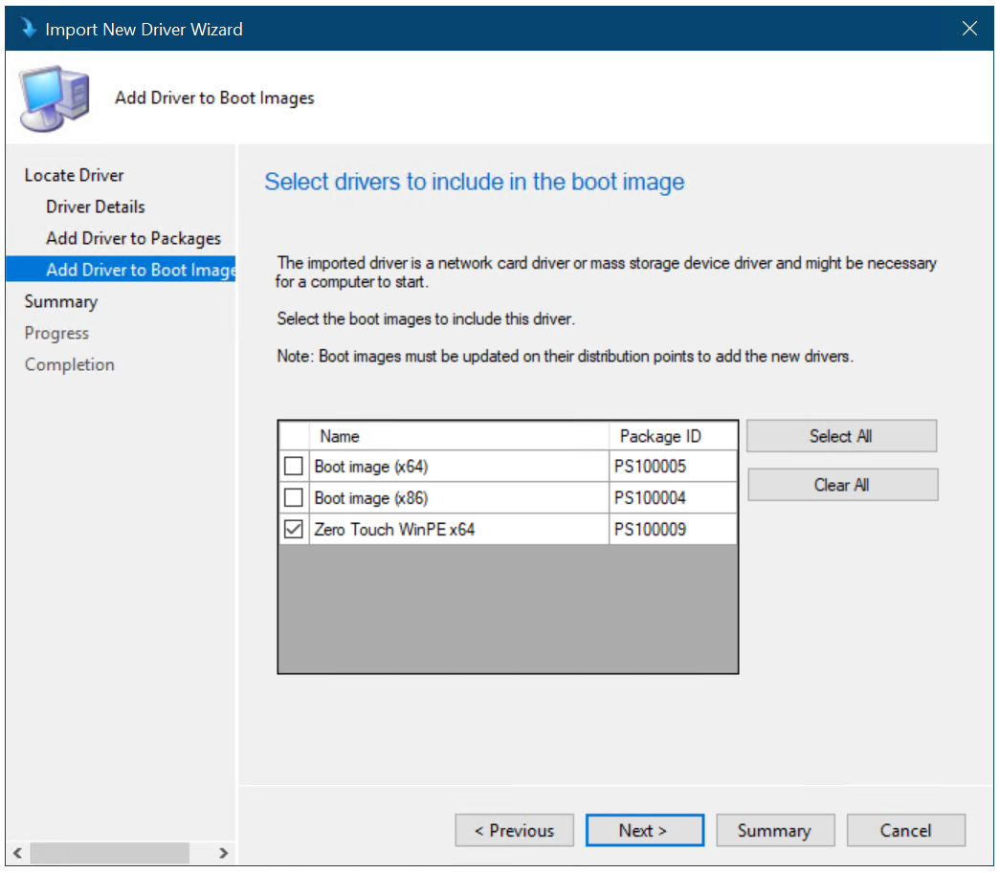
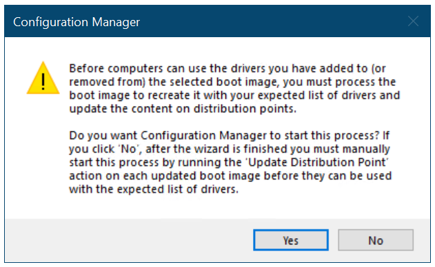
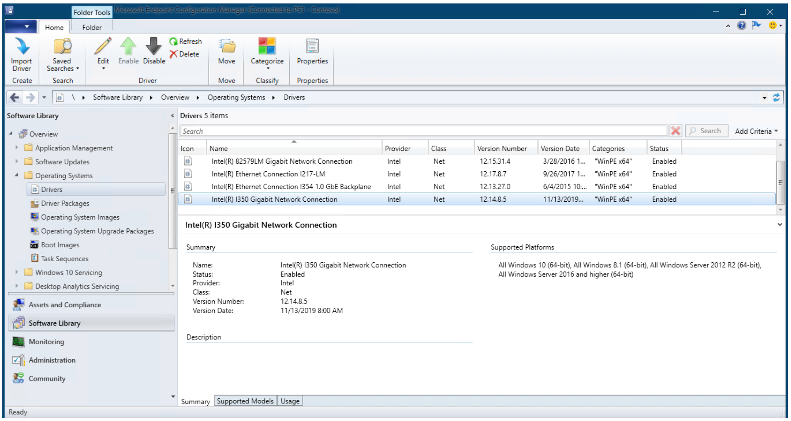
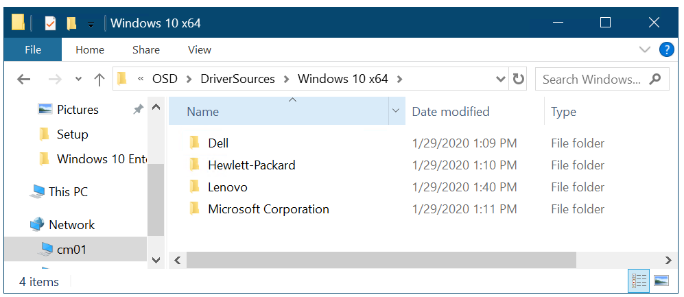

# Add drivers to a Windows 10 deployment with Windows PE using Configuration Manager

**Applies to**

- Windows 10

In this topic, you will learn how to configure the Windows Preinstallation Environment (Windows PE) to include the network drivers required to connect to the deployment share and the storage drivers required to see the local storage on machines. Even though the Windows PE boot image and the Windows 10 operating system contain many out-of-the-box drivers, it is likely you will have to add new or updated drivers to support all your hardware. In this section, you import drivers for both Windows PE and the full Windows 10 operating system.

For the purposes of this guide, we will use one server computer: CM01.
- CM01 is a domain member server and Configuration Manager software distribution point. In this guide CM01 is a standalone primary site server. CM01 is running Windows Server 2019. However, an earlier, supported version of Windows Server can also be used.  

 An existing Configuration Manager infrastructure that is integrated with MDT is used for the following procedures. For more information about the setup for this article, see [Prepare for Zero Touch Installation of Windows 10 with Configuration Manager](prepare-for-zero-touch-installation-of-windows-10-with-configuration-manager.md).

## Add drivers for Windows PE

This section will show you how to import some network and storage drivers for Windows PE. 

>[!NOTE]
>Windows PE usually has a fairly comprehensive set of drivers out of the box, assuming that you are using a recent version of the Windows ADK. This is different than the full Windows OS which will often require drivers. You shouldn't add drivers to Windows PE unless you have an issue or are missing functionality, and in these cases you should only add the driver that you need.  An example of a common driver that is added is the Intel I217 driver. Adding too many drivers can cause conflicts and lead to driver bloat in the Config Mgr database. This section shows you how to add drivers, but typically you can just skip this procedure.

This section assumes you have downloaded some drivers to the **D:\\Sources\\OSD\\DriverSources\\WinPE x64** folder on CM01.

Driver folder structure on CM01

On **CM01**:

1. Using the Configuration Manager Console, in the Software Library workspace, expand **Operating Systems**, right-click the **Drivers** node and select **Import Driver**.
2. In the Import New Driver Wizard, on the **Specify a location to import driver** page, select the **Import all drivers in the following network path (UNC)** option, browse to the **\\\\CM01\\Sources$\\OSD\\DriverSources\\WinPE x64** folder and click **Next**.
3. On the **Specify the details for the imported driver** page, click **Categories**, create a category named **WinPE x64**, and then click **Next**.
4. On the **Select the packages to add the imported driver** page, click **Next**.
5. On the **Select drivers to include in the boot image** page, select the **Zero Touch WinPE x64** boot image and click **Next**.
6. In the popup window that appears, click **Yes** to automatically update the distribution point.
7. Click **Next**, wait for the image to be updated, and then click **Close**.

   
   
   
  

  Add drivers to Windows PE

## Add drivers for Windows 10

This section illustrates how to add drivers for Windows 10 using the HP EliteBook 8560w as an example. For the HP EliteBook 8560w, you use HP SoftPaq Download Manager to get the drivers. The HP SoftPaq Download Manager can be accessed on the [HP Support site](https://go.microsoft.com/fwlink/p/?LinkId=619545).

For the purposes of this section, we assume that you have downloaded the Windows 10 drivers for the HP EliteBook 8560w model and copied them to the **D:\Sources$\OSD\DriverSources\Windows 10 x64\Hewlett-Packard\HP EliteBook 8560w** folder on CM01.

Driver folder structure on CM01

On **CM01**:

1. Using the Configuration Manager Console, in the Software Library workspace, expand **Operating Systems**, right-click the **Drivers** node and select **Import Driver**.
2. In the Import New Driver Wizard, on the **Specify a location to import driver** page, select the **Import all drivers in the following network path (UNC)** option, browse to the **\\\\CM01\\Sources$\\OSD\\DriverSources\\Windows 10 x64\\Hewlett-Packard\\HP EliteBook 8560w** folder and click **Next**. Wait a minute for driver information to be validated.
3. On the **Specify the details for the imported driver** page, click **Categories**, create a category named **Windows 10 x64 - HP EliteBook 8560w**, click **OK**, and then click **Next**.

    

    Create driver categories

4. On the **Select the packages to add the imported driver** page, click **New Package**, use the following settings for the package, and then click **Next**:

    * Name: Windows 10 x64 - HP EliteBook 8560w
    * Path: \\\\CM01\\Sources$\\OSD\\DriverPackages\\Windows 10 x64\\Hewlett-Packard\\HP EliteBook 8560w

    >[!NOTE]
    >The package path does not yet exist, so you have to type it in. The wizard will create the new package using the path you specify.

5.  On the **Select drivers to include in the boot image** page, do not select anything, and click **Next** twice. After the package has been created, click **Close**.

    >[!NOTE]
    >If you want to monitor the driver import process more closely, you can open the SMSProv.log file during driver import.
  
    
  
    Drivers imported and a new driver package created

Next, see [Create a task sequence with Configuration Manager and MDT](create-a-task-sequence-with-configuration-manager-and-mdt.md).

## Related topics

[Prepare for Zero Touch Installation of Windows 10 with Configuration Manager](prepare-for-zero-touch-installation-of-windows-10-with-configuration-manager.md) 
[Create a custom Windows PE boot image with Configuration Manager](create-a-custom-windows-pe-boot-image-with-configuration-manager.md) 
[Add a Windows 10 operating system image using Configuration Manager](add-a-windows-10-operating-system-image-using-configuration-manager.md) 
[Create an application to deploy with Windows 10 using Configuration Manager](create-an-application-to-deploy-with-windows-10-using-configuration-manager.md) 
[Create a task sequence with Configuration Manager and MDT](../deploy-windows-mdt/create-a-task-sequence-with-configuration-manager-and-mdt.md) 
[Deploy Windows 10 using PXE and Configuration Manager](deploy-windows-10-using-pxe-and-configuration-manager.md) 
[Refresh a Windows 7 SP1 client with Windows 10 using Configuration Manager](refresh-a-windows-7-client-with-windows-10-using-configuration-manager.md) 
[Replace a Windows 7 SP1 client with Windows 10 using Configuration Manager](replace-a-windows-7-client-with-windows-10-using-configuration-manager.md) 
