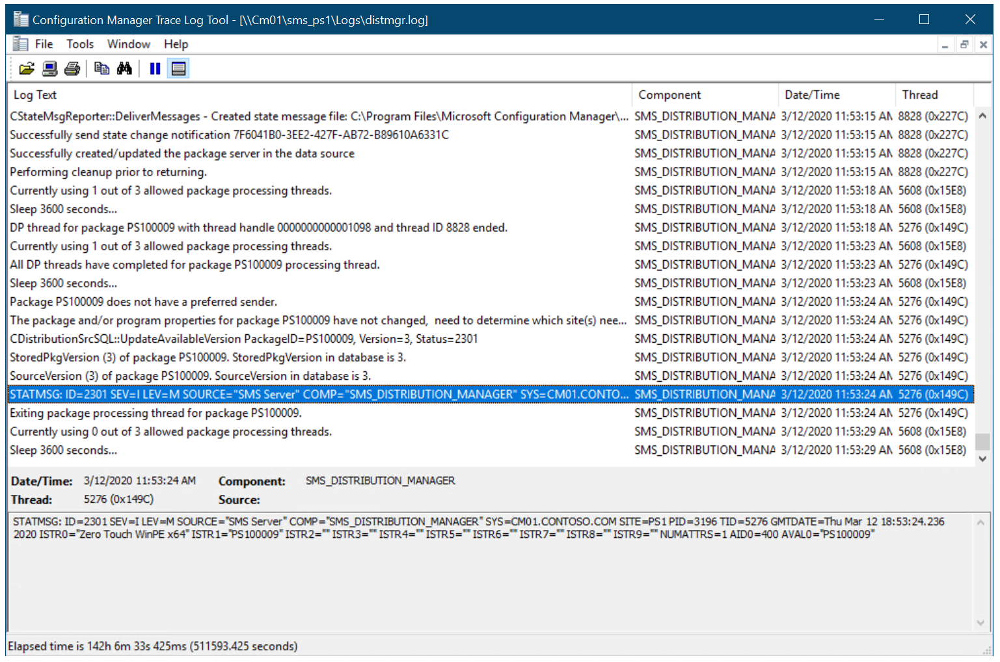
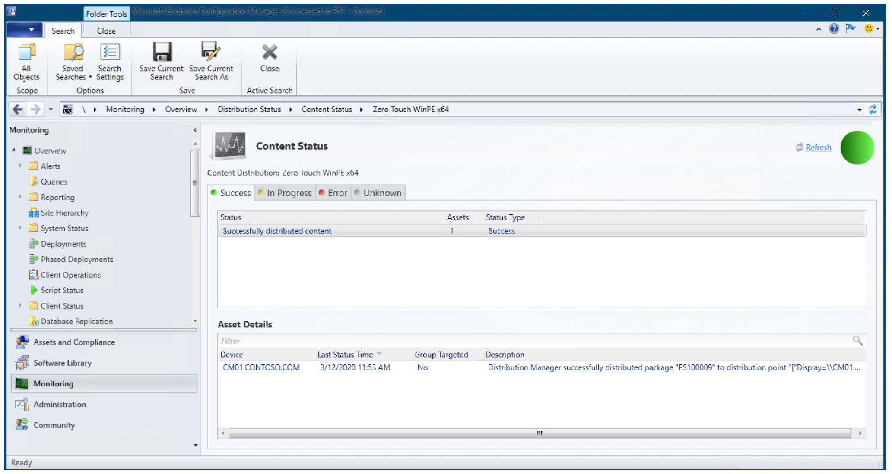
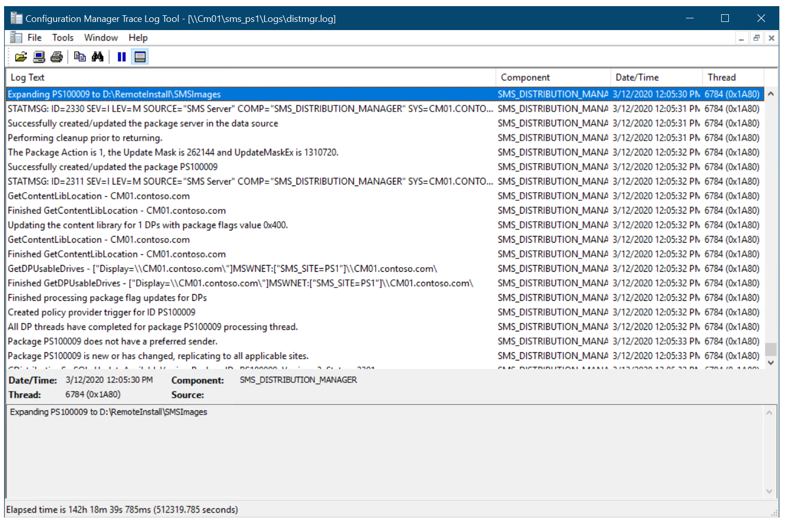
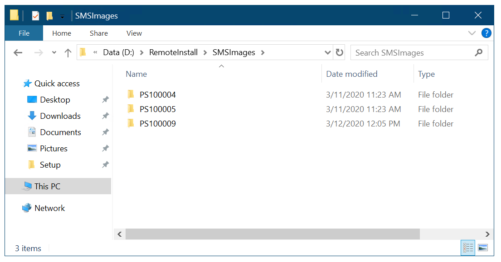

# Create a custom Windows PE boot image with Configuration Manager

**Applies to**

- Windows 10

In Microsoft Endpoint Configuration Manager, you can create custom Windows Preinstallation Environment (Windows PE) boot images that include extra components and features. This topic shows you how to create a custom Windows PE 5.0 boot image with the Microsoft Deployment Toolkit (MDT) wizard. You can also add the Microsoft Diagnostics and Recovery Toolset (DaRT) 10 to the boot image as part of the boot image creation process.
- The boot image that is created is based on the version of ADK that is installed.

For the purposes of this guide, we will use one server computer: CM01.
- CM01 is a domain member server and Configuration Manager software distribution point. In this guide CM01 is a standalone primary site server. CM01 is running Windows Server 2019. However, an earlier, supported version of Windows Server can also be used.  

 An existing Configuration Manager infrastructure that is integrated with MDT is used for the following procedures. For more information about the setup for this article, see [Prepare for Zero Touch Installation of Windows 10 with Configuration Manager](prepare-for-zero-touch-installation-of-windows-10-with-configuration-manager.md).

## Add DaRT 10 files and prepare to brand the boot image

The steps below outline the process for adding DaRT 10 installation files to the MDT installation directory. You also copy a custom background image to be used later. These steps are optional. If you do not wish to add DaRT, skip the steps below to copy DaRT tools and later skip adding the DaRT component to the boot image.

We assume you have downloaded [Microsoft Desktop Optimization Pack (MDOP) 2015](https://my.visualstudio.com/Downloads?q=Desktop%20Optimization%20Pack%202015) and copied the x64 version of MSDaRT100.msi to the **C:\\Setup\\DaRT 10** folder on CM01. We also assume you have created a custom background image and saved it in **C:\\Setup\\Branding** on CM01. In this section, we use a custom background image named <a href="../images/ContosoBackground.png">ContosoBackground.bmp</a>.

On **CM01**:

1.  Install DaRT 10 (C:\\Setup\\DaRT 10\\MSDaRT100.msi) using the default settings.
2.  Using File Explorer, navigate to the **C:\\Program Files\\Microsoft DaRT\\v10** folder.
3.  Copy the Toolsx64.cab file to the **C:\\Program Files\\Microsoft Deployment Toolkit\\Templates\\Distribution\\Tools\\x64** folder.
4.  Copy the Toolsx86.cab file to the **C:\\Program Files\\Microsoft Deployment Toolkit\\Templates\\Distribution\\Tools\\x86** folder.
5.  Using File Explorer, navigate to the **C:\\Setup** folder.
6.  Copy the **Branding** folder to **D:\\Sources\\OSD**.

## Create a boot image for Configuration Manager using the MDT wizard

By using the MDT wizard to create the boot image in Configuration Manager, you gain additional options for adding components and features to the boot image. In this section, you create a boot image for Configuration Manager using the MDT wizard.

On **CM01**:

1.  Using the Configuration Manager Console, in the Software Library workspace, expand **Operating Systems**, right-click **Boot Images**, and select **Create Boot Image using MDT**.
2.  On the **Package Source** page, in the **Package source folder to be created (UNC Path):** text box, type **\\\\CM01\\Sources$\\OSD\\Boot\\Zero Touch WinPE x64** and click **Next**.

    >[!NOTE]
    >The Zero Touch WinPE x64 folder does not yet exist. The folder will be created later by the wizard.

3.  On the **General Settings** page, assign the name **Zero Touch WinPE x64** and click **Next**.
4.  On the **Options** page, select the **x64** platform, and click **Next**.
5.  On the **Components** page, in addition to the default selected **Microsoft Data Access Components (MDAC/ADO)** support, select the **Microsoft Diagnostics and Recovery Toolkit (DaRT)** check box and click **Next**.

    

    Add the DaRT component to the Configuration Manager boot image.

    >Note: Another common component to add here is Windows PowerShell to enable PowerShell support within Windows PE.

6.  On the **Customization** page, select the **Use a custom background bitmap file** check box, and in the **UNC path:** text box, browse to **\\\\CM01\\Sources$\\OSD\\Branding\\ContosoBackground.bmp** and then click **Next** twice. Wait a few minutes while the boot image is generated, and then click **Finish**.
7.  Distribute the boot image to the CM01 distribution point by selecting the **Boot images** node, right-clicking the **Zero Touch WinPE x64** boot image, and selecting **Distribute Content**.
8.  In the Distribute Content Wizard, add the CM01 distribution point, and complete the wizard.
9.  Using Configuration Manager Trace, review the D:\\Program Files\\Microsoft Configuration Manager\\Logs\\distmgr.log file. Do not continue until you can see that the boot image is distributed. Look for the line that reads **STATMSG: ID=2301**. You also can monitor Content Status in the Configuration Manager Console at **\Monitoring\Overview\Distribution Status\Content Status\Zero Touch WinPE x64**. See the following examples:

     
    

    Content status for the Zero Touch WinPE x64 boot image

10. Using the Configuration Manager Console, in the Software Library workspace, under **Boot Images**, right-click the **Zero Touch WinPE x64** boot image and select **Properties**.
11. On the **Data Source** tab, select the **Deploy this boot image from the PXE-enabled distribution point** check box, and click **OK**.
12. Using Configuration Manager Trace, review the D:\\Program Files\\Microsoft Configuration Manager\\Logs\\distmgr.log file and look for this text: **Expanding PS100009 to D:\\RemoteInstall\\SMSImages**.
13. Review the **D:\\RemoteInstall\\SMSImages** folder. You should see three folders containing boot images. Two are from the default boot images, and the third folder (PS100009) is from your new boot image with DaRT. See the examples below:

     
    

>Note: Depending on your infrastructure and the number of packages and boot images present, the Image ID might be a different number than PS100009.

Next, see [Add a Windows 10 operating system image using Configuration Manager](add-a-windows-10-operating-system-image-using-configuration-manager.md). 

## Related topics

[Prepare for Zero Touch Installation of Windows 10 with Configuration Manager](prepare-for-zero-touch-installation-of-windows-10-with-configuration-manager.md) 
[Add a Windows 10 operating system image using Configuration Manager](add-a-windows-10-operating-system-image-using-configuration-manager.md) 
[Create an application to deploy with Windows 10 using Configuration Manager](create-an-application-to-deploy-with-windows-10-using-configuration-manager.md) 
[Add drivers to a Windows 10 deployment with Windows PE using Configuration Manager](add-drivers-to-a-windows-10-deployment-with-windows-pe-using-configuration-manager.md) 
[Create a task sequence with Configuration Manager and MDT](../deploy-windows-mdt/create-a-task-sequence-with-configuration-manager-and-mdt.md) 
[Deploy Windows 10 using PXE and Configuration Manager](deploy-windows-10-using-pxe-and-configuration-manager.md) 
[Refresh a Windows 7 SP1 client with Windows 10 using Configuration Manager](refresh-a-windows-7-client-with-windows-10-using-configuration-manager.md) 
[Replace a Windows 7 SP1 client with Windows 10 using Configuration Manager](replace-a-windows-7-client-with-windows-10-using-configuration-manager.md) 
