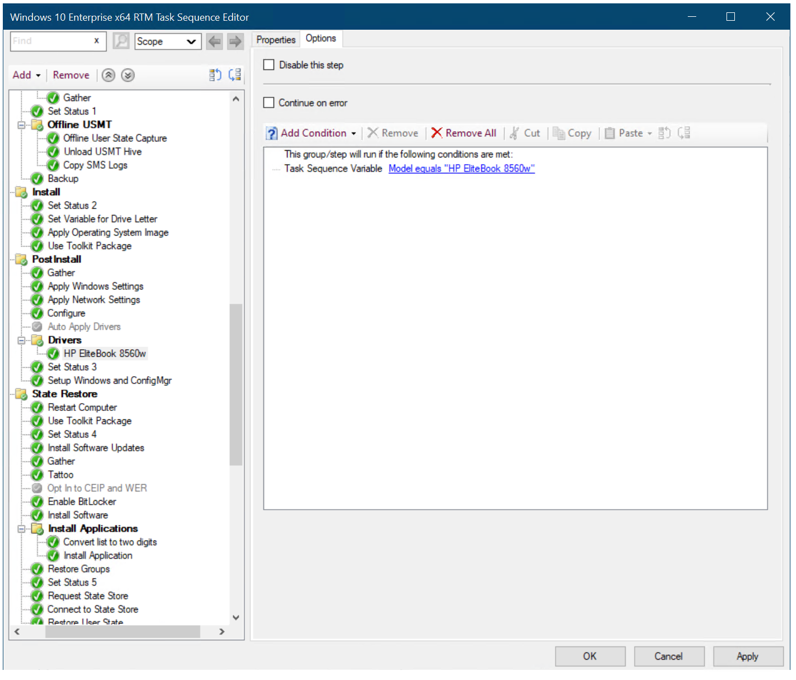
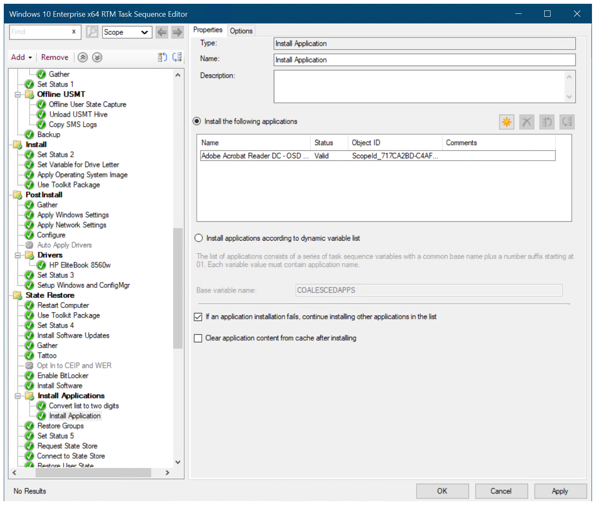

# Create a task sequence with Configuration Manager and MDT

**Applies to**

-   Windows 10

In this article, you will learn how to create a Configuration Manager task sequence with Microsoft Deployment Toolkit (MDT) integration using the MDT wizard. Creating task sequences in Configuration Manager requires many more steps than creating task sequences for MDT Lite Touch installation. Luckily, the MDT wizard helps you through the process and also guides you through creating the needed packages.

For the purposes of this guide, we will use one server computer: CM01.
- CM01 is a domain member server and Configuration Manager software distribution point. In this guide CM01 is a standalone primary site server. CM01 is running Windows Server 2019. However, an earlier, supported version of Windows Server can also be used.  

 An existing Configuration Manager infrastructure that is integrated with MDT is used for the following procedures. For more information about the setup for this article, see [Prepare for Zero Touch Installation of Windows 10 with Configuration Manager](prepare-for-zero-touch-installation-of-windows-10-with-configuration-manager.md). Note: Active Directory [permissions](prepare-for-zero-touch-installation-of-windows-10-with-configuration-manager.md#configure-active-directory-permissions) for the **CM_JD** account are required for the task sequence to work properly.

## Create a task sequence using the MDT Integration Wizard

This section walks you through the process of creating a Configuration Manager task sequence for production use.

On **CM01**:

1.  Using the Configuration Manager Console, in the Software Library workspace, expand **Operating Systems**, right-click **Task Sequences**, and select **Create MDT Task Sequence**.
2.  On the **Choose Template** page, select the **Client Task Sequence** template and click **Next**.
3.  On the **General** page, assign the following settings and then click **Next**:
    * Task sequence name: Windows 10 Enterprise x64 RTM
    * Task sequence comments: Production image with Office 365 Pro Plus x64
4.  On the **Details** page, assign the following settings and then click **Next**:
    * Join a Domain
    * Domain: contoso.com
        * Account: contoso\\CM\_JD
        * Password: pass@word1
    * Windows Settings
        * User name: Contoso
        * Organization name: Contoso
        * Product key: &lt;blank&gt;

5.  On the **Capture Settings** page, accept the default settings, and click **Next**.
6.  On the **Boot Image** page, browse and select the **Zero Touch WinPE x64** boot image package. Then click **Next**.
7.  On the **MDT Package** page, select **Create a new Microsoft Deployment Toolkit Files package**, and in the **Package source folder to be created (UNC Path):** text box, type **\\\\CM01\\Sources$\\OSD\\MDT\\MDT**. Then click **Next**.
8.  On the **MDT Details** page, assign the name **MDT** and click **Next**.
9.  On the **OS Image** page, browse and select the **Windows 10 Enterprise x64 RTM** package. Then click **Next**.
10. On the **Deployment Method** page, accept the default settings (Zero Touch installation) and click **Next**.
11. On the **Client Package** page, browse and select the **Microsoft Corporation Configuration Manager Client Package** and click **Next**.
12. On the **USMT Package** page, browse and select the **Microsoft Corporation User State Migration Tool for Windows** package and click **Next**.
13. On the **Settings Package** page, select the **Create a new settings package** option, and in the **Package source folder to be created (UNC Path):** text box, type **\\\\CM01\\Sources$\\OSD\\Settings\\Windows 10 x64 Settings** and click **Next**.
14. On the **Settings Details** page, assign the name **Windows 10 x64 Settings** and click **Next**.
15. On the **Sysprep Package** page, click **Next** twice.
16. On the **Confirmation** page, click **Finish**.

## Edit the task sequence

After you create the task sequence, we recommend that you configure the task sequence for an optimal deployment experience. The configurations include enabling support for Unified Extensible Firmware Interface (UEFI), dynamic organizational unit (OU) allocation, computer replace scenarios, and more.

On **CM01**:

1.  Using the Configuration Manager Console, in the Software Library workspace, expand **Operating Systems**, click **Task Sequences**, right-click the **Windows 10 Enterprise x64 RTM** task sequence, and click **Edit**.
2.  In the **Install** group (about halfway down), select the **Set Variable for Drive Letter** action and configure the following:
    * OSDPreserveDriveLetter: True
    
    >[!NOTE]
    >If you don't change this value, your Windows installation will end up in D:\\Windows.

3.  In the **Post Install** group, select **Apply Network Settings**, and configure the **Domain OU** value to use the **Contoso / Computers / Workstations** OU (browse for values).
4.  In the **Post Install** group, disable the **Auto Apply Drivers** action. (Disabling is done by selecting the action and, in the **Options** tab, selecting the **Disable this step** check box.)
5.  After the disabled **Post Install / Auto Apply Drivers** action, add a new group name: **Drivers**.
6.  After the **Post Install / Drivers** group, add an **Apply Driver Package** action with the following settings:
    * Name: HP EliteBook 8560w
    * Driver Package: Windows 10 x64 - HP EliteBook 8560w
    * Options tab - Add Condition: Task Sequence Variable: Model equals HP EliteBook 8560w
    
    >[!NOTE]
    >You also can add a Query WMI condition with the following query: SELECT \* FROM Win32\_ComputerSystem WHERE Model LIKE '%HP EliteBook 8560w%'
    
    
    
    The driver package options

7.  In the **State Restore / Install Applications** group, select the **Install Application** action.
8.  Select the **Install the following applications** radio button, and add the OSD / Adobe Reader DC - OSD Install application to the list.

    

    Add an application to the Configuration Manager task sequence

  >[!NOTE]
  >In recent versions of Configuration Manager the Request State Store and Release State Store actions described below are present by default. These actions are used for common computer replace scenarios. There is also the additional condition on the options tab: USMTOfflineMigration not equals TRUE.  If these actions are not present, try updating to the Config Mgr current branch release.

9.  In the **State Restore** group, after the **Set Status 5** action, verify there is a **User State \ Request State Store** action with the following settings:
    * Request state storage location to: Restore state from another computer
    * If computer account fails to connect to state store, use the Network Access account: selected
    * Options: Continue on error
    * Options / Add Condition:
      * Task Sequence Variable      
      * USMTLOCAL not equals True

10. In the **State Restore** group, after the **Restore User State** action, verify there is a **Release State Store** action with the following settings:
    * Options: Continue on error
    * Options / Condition:
      * Task Sequence Variable
      * USMTLOCAL not equals True

11. Click **OK**.

## Organize your packages (optional)

If desired, you can create a folder structure for packages. This is purely for organizational purposes and is useful if you need to manage a large number of packages. 

To create a folder for packages:

On **CM01**:

1.  Using the Configuration Manager Console, in the Software Library workspace, expand **Application Management**, and then select **Packages**.
2.  Right-click **Packages**, point to **Folder**, click **Create Folder** and create the OSD folder. This will create the Root \ OSD folder structure.
3.  Select the **MDT**, **User State Migration Tool for Windows**, and **Windows 10 x64 Settings** packages, right-click and select **Move**.
4.  In the **Move Selected Items** dialog box, select the **OSD** folder, and click **OK**.

Next, see [Finalize the operating system configuration for Windows 10 deployment with Configuration Manager](finalize-the-os-configuration-for-windows-10-deployment-with-configuration-manager.md).

## Related topics

[Prepare for Zero Touch Installation of Windows 10 with Configuration Manager](../deploy-windows-cm/prepare-for-zero-touch-installation-of-windows-10-with-configuration-manager.md) 
[Create a custom Windows PE boot image with Configuration Manager](../deploy-windows-cm/create-a-custom-windows-pe-boot-image-with-configuration-manager.md) 
[Add a Windows 10 operating system image using Configuration Manager](../deploy-windows-cm/add-a-windows-10-operating-system-image-using-configuration-manager.md) 
[Create an application to deploy with Windows 10 using Configuration Manager](../deploy-windows-cm/create-an-application-to-deploy-with-windows-10-using-configuration-manager.md) 
[Add drivers to a Windows 10 deployment with Windows PE using Configuration Manager](../deploy-windows-cm/add-drivers-to-a-windows-10-deployment-with-windows-pe-using-configuration-manager.md) 
[Deploy Windows 10 using PXE and Configuration Manager](../deploy-windows-cm/deploy-windows-10-using-pxe-and-configuration-manager.md) 
[Refresh a Windows 7 SP1 client with Windows 10 using Configuration Manager](../deploy-windows-cm/refresh-a-windows-7-client-with-windows-10-using-configuration-manager.md) 
[Replace a Windows 7 SP1 client with Windows 10 using Configuration Manager](../deploy-windows-cm/replace-a-windows-7-client-with-windows-10-using-configuration-manager.md) 
