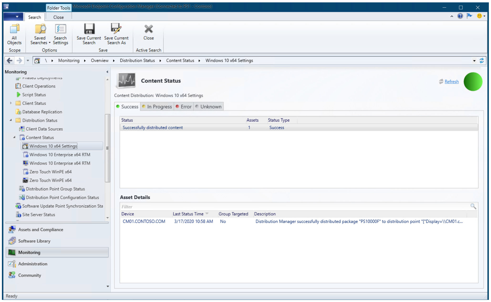

# Finalize the operating system configuration for Windows 10 deployment with Configuration Manager

**Applies to**

-   Windows 10

This topic walks you through the steps to finalize the configuration of your Windows 10 operating deployment, which includes enabling optional MDT monitoring for Configuration Manager, logs folder settings, rules configuration, content distribution, and deployment of the previously created task sequence.

For the purposes of this guide, we will use one server computer: CM01.
- CM01 is a domain member server and Configuration Manager software distribution point. In this guide CM01 is a standalone primary site server. CM01 is running Windows Server 2019. However, an earlier, supported version of Windows Server can also be used.  

 An existing Configuration Manager infrastructure that is integrated with MDT is used for the following procedures. For more information about the setup for this article, see [Prepare for Zero Touch Installation of Windows 10 with Configuration Manager](prepare-for-zero-touch-installation-of-windows-10-with-configuration-manager.md).

## Enable MDT monitoring

This section will walk you through the process of creating the D:\\MDTProduction deployment share using the MDT Deployment Workbench to enable monitoring for Configuration Manager.

On **CM01**:

1.  Open the Deployment Workbench, right-click **Deployment Shares** and click **New Deployment Share**. Use the following settings for the New Deployment Share Wizard:

    * Deployment share path: D:\\MDTProduction
    * Share name: MDTProduction$
    * Deployment share description: MDT Production
    * Options: &lt;default settings&gt;

2.  Right-click the **MDT Production** deployment share, and click **Properties**. On the **Monitoring** tab, select the **Enable monitoring for this deployment share** check box, and click **OK**.

    

    Enable MDT monitoring for Configuration Manager

## Configure the Logs folder

The D:\Logs folder was [created previously](prepare-for-zero-touch-installation-of-windows-10-with-configuration-manager.md?#review-the-sources-folder-structure) and SMB permissions were added. Next, we will add NTFS folder permissions for the Configuration Manager Network Access Account (CM_NAA), and enable server-side logging by modifying the CustomSettings.ini file used by the Configuration Manager task sequence.

On **CM01**:

1.  To configure NTFS permissions using icacls.exe, type the following at an elevated Windows PowerShell prompt:

    ``` 
    icacls D:\Logs /grant '"CM_NAA":(OI)(CI)(M)'
    ```

2. Using File Explorer, navigate to the **D:\\Sources\\OSD\\Settings\\Windows 10 x64 Settings** folder.
3. To enable server-side logging, edit the CustomSetting.ini file with Notepad.exe and enter the following settings:

   ``` 
   [Settings]
   Priority=Default
   Properties=OSDMigrateConfigFiles,OSDMigrateMode

   [Default]
   DoCapture=NO
   ComputerBackupLocation=NONE
   MachineObjectOU=ou=Workstations,ou=Computers,ou=Contoso,dc=contoso,dc=com
   OSDMigrateMode=Advanced
   OSDMigrateAdditionalCaptureOptions=/ue:*\* /ui:CONTOSO\*
   OSDMigrateConfigFiles=Miguser.xml,Migapp.xml
   SLSHARE=\\CM01\Logs$
   EventService=http://CM01:9800
   ApplyGPOPack=NO
   ```

   

   The Settings package, holding the rules and the Unattend.xml template used during deployment

3. In the Configuration Manager console, update the distribution point for the **Windows 10 x64 Settings** package by right-clicking the **Windows 10 x64 Settings** package and selecting **Update Distribution Points**. Click **OK** in the popup dialog box.

   >[!NOTE]
   >Although you have not yet added a distribution point, you still need to select Update Distribution Points. This process also updates the Configuration Manager content library with changes.

## Distribute content to the CM01 distribution portal

In Configuration Manager, you can distribute all packages needed by a task sequence in a single task. In this section, you distribute packages that have not yet been distributed to the CM01 distribution point.

On **CM01**:

1.  Using the Configuration Manager console, in the Software Library workspace, expand **Operating Systems** and select **Task Sequences**. Right-click the **Windows 10 Enterprise x64 RTM** task sequence, and select **Distribute Content**.
2.  In the Distribute Content Wizard, click **Next** twice then on the **Specify the content destination** page add the Distribution Point: **CM01.CONTOSO.COM**, and then complete the wizard.
3.  Using the CMTrace tool, verify the distribution to the CM01 distribution point by reviewing the distmgr.log file, or use the Distribution Status / Content Status option in the Monitoring workspace. Do not continue until you see all the new packages being distributed successfully.

   

   Content status

## Create a deployment for the task sequence

This sections provides steps to help you create a deployment for the task sequence.

On **CM01**:

1. Using the Configuration Manager console, in the Software Library workspace, expand **Operating Systems** and select **Task Sequences**, right-click **Windows 10 Enterprise x64 RTM** and then click **Deploy**.
2. In the Deploy Software Wizard, on the **General** page, select the **All Unknown Computers** collection and click **Next**.
3. On the **Deployment Settings** page, use the following settings and then click **Next**:

   * Purpose: Available
   * Make available to the following: Only media and PXE

   
    
   Configure the deployment settings

4. On the **Scheduling** page, accept the default settings and click **Next**.
5. On the **User Experience** page, accept the default settings and click **Next**.
6. On the **Alerts** page, accept the default settings and click **Next**.
7. On the **Distribution Points** page, accept the default settings, click **Next** twice, and then click **Close**.

   

   The Windows 10 Enterprise x64 RTM task sequence deployed to the All Unknown Computers collections available for media and PXE

## Configure Configuration Manager to prompt for the computer name during deployment (optional)

You can have Configuration Manager prompt you for a computer name or you can use rules to generate a computer name. For more details on how to do this, see [Configure MDT settings](../deploy-windows-mdt/configure-mdt-settings.md).

This section provides steps to help you configure the All Unknown Computers collection to have Configuration Manager prompt for computer names.

On **CM01**:

1. Using the Configuration Manager console, in the Asset and Compliance workspace, select **Device Collections**, right-click **All Unknown Computers**, and click **Properties**.

2. On the **Collection Variables** tab, create a new variable with the following settings:

   * Name: OSDComputerName
   * Clear the **Do not display this value in the Configuration Manager console** check box.

3. Click **OK**.

   >[!NOTE]
   >Configuration Manager can prompt for information in many ways. Using a collection variable with an empty value is just one of them. Another option is the User-Driven Installation (UDI) wizard.
   
   
   
   Configure a collection variable

Next, see [Deploy Windows 10 using PXE and Configuration Manager](deploy-windows-10-using-pxe-and-configuration-manager.md).

## Related topics

[Prepare for Zero Touch Installation of Windows 10 with Configuration Manager](prepare-for-zero-touch-installation-of-windows-10-with-configuration-manager.md)<br>
[Create a custom Windows PE boot image with Configuration Manager](create-a-custom-windows-pe-boot-image-with-configuration-manager.md)<br>
[Add a Windows 10 operating system image using Configuration Manager](add-a-windows-10-operating-system-image-using-configuration-manager.md)<br>
[Create an application to deploy with Windows 10 using Configuration Manager](create-an-application-to-deploy-with-windows-10-using-configuration-manager.md)<br>
[Add drivers to a Windows 10 deployment with Windows PE using Configuration Manager](add-drivers-to-a-windows-10-deployment-with-windows-pe-using-configuration-manager.md)<br>
[Create a task sequence with Configuration Manager and MDT](./create-a-task-sequence-with-configuration-manager-and-mdt.md)<br>
[Deploy Windows 10 using PXE and Configuration Manager](deploy-windows-10-using-pxe-and-configuration-manager.md)<br>
[Refresh a Windows 7 SP1 client with Windows 10 using Configuration Manager](refresh-a-windows-7-client-with-windows-10-using-configuration-manager.md)<br>
[Replace a Windows 7 SP1 client with Windows 10 using Configuration Manager](replace-a-windows-7-client-with-windows-10-using-configuration-manager.md)<br>