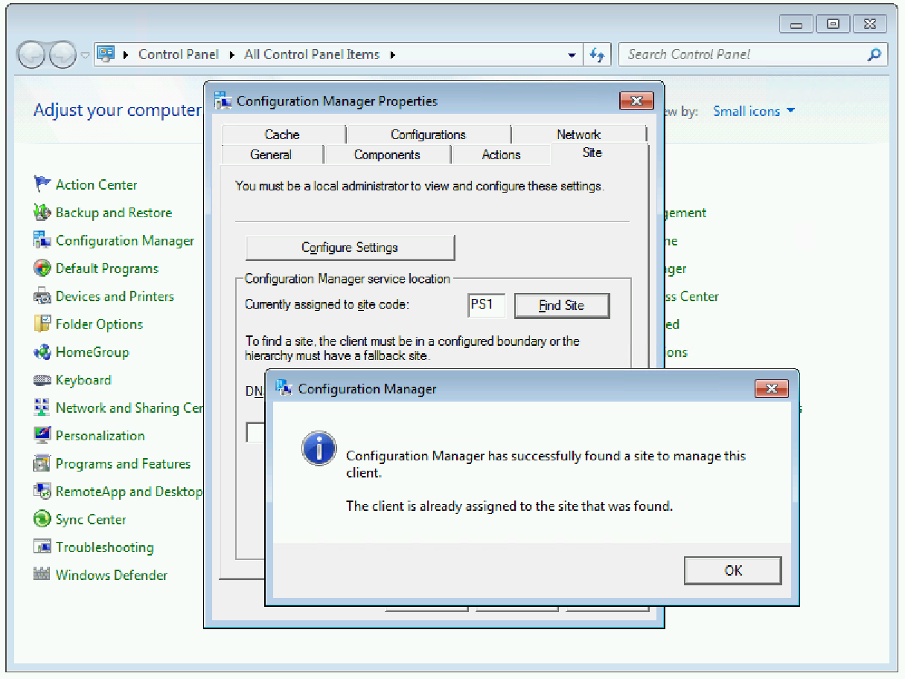
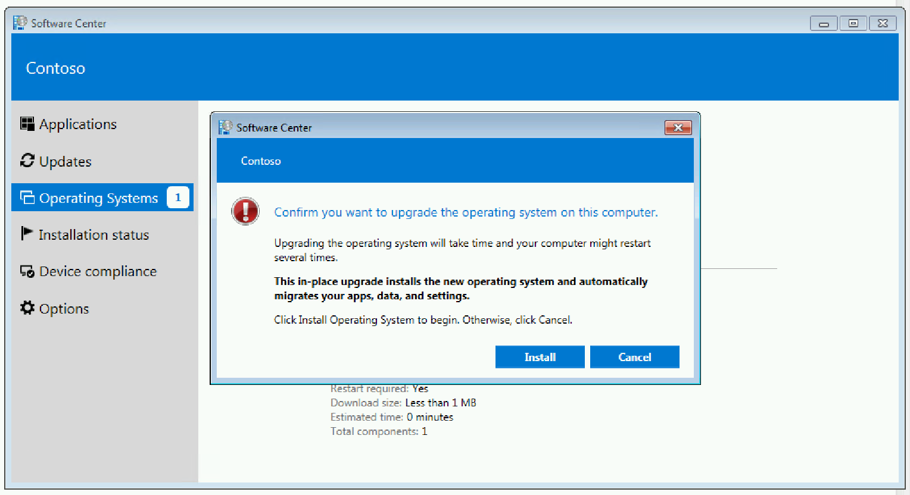
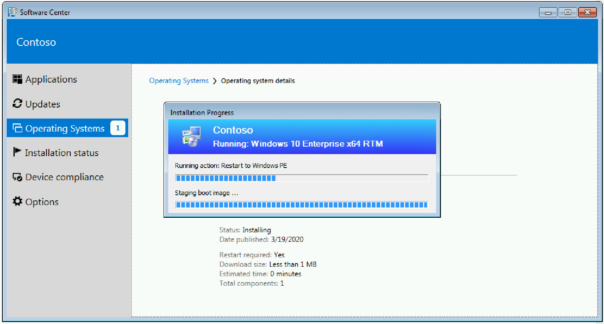
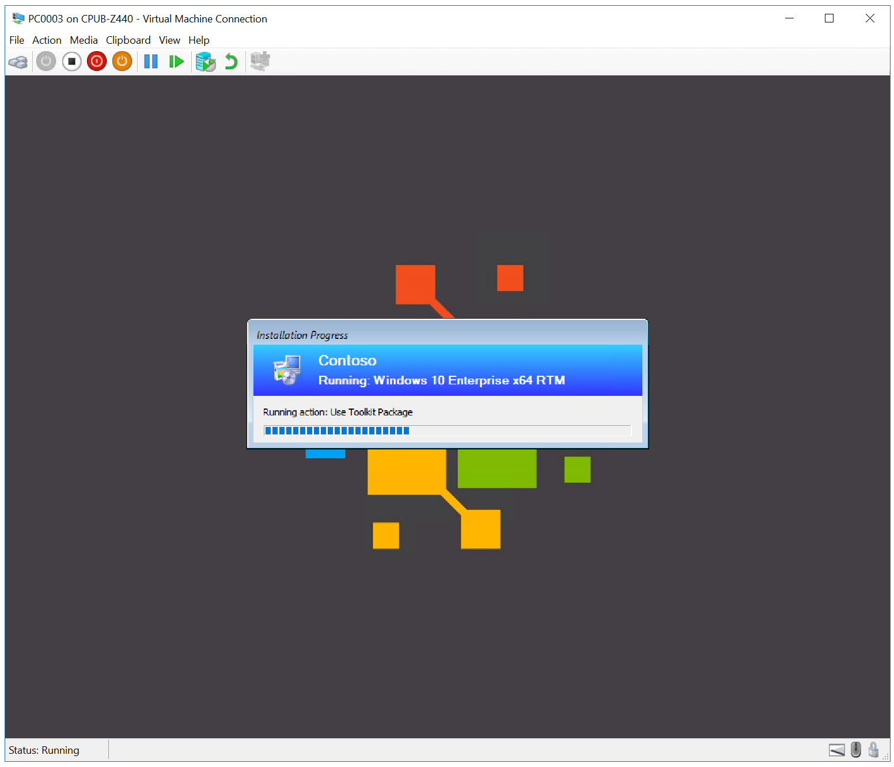
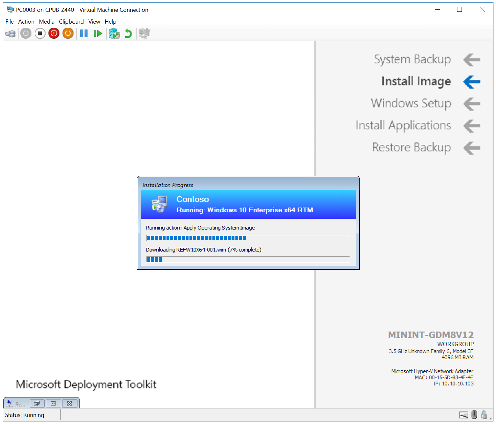
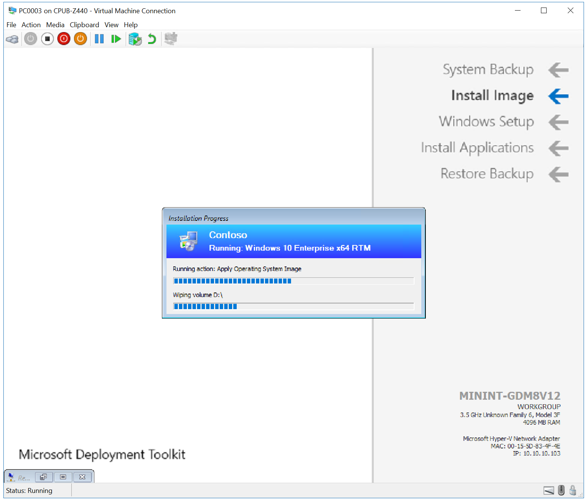
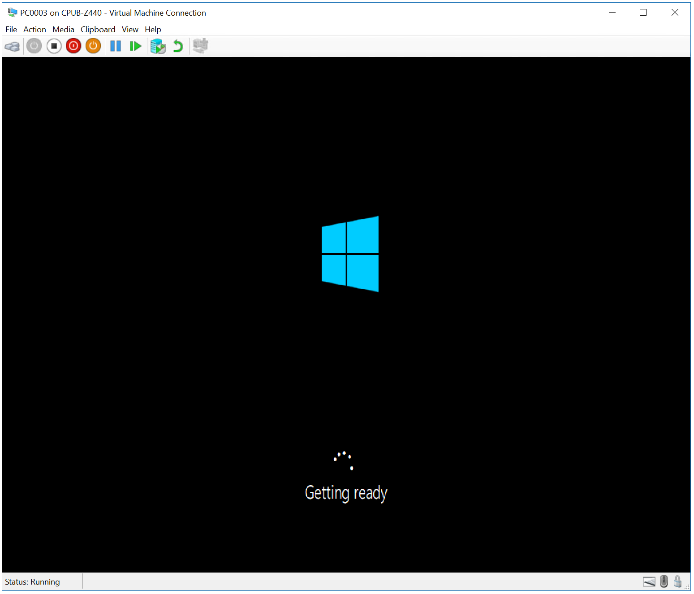
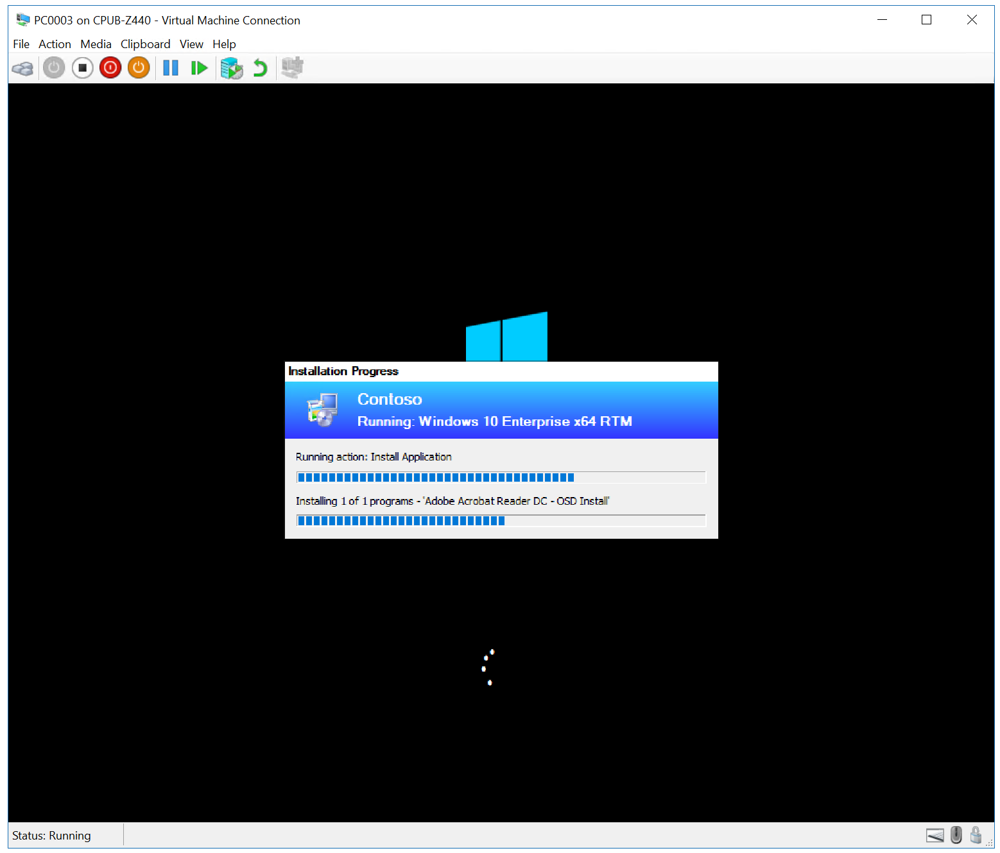
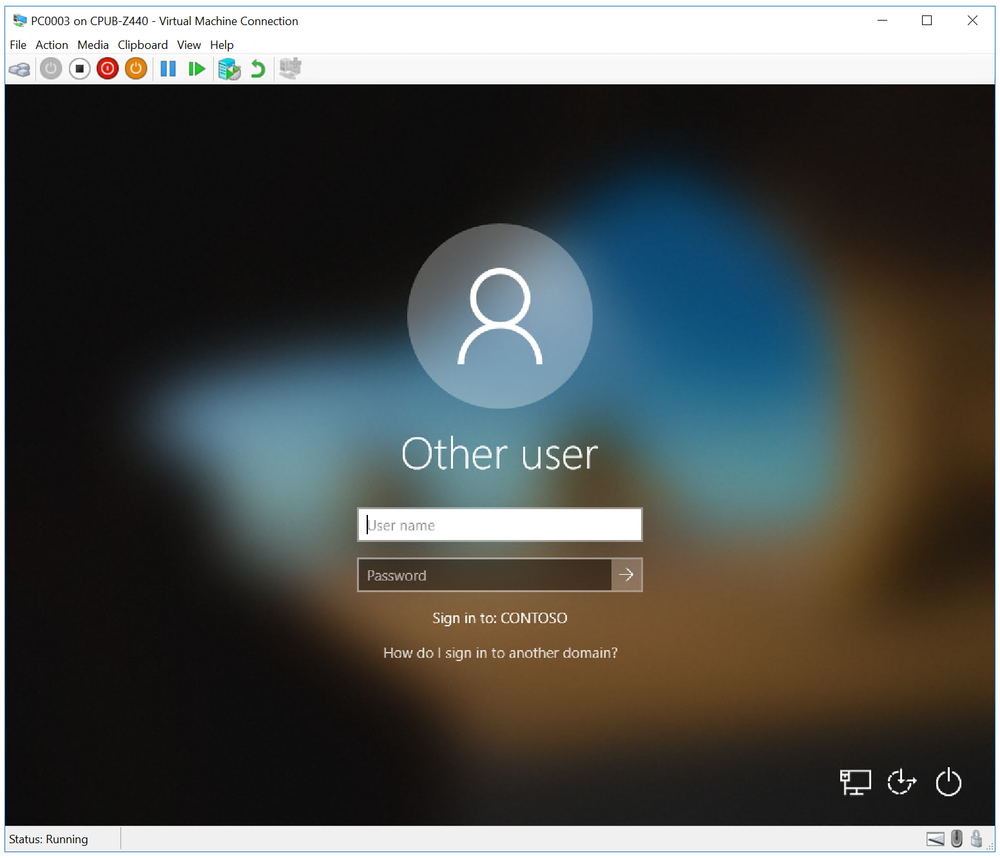
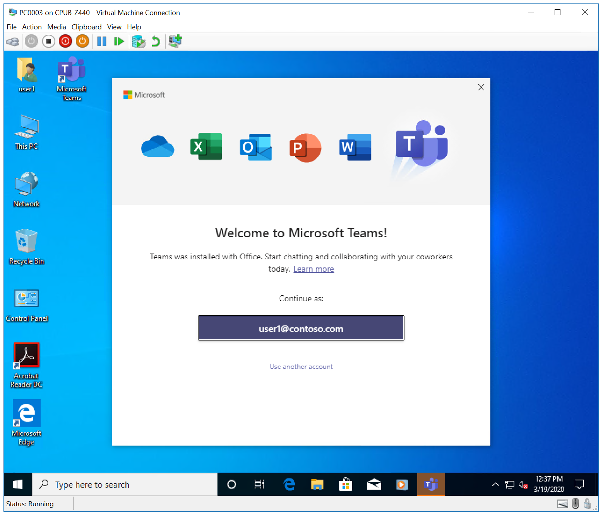

# Refresh a Windows 7 SP1 client with Windows 10 using Configuration Manager

**Applies to**

- Windows 10

This topic will show you how to refresh a Windows 7 SP1 client with Windows 10 using Configuration Manager and Microsoft Deployment Toolkit (MDT). A computer refresh is not the same as an in-place upgrade. A computer refresh involves storing user data and settings from the old installation, wiping the hard drives, installing a new OS, and then restoring the user data at the end of the installation. Also see the MDT refesh procedure: [Refresh a Windows 7 computer with Windows 10](../deploy-windows-mdt/refresh-a-windows-7-computer-with-windows-10.md).

A computer refresh with Configuration Manager works the same as it does with MDT Lite Touch installation. Configuration Manager also uses the User State Migration Tool (USMT) from the Windows Assessment and Deployment Kit (Windows ADK) 10 in the background. A computer refresh with Configuration Manager has the following steps:

1.  Data and settings are backed up locally in a backup folder.
2.  The partition is wiped, except for the backup folder.
3.  The new operating system image is applied.
4.  Other applications are installed.
5.  Data and settings are restored.

## Infrastructure

An existing Configuration Manager infrastructure that is integrated with MDT is used for the following procedures. For more information about the setup for this article, see [Prepare for Zero Touch Installation of Windows 10 with Configuration Manager](prepare-for-zero-touch-installation-of-windows-10-with-configuration-manager.md). 

For the purposes of this article, we will use one server computer (CM01) and one client computer (PC0003).
- CM01 is a domain member server and Configuration Manager software distribution point. In this guide CM01 is a standalone primary site server.
- PC0003 is a domain member client computer running Windows 7 SP1, or a later version of Windows, with the Configuration Manager client installed, that will be refreshed to Windows 10.

>[!NOTE]
>If desired, PC0003 can be a VM hosted on the server HV01, which is a Hyper-V host computer that we used previously to build a Windows 10 reference image. However, if PC0003 is a VM then you must ensure it has sufficient resources available to run the Configuration Manager OSD task sequence. 2GB of RAM or more is recommended.  

All servers are running Windows Server 2019. However, an earlier, supported version of Windows Server can also be used. 

All server and client computers referenced in this guide are on the same subnet. This is not required, but each server and client computer must be able to connect to each other to share files, and to resolve all DNS names and Active Directory information for the contoso.com domain. Internet connectivity is also required to download OS and application updates.

>[!IMPORTANT]
>This article assumes that you have [configured Active Directory permissions](prepare-for-zero-touch-installation-of-windows-10-with-configuration-manager.md#configure-active-directory-permissions) in the specified OU for the **CM_JD** account, and the client's Active Directory computer account is in the **Contoso > Computers > Workstations** OU. Use the Active Directory Users and Computers console to review the location of computer objects and move them if needed.

## Verify the Configuration Manager client settings

To verify that PC003 is correctly assigned to the PS1 site:

On **PC0003**:

1. Open the Configuration Manager control panel (control smscfgrc).
2. On the **Site** tab, click **Configure Settings**, then click **Find Site**.
3. Verify that Configuration Manager has successfully found a site to manage this client is displayed. See the following example.

## Create a device collection and add the PC0003 computer

On **CM01**:

1.  Using the Configuration Manager console, in the Asset and Compliance workspace, expand **Overview**, right-click **Device Collections**, and then select **Create Device Collection**. Use the following settings:

  * General
    * Name: Install Windows 10 Enterprise x64
    * Limited Collection: All Systems
  * Membership rules
    * Add Rule: Direct rule
      * Resource Class: System Resource
      * Attribute Name: Name
      * Value: PC0003
    * Select Resources
      * Select **PC0003**

  Use the default settings to complete the remaining wizard pages and click **Close**.

2.  Review the Install Windows 10 Enterprise x64 collection. Do not continue until you see the PC0003 machine in the collection.

    >[!NOTE]
    >It may take a short while for the collection to refresh; you can view progress via the Colleval.log file. If you want to speed up the process, you can manually update membership on the Install Windows 10 Enterprise x64 collection by right-clicking the collection and selecting Update Membership.

## Create a new deployment

On **CM01**:

Using the Configuration Manager console, in the Software Library workspace, expand **Operating Systems**, select **Task Sequences**, right-click **Windows 10 Enterprise x64 RTM**, and then click **Deploy**. Use the following settings:

- General
    - Collection: Install Windows 10 Enterprise x64
- Deployment Settings
    - Purpose: Available
    - Make available to the following: Configuration Manager clients, media and PXE

    >[!NOTE]
    >It is not necessary to make the deployment available to media and Pre-Boot Execution Environment (PXE) for a computer refresh, but you will use the same deployment for bare-metal deployments later on and you will need it at that point.

- Scheduling
    - &lt;default&gt;
- User Experience
    - &lt;default&gt;
- Alerts
    - &lt;default&gt;
- Distribution Points
    - &lt;default&gt;

## Initiate a computer refresh

Now you can start the computer refresh on PC0003.

On **CM01**:

1. Using the Configuration Manager console, in the Assets and Compliance workspace, click the **Install Windows 10 Enterprise x64** collection, right-click **PC0003**, point to **Client Notification**, click **Download Computer Policy**, and then click **OK** in the popup dialog box that appears.

On **PC0003**:

1.  Open the Software Center (click Start and type **Software Center**, or click the **New software is available** balloon in the system tray), select **Operating Systems** and click the **Windows 10 Enterprise x64 RTM** deployment, then click **Install**.
2.  In the **Software Center** warning dialog box, click **Install Operating System**. 
3. The client computer will run the Configuration Manager task sequence, boot into Windows PE, and install the new OS and applications. See the following examples:

 
 
 
 
 
 
 
 
 

Next, see [Replace a Windows 7 SP1 client with Windows 10 using Configuration Manager](replace-a-windows-7-client-with-windows-10-using-configuration-manager.md).

## Related topics

[Prepare for Zero Touch Installation of Windows 10 with Configuration Manager](prepare-for-zero-touch-installation-of-windows-10-with-configuration-manager.md) 
[Create a custom Windows PE boot image with Configuration Manager](create-a-custom-windows-pe-boot-image-with-configuration-manager.md) 
[Add a Windows 10 operating system image using Configuration Manager](add-a-windows-10-operating-system-image-using-configuration-manager.md) 
[Create an application to deploy with Windows 10 using Configuration Manager](create-an-application-to-deploy-with-windows-10-using-configuration-manager.md) 
[Add drivers to a Windows 10 deployment with Windows PE using Configuration Manager](add-drivers-to-a-windows-10-deployment-with-windows-pe-using-configuration-manager.md) 
[Create a task sequence with Configuration Manager and MDT](./create-a-task-sequence-with-configuration-manager-and-mdt.md) 
[Deploy Windows 10 using PXE and Configuration Manager](deploy-windows-10-using-pxe-and-configuration-manager.md) 
[Replace a Windows 7 SP1 client with Windows 10 using Configuration Manager](replace-a-windows-7-client-with-windows-10-using-configuration-manager.md) 