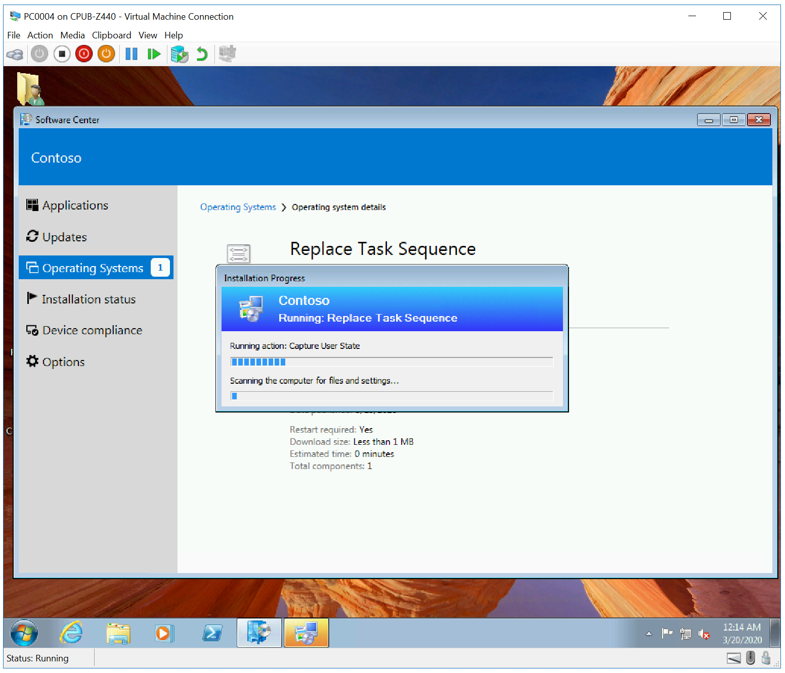
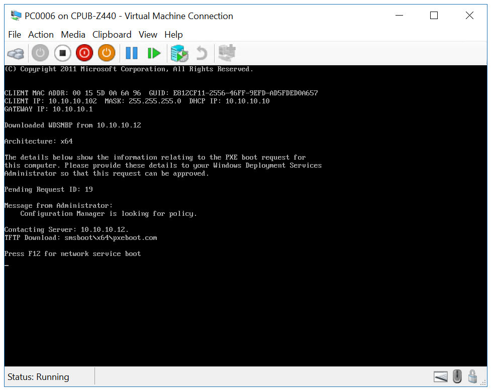
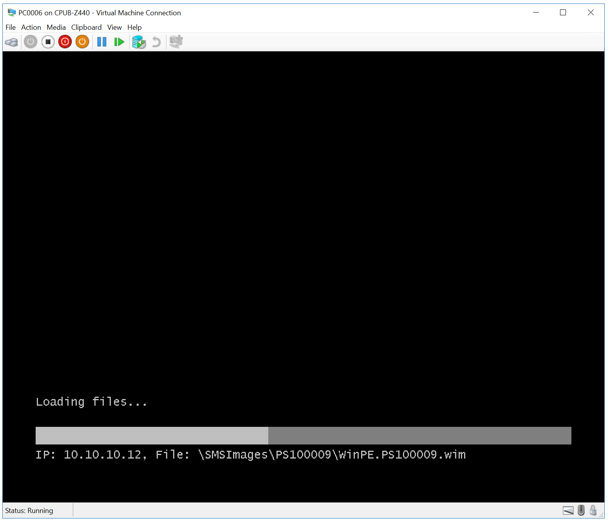
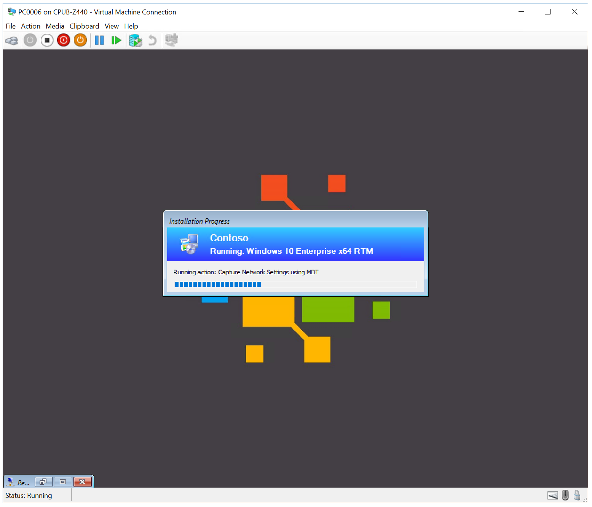
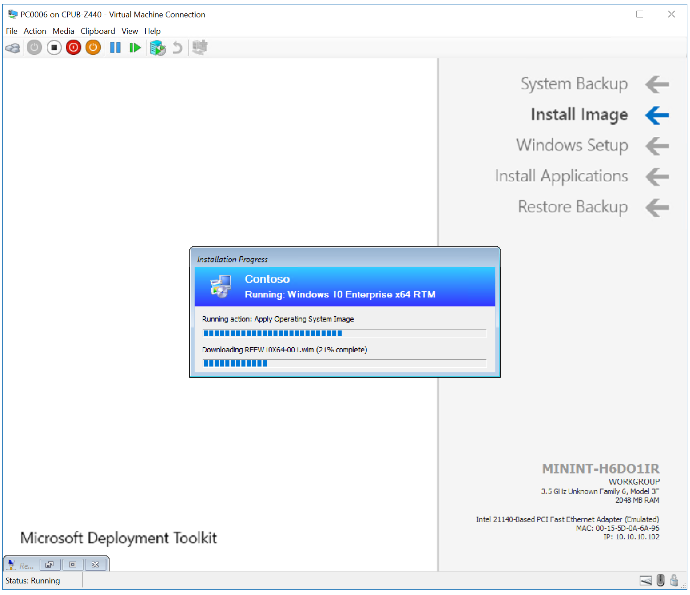
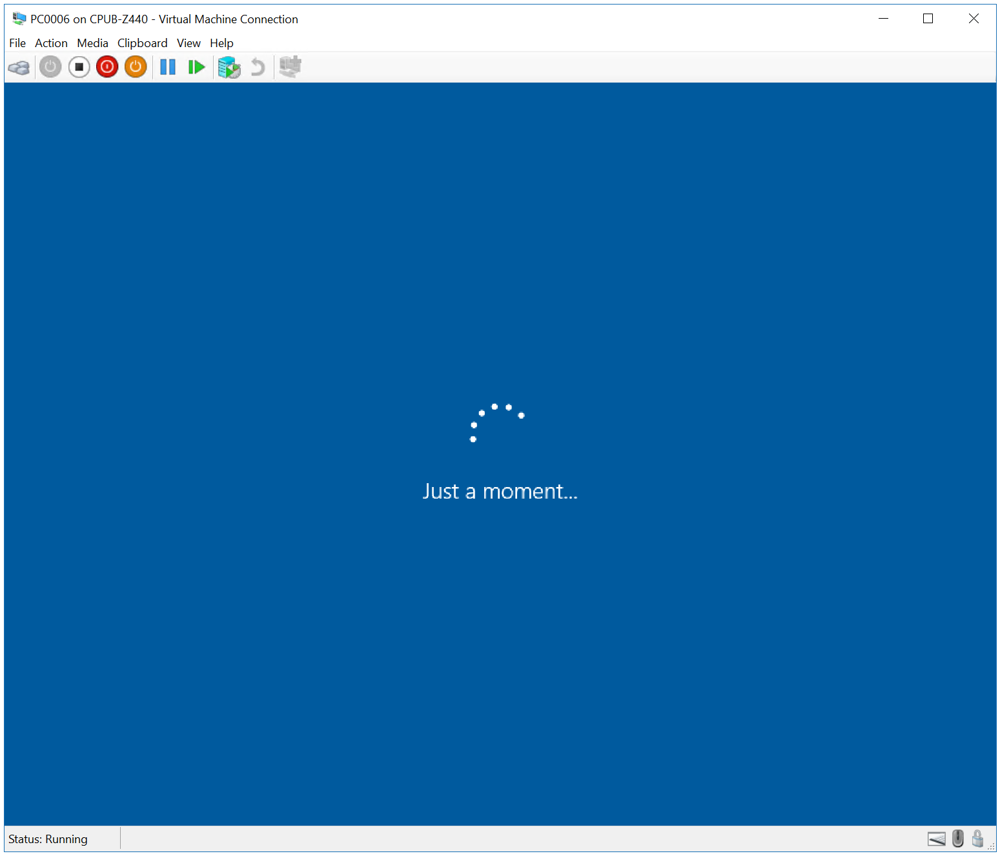
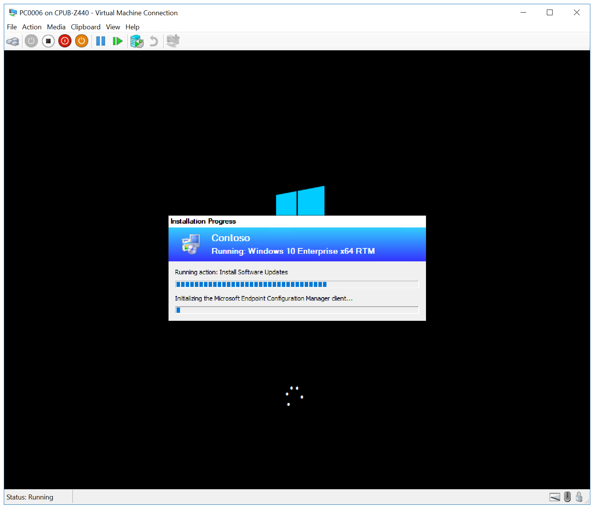
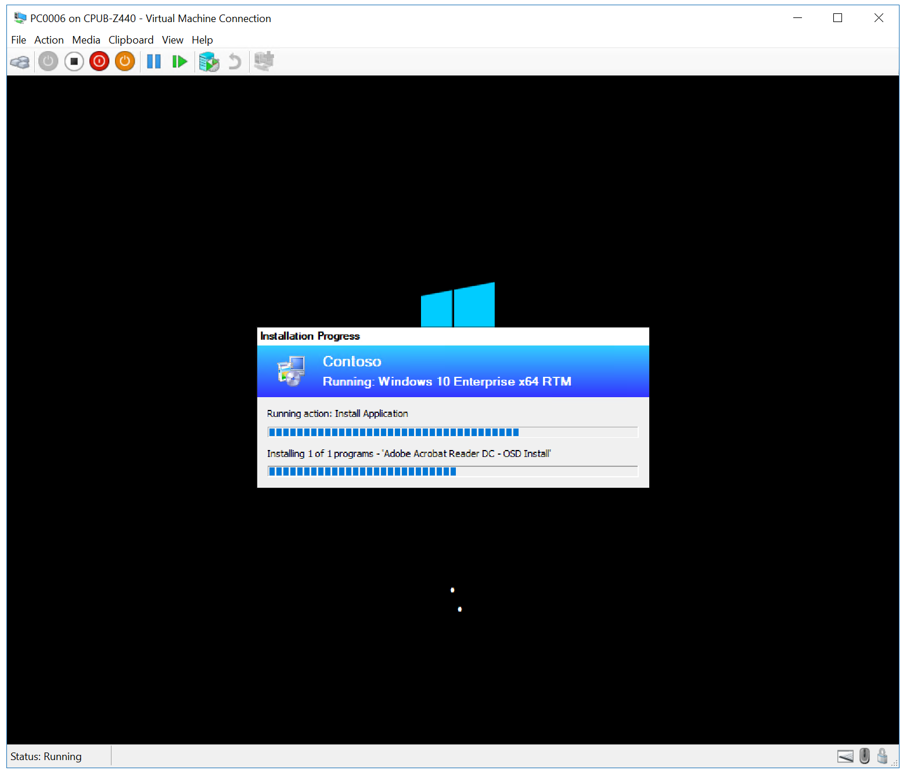
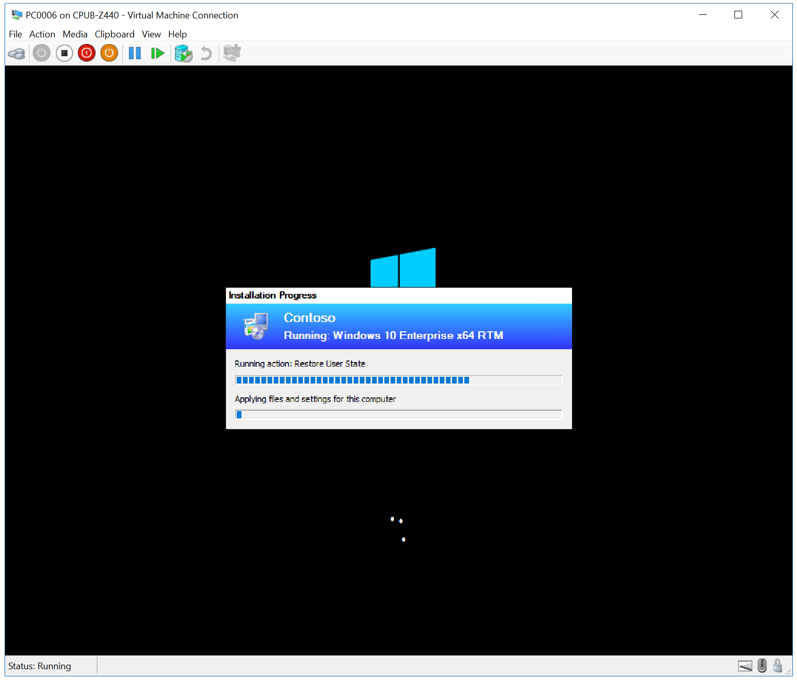
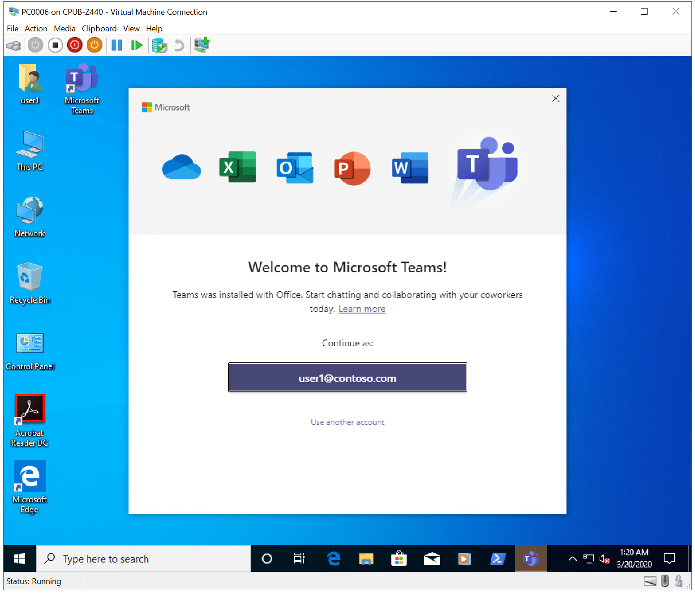

# Replace a Windows 7 SP1 client with Windows 10 using Configuration Manager

**Applies to**

- Windows 10

In this topic, you will learn how to replace a Windows 7 SP1 computer using Microsoft Endpoint Configuration Manager. This process is similar to refreshing a computer, but since you are replacing the device, you have to run the backup job separately from the deployment of Windows 10.

In this topic, you will create a backup-only task sequence that you run on PC0004 (the device you are replacing), deploy the PC0006 computer running Windows 10, and then restore this backup of PC0004 onto PC006. This is similar to the MDT replace process: [Replace a Windows 7 computer with a Windows 10 computer](../deploy-windows-mdt/replace-a-windows-7-computer-with-a-windows-10-computer.md).

## Infrastructure

An existing Configuration Manager infrastructure that is integrated with MDT is used for the following procedures. For more information about the setup for this article, see [Prepare for Zero Touch Installation of Windows 10 with Configuration Manager](prepare-for-zero-touch-installation-of-windows-10-with-configuration-manager.md). 

For the purposes of this article, we will use one server computer (CM01) and two client computers (PC0004, PC0006).
- CM01 is a domain member server and Configuration Manager software distribution point. In this guide CM01 is a standalone primary site server.
  - Important: CM01 must include the **[State migration point](https://docs.microsoft.com/configmgr/osd/get-started/manage-user-state#BKMK_StateMigrationPoint)** role for the replace task sequence used in this article to work. 
- PC0004 is a domain member client computer running Windows 7 SP1, or a later version of Windows, with the Configuration Manager client installed, that will be replaced.
- PC0006 is a domain member client computer running Windows 10, with the Configuration Manager client installed, that will replace PC0004.

>[!NOTE]
>PC0004 and PC006 can be VMs hosted on the server HV01, which is a Hyper-V host computer that we used previously to build a Windows 10 reference image. However, the VMs must have sufficient resources available to run the Configuration Manager OSD task sequence. 2GB of RAM or more is recommended.  

All servers are running Windows Server 2019. However, an earlier, supported version of Windows Server can also be used. 

All server and client computers referenced in this guide are on the same subnet. This is not required, but each server and client computer must be able to connect to each other to share files, and to resolve all DNS names and Active Directory information for the contoso.com domain. Internet connectivity is also required to download OS and application updates.

>[!IMPORTANT]
>This article assumes that you have [configured Active Directory permissions](prepare-for-zero-touch-installation-of-windows-10-with-configuration-manager.md#configure-active-directory-permissions) in the specified OU for the **CM_JD** account, and the client's Active Directory computer account is in the **Contoso > Computers > Workstations** OU. Use the Active Directory Users and Computers console to review the location of computer objects and move them if needed.

## Create a replace task sequence

On **CM01**:

1. Using the Configuration Manager console, in the Software Library workspace, expand **Operating Systems**, right-click **Task Sequences**, and select **Create MDT Task Sequence**.
2. On the **Choose Template** page, select the **Client Replace Task Sequence** template and click **Next**.
3. On the **General** page, assign the following settings and click **Next**:

   * Task sequence name: Replace Task Sequence
   * Task sequence comments: USMT backup only

4. On the **Boot Image** page, browse and select the **Zero Touch WinPE x64** boot image package. Then click **Next**.
5. On the **MDT Package** page, browse and select the **OSD / MDT** package. Then click **Next**.
6. On the **USMT Package** page, browse and select the **OSD / Microsoft Corporation User State Migration Tool for Windows** package. Then click **Next**.
7. On the **Settings Package** page, browse and select the **OSD / Windows 10 x64 Settings** package. Then click **Next**.
8. On the **Summary** page, review the details and then click **Next**.
9. On the **Confirmation** page, click **Finish**.

10. Review the Replace Task Sequence. 

    >[!NOTE]
    >This task sequence has many fewer actions than the normal client task sequence. If it doesn't seem different, make sure you selected the **Client Replace Task Sequence** template when creating the task sequence.

The backup-only task sequence (named Replace Task Sequence).

## Associate the new device with the old computer

This section walks you through the process of associating a new, blank device (PC0006), with an existing computer (PC0004), for the purpose of replacing PC0004 with PC0006. PC0006 can be either a physical or virtual machine.

On **HV01** (if PC0006 is a VM) or in the PC0006 BIOS:

1.  Make a note of the MAC address for PC0006. (If PC0006 is a virtual machine, you can see the MAC Address in the virtual machine settings.) In our example, the PC0006 MAC Address is 00:15:5D:0A:6A:96. Do not attempt to PXE boot PC0006 yet.

On **CM01**:

2.  Using the Configuration Manager console, in the Assets and Compliance workspace, right-click **Devices**, and then click **Import Computer Information**.
3.  On the **Select Source** page, select **Import single computer** and click **Next**.
4.  On the **Single Computer** page, use the following settings and then click **Next**:

    * Computer Name: PC0006
    * MAC Address: &lt;the mac address that you wrote down&gt;
    * Source Computer: PC0004

    

    Creating the computer association between PC0004 and PC0006.

5.  On the **User Accounts** page, select **Capture and restore all user accounts** and click **Next**.
6.  On the **Data Preview** page, click **Next**.
7.  On the **Choose additional collections** page, click **Add** and then select the **Install Windows 10 Enterprise x64** collection. Now, select the checkbox next to the Install Windows 10 Enterprise x64 collection you just added, and then click **Next**.
8.  On the **Summary** page, click **Next**, and then click **Close**.
9.  Select the **User State Migration** node and review the computer association in the right hand pane.
10. Right-click the **PC0004/PC0006** association and click **View Recovery Information**. Note that a recovery key has been assigned already, but a user state store location has not.
11. Review the **Install Windows 10 Enterprise x64** collection. Do not continue until you see the **PC0006** computer in the collection. You might have to update membership and refresh the collection again.

## Create a device collection and add the PC0004 computer

On **CM01**:

1.  Using the Configuration Manager console, in the Asset and Compliance workspace, right-click **Device Collections**, and then select **Create Device Collection**. Use the following settings:

    * General
      * Name: USMT Backup (Replace)
      * Limited Collection: All Systems
    * Membership rules:
      * Add Rule: Direct rule
        * Resource Class: System Resource
        * Attribute Name: Name
        * Value: PC0004
        * Select Resources:
          * Select **PC0004**

    Use default settings for the remaining wizard pages, then click **Close**.

2.  Review the **USMT Backup (Replace)** collection. Do not continue until you see the **PC0004** computer in the collection.

## Create a new deployment

On **CM01**:

Using the Configuration Manager console, in the Software Library workspace, expand **Operating Systems**, select **Task Sequences**, right-click **Replace Task Sequence**, and then select **Deploy**. Use the following settings:

-   General
    -   Collection: USMT Backup (Replace)
-   Deployment Settings
    -   Purpose: Available
    -   Make available to the following: Only Configuration Manager Clients
-   Scheduling
    -   &lt;default&gt;
-   User Experience
    -   &lt;default&gt;
-   Alerts
    -   &lt;default&gt;
-   Distribution Points
    -   &lt;default&gt;

## Verify the backup

This section assumes that you have a computer named PC0004 with the Configuration Manager client installed.

On **PC0004**:

1.  If it is not already started, start the PC0004 computer and open the Configuration Manager control panel (control smscfgrc).
2.  On the **Actions** tab, select **Machine Policy Retrieval & Evaluation Cycle**, click **Run Now**, and then click **OK** in the popup dialog box that appears.

    >[!NOTE]
    >You also can use the Client Notification option in the Configuration Manager console, as shown in [Refresh a Windows 7 SP1 client with Windows 10 using Configuration Manager](refresh-a-windows-7-client-with-windows-10-using-configuration-manager.md).

3.  Open the Software Center, select the **Replace Task Sequence** deployment and then click **Install**.
4.  Confirm you want to upgrade the operating system on this computer by clicking **Install** again.
5.  Allow the Replace Task Sequence to complete. The PC0004 computer will gather user data, boot into Windows PE and gather more data, then boot back to the full OS. The entire process should only take a few minutes.

Capturing the user state

On **CM01**:

6.  Open the state migration point storage folder (ex: D:\Migdata) and verify that a sub-folder was created containing the USMT backup.
7.  Using the Configuration Manager console, in the Assets and Compliance workspace, select the **User State Migration** node, right-click the **PC0004/PC0006** association, and select **View Recovery Information**. Note that the object now also has a user state store location.

    >[!NOTE]
    >It may take a few minutes for the user state store location to be populated.

## Deploy the new computer

On **PC0006**:

1. Start the PC0006 virtual machine (or physical computer), press **F12** to Pre-Boot Execution Environment (PXE) boot when prompted. Allow it to boot Windows Preinstallation Environment (Windows PE), and then complete the deployment wizard using the following settings:

    * Password: pass@word1
    * Select a task sequence to execute on this computer: Windows 10 Enterprise x64 RTM

2.  The setup now starts and does the following:

    * Installs the Windows 10 operating system
    * Installs the Configuration Manager client
    * Joins it to the domain
    * Installs the applications
    * Restores the PC0004 backup

When the process is complete, you will have a new Windows 10 computer in your domain with user data and settings restored. See the following examples:

 
 
 
 
 
 
 
 

Next, see [Perform an in-place upgrade to Windows 10 using Configuration Manager](upgrade-to-windows-10-with-configuraton-manager.md).

## Related topics

[Prepare for Zero Touch Installation of Windows 10 with Configuration Manager](prepare-for-zero-touch-installation-of-windows-10-with-configuration-manager.md) 
[Create a custom Windows PE boot image with Configuration Manager](create-a-custom-windows-pe-boot-image-with-configuration-manager.md) 
[Add a Windows 10 operating system image using Configuration Manager](add-a-windows-10-operating-system-image-using-configuration-manager.md) 
[Create an application to deploy with Windows 10 using Configuration Manager](create-an-application-to-deploy-with-windows-10-using-configuration-manager.md) 
[Add drivers to a Windows 10 deployment with Windows PE using Configuration Manager](add-drivers-to-a-windows-10-deployment-with-windows-pe-using-configuration-manager.md) 
[Create a task sequence with Configuration Manager and MDT](../deploy-windows-mdt/create-a-task-sequence-with-configuration-manager-and-mdt.md) 
[Deploy Windows 10 using PXE and Configuration Manager](deploy-windows-10-using-pxe-and-configuration-manager.md) 
[Refresh a Windows 7 SP1 client with Windows 10 using Configuration Manager](refresh-a-windows-7-client-with-windows-10-using-configuration-manager.md) 
