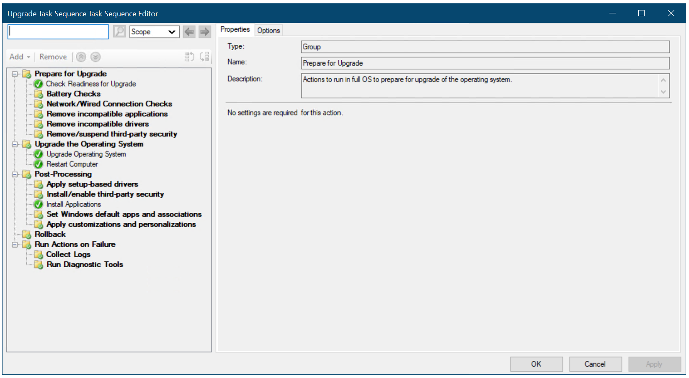
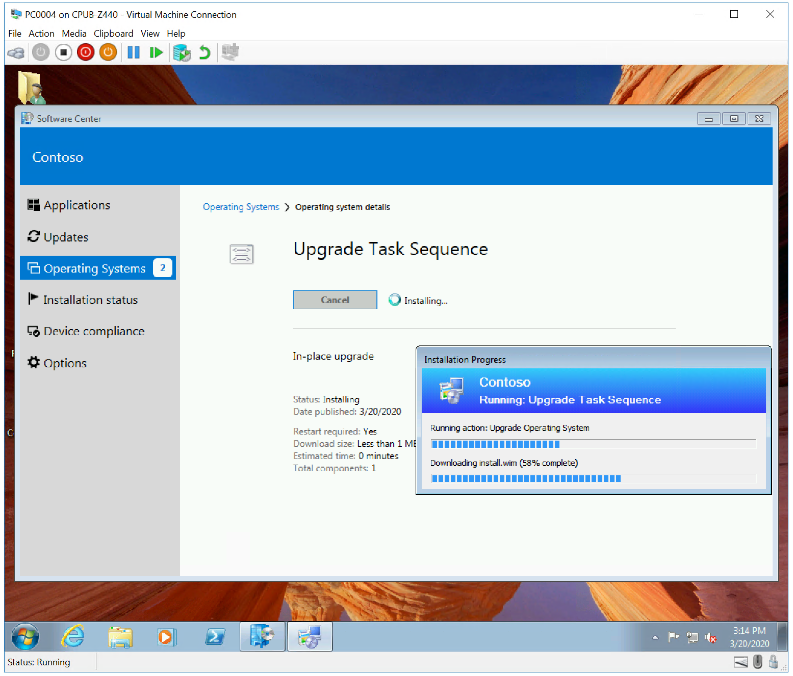
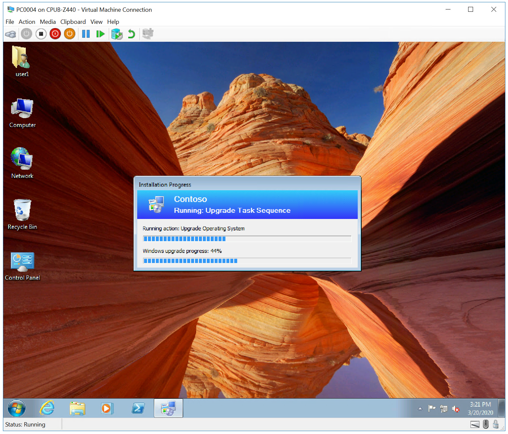
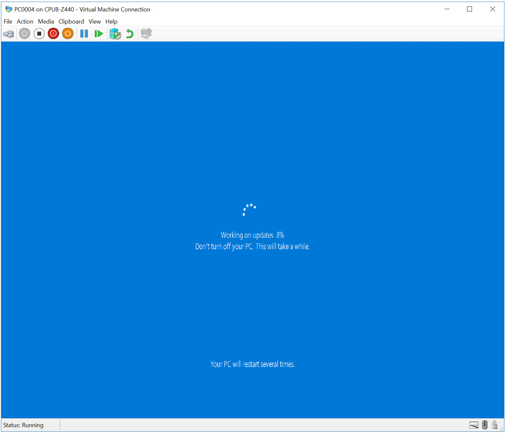
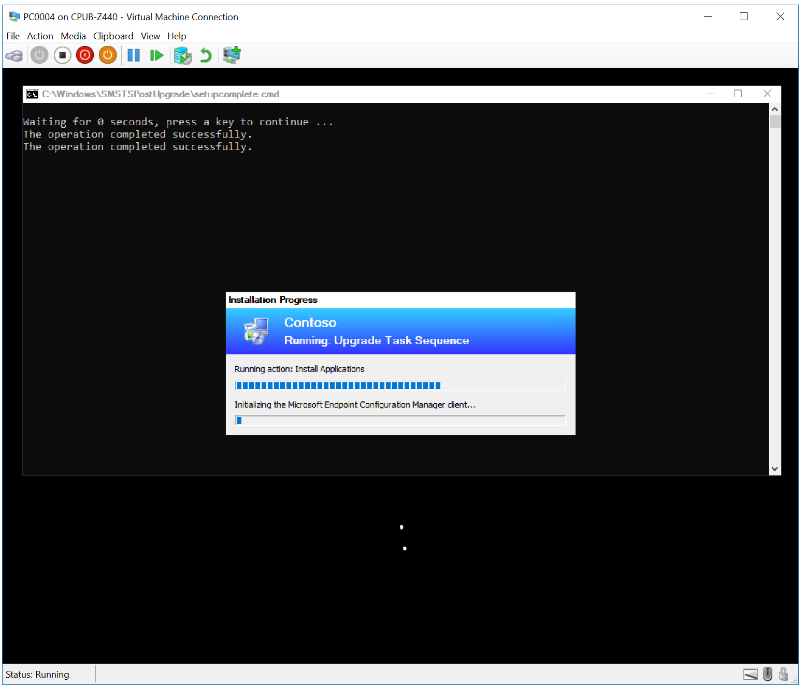
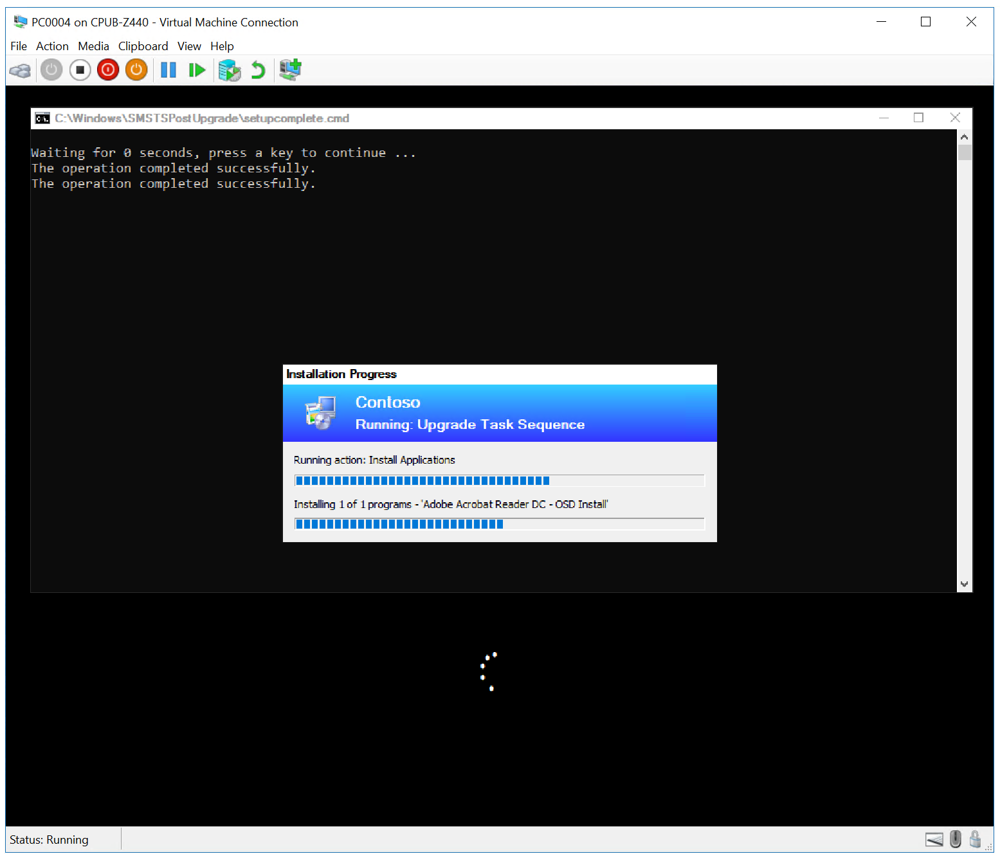
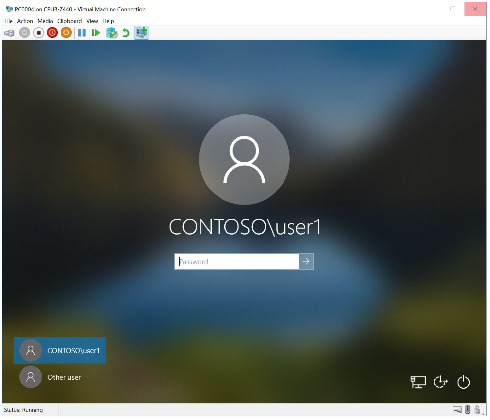
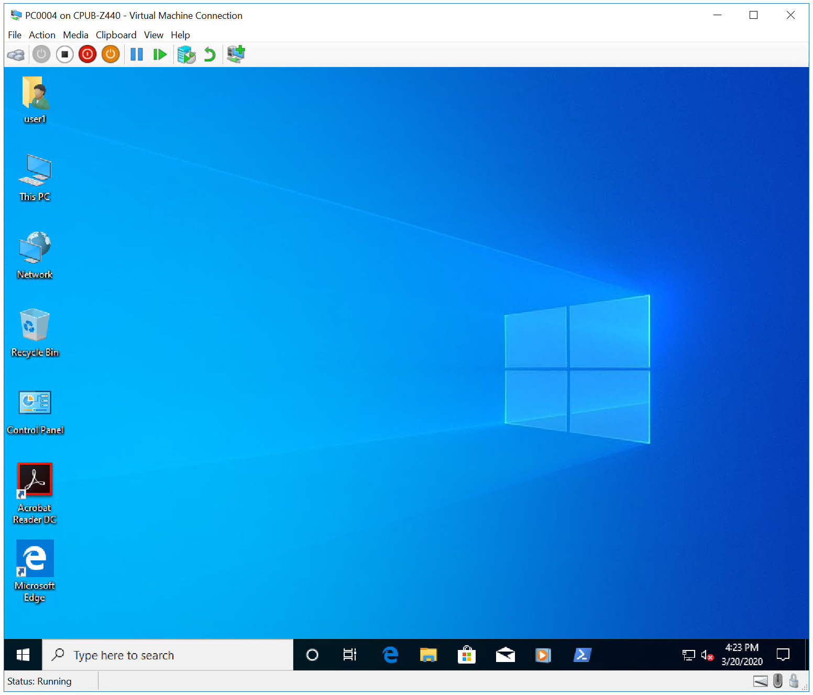

# Perform an in-place upgrade to Windows 10 using Configuration Manager

**Applies to**

-   Windows 10

The simplest path to upgrade PCs currently running Windows 7, Windows 8, or Windows 8.1 to Windows 10 is through an in-place upgrade. You can use a Microsoft Endpoint Manager task sequence to completely automate the process.

>[!IMPORTANT]
>Beginning with Windows 10 and Windows Server 2016, Windows Defender is already installed. A management client for Windows Defender is also installed automatically if the Configuration Manager client is installed. However, previous Windows operating systems installed the System Center Endpoint Protection (SCEP) client with the Configuration Manager client. The SCEP client can block in-place upgrade to Windows 10 due to incompatibility, and must be removed from a device before performing an in-place upgrade to Windows 10.

## Infrastructure

An existing Configuration Manager infrastructure that is integrated with MDT is used for the following procedures. For more information about the setup for this article, see [Prepare for Zero Touch Installation of Windows 10 with Configuration Manager](prepare-for-zero-touch-installation-of-windows-10-with-configuration-manager.md). 

For the purposes of this article, we will use one server computer (CM01) and one client computers (PC0004).
- CM01 is a domain member server and Configuration Manager software distribution point. In this guide CM01 is a standalone primary site server.
- PC0004 is a domain member client computer running Windows 7 SP1, or a later version of Windows, with the Configuration Manager client installed, that will be upgraded to Windows 10.

All servers are running Windows Server 2019. However, an earlier, supported version of Windows Server can also be used. 

All server and client computers referenced in this guide are on the same subnet. This is not required, but each server and client computer must be able to connect to each other to share files, and to resolve all DNS names and Active Directory information for the contoso.com domain. Internet connectivity is also required to download OS and application updates.

## Add an OS upgrade package

Configuration Manager Current Branch includes a native in-place upgrade task. This task sequence differs from the MDT in-place upgrade task sequence in that it does not use a default OS image, but rather uses an [OS upgrade package](/configmgr/osd/get-started/manage-operating-system-upgrade-packages).

On **CM01**:

1. Using the Configuration Manager console, in the Software Library workspace, expand **Operating Systems**, right-click **Operating System Upgrade Packages**, and click **Add Operating System Upgrade Package**.
2. On the **Data Source** page, under **Path**, click **Browse** and enter the UNC path to your media source. In this example, we have extracted the Windows 10 installation media to **\\\\cm01\\Sources$\\OSD\\UpgradePackages\\Windows 10**.
3. If you have multiple image indexes in the installation media, select **Extract a specific image index from install.wim...** and choose the image index you want from the dropdown menu. In this example, we have chosen **Windows 10 Enterprise**.
4. Next to **Architecture**, select **x64**, choose a language from the dropdown menu next to **Language**, and then click **Next**.
5. Next to **Name**, enter **Windows 10 x64 RTM** and then complete the wizard by clicking **Next** and **Close**.
6.  Distribute the OS upgrade package to the CM01 distribution point by right-clicking the **Windows 10 x64 RTM** OS upgrade package and then clicking **Distribute Content**.
7.  In the Distribute Content Wizard, add the CM01 distribution point, click **Next** and click **Close**.
8.  View the content status for the Windows 10 x64 RTM upgrade package. Do not continue until the distribution is completed (it might take a few minutes). You also can review the D:\\Program Files\\Microsoft Configuration Manager\\Logs\\distmgr.log file and look for the **STATMSG: ID=2301** line.

## Create an in-place upgrade task sequence

On **CM01**:

1. Using the Configuration Manager console, in the Software Library workspace, expand **Operating Systems**, right-click **Task Sequences**, and select **Create Task Sequence**.
2. On the **Create a new task sequence** page, select **Upgrade an operating system from an upgrade package** and click **Next**.
3. Use the following settings to complete the wizard:

   * Task sequence name: Upgrade Task Sequence
   * Description: In-place upgrade
   * Upgrade package: Windows 10 x64 RTM
   * Include software updates: Do not install any software updates
   * Install applications: OSD \ Adobe Acrobat Reader DC

4. Complete the wizard, and click **Close**.
5. Review the Upgrade Task Sequence.

The Configuration Manager upgrade task sequence

## Create a device collection

After you create the upgrade task sequence, you can create a collection to test a deployment. In this section, we assume you have the PC0004 computer running Windows 7 SP1, with the Configuration Manager client installed.

On **CM01**:

1.  Using the Configuration Manager console, in the Asset and Compliance workspace, right-click **Device Collections**, and then select **Create Device Collection**. Use the following settings:
    - General
        - Name: Windows 10 x64 in-place upgrade
        - Limited Collection: All Systems
    - Membership rules:
        - Direct rule
            - Resource Class: System Resource
            - Attribute Name: Name
            - Value: PC0004
        - Select Resources
          - Select PC0004

2.  Review the Windows 10 x64 in-place upgrade collection. Do not continue until you see PC0004 in the collection.

## Deploy the Windows 10 upgrade

In this section, you create a deployment for the Windows 10 Enterprise x64 Update application.

On **CM01**:

1.  Using the Configuration Manager console, in the Software Library workspace, right-click the **Upgrade Task Sequence** task sequence, and then click **Deploy**.
2.  On the **General** page, browse and select the **Windows 10 x64 in-place upgrade** collection, and then click **Next**.
3.  On the **Content** page, click **Next**.
4.  On the **Deployment Settings** page, click **Next**:
5.  On the **Scheduling** page, accept the default settings, and then click **Next**.
6.  On the **User Experience** page, accept the default settings, and then click **Next**.
7.  On the **Alerts** page, accept the default settings, and then click **Next**.
7.  On the **Distribution Points** page, accept the default settings, and then click **Next**.
8.  On the **Summary** page, click **Next**, and then click **Close**.

## Start the Windows 10 upgrade

Next, run the in-place upgrade task sequence on PC0004.

On **PC0004**:

1.  Open the Configuration Manager control panel (control smscfgrc).
2.  On the **Actions** tab, select **Machine Policy Retrieval & Evaluation Cycle**, click **Run Now**, and then click **OK** in the popup dialog box that appears.

    >[!NOTE]
    >You also can use the Client Notification option in the Configuration Manager console, as shown in [Refresh a Windows 7 SP1 client with Windows 10 using Configuration Manager](refresh-a-windows-7-client-with-windows-10-using-configuration-manager.md).

3.  Open the Software Center, select the **Upgrade Task Sequence** deployment and then click **Install**.
4.  Confirm you want to upgrade the operating system on this computer by clicking **Install** again.
5.  Allow the Upgrade Task Sequence to complete. The PC0004 computer will download the install.wim file, perform an in-place upgrade, and install your added applications. See the following examples:

 
 
 
 
 
 

In-place upgrade with Configuration Manager

## Related topics

[Windows 10 deployment scenarios](../windows-10-deployment-scenarios.md) 
[Configuration Manager Team blog](https://go.microsoft.com/fwlink/p/?LinkId=620109)