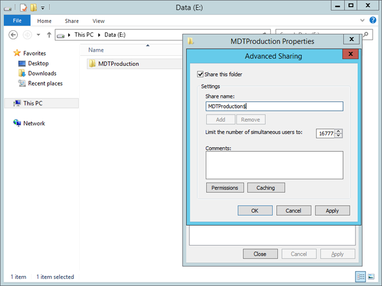
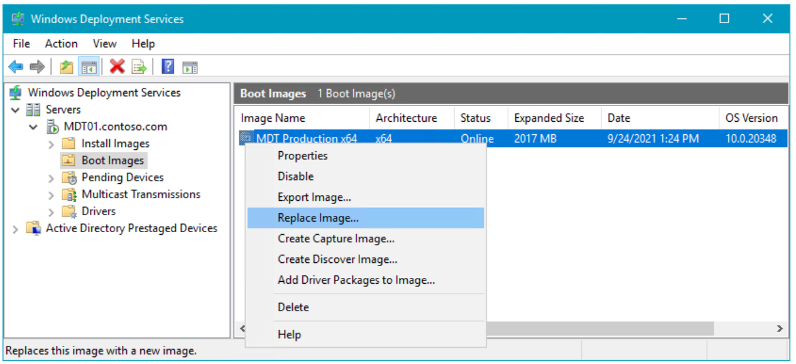
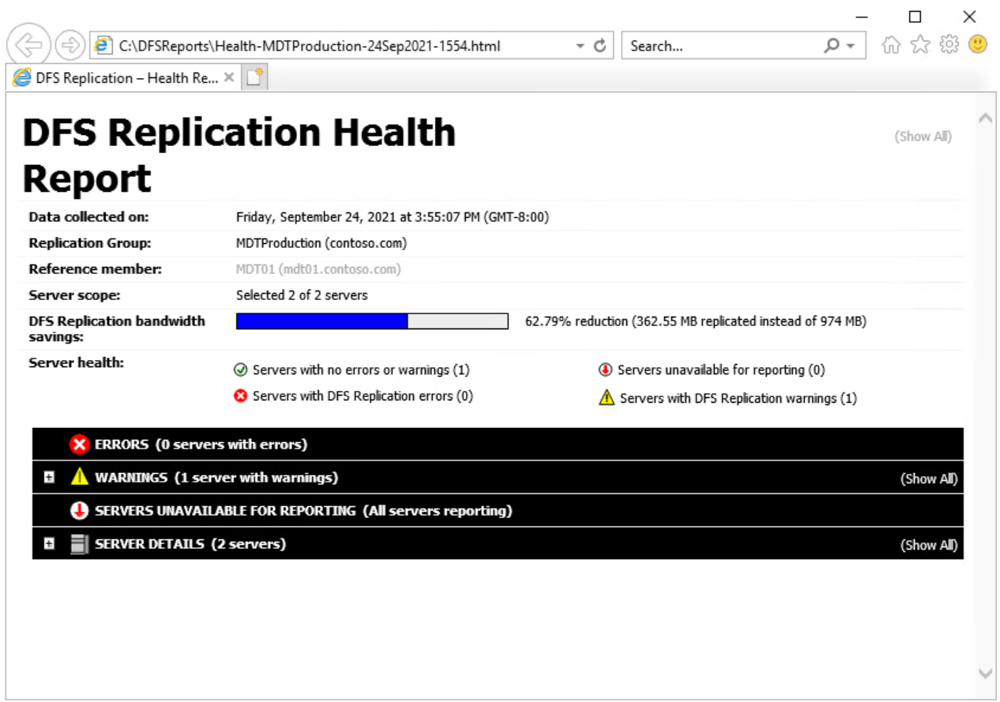

# Build a distributed environment for Windows 10 deployment

**Applies to**
-   Windows 10

In this topic, you will learn how to replicate your Windows 10 deployment shares to facilitate the deployment of Windows 10 in remote or branch locations. If you work in a distributed environment, replicating the deployment shares is an important part of the deployment solution. With images reaching 5 GB in size or more, you can't deploy machines in a remote office over the wire. You need to replicate the content, so that the clients can do local deployments.

We will use four machines for this topic: DC01, MDT01, MDT02, and PC0006. DC01 is a domain controller, MDT01 is a Windows Server 2012 R2 standard server, and PC0006 is a blank machine to which you will deploy Windows 10. You will configure a second deployment server (MDT02) for a remote site (Stockholm) by replicating the deployment share in the original site (New York). MDT01, MDT02, and PC0006 are members of the domain contoso.com for the fictitious Contoso Corporation. For more details on the setup for this topic, please see [Deploy Windows 10 with the Microsoft Deployment Toolkit](deploy-windows-10-with-the-microsoft-deployment-toolkit.md#proof).


Figure 1. The machines used in this topic.

## <a href="" id="sec01"></a>Replicate deployment shares

Replicating the content between MDT01 (New York) and MDT02 (Stockholm) can be done in a number of different ways. The most common content replication solutions with Microsoft Deployment Toolkit (MDT) use either the Linked Deployment Shares (LDS) feature or Distributed File System Replication (DFS-R). Some organizations have used a simple robocopy script for replication of the content.

**Note**  
Robocopy has options that allow for synchronization between folders. It has a simple reporting function; it supports transmission retry; and, by default, it will only copy/remove files from the source that are newer than files on the target.
 
### Linked deployment shares in MDT

LDS is a built-in feature in MDT for replicating content. However, LDS works best with strong connections such as LAN connections with low latency. For most WAN links, DFS-R is the better option.

### Why DFS-R is a better option

DFS-R is not only very fast and reliable, but it also offers central monitoring, bandwidth control, and a great delta replication engine. DFS-R will work equally well whether you have 2 sites or 90. When using DFS-R for MDT, we recommend running your deployment servers on Windows Server 2008 R2 or higher. From that version on, you can configure the replication target(s) as read-only, which is exactly what you want for MDT. This way, you can have your master deployment share centralized and replicate out changes as they happen. DFS-R will quickly pick up changes at the central deployment share in MDT01 and replicate the delta changes to MDT02.

## <a href="" id="sec02"></a>Set up Distributed File System Replication (DFS-R) for replication

Setting up DFS-R for replication is a quick and straightforward process. You prepare the deployment servers and then create a replication group. To complete the setup, you configure some replication settings.

### Prepare MDT01 for replication
1.  On MDT01, using Server Manager, click **Add roles and features**.
2.  On the **Select installation type** page, select **Role-based or feature-based installation**.
3.  On the **Select destination server** page, select **MDT01.contoso.com** and click **Next**.
4.  On the **Select server roles** page, expand **File and Storage Services (Installed)** and expand **File and iSCSI Services (Installed)**.
5.  In the **Roles** list, select **DFS Replication**. In the **Add Roles and Features Wizard** dialog box, select **Add Features**, and then click **Next**.

    

    Figure 2. Adding the DFS Replication role to MDT01.

6.  On the **Select features** page, accept the default settings, and click **Next**.
7.  On the **Confirm installation selections** page, click **Install**.
8.  On the **Installation progress** page, click **Close**.

### Prepare MDT02 for replication

1.  On MDT02, using Server Manager, click **Add roles and features**.
2.  On the **Select installation type** page, select **Role-based or feature-based installation**.
3.  On the **Select destination server** page, select **MDT02.contoso.com** and click **Next**.
4.  On the **Select server roles** page, expand **File and Storage Services (Installed)** and expand **File and iSCSI Services (Installed)**.
5.  In the **Roles** list, select **DFS Replication**. In the **Add Roles and Features Wizard** dialog box, select **Add Features**, and then click **Next**.
6.  On the **Select features** page, accept the default settings, and click **Next**.
7.  On the **Confirm installation selections** page, click **Install**.
8.  On the **Installation progress** page, click **Close**.

### Create the MDTProduction folder on MDT02

1.  On MDT02, using File Explorer, create the **E:\\MDTProduction** folder.
2.  Share the **E:\\MDTProduction** folder as **MDTProduction$**. Use the default permissions.

    

    Figure 3. Sharing the **E:\\MDTProduction folder** on MDT02.

### Configure the deployment share

When you have multiple deployment servers sharing the same content, you need to configure the Bootstrap.ini file with information about which server to connect to based on where the client is located. In MDT, that can be done by using the DefaultGateway property.
1. On MDT01, using Notepad, navigate to the **E:\\MDTProduction\\Control** folder and modify the Boostrap.ini file to look like this:

   ``` syntax
   [Settings]
   Priority=DefaultGateway, Default
   [DefaultGateway]
   192.168.1.1=NewYork
   192.168.2.1=Stockholm
   [NewYork]
   DeployRoot=\\MDT01\MDTProduction$
   [Stockholm]
   DeployRoot=\\MDT02\MDTProduction$
   [Default]
   UserDomain=CONTOSO
   UserID=MDT_BA
   SkipBDDWelcome=YES
   ```
   **Note**  
   The DeployRoot value needs to go into the Bootstrap.ini file, but you can use the same logic in the CustomSettings.ini file. For example, you can redirect the logs to the local deployment server (SLSHARE), or have the User State Migration Tool (USMT) migration store (UDDIR) local. To learn more about USMT, see [Refresh a Windows 7 computer with Windows 10](refresh-a-windows-7-computer-with-windows-10.md) and [Replace a Windows 7 computer with a Windows 10 computer](replace-a-windows-7-computer-with-a-windows-10-computer.md).
     
2. Save the Bootstrap.ini file.
3. Using the Deployment Workbench, right-click the **MDT Production** deployment share and select **Update Deployment Share**.

   

   Figure 4. Updating the MDT Production deployment share.

4. Use the default settings for the Update Deployment Share Wizard.
5. After the update is complete, use the Windows Deployment Services console. In the **Boot Images** node, right-click the **MDT Production x64** boot image and select **Replace Image**.

   

   Figure 5. Replacing the updated boot image in WDS.

6. Browse and select the **E:\\MDTProduction\\Boot\\LiteTouchPE\_x64.wim** boot image, and then complete Replace Boot Image Wizard using the default settings.
   ## <a href="" id="sec03"></a>Replicate the content
   Once the MDT01 and MDT02 servers are prepared, you are ready to configure the actual replication.
   ### Create the replication group
7. On MDT01, using DFS Management, right-click **Replication**, and select **New Replication Group**.
8. On the **Replication Group Type** page, select **Multipurpose replication group**, and click **Next**.
9. On the **Name and Domain** page, assign the **MDTProduction** name, and click **Next**.
10. On the **Replication Group Members** page, click **Add**, add **MDT01** and **MDT02**, and then click **Next**.

    

    Figure 6. Adding the Replication Group Members.

11. On the **Topology Selection** page, select the **Full mesh** option and click **Next**.
12. On the **Replication Group Schedule and Bandwidth** page, accept the default settings and click **Next**.
13. On the **Primary Member** page, select **MDT01** and click **Next**.
14. On the **Folders to Replicate** page, click **Add**, type in **E:\\MDTProduction** as the folder to replicate, click **OK**, and then click **Next**.
15. On the **Local Path of MDTProduction** on the **Other Members** page, select **MDT02**, and click **Edit**.
16. On the **Edit** page, select the **Enabled** option, type in **E:\\MDTProduction** as the local path of folder, select the **Make the selected replicated folder on this member read-only** check box, click **OK**, and then click **Next**.

    

    Figure 7. Configure the MDT02 member.

17. On the **Review Settings and Create Replication Group** page, click **Create**.
18. On the **Confirmation** page, click **Close**.
    ### Configure replicated folders
19. On MDT01, using DFS Management, expand **Replication** and then select **MDTProduction**.
20. In the middle pane, right-click the **MDT01** member and select **Properties**.
21. On the **MDT01 (MDTProduction) Properties** page, configure the following and then click **OK**:
    1.  In the **Staging** tab, set the quota to **20480 MB**.
    2.  In the **Advanced** tab, set the quota to **8192 MB**.
        In this scenario the size of the deployment share is known, but you might need to change the values for your environment. A good rule of thumb is to get the size of the 16 largest files and make sure they fit in the staging area. Here is a Windows PowerShell example that calculates the size of the 16 largest files in the E:\\MDTProduction deployment share:
        
        ``` syntax
        (Get-ChildItem E:\MDTProduction -Recurse | Sort-Object Length -Descending | Select-Object -First 16 | Measure-Object -Property Length -Sum).Sum /1GB
        ```

    

    Figure 8. Configure the Staging settings.

22. In the middle pane, right-click the **MDT02** member and select **Properties**.
23. On the **MDT02 (MDTProduction) Properties** page, configure the following and then click **OK**:
    1.  In the **Staging** tab, set the quota to **20480 MB**.
    2.  In the **Advanced** tab, set the quota to **8192 MB**.

**Note**  
It will take some time for the replication configuration to be picked up by the replication members (MDT01 and MDT02). The time for the initial sync will depend on the WAN link speed between the sites. After that, delta changes are replicated quickly.
 
### Verify replication
1.  On MDT02, wait until you start to see content appear in the **E:\\MDTProduction** folder.
2.  Using DFS Management, expand **Replication**, right-click **MDTProduction**, and select **Create Diagnostics Report**.
3.  In the Diagnostics Report Wizard, on the **Type of Diagnostics Report or Test** page, select **Health report** and click **Next**.
4.  On the **Path and Name** page, accept the default settings and click **Next**.
5.  On the **Members to Include** page, accept the default settings and click **Next**.
6.  On the **Options** page, accept the default settings and click **Next**.
7.  On the **Review Settings and Create Report** page, click **Create**.
8.  Open the report in Internet Explorer, and if necessary, select the **Allow blocked content** option.



Figure 9. The DFS Replication Health Report.

## <a href="" id="sec04"></a>Configure Windows Deployment Services (WDS) in a remote site

Like you did in the previous topic for MDT01, you need to add the MDT Production Lite Touch x64 Boot image to Windows Deployment Services on MDT02. For the following steps, we assume that WDS has already been installed on MDT02.
1.  On MDT02, using the WDS console, right-click **Boot Images** and select **Add Boot Image**.
2.  Browse to the E:\\MDTProduction\\Boot\\LiteTouchPE\_x64.wim file and add the image with the default settings.

## <a href="" id="sec05"></a>Deploy the Windows 10 client to the remote site

Now you should have a solution ready for deploying the Windows 10 client to the remote site, Stockholm, connecting to the MDT Production deployment share replica on MDT02.

1.  Create a virtual machine with the following settings:
    1.  Name: PC0006
    2.  Location: C:\\VMs
    3.  Generation: 2
    4.  Memory: 2048 MB
    5.  Hard disk: 60 GB (dynamic disk)
2.  Start the PC0006 virtual machine, and press **Enter** to start the Pre-Boot Execution Environment (PXE) boot. The machine will now load the Windows PE boot image from the WDS server.
3.  After Windows Preinstallation Environment (Windows PE) has booted, complete the Windows Deployment Wizard using the following settings:
    1.  Password: P@ssw0rd
    2.  Select a task sequence to execute on this computer:
        1.  Windows 10 Enterprise x64 RTM Custom Image
        2.  Computer Name: PC0006
        3.  Applications: Select the Install - Adobe Reader XI - x86 application
4.  The setup will now start and do the following:
    1.  Install the Windows 10 Enterprise operating system.
    2.  Install the added application.
    3.  Update the operating system via your local Windows Server Update Services (WSUS) server.

## Related topics

[Get started with the Microsoft Deployment Toolkit (MDT)](get-started-with-the-microsoft-deployment-toolkit.md)

[Create a Windows 10 reference image](create-a-windows-10-reference-image.md)

[Deploy a Windows 10 image using MDT](deploy-a-windows-10-image-using-mdt.md)

[Refresh a Windows 7 computer with Windows 10](refresh-a-windows-7-computer-with-windows-10.md)

[Replace a Windows 7 computer with a Windows 10 computer](replace-a-windows-7-computer-with-a-windows-10-computer.md)

[Configure MDT settings](configure-mdt-settings.md)
 
 
