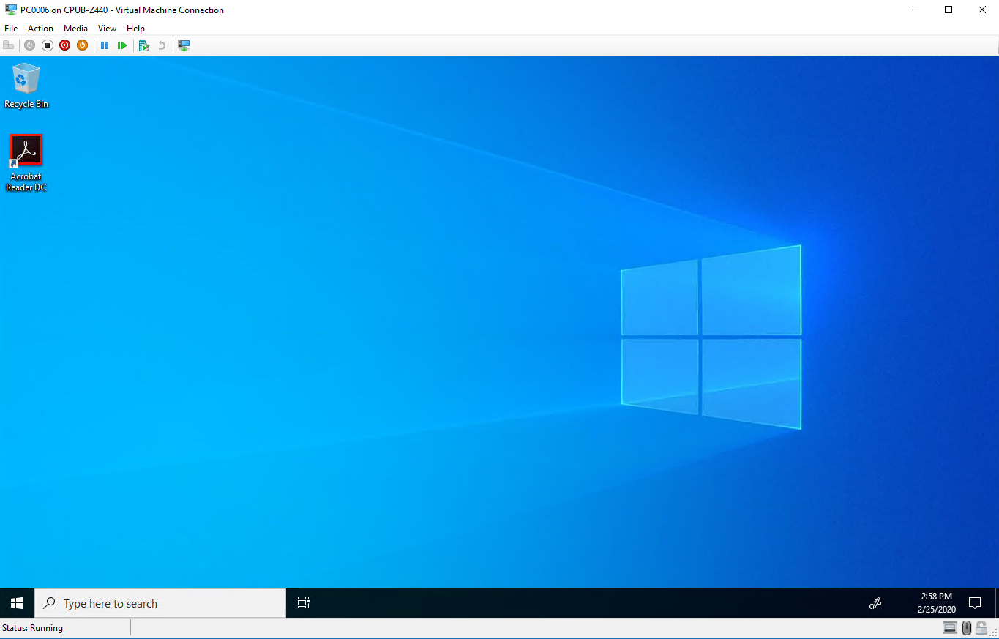

# Build a distributed environment for Windows 10 deployment

**Applies to**
-   Windows 10

Perform the steps in this article to build a distributed environment for Windows 10 deployment. A distributed environment for deployment is useful when you have a segmented network, for example one that is segmented geographically into two branch locations. If you work in a distributed environment, replicating the deployment shares is an important part of a deployment solution because images of 5 GB or more in size can present bandwidth issues when deployed over the wire. Replicating this content enables clients to do local deployments.

Four computers are used in this topic: DC01, MDT01, MDT02, and PC0006. DC01 is a domain controller, MDT01 and MDT02 are domain member computers running Windows Server 2019, and PC0006 is a blank device where we will deploy Windows 10. The second deployment server (MDT02) will be configured for a remote site (Stockholm) by replicating the deployment share on MDT01 at the original site (New York). All devices are members of the domain contoso.com for the fictitious Contoso Corporation. 

For the purposes of this article, we assume that MDT02 is prepared with the same network and storage capabilities that were specified for MDT01, except that MDT02 is located on a different subnet than MDT01. For more details on the infrastructure setup for this topic, please see [Prepare for deployment with MDT](prepare-for-windows-deployment-with-mdt.md).


Computers used in this topic.

>HV01 is also used in this topic to host the PC0006 virtual machine.

## Replicate deployment shares

Replicating the content between MDT01 (New York) and MDT02 (Stockholm) can be done in a number of different ways. The most common content replication solutions with Microsoft Deployment Toolkit (MDT) use either the Linked Deployment Shares (LDS) feature or Distributed File System Replication (DFS-R). Some organizations have used a simple robocopy script for replication of the content.

> [!NOTE]
> Robocopy has options that allow for synchronization between folders. It has a simple reporting function; it supports transmission retry; and, by default, it will only copy/remove files from the source that are newer than files on the target.
 
### Linked deployment shares in MDT

LDS is a built-in feature in MDT for replicating content. However, LDS works best with strong connections such as LAN connections with low latency. For most WAN links, DFS-R is the better option.

### Why DFS-R is a better option

DFS-R is not only very fast and reliable, but it also offers central monitoring, bandwidth control, and a great delta replication engine. DFS-R will work equally well whether you have 2 sites or 90. When using DFS-R for MDT, we recommend running your deployment servers on Windows Server 2008 R2 or higher. From that version on, you can configure the replication targets as read-only, which is exactly what you want for MDT. This way, you can have your master deployment share centralized and replicate out changes as they happen. DFS-R will quickly pick up changes at the central deployment share in MDT01 and replicate the delta changes to MDT02.

## Set up Distributed File System Replication (DFS-R) for replication

Setting up DFS-R for replication is a quick and straightforward process: Prepare the deployment servers, create a replication group, then configure some replication settings.

### Prepare MDT01 for replication

On **MDT01**:

1. Install the DFS Replication role on MDT01 by entering the following at an elevated Windows PowerShell prompt:

```powershell
Install-WindowsFeature -Name FS-DFS-Replication -IncludeManagementTools
```

2. Wait for installation to comlete, and then verify that the installation was successful. See the following output:

```output
PS C:\> Install-WindowsFeature -Name FS-DFS-Replication -IncludeManagementTools

Success Restart Needed Exit Code      Feature Result
------- -------------- ---------      --------------
True    No             Success        {DFS Replication, DFS Management Tools, Fi...
```

### Prepare MDT02 for replication

On **MDT02**:

1. Perform the same procedure on MDT02 by entering the following at an elevated Windows PowerShell prompt:

```powershell
Install-WindowsFeature -Name FS-DFS-Replication -IncludeManagementTools
```

2. Wait for installation to comlete, and then verify that the installation was successful. See the following  output:

```output
PS C:\> Install-WindowsFeature -Name FS-DFS-Replication -IncludeManagementTools

Success Restart Needed Exit Code      Feature Result
------- -------------- ---------      --------------
True    No             Success        {DFS Replication, DFS Management Tools, Fi...
```

### Create the MDTProduction folder on MDT02

On **MDT02**:

1. Create and share the **D:\\MDTProduction** folder using default permissions by entering the following at an elevated command prompt:

  ```powershell
  mkdir d:\MDTProduction
  New-SmbShare -Name "MDTProduction$" -Path "D:\MDTProduction"
  ```
  
2. You should see the following output:

  ```output
  C:\> New-SmbShare -Name "MDTProduction$" -Path "D:\MDTProduction"
  
  Name           ScopeName Path             Description
  ----           --------- ----             -----------
  MDTProduction$ *         D:\MDTProduction
  ```

### Configure the deployment share

When you have multiple deployment servers sharing the same content, you need to configure the Bootstrap.ini file with information about which server to connect to based on where the client is located. In MDT, that can be done by using the DefaultGateway property.

On **MDT01**:

1. Using Notepad, navigate to the **D:\\MDTProduction\\Control** folder and modify the Boostrap.ini file as follows. Under [DefaultGateway] enter the IP addresses for the client's default gateway in New York and Stockholm, respectively (replace 10.10.10.1 and 10.10.20.1 with your default gateways). The default gateway setting is what tells the client which deployment share (i.e. server) to use. 

   ```ini
   [Settings]
   Priority=DefaultGateway, Default

   [DefaultGateway]
   10.10.10.1=NewYork
   10.10.20.1=Stockholm

   [NewYork]
   DeployRoot=\\MDT01\MDTProduction$

   [Stockholm]
   DeployRoot=\\MDT02\MDTProduction$

   [Default]
   UserDomain=CONTOSO
   UserID=MDT_BA
   UserPassword=pass@word1
   SkipBDDWelcome=YES
   ```
   >[!NOTE]
   >The DeployRoot value needs to go into the Bootstrap.ini file, but you can use the same logic in the CustomSettings.ini file. For example, you can redirect the logs to the local deployment server (SLSHARE), or have the User State Migration Tool (USMT) migration store (UDDIR) local. To learn more about USMT, see [Refresh a Windows 7 computer with Windows 10](refresh-a-windows-7-computer-with-windows-10.md) and [Replace a Windows 7 computer with a Windows 10 computer](replace-a-windows-7-computer-with-a-windows-10-computer.md).
     
2. Save the Bootstrap.ini file.
3. Using the Deployment Workbench, right-click the **MDT Production** deployment share and select **Update Deployment Share**. Use the default settings for the Update Deployment Share Wizard. This process will take a few minutes.
4. After the update is complete, use the Windows Deployment Services console on MDT01. In the **Boot Images** node, right-click the **MDT Production x64** boot image and select **Replace Image**.
5. Browse and select the **D:\\MDTProduction\\Boot\\LiteTouchPE\_x64.wim** boot image, and then complete Replace Boot Image Wizard using the default settings.

   

   Replacing the updated boot image in WDS.

 >[!TIP]
 >If you modify bootstrap.ini again later, be sure to repeat the process of updating the deployment share in the Deployment Workbench and replacing the boot image in the WDS console.

   ## Replicate the content

   Once the MDT01 and MDT02 servers are prepared, you are ready to configure the actual replication.

   ### Create the replication group

6. On MDT01, using DFS Management (dfsmgmt.msc), right-click **Replication**, and click **New Replication Group**.
7. On the **Replication Group Type** page, select **Multipurpose replication group**, and click **Next**.
8. On the **Name and Domain** page, assign the **MDTProduction** name, and click **Next**.
9. On the **Replication Group Members** page, click **Add**, add **MDT01** and **MDT02**, and then click **Next**.

    

    Adding the Replication Group Members.

10. On the **Topology Selection** page, select the **Full mesh** option and click **Next**.
11. On the **Replication Group Schedule and Bandwidth** page, accept the default settings and click **Next**.
12. On the **Primary Member** page, select **MDT01** and click **Next**.
13. On the **Folders to Replicate** page, click **Add**, enter **D:\\MDTProduction** as the folder to replicate, click **OK**, and then click **Next**.
14. On the **Local Path of MDTProduction** on the **Other Members** page, select **MDT02**, and click **Edit**.
15. On the **Edit** page, select the **Enabled** option, type in **D:\\MDTProduction** as the local path of folder, select the **Make the selected replicated folder on this member read-only** check box, click **OK**, and then click **Next**.
16. On the **Review Settings and Create Replication Group** page, click **Create**.
17. On the **Confirmation** page, click **Close**.

    ### Configure replicated folders

18. On **MDT01**, using DFS Management, expand **Replication** and then select **MDTProduction**.
19. In the middle pane, right-click the **MDT01** member and click **Properties**.
20. On the **MDT01 (MDTProduction) Properties** page, configure the following and then click **OK**:
    1.  In the **Staging** tab, set the quota to **20480 MB**.
    2.  In the **Advanced** tab, set the quota to **8192 MB**.
        In this scenario the size of the deployment share is known, but you might need to change the values for your environment. A good rule of thumb is to get the size of the 16 largest files and make sure they fit in the staging area. Below is a Windows PowerShell example that calculates the size of the 16 largest files in the D:\\MDTProduction deployment share:
        
        ``` powershell
        (Get-ChildItem D:\MDTProduction -Recurse | Sort-Object Length -Descending | Select-Object -First 16 | Measure-Object -Property Length -Sum).Sum /1GB
        ```

21. In the middle pane, right-click the **MDT02** member and select **Properties**.
22. On the **MDT02 (MDTProduction) Properties** page, configure the following and then click **OK**:
    1.  In the **Staging** tab, set the quota to **20480 MB**.
    2.  In the **Advanced** tab, set the quota to **8192 MB**.

    > [!NOTE]
    > It will take some time for the replication configuration to be picked up by the replication members (MDT01 and MDT02). The time for the initial sync will depend on the WAN link speed between the sites. After that, delta changes are replicated quickly.

23. Verify that MDT01 and MDT02 are members of the MDTProduction replication group, with MDT01 being primary as follows using an elevated command prompt:

```cmd
C:\> dfsradmin membership list /rgname:MDTProduction /attr:MemName,IsPrimary
MemName  IsPrimary
MDT01    Yes
MDT02    No
```

### Verify replication

On **MDT02**:

1. Wait until you start to see content appear in the **D:\\MDTProduction** folder.
2. Using DFS Management, expand **Replication**, right-click **MDTProduction**, and select **Create Diagnostics Report**.
3. In the Diagnostics Report Wizard, on the **Type of Diagnostics Report or Test** page, choose **Health report** and click **Next**.
4. On the **Path and Name** page, accept the default settings and click **Next**.
5. On the **Members to Include** page, accept the default settings and click **Next**.
6. On the **Options** page, accept the default settings and click **Next**.
7. On the **Review Settings and Create Report** page, click **Create**.
8. Open the report in Internet Explorer, and if necessary, select the **Allow blocked content** option.


The DFS Replication Health Report.

>If there are replication errors you can review the DFS event log in Event Viewer under **Applications and Services Logs**.

## Configure Windows Deployment Services (WDS) in a remote site

Like you did in the previous topic for MDT01, you need to add the MDT Production Lite Touch x64 Boot image to Windows Deployment Services on MDT02. For the following steps, we assume that WDS has already been installed on MDT02.
1. On MDT02, using the WDS console, right-click **Boot Images** and select **Add Boot Image**.
2. Browse to the **D:\\MDTProduction\\Boot\\LiteTouchPE\_x64.wim** file and add the image with the default settings.

## Deploy a Windows 10 client to the remote site

Now you should have a solution ready for deploying the Windows 10 client to the remote site: Stockholm, using the MDTProduction deployment share replica on MDT02. You can test this deployment with the following optional procedure. 

>For demonstration purposes, the following procedure uses a virtual machine (PC0006) hosted by the Hyper-V server HV01. To use the remote site server (MDT02) the VM must be assigned a default gateway that matches the one you entered in the Boostrap.ini file.

1.  Create a virtual machine with the following settings:
    1. Name: PC0006
    2. Location: C:\\VMs
    3. Generation: 2
    4. Memory: 2048 MB
    5. Hard disk: 60 GB (dynamic disk)
    6. Install an operating system from a network-based installation server
2.  Start the PC0006 virtual machine, and press **Enter** to start the Pre-Boot Execution Environment (PXE) boot. The VM will now load the Windows PE boot image from the WDS server.
3.  After Windows Preinstallation Environment (Windows PE) has booted, complete the Windows Deployment Wizard using the following settings:
    1.  Select a task sequence to execute on this computer: Windows 10 Enterprise x64 RTM Custom Image 
    2.  Computer Name: PC0006
    3.  Applications: Select the Install - Adobe Reader
4.  Setup will now start and perform the following:
    1.  Install the Windows 10 Enterprise operating system.
    2.  Install applications.
    3.  Update the operating system using your local Windows Server Update Services (WSUS) server.



## Related topics

[Get started with the Microsoft Deployment Toolkit (MDT)](get-started-with-the-microsoft-deployment-toolkit.md)<br>
[Create a Windows 10 reference image](create-a-windows-10-reference-image.md)<br>
[Deploy a Windows 10 image using MDT](deploy-a-windows-10-image-using-mdt.md)<br>
[Refresh a Windows 7 computer with Windows 10](refresh-a-windows-7-computer-with-windows-10.md)<br>
[Replace a Windows 7 computer with a Windows 10 computer](replace-a-windows-7-computer-with-a-windows-10-computer.md)<br>
[Configure MDT settings](configure-mdt-settings.md)