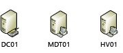
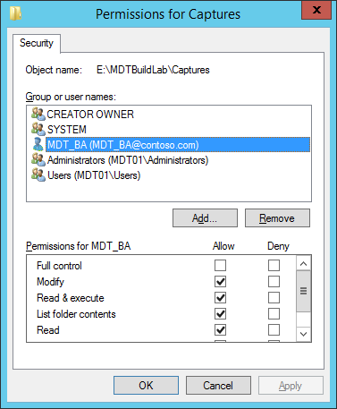
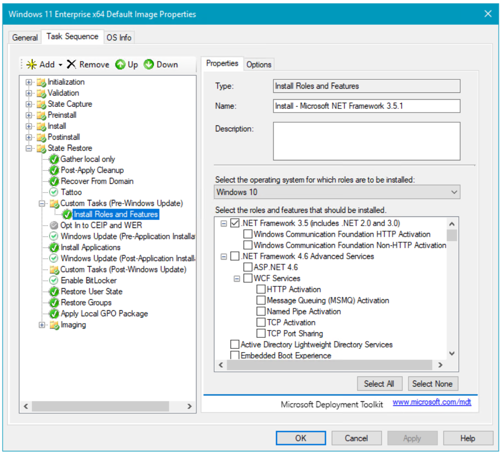
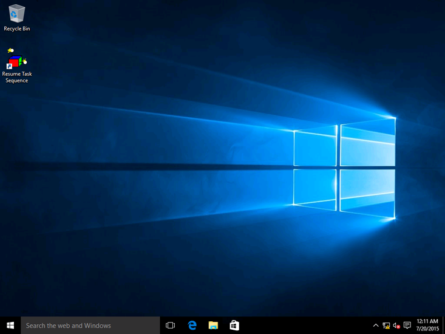
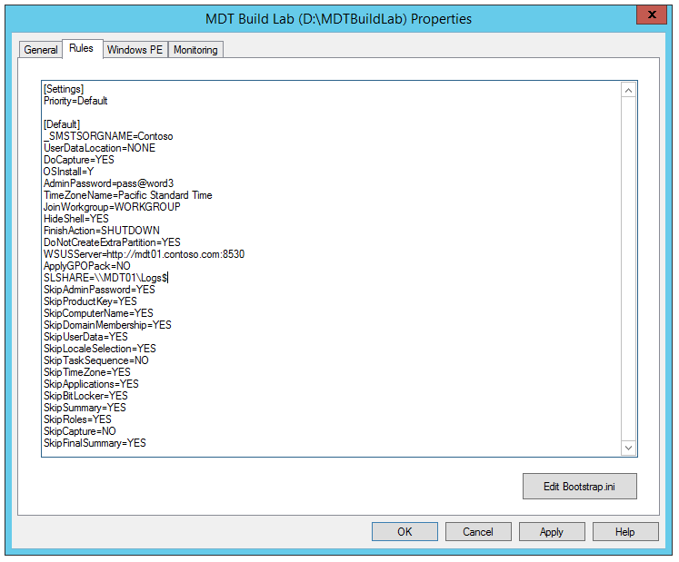

# Create a Windows 10 reference image

**Applies to**
-   Windows 10

Creating a reference image is important because that image serves as the foundation for the devices in your organization. In this topic, you will learn how to create a Windows 10 reference image using the Microsoft Deployment Toolkit (MDT). You will create a deployment share, configure rules and settings, and import all the applications and operating system files required to build a Windows 10 reference image. After completing the steps outlined in this topic, you will have a Windows 10 reference image that can be used in your deployment solution.
For the purposes of this topic, we will use four machines: DC01, MDT01, HV01, and PC0001. DC01 is a domain controller, PC0001 is a Windows 10 Enterprise x64 client, and MDT01 is a Windows Server 2012 R2 standard server. HV01 is a Hyper-V host server, but HV01 could be replaced by PC0001 as long as PC0001 has enough memory and is capable of running Hyper-V. MDT01, HV01, and PC0001 are members of the domain contoso.com for the fictitious Contoso Corporation.

> [!NOTE]
> For important details about the setup for the steps outlined in this article, please see [Deploy Windows 10 with the Microsoft Deployment Toolkit](deploy-windows-10-with-the-microsoft-deployment-toolkit.md#proof).
 


Figure 1. The machines used in this topic.

## The reference image

The reference image described in this documentation is designed primarily for deployment to physical machines. However, the reference image is created on a virtual platform, before being automatically run through the System Preparation (Sysprep) tool process and captured to a Windows Imaging (WIM) file. The reasons for creating the reference image on a virtual platform are the following:
-   You reduce development time and can use snapshots to test different configurations quickly.
-   You rule out hardware issues. You simply get the best possible image, and if you have a problem, it's not likely to be hardware related.
-   It ensures that you won't have unwanted applications that could be installed as part of a driver install but not removed by the Sysprep process.
-   It's easy to move between lab, test, and production.

## <a href="" id="sec01"></a>Set up the MDT build lab deployment share

With Windows 10, there is no hard requirement to create reference images; however, to reduce the time needed for deployment, you may want to create a reference image that contains a few base applications as well as all of the latest updates. This section will show you how to create and configure the MDT Build Lab deployment share to create a Windows 10 reference image. Because reference images will be deployed only to virtual machines during the creation process and have specific settings (rules), you should always create a separate deployment share specifically for this process.

### Create the MDT build lab deployment share

- On MDT01, log on as Administrator in the CONTOSO domain using a password of <strong>P@ssw0rd</strong>.
- Using the Deployment Workbench, right-click **Deployment Shares** and select **New Deployment Share**.
- Use the following settings for the New Deployment Share Wizard:
- Deployment share path: E:\\MDTBuildLab
- Share name: MDTBuildLab$
- Deployment share description: MDT Build Lab
- &lt;default&gt;
- Verify that you can access the \\\\MDT01\\MDTBuildLab$ share.


Figure 2. The Deployment Workbench with the MDT Build Lab deployment share created.

### Configure permissions for the deployment share

In order to write the reference image back to the deployment share, you need to assign Modify permissions to the MDT Build Account (MDT\_BA) for the **Captures** subfolder in the **E:\\MDTBuildLab** folder
1.  On MDT01, log on as **CONTOSO\\Administrator**.
2.  Modify the NTFS permissions for the **E:\\MDTBuildLab\\Captures** folder by running the following command in an elevated Windows PowerShell prompt:

    ``` syntax
    icacls E:\MDTBuildLab\Captures /grant '"MDT_BA":(OI)(CI)(M)'
    ```



Figure 3. Permissions configured for the MDT\_BA user.

## <a href="" id="sec02"></a>Add the setup files

This section will show you how to populate the MDT deployment share with the Windows 10 operating system source files, commonly referred to as setup files, which will be used to create a reference image. Setup files are used during the reference image creation process and are the foundation for the reference image.

### Add the Windows 10 installation files

MDT supports adding both full source Windows 10 DVDs (ISOs) and custom images that you have created. In this case, you create a reference image, so you add the full source setup files from Microsoft.

> [!NOTE]
> Due to the Windows limits on path length, we are purposely keeping the operating system destination directory short, using the folder name W10EX64RTM rather than a more descriptive name like Windows 10 Enterprise x64 RTM.

### Add Windows 10 Enterprise x64 (full source)

In these steps we assume that you have copied the content of a Windows 10 Enterprise x64 ISO to the **E:\\Downloads\\Windows 10 Enterprise x64** folder.

1.  On MDT01, log on as **CONTOSO\\Administrator**.
2.  Using the Deployment Workbench, expand the **Deployment Shares** node, and then expand **MDT Build Lab**.
3.  Right-click the **Operating Systems** node, and create a new folder named **Windows 10**.
4.  Expand the **Operating Systems** node, right-click the **Windows 10** folder, and select **Import Operating System**. Use the following settings for the Import Operating System Wizard:
5.  Full set of source files
6.  Source directory: E:\\Downloads\\Windows 10 Enterprise x64
7.  Destination directory name: W10EX64RTM
8.  After adding the operating system, in the **Operating Systems / Windows 10** folder, double-click the added operating system name in the **Operating System** node and change the name to the following: **Windows 10 Enterprise x64 RTM Default Image**


Figure 4. The imported Windows 10 operating system after renaming it.

## <a href="" id="sec03"></a>Add applications

Before you create an MDT task sequence, you need to add all of the applications and other sample scripts to the MDT Build Lab share.

The steps in this section use a strict naming standard for your MDT applications. You add the "Install - " prefix for typical application installations that run a setup installer of some kind, and you use the "Configure - " prefix when an application configures a setting in the operating system. You also add an " - x86", " - x64", or "- x86-x64" suffix to indicate the application's architecture (some applications have installers for both architectures). Using a script naming standard is always recommended when using MDT as it helps maintain order and consistency.
By storing configuration items as MDT applications, it is easy to move these objects between various solutions, or between test and production environments. In this topic's step-by-step sections, you will add the following applications:

-   Install - Microsoft Office 2013 Pro Plus - x86
-   Install - Microsoft Silverlight 5.0 - x64
-   Install - Microsoft Visual C++ 2005 SP1 - x86
-   Install - Microsoft Visual C++ 2005 SP1 - x64
-   Install - Microsoft Visual C++ 2008 SP1 - x86
-   Install - Microsoft Visual C++ 2008 SP1 - x64
-   Install - Microsoft Visual C++ 2010 SP1 - x86
-   Install - Microsoft Visual C++ 2010 SP1 - x64
-   Install - Microsoft Visual C++ 2012 Update 4 - x86
-   Install - Microsoft Visual C++ 2012 Update 4 - x64

In these examples, we assume that you downloaded the software in this list to the E:\\Downloads folder. The first application is added using the UI, but because MDT supports Windows PowerShell, you add the other applications using Windows PowerShell.

> [!NOTE]
> All the Microsoft Visual C++ downloads can be found on [The latest supported Visual C++ downloads](https://go.microsoft.com/fwlink/p/?LinkId=619523).

### Create the install: Microsoft Office Professional Plus 2013 x86

You can customize Office 2013. In the volume license versions of Office 2013, there is an Office Customization Tool you can use to customize the Office installation. In these steps we assume you have copied the Office 2013 installation files to the E:\\Downloads\\Office2013 folder.

### Add the Microsoft Office Professional Plus 2013 x86 installation files

After adding the Microsoft Office Professional Plus 2013 x86 application, you then automate its setup by running the Office Customization Tool. In fact, MDT detects that you added the Office Professional Plus 2013 x86 application and creates a shortcut for doing this.
You also can customize the Office installation using a Config.xml file. But we recommend that you use the Office Customization Tool as described in the following steps, as it provides a much richer way of controlling Office 2013 settings.
1.  Using the Deployment Workbench in the MDT Build Lab deployment share, expand the **Applications / Microsoft** node, and double-click **Install - Microsoft Office 2013 Pro Plus x86**.
2.  In the **Office Products** tab, click **Office Customization Tool**, and click **OK** in the **Information** dialog box.

    

    Figure 5. The Install - Microsoft Office 2013 Pro Plus - x86 application properties.

    > [!NOTE]
    > If you don't see the Office Products tab, verify that you are using a volume license version of Office. If you are deploying Office 365, you need to download the Admin folder from Microsoft.
     
3.  In the Office Customization Tool dialog box, select the Create a new Setup customization file for the following product option, select the Microsoft Office Professional Plus 2013 (32-bit) product, and click OK.
4.  Use the following settings to configure the Office 2013 setup to be fully unattended:
    1.  Install location and organization name
        -   Organization name: Contoso
    2.  Licensing and user interface
        1.  Select Use KMS client key
        2.  Select I accept the terms in the License Agreement.
        3.  Select Display level: None

        

        Figure 6. The licensing and user interface screen in the Microsoft Office Customization Tool

    3.  Modify Setup properties
        -   Add the **SETUP\_REBOOT** property and set the value to **Never**.
    4.  Modify user settings
        -   In the **Microsoft Office 2013** node, expand **Privacy**, select **Trust Center**, and enable the Disable Opt-in Wizard on first run setting.
5.  From the **File** menu, select **Save**, and save the configuration as 0\_Office2013ProPlusx86.msp in the **E:\\MDTBuildLab\\Applications\\Install - Microsoft Office 2013 Pro Plus - x86\\Updates** folder.

    > [!NOTE]
    > The reason for naming the file with a 0 (zero) at the beginning is that the Updates folder also handles Microsoft Office updates, and they are installed in alphabetical order. The Office 2013 setup works best if the customization file is installed before any updates.

6.  Close the Office Customization Tool, click Yes in the dialog box, and in the **Install - Microsoft Office 2013 Pro Plus - x86 Properties** window, click **OK**.

### Connect to the deployment share using Windows PowerShell

If you need to add many applications, you can take advantage of the PowerShell support that MDT has. To start using PowerShell against the deployment share, you must first load the MDT PowerShell snap-in and then make the deployment share a PowerShell drive (PSDrive).
1.  On MDT01, log on as **CONTOSO\\Administrator**.
2.  Import the snap-in and create the PSDrive by running the following commands in an elevated PowerShell prompt:

    ``` syntax
    Import-Module "C:\Program Files\Microsoft Deployment Toolkit\bin\MicrosoftDeploymentToolkit.psd1"
    New-PSDrive -Name "DS001" -PSProvider MDTProvider -Root "E:\MDTBuildLab"
    ```

### Create the install: Microsoft Visual C++ 2005 SP1 x86

In these steps we assume that you have downloaded Microsoft Visual C++ 2005 SP1 x86. You might need to modify the path to the source folder to reflect your current environment. In this example, the source path is set to E:\\Downloads\\VC++2005SP1x86.
1.  On MDT01, log on as **CONTOSO\\Administrator**.

2.  Create the application by running the following commands in an elevated PowerShell prompt:

    ``` syntax
    $ApplicationName = "Install - Microsoft Visual C++ 2005 SP1 - x86"
    $CommandLine = "vcredist_x86.exe /Q"
    $ApplicationSourcePath = "E:\Downloads\VC++2005SP1x86"
    Import-MDTApplication -Path "DS001:\Applications\Microsoft" -Enable "True" -Name $ApplicationName -ShortName $ApplicationName -Commandline $Commandline -WorkingDirectory ".\Applications\$ApplicationName" -ApplicationSourcePath $ApplicationSourcePath -DestinationFolder $ApplicationName 
    -Verbose
    ```

### Create the install: Microsoft Visual C++ 2005 SP1 x64

In these steps we assume that you have downloaded Microsoft Visual C++ 2005 SP1 x64. You might need to modify the path to the source folder to reflect your current environment. In this example, the source path is set to E:\\Downloads\\VC++2005SP1x64.
1.  On MDT01, log on as **CONTOSO\\Administrator**.
2.  Create the application by running the following commands in an elevated PowerShell prompt:

    ``` syntax
    $ApplicationName = "Install - Microsoft Visual C++ 2005 SP1 - x64"
    $CommandLine = "vcredist_x64.exe /Q"
    $ApplicationSourcePath = "E:\Downloads\VC++2005SP1x64"
    Import-MDTApplication -Path "DS001:\Applications\Microsoft" -Enable "True" -Name $ApplicationName -ShortName $ApplicationName -Commandline $Commandline -WorkingDirectory ".\Applications\$ApplicationName" -ApplicationSourcePath $ApplicationSourcePath -DestinationFolder $ApplicationName 
    -Verbose
    ```

### Create the install: Microsoft Visual C++ 2008 SP1 x86

In these steps we assume that you have downloaded Microsoft Visual C++ 2008 SP1 x86. You might need to modify the path to the source folder to reflect your current environment. In this example, the source path is set to E:\\Downloads\\VC++2008SP1x86.
1.  On MDT01, log on as **CONTOSO\\Administrator**.
2.  Create the application by running the following commands in an elevated PowerShell prompt:

    ``` syntax
    $ApplicationName = "Install - Microsoft Visual C++ 2008 SP1 - x86"
    $CommandLine = "vcredist_x86.exe /Q"
    $ApplicationSourcePath = "E:\Downloads\VC++2008SP1x86"
    Import-MDTApplication -Path "DS001:\Applications\Microsoft" -Enable "True" -Name $ApplicationName -ShortName $ApplicationName -Commandline $Commandline -WorkingDirectory ".\Applications\$ApplicationName" -ApplicationSourcePath $ApplicationSourcePath -DestinationFolder $ApplicationName 
    -Verbose
    ```

### Create the install: Microsoft Visual C++ 2008 SP1 x64

In these steps we assume that you have downloaded Microsoft Visual C++ 2008 SP1 x64. You might need to modify the path to the source folder to reflect your current environment. In this example, the source path is set to E:\\Downloads\\VC++2008SP1x64.
1.  On MDT01, log on as **CONTOSO\\Administrator**.
2.  Create the application by running the following commands in an elevated PowerShell prompt:

    ``` syntax
    $ApplicationName = "Install - Microsoft Visual C++ 2008 SP1 - x64"
    $CommandLine = "vcredist_x64.exe /Q"
    $ApplicationSourcePath = "E:\Downloads\VC++2008SP1x64"
    Import-MDTApplication -Path "DS001:\Applications\Microsoft" -Enable "True" -Name $ApplicationName -ShortName $ApplicationName -Commandline $Commandline -WorkingDirectory ".\Applications\$ApplicationName" -ApplicationSourcePath $ApplicationSourcePath -DestinationFolder $ApplicationName 
    -Verbose
    ```

### Create the install: Microsoft Visual C++ 2010 SP1 x86

In these steps we assume that you have downloaded Microsoft Visual C++ 2010 SP1 x86. You might need to modify the path to the source folder to reflect your current environment. In this example, the source path is set to E:\\Downloads\\VC++2010SP1x86.
1.  On MDT01, log on as **CONTOSO\\Administrator**.
2.  Create the application by running the following commands in an elevated PowerShell prompt:

    ``` syntax
    $ApplicationName = "Install - Microsoft Visual C++ 2010 SP1 - x86"
    $CommandLine = "vcredist_x86.exe /Q"
    $ApplicationSourcePath = "E:\Downloads\VC++2010SP1x86"
    Import-MDTApplication -Path "DS001:\Applications\Microsoft" -Enable "True" -Name $ApplicationName -ShortName $ApplicationName -CommandLine $CommandLine -WorkingDirectory ".\Applications\$ApplicationName" -ApplicationSourcePath $ApplicationSourcePath -DestinationFolder $ApplicationName 
    -Verbose
    ```

### Create the install: Microsoft Visual C++ 2010 SP1 x64

In these steps we assume that you have downloaded Microsoft Visual C++ 2010 SP1 x64. You might need to modify the path to the source folder to reflect your current environment. In this example, the source path is set to E:\\Downloads\\VC++2010SP1x64.
1.  On MDT01, log on as **CONTOSO\\Administrator**.
2.  Create the application by running the following commands in an elevated PowerShell prompt:

    ``` syntax
    $ApplicationName = "Install - Microsoft Visual C++ 2010 SP1 - x64"
    $CommandLine = "vcredist_x64.exe /Q"
    $ApplicationSourcePath = "E:\Downloads\VC++2010SP1x64"
    Import-MDTApplication -Path "DS001:\Applications\Microsoft" -Enable "True" -Name $ApplicationName -ShortName $ApplicationName -CommandLine $CommandLine -WorkingDirectory ".\Applications\$ApplicationName" -ApplicationSourcePath $ApplicationSourcePath -DestinationFolder $ApplicationName 
    -Verbose
    ```

### Create the install: Microsoft Visual C++ 2012 Update 4 x86

In these steps we assume that you have downloaded Microsoft Visual C++ 2012 Update 4 x86. You might need to modify the path to the source folder to reflect your current environment. In this example, the source path is set to E:\\Downloads\\VC++2012Ux86.
1.  On MDT01, log on as **CONTOSO\\Administrator**.
2.  Create the application by running the following commands in an elevated PowerShell prompt:

    ``` syntax
    $ApplicationName = "Install - Microsoft Visual C++ 2012 Update 4 - x86"
    $CommandLine = "vcredist_x86.exe /Q"
    $ApplicationSourcePath = "E:\Downloads\VC++2012Ux86"
    Import-MDTApplication -Path "DS001:\Applications\Microsoft" -Enable "True" -Name $ApplicationName -ShortName $ApplicationName -CommandLine $CommandLine -WorkingDirectory ".\Applications\$ApplicationName" -ApplicationSourcePath $ApplicationSourcePath -DestinationFolder $ApplicationName 
    -Verbose
    ```

### Create the install: Microsoft Visual C++ 2012 Update 4 x64

In these steps we assume that you have downloaded Microsoft Visual C++ 2012 Update 4 x64. You might need to modify the path to the source folder to reflect your current environment. In this example, the source path is set to E:\\Downloads\\VC++2012Ux64.
1.  On MDT01, log on as **CONTOSO\\Administrator**.
2.  Create the application by running the following commands in an elevated PowerShell prompt:

    ``` syntax
    $ApplicationName = "Install - Microsoft Visual C++ 2012 Update 4 - x64"
    $CommandLine = "vcredist_x64.exe /Q"
    $ApplicationSourcePath = "E:\Downloads\VC++2012Ux64"
    Import-MDTApplication -Path "DS001:\Applications\Microsoft" -Enable "True" -Name $ApplicationName -ShortName $ApplicationName -CommandLine $CommandLine -WorkingDirectory ".\Applications\$ApplicationName" -ApplicationSourcePath $ApplicationSourcePath -DestinationFolder $ApplicationName 
    -Verbose
    ```

## <a href="" id="sec04"></a>Create the reference image task sequence

In order to build and capture your Windows 10 reference image for deployment using MDT, you will create a task sequence. The task sequence will reference the operating system and applications that you previously imported into the MDT Build Lab deployment share to build a Windows 10 reference image.
After creating the task sequence, you configure it to enable patching against the Windows Server Update Services (WSUS) server. The Task Sequence Windows Update action supports getting updates directly from Microsoft Update, but you get more stable patching if you use a local WSUS server. WSUS also allows for an easy process of approving the patches that you are deploying.

### Drivers and the reference image

Because we use modern virtual platforms for creating our reference images, we don’t need to worry about drivers when creating reference images for Windows 10. We use Hyper-V in our environment, and Windows Preinstallation Environment (Windows PE) already has all the needed drivers built-in for Hyper-V.

### Create a task sequence for Windows 10 Enterprise

To create a Windows 10 reference image task sequence, the process is as follows:

1.  Using the Deployment Workbench in the MDT Build Lab deployment share, right-click **Task Sequences**, and create a new folder named **Windows 10**.
2.  Expand the **Task Sequences** node, right-click the new **Windows 10** folder and select **New Task Sequence**. Use the following settings for the New Task Sequence Wizard:
    1.  Task sequence ID: REFW10X64-001
    2.  Task sequence name: Windows 10 Enterprise x64 RTM Default Image
    3.  Task sequence comments: Reference Build
    4.  Template: Standard Client Task Sequence
    5.  Select OS: Windows 10 Enterprise x64 RTM Default Image
    6.  Specify Product Key: Do not specify a product key at this time
    7.  Full Name: Contoso
    8.  Organization: Contoso
    9.  Internet Explorer home page: http://www.contoso.com
    10. Admin Password: Do not specify an Administrator Password at this time

### Edit the Windows 10 task sequence

The steps below walk you through the process of editing the Windows 10 reference image task sequence to include the actions required to update the reference image with the latest updates from WSUS, install roles and features, and utilities, and install Microsoft Office 2013.

1.  In the Task Sequences / Windows 10 folder, right-click the Windows 10 Enterprise x64 RTM Default Image task sequence, and select Properties.
2.  On the **Task Sequence** tab, configure the Windows 10 Enterprise x64 RTM Default Image task sequence with the following settings:
    1.  State Restore. Enable the Windows Update (Pre-Application Installation) action.
        **Note**  
        Enable an action by going to the Options tab and clearing the Disable this step check box.
         
    2.  State Restore. Enable the Windows Update (Post-Application Installation) action.
    3.  State Restore. Enable the Windows Update (Post-Application Installation) action. State Restore. After the **Tattoo** action, add a new **Group** action with the following setting:
        -   Name: Custom Tasks (Pre-Windows Update)
    4.  State Restore. After Windows Update (Post-Application Installation) action, rename Custom Tasks to Custom Tasks (Post-Windows Update).
        **Note**  
        The reason for adding the applications after the Tattoo action but before running Windows Update is simply to save time during the deployment. This way we can add all applications that will upgrade some of the built-in components and avoid unnecessary updating.
         
    5.  State Restore / Custom Tasks (Pre-Windows Update). Add a new Install Roles and Features action with the following settings:
        1.  Name: Install - Microsoft NET Framework 3.5.1
        2.  Select the operating system for which roles are to be installed: Windows 10
        3.  Select the roles and features that should be installed: .NET Framework 3.5 (includes .NET 2.0 and 3.0)
        
        >[!IMPORTANT]
        >This is probably the most important step when creating a reference image. Many applications need the .NET Framework, and we strongly recommend having it available in the image. The one thing that makes this different from other components is that .NET Framework 3.5.1 is not included in the WIM file. It is installed from the **Sources\\SxS** folder on the media, and that makes it more difficult to add after the image has been deployed.
         
        

        Figure 7. The task sequence after creating the Custom Tasks (Pre-Windows Update) group and adding the Install - Microsoft NET Framework 3.5.1 action.

    6.  State Restore - Custom Tasks (Pre-Windows Update). After the **Install - Microsoft NET Framework 3.5.1** action, add a new **Install Application** action with the following settings:
        1.  Name: Install - Microsoft Visual C++ 2005 SP1 - x86
        2.  Install a Single Application: Install - Microsoft Visual C++ 2005 SP1 - x86-x64
    7.  Repeat the previous step (add a new **Install Application**) to add the following applications:
        1.  Install - Microsoft Visual C++ 2005 SP1 - x64
        2.  Install - Microsoft Visual C++ 2008 SP1 - x86
        3.  Install - Microsoft Visual C++ 2008 SP1 - x64
        4.  Install - Microsoft Visual C++ 2010 SP1 - x86
        5.  Install - Microsoft Visual C++ 2010 SP1 - x64
        6.  Install - Microsoft Visual C++ 2012 Update 4 - x86
        7.  Install - Microsoft Visual C++ 2012 Update 4 - x64
        8.  Install - Microsoft Office 2013 Pro Plus - x86
    8.  After the Install - Microsoft Office 2013 Pro Plus - x86 action, add a new Restart computer action.
3.  Click **OK**.


### Optional configuration: Add a suspend action

The goal when creating a reference image is of course to automate everything. But sometimes you have a special configuration or application setup that is too time-consuming to automate. If you need to do some manual configuration, you can add a little-known feature called Lite Touch Installation (LTI) Suspend. If you add the LTISuspend.wsf script as a custom action in the task sequence, it will suspend the task sequence until you click the Resume Task Sequence shortcut icon on the desktop. In addition to using the LTI Suspend feature for manual configuration or installation, you can also use it simply for verifying a reference image before you allow the task sequence to continue and use Sysprep and capture the virtual machine.


Figure 8. A task sequence with optional Suspend action (LTISuspend.wsf) added.



Figure 9. The Windows 10 desktop with the Resume Task Sequence shortcut.

### Edit the Unattend.xml file for Windows 10 Enterprise

When using MDT, you don't need to edit the Unattend.xml file very often because most configurations are taken care of by MDT. However if, for example, you want to configure Internet Explorer 11 behavior, then you can edit the Unattend.xml for this. Editing the Unattend.xml for basic Internet Explorer settings is easy, but for more advanced settings, you will want to use Internet Explorer Administration Kit (IEAK).

> [!WARNING]
> Do not use **SkipMachineOOBE** or **SkipUserOOBE** in your Unattend.xml file. These settings are deprecated and can have unintended effects if used.

> [!NOTE]
> You also can use the Unattend.xml to enable components in Windows 10, like the Telnet Client or Hyper-V client. Normally we prefer to do this via the **Install Roles and Features** action, or using Deployment Image Servicing and Management (DISM) command-line tools, because then we can add that as an application, being dynamic, having conditions, and so forth. Also, if you are adding packages via Unattend.xml, it is version specific, so Unattend.xml must match the exact version of the operating system you are servicing.
 
Follow these steps to configure Internet Explorer settings in Unattend.xml for the Windows 10 Enterprise x64 RTM Default Image task sequence:

1.  Using the Deployment Workbench, right-click the **Windows 10 Enterprise x64 RTM Default Image** task sequence and select **Properties**.
2.  In the **OS Info** tab, click **Edit Unattend.xml**. MDT now generates a catalog file. This will take a few minutes, and then Windows System Image Manager (Windows SIM) will start.
3.  In Windows SIM, expand the **4 specialize** node in the **Answer File** pane and select the amd64\_Microsoft-Windows-IE-InternetExplorer\_neutral entry.
4.  In the **amd64\_Microsoft-Windows-IE-InternetExplorer\_neutral properties** window (right-hand window), set the following values:
    -   DisableDevTools: true
5.  Save the Unattend.xml file, and close Windows SIM.
6.  On the Windows 10 Enterprise x64 RTM Default Image Properties, click **OK**.


Figure 10. Windows System Image Manager with the Windows 10 Unattend.xml.

## <a href="" id="sec05"></a>Configure the MDT deployment share rules

Understanding rules is critical to successfully using MDT. Rules are configured using the Rules tab of the deployment share's properties. The Rules tab is essentially a shortcut to edit the CustomSettings.ini file that exists in the E:\\MDTBuildLab\\Control folder. This section discusses how to configure the MDT deployment share rules as part of your Windows 10 Enterprise deployment.

### MDT deployment share rules overview

In MDT, there are always two rule files: the CustomSettings.ini file and the Bootstrap.ini file. You can add almost any rule to either; however, the Bootstrap.ini file is copied from the Control folder to the boot image, so the boot image needs to be updated every time you change that file.
For that reason, add only a minimal set of rules to Bootstrap.ini, such as which deployment server and share to connect to - the DEPLOYROOT value. Put the other rules in CustomSettings.ini because that file is updated immediately when you click OK. By taking the following steps, you will configure the rules for the MDT Build Lab deployment share:
1.  Using the Deployment Workbench, right-click the **MDT Build Lab deployment share** and select **Properties**.
2.  Select the **Rules** tab and modify using the following information:
    ``` syntax
    [Settings]
    Priority=Default
    [Default]
    _SMSTSORGNAME=Contoso
    UserDataLocation=NONE
    DoCapture=YES
    OSInstall=Y
    AdminPassword=P@ssw0rd
    TimeZoneName=Pacific Standard Time 
    JoinWorkgroup=WORKGROUP
    HideShell=YES
    FinishAction=SHUTDOWN
    DoNotCreateExtraPartition=YES
    WSUSServer=http://mdt01.contoso.com:8530
    ApplyGPOPack=NO
    SLSHARE=\\MDT01\Logs$
    SkipAdminPassword=YES
    SkipProductKey=YES
    SkipComputerName=YES
    SkipDomainMembership=YES
    SkipUserData=YES
    SkipLocaleSelection=YES
    SkipTaskSequence=NO
    SkipTimeZone=YES
    SkipApplications=YES
    SkipBitLocker=YES
    SkipSummary=YES
    SkipRoles=YES
    SkipCapture=NO
    SkipFinalSummary=YES
    ```

    

    Figure 11. The server-side rules for the MDT Build Lab deployment share.

3.  Click **Edit Bootstrap.ini** and modify using the following information:

    ``` syntax
    [Settings]
    Priority=Default
    [Default]
    DeployRoot=\\MDT01\MDTBuildLab$
    UserDomain=CONTOSO
    UserID=MDT_BA
    UserPassword=P@ssw0rd
    SkipBDDWelcome=YES
    ```

    

    Figure 12. The boot image rules for the MDT Build Lab deployment share.

    > [!NOTE]
    > For security reasons, you normally don't add the password to the Bootstrap.ini file; however, because this deployment share is for creating reference image builds only, and should not be published to the production network, it is acceptable to do so in this situation.

4.  In the **Windows PE** tab, in the **Platform** drop-down list, select **x86**.
5.  In the **Lite Touch Boot Image Settings** area, configure the following settings:
    1.  Image description: MDT Build Lab x86
    2.  ISO file name: MDT Build Lab x86.iso
6.  In the **Windows PE** tab, in the **Platform** drop-down list, select **x64**.
7.  In the **Lite Touch Boot Image Settings** area, configure the following settings:
    1.  Image description: MDT Build Lab x64
    2.  ISO file name: MDT Build Lab x64.iso
8.  Click **OK**.

> [!NOTE]
> In MDT, the x86 boot image can deploy both x86 and x64 operating systems (except on computers based on Unified Extensible Firmware Interface).


### Update the deployment share

After the deployment share has been configured, it needs to be updated. This is the process when the Windows PE boot images are created.

1.  Using the Deployment Workbench, right-click the **MDT Build Lab deployment share** and select **Update Deployment Share**.
2.  Use the default options for the Update Deployment Share Wizard.

> [!NOTE]
> The update process will take 5 to 10 minutes.

### The rules explained

Now that the MDT Build Lab deployment share (the share used to create the reference images) has been configured, it is time to explain the various settings used in the Bootstrap.ini and CustomSettings.ini files.

The Bootstrap.ini and CustomSettings.ini files work together. The Bootstrap.ini file is always present on the boot image and is read first. The basic purpose for Bootstrap.ini is to provide just enough information for MDT to find the CustomSettings.ini.

The CustomSettings.ini file is normally stored on the server, in the Deployment share\\Control folder, but also can be stored on the media (when using offline media).

> [!NOTE]
> The settings, or properties, that are used in the rules (CustomSettings.ini and Bootstrap.ini) are listed in the MDT documentation, in the Microsoft Deployment Toolkit Reference / Properties / Property Definition section.

### The Bootstrap.ini file

The Bootstrap.ini file is available via the deployment share's Properties dialog box, or via the E:\\MDTBuildLab\\Control folder on MDT01.

``` syntax
[Settings]
Priority=Default
[Default]
DeployRoot=\\MDT01\MDTBuildLab$
UserDomain=CONTOSO
UserID=MDT_BA
UserPassword=P@ssw0rd
SkipBDDWelcome=YES
```

So, what are these settings?
-   **Priority.** This determines the order in which different sections are read. This Bootstrap.ini has only one section, named \[Default\].
-   **DeployRoot.** This is the location of the deployment share. Normally, this value is set by MDT, but you need to update the DeployRoot value if you move to another server or other share. If you don't specify a value, the Windows Deployment Wizard prompts you for a location.
-   **UserDomain, UserID, and UserPassword.** These values are used for automatic log on to the deployment share. Again, if they are not specified, the wizard prompts you.

    > [!WARNING]
    > Caution is advised. These values are stored in clear text on the boot image. Use them only for the MDT Build Lab deployment share and not for the MDT Production deployment share that you learn to create in the next topic.

-   **SkipBDDWelcome.** Even if it is nice to be welcomed every time we start a deployment, we prefer to skip the initial welcome page of the Windows Deployment Wizard.

> [!NOTE]
> All properties beginning with "Skip" control only whether to display that pane in the Windows Deployment Wizard. Most of the panes also require you to actually set one or more values.

### The CustomSettings.ini file

The CustomSettings.ini file, whose content you see on the Rules tab of the deployment share Properties dialog box, contains most of the properties used in the configuration.

``` syntax
[Settings]
Priority=Default
[Default]
_SMSTSORGNAME=Contoso
UserDataLocation=NONE
DoCapture=YES
OSInstall=Y
AdminPassword=P@ssw0rd
TimeZoneName=Pacific Standard Time 
JoinWorkgroup=WORKGROUP
HideShell=YES
FinishAction=SHUTDOWN
DoNotCreateExtraPartition=YES
WSUSServer=http://mdt01.contoso.com:8530
ApplyGPOPack=NO
SLSHARE=\\MDT01\Logs$
SkipAdminPassword=YES
SkipProductKey=YES
SkipComputerName=YES
SkipDomainMembership=YES
SkipUserData=YES
SkipLocaleSelection=YES
SkipTaskSequence=NO
SkipTimeZone=YES
SkipApplications=YES
SkipBitLocker=YES
SkipSummary=YES
SkipRoles=YES
SkipCapture=NO
SkipFinalSummary=YES
```
-   **Priority.** Has the same function as in Bootstrap.ini. Priority determines the order in which different sections are read. This CustomSettings.ini has only one section, named \[Default\]. In general, if you have multiple sections that set the same value, the value from the first section (higher priority) wins. The rare exceptions are listed in the ZTIGather.xml file.
-   **\_SMSTSORGNAME.** The organization name displayed in the task sequence progress bar window during deployment.
-   **UserDataLocation.** Controls the settings for user state backup. You do not need to use when building and capturing a reference image.
-   **DoCapture.** Configures the task sequence to run the System Preparation (Sysprep) tool and capture the image to a file when the operating system is installed.
-   **OSInstall.** Must be set to Y or YES (the code actually just looks for the Y character) for the setup to proceed.
-   **AdminPassword.** Sets the local Administrator account password.
-   **TimeZoneName.** Establishes the time zone to use. Don't confuse this value with TimeZone, which is only for legacy operating systems (Windows 7 and Windows Server 2003).

    **Note**  
    The easiest way to find the current time zone name on a Windows 10 machine is to run tzutil /g in a command prompt. You can also run tzutil /l to get a listing of all available time zone names.
     
-   **JoinWorkgroup.** Configures Windows to join a workgroup.
-   **HideShell.** Hides the Windows Shell during deployment. This is especially useful for Windows 10 deployments in which the deployment wizard will otherwise appear behind the tiles.
-   **FinishAction.** Instructs MDT what to do when the task sequence is complete.
-   **DoNotCreateExtraPartition.** Configures the task sequence not to create the extra partition for BitLocker. There is no need to do this for your reference image.
-   **WSUSServer.** Specifies which Windows Server Update Services (WSUS) server (and port, if needed) to use during the deployment. Without this option MDT will use Microsoft Update directly, which will increase deployment time and limit your options of controlling which updates are applied.
-   **SLSHARE.** Instructs MDT to copy the log files to a server share if something goes wrong during deployment, or when a deployment is successfully completed.
-   **ApplyGPOPack.** Allows you to deploy local group policies created by Microsoft Security Compliance Manager (SCM).
-   **SkipAdminPassword.** Skips the pane that asks for the Administrator password.
-   **SkipProductKey.** Skips the pane that asks for the product key.
-   **SkipComputerName.** Skips the Computer Name pane.
-   **SkipDomainMemberShip.** Skips the Domain Membership pane. If set to Yes, you need to configure either the JoinWorkgroup value or the JoinDomain, DomainAdmin, DomainAdminDomain, and DomainAdminPassword properties.
-   **SkipUserData.** Skips the pane for user state migration.
-   **SkipLocaleSelection.** Skips the pane for selecting language and keyboard settings.
-   **SkipTimeZone.** Skips the pane for setting the time zone.
-   **SkipApplications.** Skips the Applications pane.
-   **SkipBitLocker.** Skips the BitLocker pane.
-   **SkipSummary.** Skips the initial Windows Deployment Wizard summary pane.
-   **SkipRoles.** Skips the Install Roles and Features pane.
-   **SkipCapture.** Skips the Capture pane.
-   **SkipFinalSummary.** Skips the final Windows Deployment Wizard summary. Because you use FinishAction=Shutdown, you don't want the wizard to stop in the end so that you need to click OK before the machine shuts down.

## <a href="" id="sec06"></a>Build the Windows 10 reference image

Once you have created your task sequence, you are ready to create the Windows 10 reference image. This will be performed by launching the task sequence from a virtual machine which will then automatically perform the reference image creation and capture process.
This steps below outline the process used to boot a virtual machine using an ISO boot image created by MDT, and then execute the reference image task sequence image to create and capture the Windows 10 reference image.

1.  Copy the E:\\MDTBuildLab\\Boot\\MDT Build Lab x86.iso on MDT01 to C:\\ISO on the Hyper-V host.

    **Note**  
    Remember, in MDT you can use the x86 boot image to deploy both x86 and x64 operating system images. That's why you can use the x86 boot image instead of the x64 boot image.
     
2.  Create a virtual machine with the following settings:
    1.  Name: REFW10X64-001
    2.  Location: C:\\VMs
    3.  Memory: 1024 MB
    4.  Network: External (The network that is connected to the same infrastructure as MDT01 is)
    5.  Hard disk: 60 GB (dynamic disk)
    6.  Image file: C:\\ISO\\MDT Build Lab x86.iso
3.  Take a snapshot of the REFW10X64-001 virtual machine, and name it **Clean with MDT Build Lab x86 ISO**.

    **Note**  
    Taking a snapshot is useful if you need to restart the process and want to make sure you can start clean.
     
4.  Start the REFW10X64-001 virtual machine. After booting into Windows PE, complete the Windows Deployment Wizard using the following settings:
    1.  Select a task sequence to execute on this computer: Windows 10 Enterprise x64 RTM Default Image
    2.  Specify whether to capture an image: Capture an image of this reference computer
        -   Location: \\\\MDT01\\MDTBuildLab$\\Captures
    3.  File name: REFW10X64-001.wim

        

        Figure 13. The Windows Deployment Wizard for the Windows 10 reference image.

5.  The setup now starts and does the following:
    1.  Installs the Windows 10 Enterprise operating system.
    2.  Installs the added applications, roles, and features.
    3.  Updates the operating system via your local Windows Server Update Services (WSUS) server.
    4.  Stages Windows PE on the local disk.
    5.  Runs System Preparation (Sysprep) and reboots into Windows PE.
    6.  Captures the installation to a Windows Imaging (WIM) file.
    7.  Turns off the virtual machine.

After some time, you will have a Windows 10 Enterprise x64 image that is fully patched and has run through Sysprep, located in the E:\\MDTBuildLab\\Captures folder on your deployment server. The file name is REFW10X64-001.wim.

## Related topics

[Get started with the Microsoft Deployment Toolkit (MDT)](get-started-with-the-microsoft-deployment-toolkit.md)

[Deploy a Windows 10 image using MDT](deploy-a-windows-10-image-using-mdt.md)

[Build a distributed environment for Windows 10 deployment](build-a-distributed-environment-for-windows-10-deployment.md)

[Refresh a Windows 7 computer with Windows 10](refresh-a-windows-7-computer-with-windows-10.md)

[Replace a Windows 7 computer with a Windows 10 computer](replace-a-windows-7-computer-with-a-windows-10-computer.md)

[Configure MDT settings](configure-mdt-settings.md)
