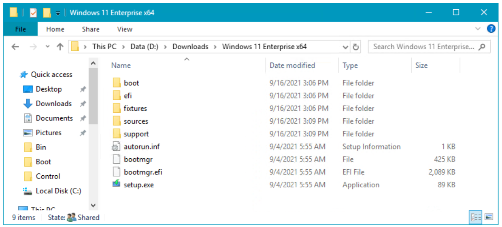
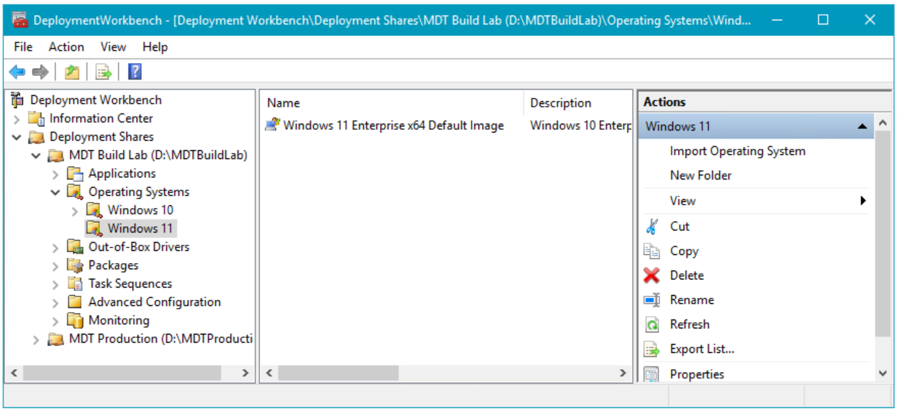
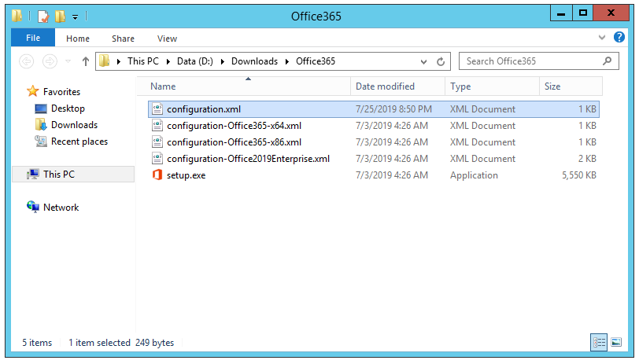
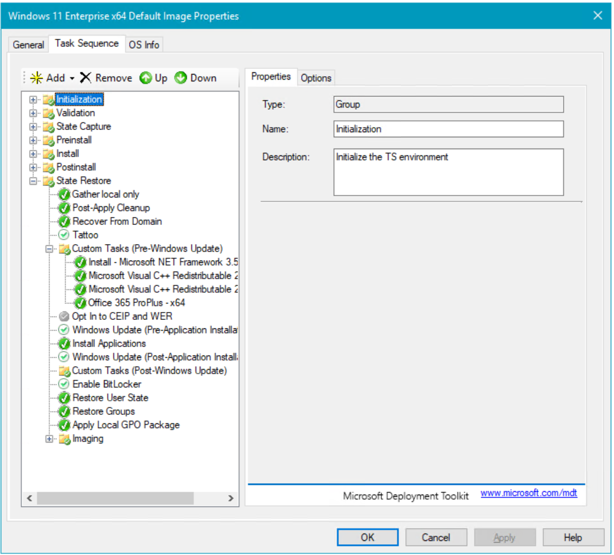
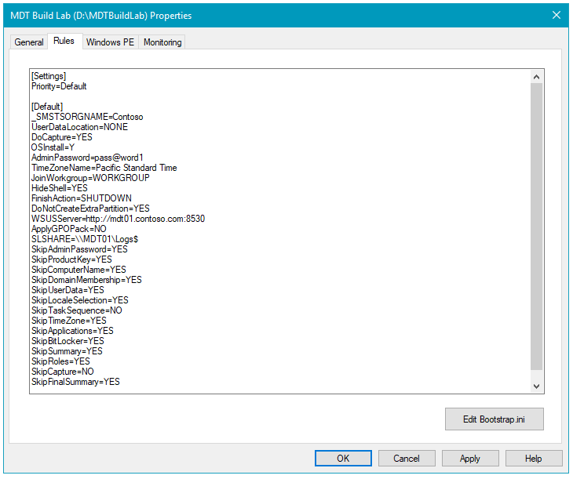
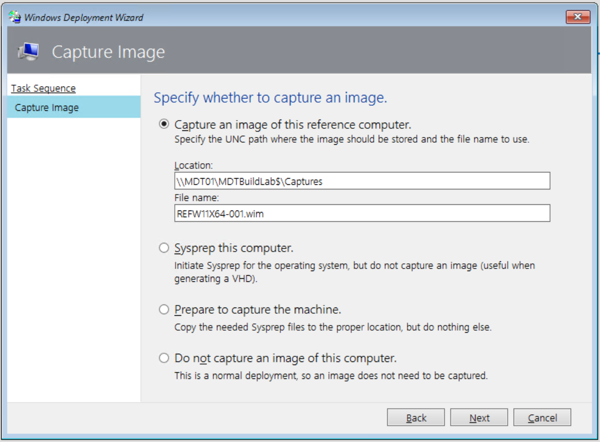
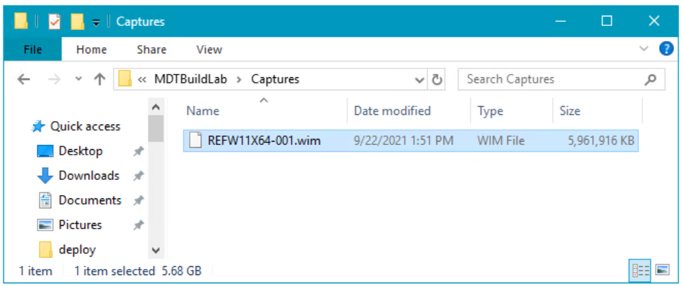
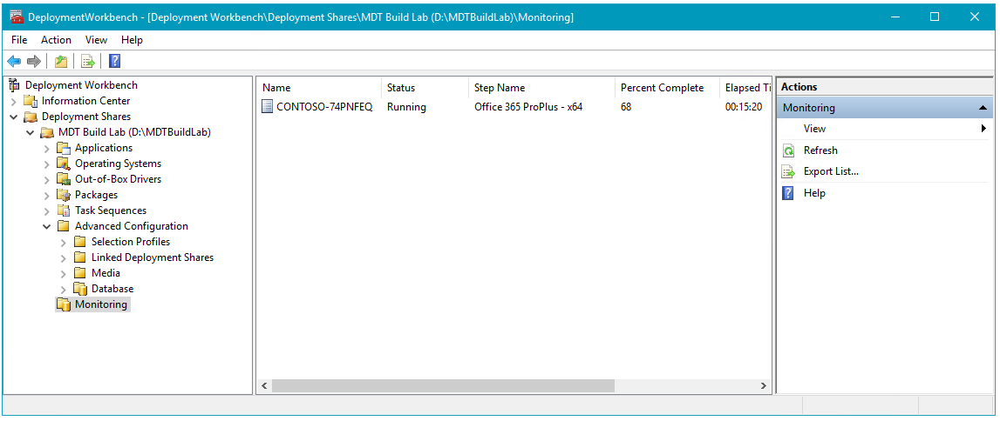

# Create a Windows 10 reference image

**Applies to**
- Windows 10

Creating a reference image is important because that image serves as the foundation for the devices in your organization. In this topic, you will learn how to create a Windows 10 reference image using the Microsoft Deployment Toolkit (MDT). You will create a deployment share, configure rules and settings, and import all the applications and operating system files required to build a Windows 10 reference image. After completing the steps outlined in this topic, you will have a Windows 10 reference image that can be used in your deployment solution.

>[!NOTE]
>See [Prepare for deployment with MDT](prepare-for-windows-deployment-with-mdt.md) for more information about the server, client, and network infrastructure used in this guide.

For the purposes of this topic, we will use three computers: DC01, MDT01, and HV01.
   - DC01 is a domain controller for the contoso.com domain.
   - MDT01 is a contoso.com domain member server.
   - HV01 is a Hyper-V server that will be used to build the reference image.
 
   

   Computers used in this topic.

## The reference image

The reference image described in this guide is designed primarily for deployment to physical devices. However, the reference image is typically created on a virtual platform, before being automatically run through the System Preparation (Sysprep) tool process and captured to a Windows Imaging (WIM) file. The reasons for creating the reference image on a virtual platform are the following:
- To reduce development time and can use snapshots to test different configurations quickly.
- To rule out hardware issues. You simply get the best possible image, and if you have a problem, it's not likely to be hardware related.
- To ensures that you won't have unwanted applications that could be installed as part of a driver install but not removed by the Sysprep process.
- The image is easy to move between lab, test, and production.

## Set up the MDT build lab deployment share

With Windows 10, there is no hard requirement to create reference images. However, to reduce the time needed for deployment, you might want to create a reference image that contains a few base applications as well as all of the latest updates. This section will show you how to create and configure the MDT Build Lab deployment share to create a Windows 10 reference image. Because reference images will be deployed only to virtual machines during the creation process and have specific settings (rules), you should always create a separate deployment share specifically for this process.

### Create the MDT build lab deployment share

On **MDT01**:

- Sign in as contoso\\administrator using a password of <b>pass@word1</b> (credentials from the [prepare for deployment](prepare-for-windows-deployment-with-mdt.md) topic).
- Start the MDT deployment workbench, and pin this to the taskbar for easy access.
- Using the Deployment Workbench, right-click **Deployment Shares** and select **New Deployment Share**.
- Use the following settings for the New Deployment Share Wizard:
  - Deployment share path: **D:\\MDTBuildLab**
  - Share name: **MDTBuildLab$**
  - Deployment share description: **MDT Build Lab**
- Accept the default selections on the Options page and click **Next**.
- Review the Summary page, click **Next**, wait for the deployment share to be created, then click **Finish**.
- Verify that you can access the <b>\\\\MDT01\\MDTBuildLab$</b> share.

   

   The Deployment Workbench with the MDT Build Lab deployment share.

### Enable monitoring

To monitor the task sequence as it happens, right-click the **MDT Build Lab** deployment share, click **Properties**, click the **Monitoring** tab, and select **Enable monitoring for this deployment share**.  This step is optional.

### Configure permissions for the deployment share

In order to read files in the deployment share and write the reference image back to it, you need to assign NTSF and SMB permissions to the MDT Build Account (MDT\_BA) for the **D:\\MDTBuildLab** folder

On **MDT01**:

1.  Ensure you are signed in as **contoso\\administrator**.
2.  Modify the NTFS permissions for the **D:\\MDTBuildLab** folder by running the following command in an elevated Windows PowerShell prompt:

    ``` powershell
    icacls "D:\MDTBuildLab" /grant '"CONTOSO\MDT_BA":(OI)(CI)(M)'
    grant-smbshareaccess -Name MDTBuildLab$ -AccountName "Contoso\MDT_BA" -AccessRight Full -force
    ```

## Add setup files

This section will show you how to populate the MDT deployment share with the Windows 10 operating system source files, commonly referred to as setup files, which will be used to create a reference image. Setup files are used during the reference image creation process and are the foundation for the reference image.

### Add the Windows 10 installation files

MDT supports adding both full source Windows 10 DVDs (ISOs) and custom images that you have created. In this case, you create a reference image, so you add the full source setup files from Microsoft.

>[!NOTE]
>Due to the Windows limits on path length, we are purposely keeping the operating system destination directory short, using the folder name W10EX64RTM rather than a more descriptive name like Windows 10 Enterprise x64 RTM.
 
### Add Windows 10 Enterprise x64 (full source)

On **MDT01**:

1. Sign in as **contoso\\administrator** and copy the content of a Windows 10 Enterprise x64 DVD/ISO to the **D:\\Downloads\\Windows 10 Enterprise x64** folder on MDT01, or just insert the DVD or mount an ISO on MDT01. The following example shows the files copied to the D:\\Downloads folder, but you can also choose to import the OS directly from an ISO or DVD.

    

2. Using the Deployment Workbench, expand the **Deployment Shares** node, and then expand **MDT Build Lab**.
3. Right-click the **Operating Systems** node, and create a new folder named **Windows 10**.
4. Expand the **Operating Systems** node, right-click the **Windows 10** folder, and select **Import Operating System**. Use the following settings for the Import Operating System Wizard:
    - Full set of source files
    - Source directory: (location of your source files)
    - Destination directory name: <b>W10EX64RTM</b>
5. After adding the operating system, in the **Operating Systems / Windows 10** folder, double-click it and change the name to: **Windows 10 Enterprise x64 RTM Default Image**. See the following example.

    

>Depending on the DVD you used, there might be multiple editions available. For the purposes of this guide, we are using the Windows 10 Enterprise image, but other images will also work.

## Add applications

Before you create an MDT task sequence, you need to add any applications and scripts you wish to install to the MDT Build Lab share.

On **MDT01**:

First, create an MDT folder to store the Microsoft applications that will be installed:

1. In the MDT Deployment Workbench, expand **Deployment Shares \\ MDT Build Lab \\ Applications**
2. Right-click **Applications** and then click **New Folder**.
3. Under **Folder name**, type **Microsoft**.
4. Click **Next** twice, and then click **Finish**.

The steps in this section use a strict naming standard for your MDT applications. 
- Use the "<b>Install - </b>" prefix for typical application installations that run a setup installer of some kind, 
- Use the "<b>Configure - </b>" prefix when an application configures a setting in the operating system. 
- You also add an "<b> - x86</b>", "<b> - x64</b>", or "<b>- x86-x64</b>" suffix to indicate the application's architecture (some applications have installers for both architectures).
 
Using a script naming standard is always recommended when using MDT as it helps maintain order and consistency. 

By storing configuration items as MDT applications, it is easy to move these objects between various solutions, or between test and production environments. 

In example sections, you will add the following applications:

- Install - Microsoft Office 365 Pro Plus - x64
- Install - Microsoft Visual C++ Redistributable 2019 - x86
- Install - Microsoft Visual C++ Redistributable 2019 - x64

>The 64-bit version of Microsoft Office 365 Pro Plus is recommended unless you need legacy app support. For more information, see [Choose between the 64-bit or 32-bit version of Office](https://support.office.com/article/choose-between-the-64-bit-or-32-bit-version-of-office-2dee7807-8f95-4d0c-b5fe-6c6f49b8d261)

Download links:
- [Office Deployment Tool](https://www.microsoft.com/download/details.aspx?id=49117)
- [Microsoft Visual C++ Redistributable 2019 - x86](https://aka.ms/vs/16/release/VC_redist.x86.exe)
- [Microsoft Visual C++ Redistributable 2019 - x64](https://aka.ms/vs/16/release/VC_redist.x64.exe)

Download all three items in this list to the D:\\Downloads folder on MDT01. 

**Note**: For the purposes of this lab, we will leave the MSVC files in the D:\\Downloads folder and the Office365 files will be extracted to a child folder. If you prefer, you can place each application in its own separate child folder and then modify the $ApplicationSourcePath below as needed (instead of just D:\\Downloads).

>[!NOTE]
>All the Microsoft Visual C++ downloads can be found on [The latest supported Visual C++ downloads](https://go.microsoft.com/fwlink/p/?LinkId=619523). Visual C++ 2015, 2017 and 2019 all share the same redistributable files.
 
### Create configuration file: Microsoft Office 365 Professional Plus x64

1. After downloading the most current version of the Office Deployment tool from the Microsoft Download Center using the link provided above, run the self-extracting executable file and extract the files to **D:\\Downloads\\Office365**.  The Office Deployment Tool (setup.exe) and several sample configuration.xml files will be extracted.
2. Using a text editor (such as Notepad), create an XML file in the D:\\Downloads\\Office365 directory with the installation settings for Microsoft 365 Apps for enterprise that are appropriate for your organization. The file uses an XML format, so the file you create must have an extension of .xml but the file can have any filename.

    For example, you can use the following configuration.xml file, which provides these configuration settings:
      - Install the 64-bit version of Microsoft 365 Apps for enterprise in English directly from the Office Content Delivery Network (CDN) on the internet. Note: 64-bit is now the default and recommended edition. 
      - Use the Semi-Annual Channel and get updates directly from the Office CDN on the internet. 
      - Perform a silent installation. You won’t see anything that shows the progress of the installation and you won’t see any error messages.

     ```xml
     <Configuration>
      <Add OfficeClientEdition="64" Channel="Broad">
        <Product ID="O365ProPlusRetail">
          <Language ID="en-us" />
        </Product>
      </Add>
      <Display Level="None" AcceptEULA="TRUE" />
      <Updates Enabled="TRUE" />
     </Configuration>
     ```

     By using these settings, any time you build the reference image you’ll be installing the most up-to-date Semi-Annual Channel version of Microsoft 365 Apps for enterprise.

 >[!TIP]
 >You can also use the web-based interface of the [Office Customization Tool](https://config.office.com/) to help you create your configuration.xml file.
 
 Also see [Configuration options for the Office Deployment Tool](https://docs.microsoft.com/deployoffice/configuration-options-for-the-office-2016-deployment-tool) and [Overview of the Office Deployment Tool](https://docs.microsoft.com/DeployOffice/overview-of-the-office-2016-deployment-tool) for more information. 

3. Ensure the configuration.xml file is in the D:\\Downloads\\Office365 folder. See the following example of the extracted files plus the configuration.xml file in the Downloads\\Office365 folder:

    

  Assuming you have named the file "configuration.xml" as shown above, we will use the command "**setup.exe /configure configuration.xml**" when we create the application in MDT. This will perform the installation of Microsoft 365 Apps for enterprise using the configuration settings in the configuration.xml file. Do not perform this step yet.

 >[!IMPORTANT]
 >After Microsoft 365 Apps for enterprise is installed on the reference image, do NOT open any Office programs. if you open an Office program, you are prompted to sign-in, which activates the installation of Microsoft 365 Apps for enterprise. Even if you don't sign in and you close the Sign in to set up Office dialog box, a temporary product key is installed. You don't want any kind of product key for Microsoft 365 Apps for enterprise installed as part of your reference image.

Additional information
- Microsoft 365 Apps for enterprise is usually updated on a monthly basis with security updates and other quality updates (bug fixes), and possibly new features (depending on which update channel you’re using). That means that once you’ve deployed your reference image, Microsoft 365 Apps for enterprise will most likely need to download and install the latest updates that have been released since you created your reference image.

- **Note**: By using installing Office Deployment Tool as part of the reference image, Microsoft 365 Apps for enterprise is installed immediately after the reference image is deployed to the user’s device, rather than including Office apps part of the reference image. This way the user will have the most up-to-date version of Microsoft 365 Apps for enterprise right away and won’t have to download any new updates (which is most likely what would happen if Microsoft 365 Apps for enterprise was installed as part of the reference image.)
 - When you are creating your reference image, instead of installing Microsoft 365 Apps for enterprise directly from the Office CDN on the internet, you can install Microsoft 365 Apps for enterprise from a location on your local network, such as a file share. To do that, you would use the Office Deployment Tool in /download mode to download the installation files to that file share. Then you could use the Office Deployment Tool in /configure mode to install Microsoft 365 Apps for enterprise from that location on to your reference image. As part of that, you’ll need to point to that location in your configuration.xml file so that the Office Deployment Tool knows where to get the Microsoft 365 Apps for enterprise files. If you decide to do this, the next time you create a new reference image, you’ll want to be sure to use the Office Deployment Tool to download the most up-to-date installation files for Microsoft 365 Apps for enterprise to that location on your internal network. That way your new reference image will have a more up-to-date installation of Microsoft 365 Apps for enterprise.

### Connect to the deployment share using Windows PowerShell

If you need to add many applications, you can take advantage of the PowerShell support that MDT has. To start using PowerShell against the deployment share, you must first load the MDT PowerShell snap-in and then make the deployment share a PowerShell drive (PSDrive).

On **MDT01**:

1.  Ensure you are signed in as **contoso\\Administrator**.
2.  Import the snap-in and create the PSDrive by running the following commands in an elevated PowerShell prompt:

    ``` powershell
    Import-Module "C:\Program Files\Microsoft Deployment Toolkit\bin\MicrosoftDeploymentToolkit.psd1"
    New-PSDrive -Name "DS001" -PSProvider MDTProvider -Root "D:\MDTBuildLab"
    ```
>[!TIP]
>Use "Get-Command -module MicrosoftDeploymentToolkit" to see a list of available cmdlets

### Create the install: Microsoft Office 365 Pro Plus - x64

In these steps we assume that you have downloaded the Office Deployment Tool. You might need to modify the path to the source folder to reflect your current environment. In this example, the source path is set to D:\\Downloads\\Office365.

On **MDT01**:

1.  Ensure you are signed on as **contoso\\Administrator**.
2.  Create the application by running the following commands in an elevated PowerShell prompt:

    ``` powershell
    $ApplicationName = "Install - Office365 ProPlus - x64"
    $CommandLine = "setup.exe /configure configuration.xml"
    $ApplicationSourcePath = "D:\Downloads\Office365"
    Import-MDTApplication -Path "DS001:\Applications\Microsoft" -Enable "True" -Name $ApplicationName -ShortName $ApplicationName -CommandLine $CommandLine -WorkingDirectory ".\Applications\$ApplicationName" -ApplicationSourcePath $ApplicationSourcePath -DestinationFolder $ApplicationName -Verbose
    ```

    Upon successful installation the following text is displayed:
    ```
    VERBOSE: Performing the operation "import" on target "Application".
    VERBOSE: Beginning application import
    VERBOSE: Copying application source files from D:\Downloads\Office365 to D:\MDTBuildLab\Applications\Install -
    Office365 ProPlus - x64
    VERBOSE: Creating new item named Install - Office365 ProPlus - x64 at DS001:\Applications\Microsoft.
    
    Name
    ----
    Install - Office365 ProPlus - x64
    VERBOSE: Import processing finished.
    ```

### Create the install: Microsoft Visual C++ Redistributable 2019 - x86

>[!NOTE]
>We have abbreviated "Microsoft Visual C++ Redistributable" in the $ApplicationName below as "MSVC" to avoid the path name exceeding the maxiumum allowed length of 248 characters.

In these steps we assume that you have downloaded Microsoft Visual C++ Redistributable 2019 - x86. You might need to modify the path to the source folder to reflect your current environment. In this example, the source path is set to D:\\Downloads.

On **MDT01**:

1.  Ensure you are signed on as **contoso\\Administrator**.
2.  Create the application by running the following commands in an elevated PowerShell prompt:

    ``` powershell
    $ApplicationName = "Install - MSVC 2019 - x86"
    $CommandLine = "vc_redist.x86.exe /Q"
    $ApplicationSourcePath = "D:\Downloads"
    Import-MDTApplication -Path "DS001:\Applications\Microsoft" -Enable "True" -Name $ApplicationName -ShortName $ApplicationName -CommandLine $CommandLine -WorkingDirectory ".\Applications\$ApplicationName" -ApplicationSourcePath $ApplicationSourcePath -DestinationFolder $ApplicationName -Verbose
    ```

    Upon successful installation the following text is displayed:
    ```
    VERBOSE: Performing the operation "import" on target "Application".
    VERBOSE: Beginning application import
    VERBOSE: Copying application source files from D:\Downloads to D:\MDTBuildLab\Applications\Install - MSVC 2019 - x86
    VERBOSE: Creating new item named Install - MSVC 2019 - x86 at DS001:\Applications\Microsoft.
    
    Name
    ----
    Install - MSVC 2019 - x86
    VERBOSE: Import processing finished.
    ```

### Create the install: Microsoft Visual C++ Redistributable 2019 - x64

In these steps we assume that you have downloaded Microsoft Visual C++ Redistributable 2019 - x64. You might need to modify the path to the source folder to reflect your current environment. In this example, the source path is set to D:\\Downloads.

On **MDT01**:

1.  Ensure you are signed on as **contoso\\Administrator**.
2.  Create the application by running the following commands in an elevated PowerShell prompt:

    ``` powershell
    $ApplicationName = "Install - MSVC 2019 - x64"
    $CommandLine = "vc_redist.x64.exe /Q"
    $ApplicationSourcePath = "D:\Downloads"
    Import-MDTApplication -Path "DS001:\Applications\Microsoft" -Enable "True" -Name $ApplicationName -ShortName $ApplicationName -CommandLine $CommandLine -WorkingDirectory ".\Applications\$ApplicationName" -ApplicationSourcePath $ApplicationSourcePath -DestinationFolder $ApplicationName -Verbose
    ```

## Create the reference image task sequence

In order to build and capture your Windows 10 reference image for deployment using MDT, you will create a task sequence. The task sequence will reference the operating system and applications that you previously imported into the MDT Build Lab deployment share to build a Windows 10 reference image.
After creating the task sequence, you configure it to enable patching against the Windows Server Update Services (WSUS) server. The Task Sequence Windows Update action supports getting updates directly from Microsoft Update, but you get more stable patching if you use a local WSUS server. WSUS also allows for an easy process of approving the patches that you are deploying.

### Drivers and the reference image

Because we use modern virtual platforms for creating our reference images, we don’t need to worry about drivers when creating reference images for Windows 10. We use Hyper-V in our environment, and Windows Preinstallation Environment (Windows PE) already has all the needed drivers built-in for Hyper-V.

### Create a task sequence for Windows 10 Enterprise

To create a Windows 10 reference image task sequence, the process is as follows:

On **MDT01**:

1. Using the Deployment Workbench, under **Deployment Shares > MDT Build Lab** right-click **Task Sequences**, and create a **New Folder** named **Windows 10**.
2. Right-click the new **Windows 10** folder and select **New Task Sequence**. Use the following settings for the New Task Sequence Wizard:
   1. Task sequence ID: REFW10X64-001
   2. Task sequence name: Windows 10 Enterprise x64 RTM Default Image
   3. Task sequence comments: Reference Build
   4. Template: Standard Client Task Sequence
   5. Select OS: Windows 10 Enterprise x64 RTM Default Image
   6. Specify Product Key: Do not specify a product key at this time
   7. Full Name: Contoso
   8. Organization: Contoso
   9. Internet Explorer home page: http://www.contoso.com
   10. Admin Password: Do not specify an Administrator Password at this time

### Edit the Windows 10 task sequence

The steps below walk you through the process of editing the Windows 10 reference image task sequence to include the actions required to update the reference image with the latest updates from WSUS, install roles and features, and utilities, and install Microsoft Office365 ProPlus x64.

On **MDT01**:

1. In the **Task Sequences / Windows 10** folder, right-click the **Windows 10 Enterprise x64 RTM Default Image** task sequence, and select **Properties**.
2. On the **Task Sequence** tab, configure the Windows 10 Enterprise x64 RTM Default Image task sequence with the following settings:
    1. **State Restore > Windows Update (Pre-Application Installation)** action: Enable this action by clicking the **Options** tab and clearing the **Disable this step** check box.
         
    2. **State Restore > Windows Update (Post-Application Installation)** action: Also enable this action.
    3. **State Restore**: After the **Tattoo** action, add a new **Group** action (click **Add** then click **New Group**) with the following setting:
        -   Name: **Custom Tasks (Pre-Windows Update)**
    4. **State Restore**: After **Windows Update (Post-Application Installation)** action, rename **Custom Tasks** to **Custom Tasks (Post-Windows Update)**.
        - **Note**: The reason for adding the applications after the Tattoo action but before running Windows Update is simply to save time during the deployment. This way we can add all applications that will upgrade some of the built-in components and avoid unnecessary updating.
    5. **State Restore > Custom Tasks (Pre-Windows Update)**: Add a new **Install Roles and Features** action with the following settings:
        1. Name: Install - Microsoft NET Framework 3.5.1
        2. Select the operating system for which roles are to be installed: Windows 10
        3. Select the roles and features that should be installed: .NET Framework 3.5 (includes .NET 2.0 and 3.0)
        
        >[!IMPORTANT]
        >This is probably the most important step when creating a reference image. Many applications need the .NET Framework, and we strongly recommend having it available in the image. The one thing that makes this different from other components is that .NET Framework 3.5.1 is not included in the WIM file. It is installed from the **Sources\\SxS** folder on the media, and that makes it more difficult to add after the image has been deployed.
         
        

        The task sequence after creating the Custom Tasks (Pre-Windows Update) group and adding the Install - Microsoft NET Framework 3.5.1 action.

    6. **State Restore > Custom Tasks (Pre-Windows Update)**: After the **Install - Microsoft NET Framework 3.5.1** action, add a new **Install Application** action (selected from the **General** group) with the following settings:
        1. Name: Microsoft Visual C++ Redistributable 2019 - x86
        2. Install a Single Application: browse to **Install - MSVC 2019 - x86**
    7.  Repeat these steps (add a new **Install Application**) to add Microsoft Visual C++ Redistributable 2019 - x64 and Microsoft 365 Apps for enterprise as well.
3. Click **OK**.

  


### Optional configuration: Add a suspend action

The goal when creating a reference image is of course to automate everything. But sometimes you have a special configuration or application setup that is too time-consuming to automate. If you need to do some manual configuration, you can add a little-known feature called Lite Touch Installation (LTI) Suspend. If you add the LTISuspend.wsf script as a custom action in the task sequence, it will suspend the task sequence until you click the Resume Task Sequence shortcut icon on the desktop. In addition to using the LTI Suspend feature for manual configuration or installation, you can also use it simply for verifying a reference image before you allow the task sequence to continue and use Sysprep and capture the virtual machine.

   

   A task sequence with optional Suspend action (LTISuspend.wsf) added.

   

   The Windows 10 desktop with the Resume Task Sequence shortcut.

### Edit the Unattend.xml file for Windows 10 Enterprise

When using MDT, you don't need to edit the Unattend.xml file very often because most configurations are taken care of by MDT. However if, for example, you want to configure Internet Explorer behavior, then you can edit the Unattend.xml for this. Editing the Unattend.xml for basic Internet Explorer settings is easy, but for more advanced settings, you will want to use the Internet Explorer Administration Kit (IEAK).

>[!WARNING]
>Do not use **SkipMachineOOBE** or **SkipUserOOBE** in your Unattend.xml file. These settings are deprecated and can have unintended effects if used.

>[!NOTE]
>You also can use the Unattend.xml to enable components in Windows 10, like the Telnet Client or Hyper-V client. Normally we prefer to do this via the **Install Roles and Features** action, or using Deployment Image Servicing and Management (DISM) command-line tools, because then we can add that as an application, being dynamic, having conditions, and so forth. Also, if you are adding packages via Unattend.xml, it is version specific, so Unattend.xml must match the exact version of the operating system you are servicing.
 
Follow these steps to configure Internet Explorer settings in Unattend.xml for the Windows 10 Enterprise x64 RTM Default Image task sequence:

On **MDT01**:

1. Using the Deployment Workbench, under **Deployment Shares > MDT Build Lab > Task Sequences** right-click the **Windows 10 Enterprise x64 RTM Default Image** task sequence and select **Properties**.
2. In the **OS Info** tab, click **Edit Unattend.xml**. MDT now generates a catalog file. This will take a few minutes, and then Windows System Image Manager (Windows SIM) will start.

 > [!IMPORTANT]
 > The ADK version 1903 has a [known issue](https://docs.microsoft.com/windows-hardware/get-started/what-s-new-in-kits-and-tools#whats-new-in-the-windows-adk-for-windows-10-version-1903) generating a catalog file for Windows 10, version 1903 or 1909 X64 install.wim. You might see the error "Could not load file or assembly" in in the console output. To avoid this issue, [install the ADK, version 2004 or a later version](https://docs.microsoft.com/windows-hardware/get-started/adk-install). A workaround is also available for the ADK version 1903:
 > - Close the Deployment Workbench and install the [WSIM 1903 update](https://go.microsoft.com/fwlink/?linkid=2095334). This will update imagecat.exe and imgmgr.exe to version 10.0.18362.144.
 > - Manually run imgmgr.exe (C:\Program Files (x86)\\Windows Kits\\10\\Assessment and Deployment Kit\\Deployment Tools\\WSIM\\imgmgr.exe).
 > - Generate a catalog (Tools/Create Catalog) for the selected install.wim (ex: D:\\MDTBuildLab\\Operating Systems\\W10EX64RTM\\sources\\install.wim). 
 > - After manually creating the catalog file (ex: D:\\MDTBuildLab\\Operating Systems\\W10EX64RTM\\sources\\install_Windows 10 Enterprise.clg), open the Deployment Workbench and proceed to edit unattend.xml.

3. In Windows SIM, expand the **4 specialize** node in the **Answer File** pane and select the amd64\_Microsoft-Windows-IE-InternetExplorer\_neutral entry.
4. In the **amd64\_Microsoft-Windows-IE-InternetExplorer\_neutral properties** window (right-hand window), set the following values:
  - DisableDevTools: true
5. Save the Unattend.xml file, and close Windows SIM.
     - Note: If errors are reported that certain display values are incorrect, you can ignore this or browse to **7oobeSystem\\amd64_Microsoft-Windows-Shell-Setup__neutral\\Display** and enter the following: ColorDepth 32, HorizontalResolution 1, RefreshRate 60, VerticalResolution 1.
6. On the Windows 10 Enterprise x64 RTM Default Image Properties, click **OK**.

    

    Windows System Image Manager with the Windows 10 Unattend.xml.

## Configure the MDT deployment share rules

Understanding rules is critical to successfully using MDT. Rules are configured using the **Rules** tab of the deployment share's properties. The **Rules** tab is essentially a shortcut to edit the **CustomSettings.ini** file that exists in the **D:\\MDTBuildLab\\Control** folder. This section discusses how to configure the MDT deployment share rules as part of your Windows 10 Enterprise deployment.

### MDT deployment share rules overview

In MDT, there are always two rule files: the **CustomSettings.ini** file and the **Bootstrap.ini** file. You can add almost any rule to either. However, the Bootstrap.ini file is copied from the Control folder to the boot image, so the boot image needs to be updated every time you change that file. For this reason, add only a minimal set of rules to Bootstrap.ini, such as which deployment server and share to connect to - the DEPLOYROOT value. Put the other rules in CustomSettings.ini because that file is updated immediately when you click OK. 

To configure the rules for the MDT Build Lab deployment share:

On **MDT01**:

1.  Using the Deployment Workbench, right-click the **MDT Build Lab** deployment share and select **Properties**.
2.  Select the **Rules** tab and replace the existing content with the following information (edit the settings as needed to match your deployment). For example, If you do not have a WSUS server in your environment, delete the **WSUSServer** line from the configuration:

    ``` 
    [Settings]
    Priority=Default
    
    [Default]
    _SMSTSORGNAME=Contoso
    UserDataLocation=NONE
    DoCapture=YES
    OSInstall=Y
    AdminPassword=pass@word1
    TimeZoneName=Pacific Standard Time 
    JoinWorkgroup=WORKGROUP
    HideShell=YES
    FinishAction=SHUTDOWN
    DoNotCreateExtraPartition=YES
    WSUSServer=http://mdt01.contoso.com:8530
    ApplyGPOPack=NO
    SLSHARE=\\MDT01\Logs$
    SkipAdminPassword=YES
    SkipProductKey=YES
    SkipComputerName=YES
    SkipDomainMembership=YES
    SkipUserData=YES
    SkipLocaleSelection=YES
    SkipTaskSequence=NO
    SkipTimeZone=YES
    SkipApplications=YES
    SkipBitLocker=YES
    SkipSummary=YES
    SkipRoles=YES
    SkipCapture=NO
    SkipFinalSummary=YES
    ```

    

    The server-side rules for the MDT Build Lab deployment share.
 
3.  Click **Edit Bootstrap.ini** and modify using the following information:

    ``` 
    [Settings]
    Priority=Default
    
    [Default]
    DeployRoot=\\MDT01\MDTBuildLab$
    UserDomain=CONTOSO
    UserID=MDT_BA
    UserPassword=pass@word1
    
    SkipBDDWelcome=YES
    ```

    >[!NOTE]
    >For security reasons, you normally don't add the password to the Bootstrap.ini file; however, because this deployment share is for creating reference image builds only, and should not be published to the production network, it is acceptable to do so in this situation. Obviously if you are not using the same password (pass@word3) that is provided in this lab, you must enter your own custom password on the Rules tab and in Bootstrap.ini.
     
4. On the **Windows PE** tab, in the **Platform** drop-down list, select **x86**.
5. In the **Lite Touch Boot Image Settings** area, configure the following settings:
   1.  Image description: MDT Build Lab x86
   2.  ISO file name: MDT Build Lab x86.iso
6. On the **Windows PE** tab, in the **Platform** drop-down list, select **x64**.
7. In the **Lite Touch Boot Image Settings** area, configure the following settings:
   1.  Image description: MDT Build Lab x64
   2.  ISO file name: MDT Build Lab x64.iso
8. Click **OK**.

>[!NOTE]
>In MDT, the x86 boot image can deploy both x86 and x64 operating systems (except on computers based on Unified Extensible Firmware Interface).
 
### Update the deployment share

After the deployment share has been configured, it needs to be updated. This is the process when the Windows PE boot images are created.

1.  In the Deployment Workbench, right-click the **MDT Build Lab** deployment share and select **Update Deployment Share**.
2.  Use the default options for the Update Deployment Share Wizard.

>[!NOTE]
>The update process will take 5 to 10 minutes.
 
### The rules explained

Now that the MDT Build Lab deployment share (the share used to create the reference images) has been configured, it is time to explain the various settings used in the Bootstrap.ini and CustomSettings.ini files.

The Bootstrap.ini and CustomSettings.ini files work together. The Bootstrap.ini file is always present on the boot image and is read first. The basic purpose for Bootstrap.ini is to provide just enough information for MDT to find the CustomSettings.ini.

The CustomSettings.ini file is normally stored on the server, in the Deployment share\\Control folder, but also can be stored on the media (when using offline media).

>[!NOTE]
>The settings, or properties, that are used in the rules (CustomSettings.ini and Bootstrap.ini) are listed in the MDT documentation, in the Microsoft Deployment Toolkit Reference / Properties / Property Definition section.
 
### The Bootstrap.ini file

The Bootstrap.ini file is available via the deployment share's Properties dialog box, or via the D:\\MDTBuildLab\\Control folder on MDT01.

``` 
[Settings]
Priority=Default
[Default]
DeployRoot=\\MDT01\MDTBuildLab$
UserDomain=CONTOSO
UserID=MDT_BA
UserPassword=pass@word1
SkipBDDWelcome=YES
```

So, what are these settings?
-   **Priority.** This determines the order in which different sections are read. This Bootstrap.ini has only one section, named \[Default\].
-   **DeployRoot.** This is the location of the deployment share. Normally, this value is set by MDT, but you need to update the DeployRoot value if you move to another server or other share. If you don't specify a value, the Windows Deployment Wizard prompts you for a location.
-   **UserDomain, UserID, and UserPassword.** These values are used for automatic log on to the deployment share. Again, if they are not specified, the wizard prompts you.

    >[!WARNING]
    >Caution is advised. These values are stored in clear text on the boot image. Use them only for the MDT Build Lab deployment share and not for the MDT Production deployment share that you learn to create in the next topic.
     
-   **SkipBDDWelcome.** Even if it is nice to be welcomed every time we start a deployment, we prefer to skip the initial welcome page of the Windows Deployment Wizard.

>[!NOTE]
>All properties beginning with "Skip" control only whether to display that pane in the Windows Deployment Wizard. Most of the panes also require you to actually set one or more values.
 
### The CustomSettings.ini file

The CustomSettings.ini file, whose content you see on the Rules tab of the deployment share Properties dialog box, contains most of the properties used in the configuration.

``` 
[Settings]
Priority=Default
[Default]
_SMSTSORGNAME=Contoso
UserDataLocation=NONE
DoCapture=YES
OSInstall=Y
AdminPassword=pass@word1
TimeZoneName=Pacific Standard Time 
JoinWorkgroup=WORKGROUP
HideShell=YES
FinishAction=SHUTDOWN
DoNotCreateExtraPartition=YES
WSUSServer=http://mdt01.contoso.com:8530
ApplyGPOPack=NO
SLSHARE=\\MDT01\Logs$
SkipAdminPassword=YES
SkipProductKey=YES
SkipComputerName=YES
SkipDomainMembership=YES
SkipUserData=YES
SkipLocaleSelection=YES
SkipTaskSequence=NO
SkipTimeZone=YES
SkipApplications=YES
SkipBitLocker=YES
SkipSummary=YES
SkipRoles=YES
SkipCapture=NO
SkipFinalSummary=YES
```
- **Priority.** Has the same function as in Bootstrap.ini. Priority determines the order in which different sections are read. This CustomSettings.ini has only one section, named \[Default\]. In general, if you have multiple sections that set the same value, the value from the first section (higher priority) wins. The rare exceptions are listed in the ZTIGather.xml file.
- **\_SMSTSORGNAME.** The organization name displayed in the task sequence progress bar window during deployment.
- **UserDataLocation.** Controls the settings for user state backup. You do not need to use when building and capturing a reference image.
- **DoCapture.** Configures the task sequence to run the System Preparation (Sysprep) tool and capture the image to a file when the operating system is installed.
- **OSInstall.** Must be set to Y or YES (the code actually just looks for the Y character) for the setup to proceed.
- **AdminPassword.** Sets the local Administrator account password.
- **TimeZoneName.** Establishes the time zone to use. Don't confuse this value with TimeZone, which is only for legacy operating systems (Windows 7 and Windows Server 2003).

    **Note**: The easiest way to find the current time zone name on a Windows 10 machine is to run tzutil /g in a command prompt. You can also run tzutil /l to get a listing of all available time zone names.
     
- **JoinWorkgroup.** Configures Windows to join a workgroup.
- **HideShell.** Hides the Windows Shell during deployment. This is especially useful for Windows 10 deployments in which the deployment wizard will otherwise appear behind the tiles.
- **FinishAction.** Instructs MDT what to do when the task sequence is complete.
- **DoNotCreateExtraPartition.** Configures the task sequence not to create the extra partition for BitLocker. There is no need to do this for your reference image.
- **WSUSServer.** Specifies which Windows Server Update Services (WSUS) server (and port, if needed) to use during the deployment. Without this option MDT will use Microsoft Update directly, which will increase deployment time and limit your options of controlling which updates are applied.
- **SLSHARE.** Instructs MDT to copy the log files to a server share if something goes wrong during deployment, or when a deployment is successfully completed.
- **ApplyGPOPack.** Allows you to deploy local group policies created by Microsoft Security Compliance Manager (SCM).
- **SkipAdminPassword.** Skips the pane that asks for the Administrator password.
- **SkipProductKey.** Skips the pane that asks for the product key.
- **SkipComputerName.** Skips the Computer Name pane.
- **SkipDomainMemberShip.** Skips the Domain Membership pane. If set to Yes, you need to configure either the JoinWorkgroup value or the JoinDomain, DomainAdmin, DomainAdminDomain, and DomainAdminPassword properties.
- **SkipUserData.** Skips the pane for user state migration.
- **SkipLocaleSelection.** Skips the pane for selecting language and keyboard settings.
- **SkipTimeZone.** Skips the pane for setting the time zone.
- **SkipApplications.** Skips the Applications pane.
- **SkipBitLocker.** Skips the BitLocker pane.
- **SkipSummary.** Skips the initial Windows Deployment Wizard summary pane.
- **SkipRoles.** Skips the Install Roles and Features pane.
- **SkipCapture.** Skips the Capture pane.
- **SkipFinalSummary.** Skips the final Windows Deployment Wizard summary. Because you use FinishAction=Shutdown, you don't want the wizard to stop in the end so that you need to click OK before the machine shuts down.

## Build the Windows 10 reference image

As previously described, this section requires a Hyper-V host. See [Hyper-V requirements](prepare-for-windows-deployment-with-mdt.md#hyper-v-requirements) for more information.

Once you have created your task sequence, you are ready to create the Windows 10 reference image. This will be performed by launching the task sequence from a virtual machine which will then automatically perform the reference image creation and capture process. 

The steps below outline the process used to boot a virtual machine using an ISO boot image created by MDT, and then run the reference image task sequence image to create and capture the Windows 10 reference image.

1. Copy D:\\MDTBuildLab\\Boot\\MDT Build Lab x86.iso on MDT01 to C:\\ISO on your Hyper-V host (HV01).

    **Note**: Remember, in MDT you can use the x86 boot image to deploy both x86 and x64 operating system images. That's why you can use the x86 boot image instead of the x64 boot image.

On **HV01**:
     
2. Create a new virtual machine with the following settings:
   1. Name: REFW10X64-001
   2. Store the virtual machine in a different location: C:\VM
   3. Generation 1
   4. Memory: 1024 MB
   5. Network: Must be able to connect to \\MDT01\MDTBuildLab$
   7. Hard disk: 60 GB (dynamic disk)
   8. Install OS with image file: C:\\ISO\\MDT Build Lab x86.iso
1. Before you start the VM, add a checkpoint for REFW10X64-001, and name it **Clean with MDT Build Lab x86 ISO**.

    **Note**: Checkpoints are useful if you need to restart the process and want to make sure you can start clean.
     
4. Start the REFW10X64-001 virtual machine and connect to it.

    **Note**: Up to this point we have not discussed IP addressing or DHCP. In the initial setup for this guide, DC01 was provisioned as a DHCP server to provide IP address leases to client computers.  You might have a different DHCP server on your network that you wish to use. The REFW10X64-001 virtual machine requires an IP address lease that provides it with connectivity to MDT01 so that it can connect to the \\MDT01\MDTBuildLab$ share. In the current scenario this is accomplished with a DHCP scope that provides IP addresses in the 10.10.10.100 - 10.10.10.200 range, as part of a /24 subnet so that the client can connect to MDT01 at 10.10.10.11.

    After booting into Windows PE, complete the Windows Deployment Wizard with the following settings:
    1. Select a task sequence to execute on this computer: Windows 10 Enterprise x64 RTM Default Image
    2. Specify whether to capture an image: Capture an image of this reference computer
       -   Location: \\\\MDT01\\MDTBuildLab$\\Captures
    3. File name: REFW10X64-001.wim

        

        The Windows Deployment Wizard for the Windows 10 reference image.

5. The setup now starts and does the following:
    1. Installs the Windows 10 Enterprise operating system.
    2. Installs the added applications, roles, and features.
    3. Updates the operating system via your local Windows Server Update Services (WSUS) server.
    4. Stages Windows PE on the local disk.
    5. Runs System Preparation (Sysprep) and reboots into Windows PE.
    6. Captures the installation to a Windows Imaging (WIM) file.
    7. Turns off the virtual machine.

After some time, you will have a Windows 10 Enterprise x64 image that is fully patched and has run through Sysprep, located in the D:\\MDTBuildLab\\Captures folder on your deployment server. The file name is REFW10X64-001.wim.

   

## Troubleshooting

If you [enabled monitoring](#enable-monitoring), you can check the progress of the task sequence.

   

If there are problems with your task sequence, you can troubleshoot in Windows PE by pressing F8 to open a command prompt. There are several [MDT log files](https://docs.microsoft.com/configmgr/mdt/troubleshooting-reference#mdt-logs) created that can be helpful determining the origin of an error, such as BDD.log.  From the command line in Windows PE you can copy these logs from the client to your MDT server for viewing with CMTrace. For example: copy BDD.log \\\\mdt01\\logs$.

After some time, you will have a Windows 10 Enterprise x64 image that is fully patched and has run through Sysprep, located in the D:\\MDTBuildLab\\Captures folder on your deployment server. The file name is REFW10X64-001.wim.

## Related topics

[Get started with the Microsoft Deployment Toolkit (MDT)](get-started-with-the-microsoft-deployment-toolkit.md)<br>
[Deploy a Windows 10 image using MDT](deploy-a-windows-10-image-using-mdt.md)<br>
[Build a distributed environment for Windows 10 deployment](build-a-distributed-environment-for-windows-10-deployment.md)<br>
[Refresh a Windows 7 computer with Windows 10](refresh-a-windows-7-computer-with-windows-10.md)<br>
[Replace a Windows 7 computer with a Windows 10 computer](replace-a-windows-7-computer-with-a-windows-10-computer.md)<br>
[Configure MDT settings](configure-mdt-settings.md)
