# Deploy a Windows 10 image using MDT

**Applies to**
-   Windows 10

This topic will show you how to take your reference image for Windows 10 (that was just [created](create-a-windows-10-reference-image.md)), and deploy that image to your environment using the **Microsoft Deployment Toolkit (MDT)**. 

We will prepare for this by creating an **MDT** deployment share that is used solely for image deployment. Separating the processes of creating reference images from the processes used to deploy them in production allows greater control of both processes. We will configure **Active Directory** permissions, configure the deployment share, create a new task sequence, and add applications, drivers, and rules.

For the purposes of this topic, we will use four computers: **DC01**, **MDT01**, **HV01**, and **PC0005**. 

- **DC01** is a domain controller 
- **MDT01** is a domain member server 
- **HV01** is a Hyper-V server 
- **PC0005** is a blank device to which we will deploy Windows 10

**MDT01** and **PC0005** are members of the domain contoso.com for the fictitious Contoso Corporation.  **HV01** is used to test the deployment of **PC0005** in a virtual environment.

   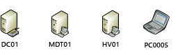

>[!NOTE]
>For details about the setup for the procedures in this article, please see [Prepare for deployment with MDT](prepare-for-windows-deployment-with-mdt.md).

## Step 1: Configure Active Directory permissions

These steps will show you how to configure an Active Directory account with the permissions required to deploy a Windows 10 machine to the domain using MDT. These steps assume you have  The account is used for Windows Preinstallation Environment (Windows PE) to connect to MDT01. In order for MDT to join machines into the contoso.com domain you need to create an account and configure permissions in Active Directory.

On **DC01**:

1. Download the [Set-OUPermissions.ps1 script](https://go.microsoft.com/fwlink/p/?LinkId=619362) and copy it to the **C:\\Setup\\Scripts** directory on **DC01**.  This script configures permissions to allow the **MDT_JD** account to manage computer accounts in the contoso > Computers organizational unit.
2. Create the **MDT_JD** service account by running the following command from an elevated **Windows PowerShell prompt**:

   ```powershell
   New-ADUser -Name MDT_JD -UserPrincipalName MDT_JD -path "OU=Service Accounts,OU=Accounts,OU=Contoso,DC=CONTOSO,DC=COM" -Description "MDT join domain account" -AccountPassword (ConvertTo-SecureString "pass@word1" -AsPlainText -Force) -ChangePasswordAtLogon $false -PasswordNeverExpires $true -Enabled $true 
   ```

3. Next, run the **Set-OuPermissions script** to apply permissions to the **MDT\_JD** service account, enabling it to manage computer accounts in the Contoso / Computers OU. Run the following commands from an elevated **Windows PowerShell prompt**:

   ```powershell
   Set-ExecutionPolicy -ExecutionPolicy RemoteSigned -Force
   Set-Location C:\Setup\Scripts
   .\Set-OUPermissions.ps1 -Account MDT_JD -TargetOU "OU=Workstations,OU=Computers,OU=Contoso"
   ```

The following is a list of the permissions being granted:
    a.  Scope: This object and all descendant objects
    b.  Create Computer objects
    c.  Delete Computer objects
    d.  Scope: Descendant Computer objects
    e.  Read All Properties
    f.  Write All Properties
    g.  Read Permissions
    h.  Modify Permissions
    i.  Change Password
    j.  Reset Password
    k.  Validated write to DNS host name
    l.  Validated write to service principal name

## Step 2: Set up the MDT production deployment share

Next, create a new **MDT** deployment share. You should not use the same deployment share that you used to create the reference image for a production deployment. Perform this procedure on the **MDT01** server.

### Create the MDT production deployment share

On **MDT01**:

The steps for creating the deployment share for production are the same as when you created the deployment share for creating the custom reference image:

1. Ensure you are signed on as: contoso\administrator.
2. In the **Deployment Workbench** console, right-click **Deployment Shares** and select **New Deployment Share**.
3. On the **Path** page, in the **Deployment share path** text box, type **D:\\MDTProduction** and click **Next**.
4. On the **Share** page, in the **Share name** text box, type **MDTProduction$** and click **Next**.
5. On the **Descriptive Name** page, in the **Deployment share description** text box, type **MDT Production** and click **Next**.
6. On the **Options** page, accept the default settings and click **Next** twice, and then click **Finish**.
7. Using **File Explorer**, verify that you can access the **\\\\MDT01\\MDTProduction$** share.

### Configure permissions for the production deployment share

To read files in the deployment share, you need to assign **NTFS** and **SMB** permissions to the **MDT Build Account (MDT\_BA)** for the **D:\\MDTProduction** folder.

On **MDT01**:

1.  Ensure you are signed in as **contoso\\administrator**.
2.  Modify the **NTFS** permissions for the **D:\\MDTProduction** folder by running the following command in an elevated **Windows PowerShell prompt**:

    ``` powershell
    icacls "D:\MDTProduction" /grant '"CONTOSO\MDT_BA":(OI)(CI)(M)'
    grant-smbshareaccess -Name MDTProduction$ -AccountName "Contoso\MDT_BA" -AccessRight Full -force
    ```

## Step 3: Add a custom image

The next step is to add a reference image into the deployment share with the setup files required to successfully deploy Windows 10. When adding a custom image, you still need to copy setup files (an option in the wizard) because Windows 10 stores additional components in the Sources\\SxS folder which is outside the image and may be required when installing components.

### Add the Windows 10 Enterprise x64 RTM custom image

In these steps, we assume that you have completed the steps in the [Create a Windows 10 reference image](create-a-windows-10-reference-image.md) topic, so you have a Windows 10 reference image at **D:\\MDTBuildLab\\Captures\REFW10X64-001.wim** on **MDT01**.

1.  Using the **Deployment Workbench**, expand the **Deployment Shares** node, and then expand **MDT Production**; select the **Operating Systems** node, and create a **folder** named **Windows 10**.
2.  Right-click the **Windows 10** folder and select **Import Operating System**.
3.  On the **OS Type** page, select **Custom image file** and click **Next**.
4.  On the **Image** page, in the **Source file** text box, browse to **D:\\MDTBuildLab\\Captures\\REFW10X64-001.wim** and click **Next**.
5.  On the **Setup** page, select the **Copy Windows 7, Windows Server 2008 R2, or later setup files from the specified path** option; in the **Setup source directory** text box, browse to **D:\\MDTBuildLab\\Operating Systems\\W10EX64RTM** and click **Next**.
6.  On the **Destination** page, in the **Destination directory name** text box, type **W10EX64RTM**, click **Next** twice, and then click **Finish**.
7.  After adding the **Operating System**, double-click the added **Operating System** name in the **Operating Systems / Windows 10** node and change the name to **Windows 10 Enterprise x64 RTM Custom Image**.

> [!NOTE]
> The reason for adding the setup files has changed since earlier versions of **MDT**. **MDT 2010** used the setup files to install Windows. **MDT** uses the **DISM** command to apply the image; however, you still need the **setup files** because some components in **roles and features** are stored outside the main image.
 

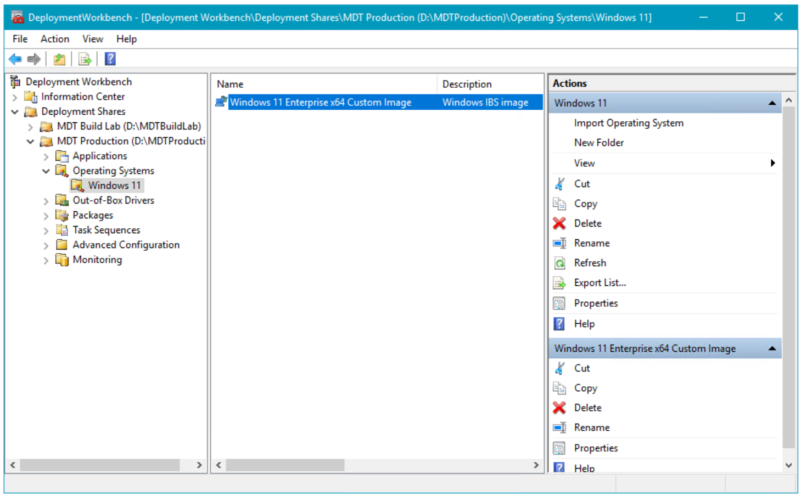

## Step 4: Add an application

When you configure your **MDT Build Lab deployment** share, you can also add **applications** to the new deployment share before creating your task sequence. This section walks you through the process of adding an application to the **MDT Production deployment** share using **Adobe Reader** as an example.

### Create the install: Adobe Reader DC

On **MDT01**:

1. Download the Enterprise distribution version of [**Adobe Acrobat Reader DC**](https://get.adobe.com/reader/enterprise/) (AcroRdrDC2100120140_en_US.exe) to **D:\\setup\\adobe** on MDT01.
2. Extract the **.exe** file that you downloaded to a **.msi** (ex: .\AcroRdrDC2100120140_en_US.exe -sfx_o"d:\setup\adobe\install\" -sfx_ne).
3. In the **Deployment Workbench**, expand the **MDT Production** node and navigate to the **Applications** node.
4. Right-click the **Applications** node, and create a new folder named **Adobe**.
5. In the **Applications** node, right-click the **Adobe** folder and select **New Application**.
6. On the **Application Type** page, select the **Application with source files** option and click **Next**.
7. On the **Details** page, in the **Application Name** text box, type **Install - Adobe Reader** and click *Next**.
8. On the **Source** page, in the **Source Directory** text box, browse to **D:\\setup\\adobe\\install** and click **Next**.
9. On the **Destination** page, in the **Specify the name of the directory that should be created** text box, type **Install - Adobe Reader** and click **Next**.
10. On the **Command Details** page, in the **Command Line** text box, type **msiexec /i AcroRead.msi /q**, click **Next** twice, and then click **Finish**.

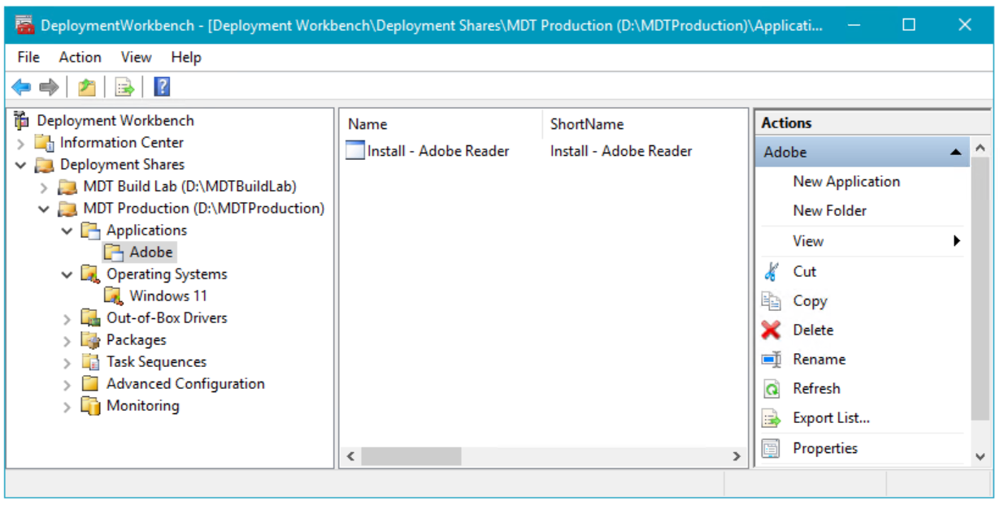

The Adobe Reader application added to the Deployment Workbench.

## Step 5: Prepare the drivers repository

In order to deploy Windows 10 with **MDT** successfully, you need drivers for the boot images and for the actual operating system. This section will show you how to add drivers for the boot images and operating system, using the following hardware models as examples:
-   Lenovo ThinkPad T420
-   Dell Latitude 7390
-   HP EliteBook 8560w
-   Microsoft Surface Pro

For boot images, you need to have storage and network drivers; for the operating system, you need to have the full suite of drivers.

>[!NOTE]
>You should only add drivers to the Windows PE images if the default drivers don't work. Adding drivers that are not necessary will only make the boot image larger and potentially delay the download time.
 
### Create the driver source structure in the file system

The key to successful management of drivers for **MDT**, as well as for any other deployment solution, is to have a really good driver repository. From this repository, you import drivers into MDT for deployment, but you should always maintain the repository for future use.

On **MDT01**:

> [!IMPORTANT]
> In the steps below, it is critical that the folder names used for various computer makes and models exactly match the results of **wmic computersystem get model,manufacturer** on the target system.

1.  Using **File Explorer**, create the **D:\\drivers** folder.
2.  In the **D:\\drivers** folder, create the following folder structure:
    1.  **WinPE x86**
    2.  **WinPE x64**
    3.  **Windows 10 x64**
3.  In the new **Windows 10 x64** folder, create the following folder structure:
    -   Dell Inc
        -   Latitude E7450
    -   Hewlett-Packard
        -   HP EliteBook 8560w
    -   Lenovo
        -   ThinkStation P500 (30A6003TUS)
    -   Microsoft Corporation
        -   Surface Laptop

> [!NOTE]
> Even if you are not going to use both x86 and x64 boot images, we still recommend that you add the support structure for future use.
 
### Create the logical driver structure in MDT

When you import drivers to the **MDT driver repository**, **MDT** creates a single instance folder structure based on driver class names. However, you can, and should, mimic the driver structure of your driver source repository in the Deployment Workbench. This is done by creating logical folders in the Deployment Workbench.
1.  On **MDT01**, using Deployment Workbench, select the **Out-of-Box Drivers** node.
2.  In the **Out-Of-Box Drivers** node, create the following folder structure:
    1.  **WinPE x86**
    2.  **WinPE x64**
    3.  **Windows 10 x64**
3.  In the **Windows 10 x64** folder, create the following folder structure:
    -   Dell Inc
        -   Latitude E7450
    -   Hewlett-Packard
        -   HP EliteBook 8560w
    -   Lenovo
        -   30A6003TUS
    -   Microsoft Corporation
        -   Surface Laptop

The preceding folder names should match the actual make and model values that MDT reads from devices during deployment. You can find out the model values for your machines by using the following command in an elevated **Windows PowerShell prompt**:

``` powershell
Get-WmiObject -Class:Win32_ComputerSystem
```
Or, you can use this command in a normal command prompt:

``` 
wmic csproduct get name
```

If you want a more standardized naming convention, try the **ModelAliasExit.vbs script** from the Deployment Guys blog post entitled [Using and Extending Model Aliases for Hardware Specific Application Installation](https://go.microsoft.com/fwlink/p/?LinkId=619536).

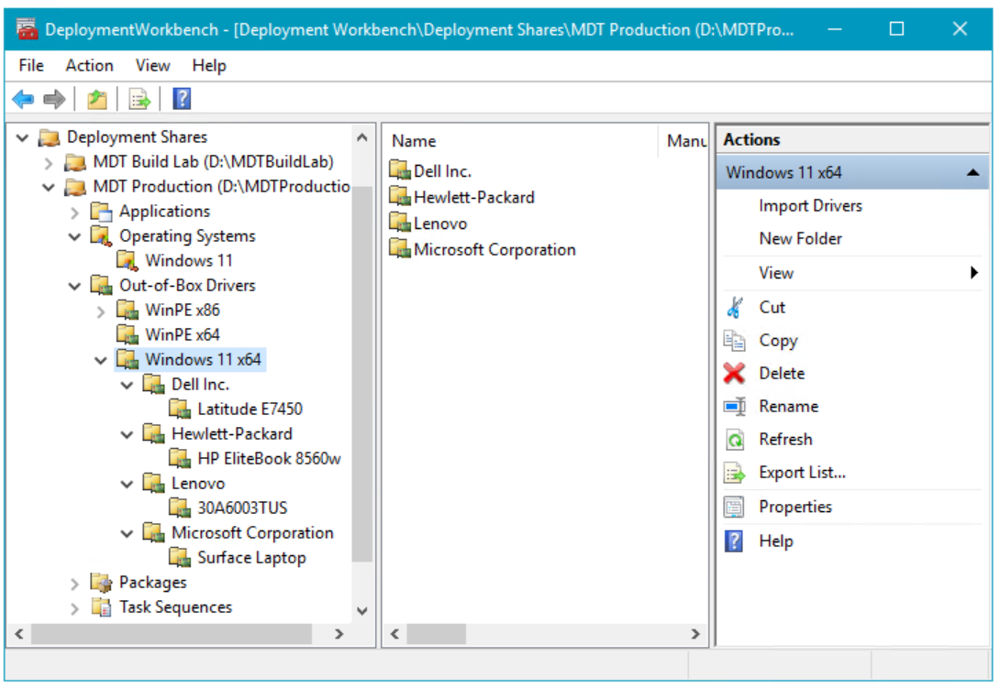

The Out-of-Box Drivers structure in the Deployment Workbench.

### Create the selection profiles for boot image drivers

By default, MDT adds any storage and network drivers that you import to the boot images. However, you should add only the drivers that are necessary to the boot image. You can control which drivers are added by using selection profiles.
The drivers that are used for the boot images (Windows PE) are Windows 10 drivers. If you can’t locate **Windows 10** drivers for your device, a **Windows 7** or **Windows 8.1** driver will most likely work, but Windows 10 drivers should be your first choice.

On **MDT01**:

1.  In the **Deployment Workbench**, under the **MDT Production** node, expand the **Advanced Configuration** node, right-click the **Selection Profiles** node, and select **New Selection Profile**.
2.  In the **New Selection Profile Wizard**, create a **selection profile** with the following settings:
    1.  Selection Profile name: **WinPE x86**
    2.  Folders: Select the **WinPE x86 folder** in **Out-of-Box Drivers**.
    3. Click **Next**, **Next**, and **Finish**.
3.  Right-click the **Selection Profiles** node again, and select **New Selection Profile**.
4.  In the **New Selection Profile Wizard**, create a **selection profile** with the following settings:
    1.  Selection Profile name: **WinPE x64**
    2.  Folders: Select the **WinPE x64 folder** in **Out-of-Box Drivers**.
    3.  Click **Next**, **Next**, and **Finish**.

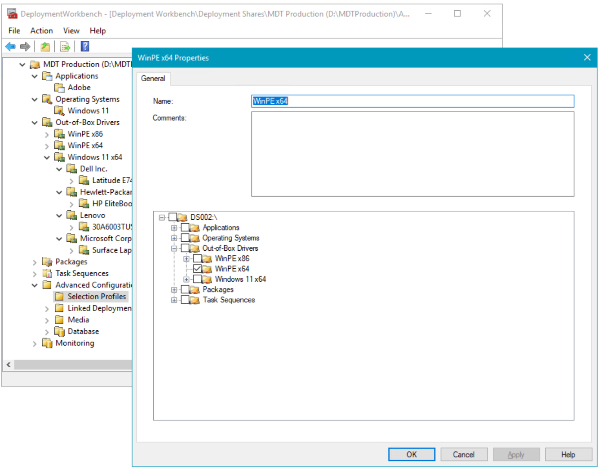

Creating the WinPE x64 selection profile.

### Extract and import drivers for the x64 boot image

**Windows PE** supports all the hardware models that we have, but here you learn how to add boot image drivers to accommodate any new hardware that might require additional drivers. In this example, you add the latest Intel network drivers to the x64 boot image.

On **MDT01**:

1. Download **PROWinx64.exe** from Intel.com (ex: [PROWinx64.exe](https://downloadcenter.intel.com/downloads/eula/25016/Intel-Network-Adapter-Driver-for-Windows-10?httpDown=https%3A%2F%2Fdownloadmirror.intel.com%2F25016%2Feng%2FPROWinx64.exe)).
2.  Extract **PROWinx64.exe** to a temporary folder - in this example to the **C:\\Tmp\\ProWinx64** folder.
3.  Using **File Explorer**, create the **D:\\Drivers\\WinPE x64\\Intel PRO1000** folder.
4.  Copy the content of the **C:\\Tmp\\PROWinx64\\PRO1000\\Winx64\\NDIS64** folder to the **D:\\Drivers\\WinPE x64\\Intel PRO1000** folder.
5.  In the **Deployment Workbench**, expand the **MDT Production** > **Out-of-Box Drivers** node, right-click the **WinPE x64** node, select **Import Drivers**, and use the following driver source directory to import drivers: **D:\\Drivers\\WinPE x64\\Intel PRO1000**.

### Download, extract, and import drivers

### For the Lenovo ThinkStation P500

For the **ThinkStation P500** model, you use the Lenovo ThinkVantage Update Retriever software to download the drivers. With Update Retriever, you need to specify the correct Lenovo Machine Type for the actual hardware (the first four characters of the model name). As an example, the Lenovo ThinkStation P500 model has the 30A6003TUS model name, meaning the Machine Type is 30A6.

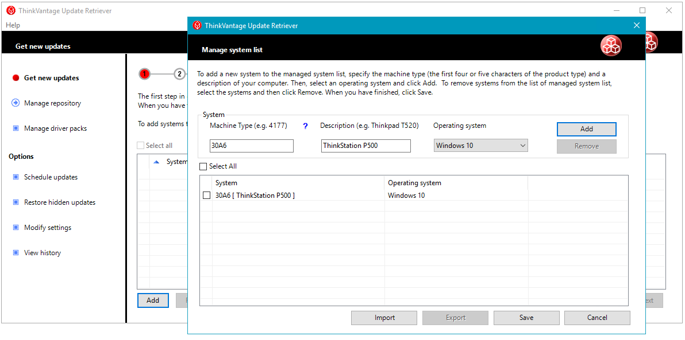

To get the updates, download the drivers from the Lenovo ThinkVantage Update Retriever using its export function. You can also download the drivers by searching PC Support on the [Lenovo website](https://go.microsoft.com/fwlink/p/?LinkId=619543).

In this example, we assume you have downloaded and extracted the drivers using ThinkVantage Update Retriever to the **D:\\Drivers\\Lenovo\\ThinkStation P500 (30A6003TUS)** directory.

On **MDT01**:

1. In the Deployment Workbench, in the **MDT Production** > **Out-Of-Box Drivers** > **Windows 10 x64** node, expand the **Lenovo** node.
2.  Right-click the **30A6003TUS** folder and select **Import Drivers** and use the following Driver source directory to import drivers: **D:\\Drivers\\Windows 10 x64\\Lenovo\\ThinkStation P500 (30A6003TUS)**

The folder you select and all sub-folders will be checked for drivers, expanding any .cab files that are present and searching for drivers.

### For the Latitude E7450

For the Dell Latitude E7450 model, you use the Dell Driver CAB file, which is accessible via the [Dell TechCenter website](https://go.microsoft.com/fwlink/p/?LinkId=619544).

In these steps, we assume you have downloaded and extracted the CAB file for the Latitude E7450 model to the **D:\\Drivers\\Dell Inc\\Latitude E7450** folder.

On **MDT01**:

1. In the **Deployment Workbench**, in the **MDT Production** > **Out-Of-Box Drivers** > **Windows 10 x64** node, expand the **Dell Inc** node.
2.  Right-click the **Latitude E7450** folder and select **Import Drivers** and use the following Driver source directory to import drivers: **D:\\Drivers\\Windows 10 x64\\Dell Inc\\Latitude E7450**

### For the HP EliteBook 8560w

For the HP EliteBook 8560w, you use HP SoftPaq Download Manager to get the drivers. The HP SoftPaq Download Manager can be accessed on the [HP Support site](https://go.microsoft.com/fwlink/p/?LinkId=619545).

In these steps, we assume you have downloaded and extracted the drivers for the HP EliteBook 8650w model to the **D:\\Drivers\\Windows 10 x64\\Hewlett-Packard\\HP EliteBook 8560w** folder.

On **MDT01**:

1.  In the **Deployment Workbench**, in the **MDT Production** > **Out-Of-Box Drivers** > **Windows 10 x64** node, expand the **Hewlett-Packard** node.
2.  Right-click the **HP EliteBook 8560w** folder and select **Import Drivers** and use the following Driver source directory to import drivers: **D:\\Drivers\\Windows 10 x64\\Hewlett-Packard\\HP EliteBook 8560w**

### For the Microsoft Surface Laptop

For the Microsoft Surface Laptop model, you find the drivers on the Microsoft website. In these steps we assume you have downloaded and extracted the Surface Laptop drivers to the **D:\\Drivers\\Windows 10 x64\\Microsoft\\Surface Laptop** folder.

On **MDT01**:

1.  In the Deployment Workbench, in the **MDT Production** > **Out-Of-Box Drivers** > **Windows 10 x64** node, expand the **Microsoft** node.
2.  Right-click the **Surface Laptop** folder and select **Import Drivers**; and use the following Driver source directory to import drivers: **D:\\Drivers\\Windows 10 x64\\Microsoft\\Surface Laptop**

## Step 6: Create the deployment task sequence

This section will show you how to create the task sequence used to deploy your production Windows 10 reference image. You will then configure the task sequence to enable patching via a Windows Server Update Services (WSUS) server.

### Create a task sequence for Windows 10 Enterprise

On **MDT01**:

1. In the Deployment Workbench, under the **MDT Production** node, right-click **Task Sequences**, and create a folder named **Windows 10**.
2. Right-click the new **Windows 10** folder and select **New Task Sequence**. Use the following settings for the New Task Sequence Wizard:
   1. Task sequence ID: W10-X64-001
   2. Task sequence name: Windows 10 Enterprise x64 RTM Custom Image
   3. Task sequence comments: Production Image
   4. Template: Standard Client Task Sequence
   5. Select OS: Windows 10 Enterprise x64 RTM Custom Image
   6. Specify Product Key: Do not specify a product key at this time
   7. Full Name: Contoso
   8. Organization: Contoso
   9. Internet Explorer home page: https://www.contoso.com
   10. Admin Password: Do not specify an Administrator Password at this time

### Edit the Windows 10 task sequence

1. Continuing from the previous procedure, right-click the **Windows 10 Enterprise x64 RTM Custom Image** task sequence, and select **Properties**.
2. On the **Task Sequence** tab, configure the **Windows 10 Enterprise x64 RTM Custom Image** task sequence with the following settings:
   1.  Preinstall: After the **Enable BitLocker (Offline)** action, add a **Set Task Sequence Variable** action with the following settings:
       1.  Name: Set DriverGroup001
       2.  Task Sequence Variable: DriverGroup001
       3.  Value: Windows 10 x64\\%Make%\\%Model%
   2.  Configure the **Inject Drivers** action with the following settings:
       1.  Choose a selection profile: Nothing
       2.  Install all drivers from the selection profile

           >[!NOTE]
           >The configuration above indicates that MDT should only use drivers from the folder specified by the DriverGroup001 property, which is defined by the "Choose a selection profile: Nothing" setting, and that MDT should not use plug and play to determine which drivers to copy, which is defined by the "Install all drivers from the selection profile" setting.
             
   3.  State Restore. Enable the **Windows Update (Pre-Application Installation)** action.
   4.  State Restore. Enable the **Windows Update (Post-Application Installation)** action.
3. Click **OK**.

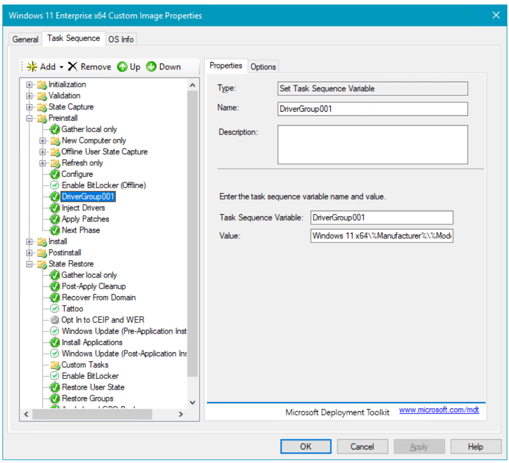

The task sequence for production deployment.

## Step 7: Configure the MDT production deployment share

In this section, you will learn how to configure the MDT Build Lab deployment share with the rules required to create a simple and dynamic deployment process. This includes configuring commonly used rules and an explanation of how these rules work.

### Configure the rules

> [!NOTE]
> The following instructions assume the device is online. If you're offline you can remove SLShare variable.

On **MDT01**:

1. Right-click the **MDT Production** deployment share and select **Properties**.
2. Select the **Rules** tab and replace the existing rules with the following information (modify the domain name, WSUS server, and administrative credentials to match your environment):

  ``` 
  [Settings]
  Priority=Default

  [Default]
  _SMSTSORGNAME=Contoso
  OSInstall=YES
  UserDataLocation=AUTO
  TimeZoneName=Pacific Standard Time 
  AdminPassword=pass@word1
  JoinDomain=contoso.com
  DomainAdmin=CONTOSO\MDT_JD
  DomainAdminPassword=pass@word1
  MachineObjectOU=OU=Workstations,OU=Computers,OU=Contoso,DC=contoso,DC=com
  SLShare=\\MDT01\Logs$
  ScanStateArgs=/ue:*\* /ui:CONTOSO\*
  USMTMigFiles001=MigApp.xml
  USMTMigFiles002=MigUser.xml
  HideShell=YES
  ApplyGPOPack=NO
  WSUSServer=mdt01.contoso.com:8530
  SkipAppsOnUpgrade=NO
  SkipAdminPassword=YES
  SkipProductKey=YES
  SkipComputerName=NO
  SkipDomainMembership=YES
  SkipUserData=YES
  SkipLocaleSelection=YES
  SkipTaskSequence=NO
  SkipTimeZone=YES
  SkipApplications=NO
  SkipBitLocker=YES
  SkipSummary=YES
  SkipCapture=YES
  SkipFinalSummary=NO
  ```

3. Click **Edit Bootstrap.ini** and modify using the following information:

``` 
[Settings]
Priority=Default

[Default]
DeployRoot=\\MDT01\MDTProduction$
UserDomain=CONTOSO
UserID=MDT_BA
UserPassword=pass@word1
SkipBDDWelcome=YES
```

4. On the **Windows PE** tab, in the **Platform** drop-down list, make sure **x86** is selected.
5. On the **General** sub tab (still under the main Windows PE tab), configure the following settings:
   - In the **Lite Touch Boot Image Settings** area:
     1.  Image description: MDT Production x86
     2.  ISO file name: MDT Production x86.iso
        
     > [!NOTE]
     > 
     >Because you are going to use Pre-Boot Execution Environment (PXE) later to deploy the machines, you do not need the ISO file; however, we recommend creating ISO files because they are useful when troubleshooting deployments and for quick tests.
         
6. On the **Drivers and Patches** sub tab, select the **WinPE x86** selection profile and select the **Include all drivers from the selection profile** option.
7. On the **Windows PE** tab, in the **Platform** drop-down list, select **x64**.
8. On the **General** sub tab, configure the following settings:
   -   In the **Lite Touch Boot Image Settings** area:
       1.  Image description: MDT Production x64
       2.  ISO file name: MDT Production x64.iso
9. In the **Drivers and Patches** sub tab, select the **WinPE x64** selection profile and select the **Include all drivers from the selection profile** option.
10. In the **Monitoring** tab, select the **Enable monitoring for this deployment share** check box.
11. Click **OK**.

>[!NOTE]
>It will take a while for the Deployment Workbench to create the monitoring database and web service.
 

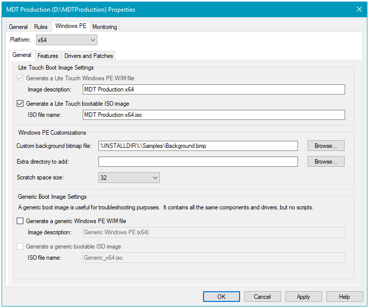

The Windows PE tab for the x64 boot image.

### The rules explained

The rules for the MDT Production deployment share are somewhat different from those for the MDT Build Lab deployment share. The biggest differences are that you deploy the machines into a domain instead of a workgroup.

>
>You can optionally remove the **UserID** and **UserPassword** entries from Bootstrap.ini so that users performing PXE boot are prompted to provide credentials with permission to connect to the deployment share. Setting **SkipBDDWelcome=NO** enables the welcome screen that displays options to run the deployment wizard, run DaRT tools (if installed), exit to a Windows PE command prompt, set the keyboard layout, or configure a static IP address.  In this example we are skipping the welcome screen and providing credentials.

### The Bootstrap.ini file

This is the MDT Production Bootstrap.ini:
``` 
[Settings]
Priority=Default

[Default]
DeployRoot=\\MDT01\MDTProduction$
UserDomain=CONTOSO
UserID=MDT_BA
UserPassword=pass@word1
SkipBDDWelcome=YES
```

### The CustomSettings.ini file

This is the CustomSettings.ini file with the new join domain information:
``` 
[Settings]
Priority=Default

[Default]
_SMSTSORGNAME=Contoso
OSInstall=Y
UserDataLocation=AUTO
TimeZoneName=Pacific Standard Time 
AdminPassword=pass@word1
JoinDomain=contoso.com
DomainAdmin=CONTOSO\MDT_JD
DomainAdminPassword=pass@word1
MachineObjectOU=OU=Workstations,OU=Computers,OU=Contoso,DC=contoso,DC=com
SLShare=\\MDT01\Logs$
ScanStateArgs=/ue:*\* /ui:CONTOSO\*
USMTMigFiles001=MigApp.xml
USMTMigFiles002=MigUser.xml
HideShell=YES
ApplyGPOPack=NO
WSUSServer=http://mdt01.contoso.com:8530
SkipAppsOnUpgrade=NO
SkipAdminPassword=YES
SkipProductKey=YES
SkipComputerName=NO
SkipDomainMembership=YES
SkipUserData=YES
SkipLocaleSelection=YES
SkipTaskSequence=NO
SkipTimeZone=YES
SkipApplications=NO
SkipBitLocker=YES
SkipSummary=YES
SkipCapture=YES
SkipFinalSummary=NO
EventService=http://MDT01:9800
```

Some properties to use in the MDT Production rules file are as follows:
-   **JoinDomain.** The domain to join.
-   **DomainAdmin.** The account to use when joining the machine to the domain.
-   **DomainAdminDomain.** The domain for the join domain account.
-   **DomainAdminPassword.** The password for the join domain account.
-   **MachineObjectOU.** The organizational unit (OU) to which to add the computer account.
-   **ScanStateArgs.** Arguments for the User State Migration Tool (USMT) ScanState command.
-   **USMTMigFiles(\*).** List of USMT templates (controlling what to backup and restore).
-   **EventService.** Activates logging information to the MDT monitoring web service.

### Optional deployment share configuration

If your organization has a Microsoft Software Assurance agreement, you also can subscribe to the additional Microsoft Desktop Optimization Package (MDOP) license (at an additional cost). Included in MDOP is Microsoft Diagnostics and Recovery Toolkit (DaRT), which contains tools that can help you troubleshoot MDT deployments, as well as troubleshoot Windows itself.

### Add DaRT 10 to the boot images

If you have licensing for MDOP and DaRT, you can add DaRT to the boot images using the steps in this section. If you do not have DaRT licensing, or don't want to use it, simply skip to the next section, [Update the Deployment Share](#update-the-deployment-share). To enable the remote connection feature in MDT, you need to do the following:

>DaRT 10 is part of [MDOP 2015](https://docs.microsoft.com/microsoft-desktop-optimization-pack/#how-to-get-mdop). Note: MDOP might be available as a download from your [Visual Studio subscription](https://my.visualstudio.com/Downloads). When searching, be sure to look for **Desktop Optimization Pack**.

On **MDT01**:

1. Download MDOP 2015 and copy the DaRT 10 installer file to the D:\\Setup\\DaRT 10 folder on MDT01 (DaRT\\DaRT 10\\Installers\\\<lang\>\\x64\\MSDaRT100.msi).
2. Install DaRT 10 (MSDaRT10.msi) using the default settings.

  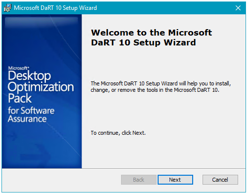

2. Copy the two tools CAB files from **C:\\Program Files\\Microsoft DaRT\\v10** (**Toolsx86.cab** and **Toolsx64.cab**) to the production deployment share at **D:\\MDTProduction\\Tools\\x86** and **D:\\MDTProduction\\Tools\\x64**, respectively.
3. In the Deployment Workbench, right-click the **MDT Production** deployment share and select **Properties**.
4. On the **Windows PE** tab, in the **Platform** drop-down list, make sure **x86** is selected.
5. On the **Features** sub tab, select the **Microsoft Diagnostics and Recovery Toolkit (DaRT)** checkbox.

  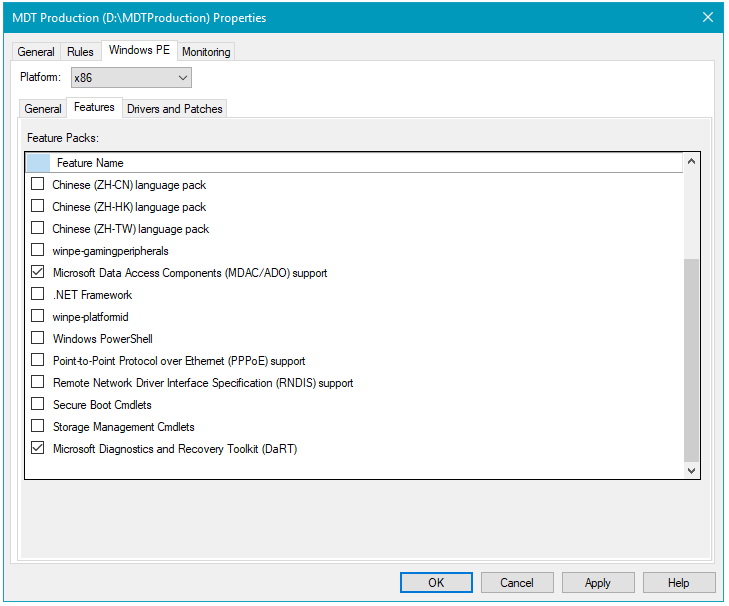

  Selecting the DaRT 10 feature in the deployment share.

8. In the **Windows PE** tab, in the **Platform** drop-down list, select **x64**.
9. In the **Features** sub tab, in addition to the default selected feature pack, select the **Microsoft Diagnostics and Recovery Toolkit (DaRT)** check box.
10. Click **OK**.

### Update the deployment share

Like the MDT Build Lab deployment share, the MDT Production deployment share needs to be updated after it has been configured. This is the process during which the Windows PE boot images are created.
1.  Right-click the **MDT Production** deployment share and select **Update Deployment Share**.
2.  Use the default options for the Update Deployment Share Wizard.

>[!NOTE]
>The update process will take 5 to 10 minutes.

## Step 8: Deploy the Windows 10 client image

These steps will walk you through the process of using task sequences to deploy Windows 10 images through a fully automated process. First, you need to add the boot image to Windows Deployment Services (WDS) and then start the deployment. In contrast with deploying images from the MDT Build Lab deployment share, we recommend using the Pre-Installation Execution Environment (PXE) to start the full deployments in the datacenter, even though you technically can use an ISO/CD or USB to start the process.

### Configure Windows Deployment Services

You need to add the MDT Production Lite Touch x64 Boot image to WDS in preparation for the deployment. In this procedure, we assume that WDS is already installed and initialized on MDT01 as described in the [Prepare for Windows deployment](prepare-for-windows-deployment-with-mdt.md#install-and-initialize-windows-deployment-services-wds) article.

On **MDT01**:

1. Open the Windows Deployment Services console, expand the **Servers** node and then expand **MDT01.contoso.com**.
2. Right-click **Boot Images** and select **Add Boot Image**.
3. Browse to the **D:\\MDTProduction\\Boot\\LiteTouchPE\_x64.wim** file and add the image with the default settings.

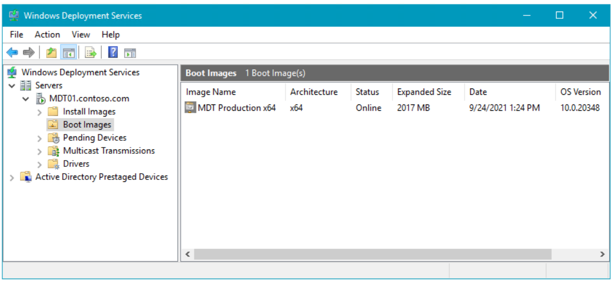

The boot image added to the WDS console.

### Deploy the Windows 10 client

At this point, you should have a solution ready for deploying the Windows 10 client. We recommend starting by trying a few deployments at a time until you are confident that your configuration works as expected. We find it useful to try some initial tests on virtual machines before testing on physical hardware. This helps rule out hardware issues when testing or troubleshooting. Here are the steps to deploy your Windows 10 image to a virtual machine:

On **HV01**:

1. Create a virtual machine with the following settings:
    1. Name: PC0005
    2. Store the virtual machine in a different location: C:\VM
    3. Generation: 2
    4. Memory: 2048 MB
    5. Network: Must be able to connect to \\MDT01\MDTProduction$
    6. Hard disk: 60 GB (dynamic disk)
    7. Installation Options: Install an operating system from a network-based installation server
2.  Start the PC0005 virtual machine, and press **Enter** to start the PXE boot. The VM will now load the Windows PE boot image from the WDS server.

    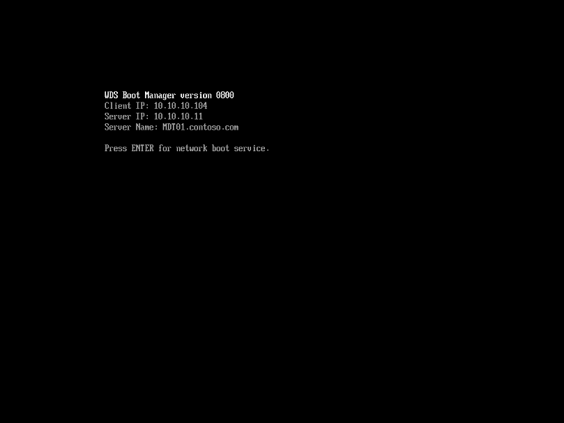

    The initial PXE boot process of PC0005.

3.  After Windows PE has booted, complete the Windows Deployment Wizard using the following setting:
    1.  Select a task sequence to execute on this computer: Windows 10 Enterprise x64 RTM Custom Image
    2.  Computer Name: **PC0005**
    3.  Applications: Select the **Install - Adobe Reader** checkbox.
4.  Setup now begins and does the following:
    1.  Installs the Windows 10 Enterprise operating system.
    2.  Installs the added application.
    3.  Updates the operating system via your local Windows Server Update Services (WSUS) server.

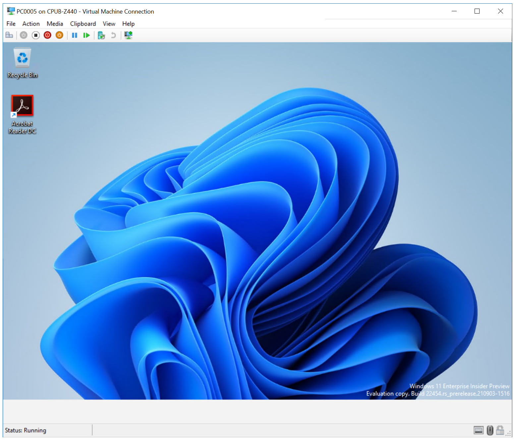

### Application installation

Following OS installation, Microsoft Office 365 Pro Plus - x64 is installed automatically.

 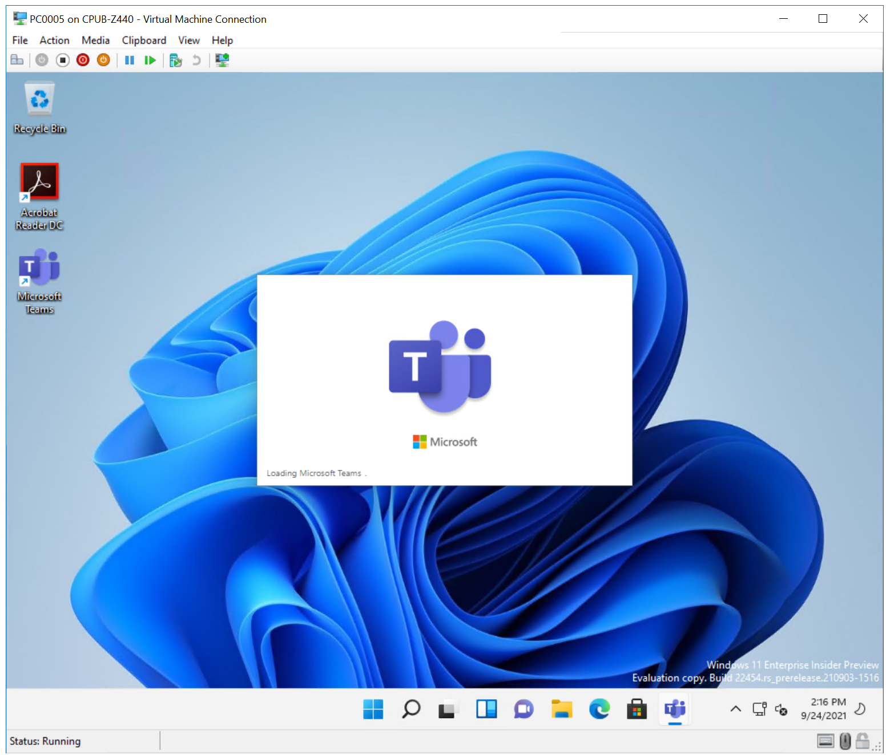

### Use the MDT monitoring feature

Since you have enabled the monitoring on the MDT Production deployment share, you can follow your deployment of PC0005 via the monitoring node.

On **MDT01**:

1.  In the Deployment Workbench, expand the **MDT Production** deployment share folder.
2.  Select the **Monitoring** node, and wait until you see PC0005.
3.  Double-click PC0005, and review the information.

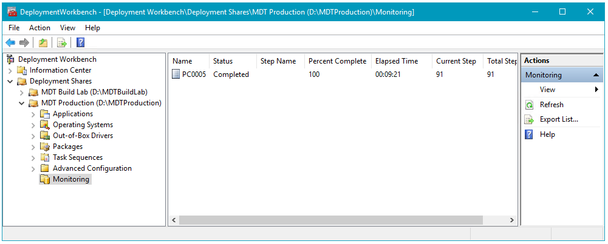

The Monitoring node, showing the deployment progress of PC0005.

### Use information in the Event Viewer

When monitoring is enabled, MDT also writes information to the event viewer on MDT01. This information can be used to trigger notifications via scheduled tasks when deployment is completed. For example, you can configure scheduled tasks to send an email when a certain event is created in the event log.

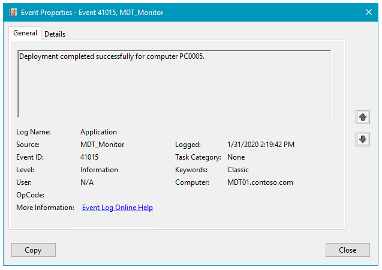

The Event Viewer showing a successful deployment of PC0005.

## Multicast deployments

Multicast deployment allows for image deployment with reduced network load during simultaneous deployments. Multicast is a useful operating system deployment feature in MDT deployments, however it is important to ensure that your network supports it and is designed for it. If you have a limited number of simultaneous deployments, you probably do not need to enable multicast.

### Requirements

Multicast requires that Windows Deployment Services (WDS) is running on Windows Server 2008 or later. In addition to the core MDT setup for multicast, the network needs to be configured to support multicast. In general, this means involving the organization networking team to make sure that 
Internet Group Management Protocol (IGMP) snooping is turned on and that the network is designed for multicast traffic. The multicast solution uses IGMPv3.

### Set up MDT for multicast

Setting up MDT for multicast is straightforward. You enable multicast on the deployment share, and MDT takes care of the rest.

On **MDT01**:

1.  In the Deployment Workbench, right-click the **MDT Production** deployment share folder and select **Properties**.
2.  On the **General** tab, select the **Enable multicast for this deployment share (requires Windows Server 2008 R2 Windows Deployment Services)** check box, and click **OK**.
3.  Right-click the **MDT Production** deployment share folder and select **Update Deployment Share**.
4.  After updating the deployment share, use the Windows Deployment Services console to, verify that the multicast namespace was created.

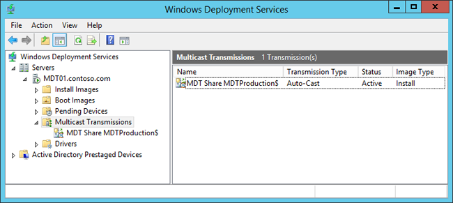

The newly created multicast namespace.

## Use offline media to deploy Windows 10

In addition to network-based deployments, MDT supports the use of offline media-based deployments of Windows 10. You can very easily generate an offline version of your deployment share - either the full deployment share or a subset of it - through the use of selection profiles. The generated offline media can be burned to a DVD or copied to a USB stick for deployment.

Offline media are useful not only when you do not have network connectivity to the deployment share, but also when you have limited connection to the deployment share and do not want to copy 5 GB of data over the wire. Offline media can still join the domain, but you save the transfer of operating system images, drivers, and applications over the wire.

### Create the offline media selection profile

To filter what is being added to the media, you create a selection profile. When creating selection profiles, you quickly realize the benefits of having created a good logical folder structure in the Deployment Workbench.

On **MDT01**:

1.  In the Deployment Workbench, under the **MDT Production / Advanced Configuration** node, right-click **Selection Profiles**, and select **New Selection Profile**.
2.  Use the following settings for the New Selection Profile Wizard:
    1.  General Settings
        -   Selection profile name: Windows 10 Offline Media
    2.  Folders
        1.  Applications / Adobe
        2.  Operating Systems / Windows 10
        3.  Out-Of-Box Drivers / WinPE x64
        4.  Out-Of-Box Drivers / Windows 10 x64
        5.  Task Sequences / Windows 10

      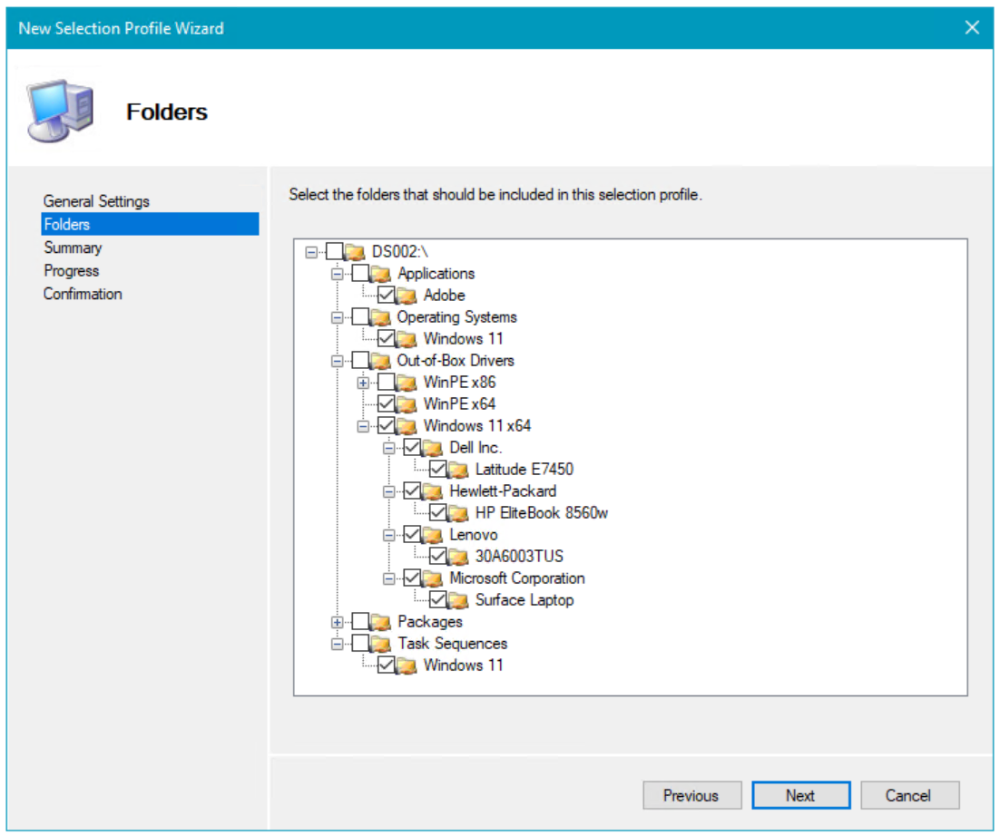

### Create the offline media

In these steps, you generate offline media from the MDT Production deployment share. To filter what is being added to the media, you use the previously created selection profile.

1.  On MDT01, using File Explorer, create the **D:\\MDTOfflineMedia** folder.

     >[!NOTE]
     >When creating offline media, you need to create the target folder first. It is crucial that you do not create a subfolder inside the deployment share folder because it will break the offline media.
     
2.  In the Deployment Workbench, under the **MDT Production / Advanced Configuration** node, right-click the **Media** node, and select **New Media**.
3.  Use the following settings for the New Media Wizard:
    -   General Settings
        1.  Media path: **D:\\MDTOfflineMedia**
        2.  Selection profile: **Windows 10 Offline Media**

### Configure the offline media

Offline media has its own rules, its own Bootstrap.ini and CustomSettings.ini files. These files are stored in the Control folder of the offline media; they also can be accessed via properties of the offline media in the Deployment Workbench.

On **MDT01**:

1.  Copy the CustomSettings.ini file from the **D:\MDTProduction\Control** folder to **D:\\MDTOfflineMedia\\Content\\Deploy\\Control**. Overwrite the existing files.
2.  In the Deployment Workbench, under the **MDT Production / Advanced Configuration / Media** node, right-click the **MEDIA001** media, and select **Properties**.
3.  In the **General** tab, configure the following:
    1.  Clear the Generate x86 boot image check box.
    2.  ISO file name: Windows 10 Offline Media.iso
4.  On the **Windows PE** tab, in the **Platform** drop-down list, select **x64**.
5.  On the **General** sub tab, configure the following settings:
    1.  In the **Lite Touch Boot Image Settings** area:
        -   Image description: MDT Production x64
    2.  In the **Windows PE Customizations** area, set the Scratch space size to 128.
6.  On the **Drivers and Patches** sub tab, select the **WinPE x64** selection profile and select the **Include all drivers from the selection profile** option.
7.  Click **OK**.

### Generate the offline media

You have now configured the offline media deployment share, however the share has not yet been populated with the files required for deployment. Now everything is ready you populate the deployment share content folder and generate the offline media ISO.

On **MDT01**:

1.  In the Deployment Workbench, navigate to the **MDT Production / Advanced Configuration / Media** node.
2.  Right-click the **MEDIA001** media, and select **Update Media Content**. The Update Media Content process now generates the offline media in the **D:\\MDTOfflineMedia\\Content** folder. The process might require several minutes.

### Create a bootable USB stick

The ISO that you got when updating the offline media item can be burned to a DVD and used directly (it will be bootable), but it is often more efficient to use USB sticks instead since they are faster and can hold more data. (A dual-layer DVD is limited to 8.5 GB.)

>[!TIP] 
>In this example, the .wim file is 5.5 GB in size. However, bootable USB sticks are formatted with the FAT32 file system which limits file size to 4.0 GB. You can place the image on a different drive (ex: E:\Deploy\Operating Systems\W10EX64RTM\REFW10X64-001.swm) and then modify E:\Deploy\Control\OperatingSystems.xml to point to it. Alternatively to keep using the USB you must split the .wim file, which can be done using DISM: <br>&nbsp;<br>Dism /Split-Image /ImageFile:D:\MDTOfflinemedia\Content\Deploy\Operating Systems\W10EX64RTM\REFW10X64-001.wim /SWMFile:E:\sources\install.swm /FileSize:3800. <br>&nbsp;<br>Windows Setup automatically installs from this file, provided you name it install.swm. The file names for the next files include numbers, for example: install2.swm, install3.swm. <br>&nbsp;<br>To enable split image in MDT, the Settings.xml file in your deployment share (ex: D:\MDTProduction\Control\Settings.xml) must have the **SkipWimSplit** value set to **False**. By default this value is set to True (\<SkipWimSplit\>True\</SkipWimSplit\>), so this must be changed and the offline media content updated.

Follow these steps to create a bootable USB stick from the offline media content:

1.  On a physical machine running Windows 7 or later, insert the USB stick you want to use.
2.  Copy the content of the **MDTOfflineMedia\\Content** folder to the root of the USB stick.
3.  Start an elevated command prompt (run as Administrator), and start the Diskpart utility by typing **Diskpart** and pressing **Enter**.
4.  In the Diskpart utility, you can type **list volume** (or the shorter **list vol**) to list the volumes, but you really only need to remember the drive letter of the USB stick to which you copied the content. In our example, the USB stick had the drive letter F.
5.  In the Diskpart utility, type **select volume F** (replace F with your USB stick drive letter).
6.  In the Diskpart utility, type **active**, and then type **exit**.

## Unified Extensible Firmware Interface (UEFI)-based deployments

As referenced in [Windows 10 deployment scenarios and tools](https://go.microsoft.com/fwlink/p/?LinkId=619546), Unified Extensible Firmware Interface (UEFI)-based deployments are becoming more common. In fact, when you create a generation 2 virtual machine in Hyper-V, you get a UEFI-based computer. During deployment, MDT automatically detects that you have an UEFI-based machine and creates the partitions UEFI requires. You do not need to update or change your task sequences in any way to accommodate UEFI.

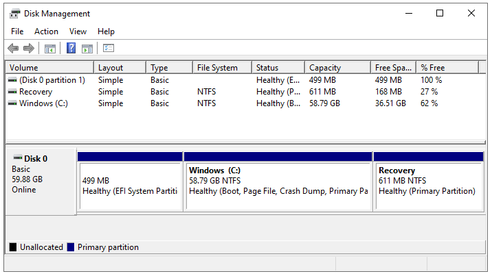

The partitions when deploying an UEFI-based machine.

## Related topics

[Get started with the Microsoft Deployment Toolkit (MDT)](get-started-with-the-microsoft-deployment-toolkit.md)<br>
[Create a Windows 10 reference image](create-a-windows-10-reference-image.md)<br>
[Build a distributed environment for Windows 10 deployment](build-a-distributed-environment-for-windows-10-deployment.md)<br>
[Refresh a Windows 7 computer with Windows 10](refresh-a-windows-7-computer-with-windows-10.md)<br>
[Replace a Windows 7 computer with a Windows 10 computer](replace-a-windows-7-computer-with-a-windows-10-computer.md)<br>
[Configure MDT settings](configure-mdt-settings.md)<br>
