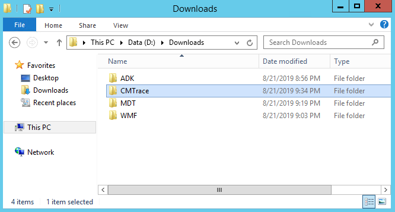

# Prepare for deployment with MDT

**Applies to**
-   Windows 10

This topic will walk you through the steps necessary to create the server structure required to deploy the Windows 10 operating system using the Microsoft Deployment Toolkit (MDT). It covers the installation of the necessary system prerequisites, the creation of shared folders and service accounts, and the configuration of security permissions in the file system and in Active Directory.

## Requirements

### Network and server infrastructure

For the purposes of this topic, we will use three computers: **DC01**, **MDT01**, and **HV01**.
- All servers are running Windows Server 2019. 
    - You can use an earlier version of Windows Server with minor modifications to some procedures. 
    - Although MDT supports Windows Server 2008 R2, At least Windows Server 2012 R2 or later is requried to perform the procedures in this guide.
- DC01 is a domain controller, DHCP server, and DNS server for contoso.com, representing the fictitious Contoso Corporation.
- MDT01 is a domain member server in contoso.com and has a D: drive that will be used for data.
    - The data drive requires at least 100GB of disk space.
- HV01 is a Hyper-V host computer that is used to build a Windows 10 reference image.
    - See [Hyper-V requirements](#hyper-v-requirements) below for more information.

### Client computers

Several client computers are referenced in this guide using hostnames PC0001 to PC0007.

- **PC0001.** A computer running Windows 10 Enterprise x64, fully patched with the latest security updates, and configured as a member in the contoso.com domain. This computer is referenced as the admin workstation.
  - Client name: PC0001
  - IP Address: DHCP
- **PC0002.** A computer running Windows 7 SP1 Enterprise x64, fully patched with the latest security updates, and configured as a member in the contoso.com domain. This computer is referenced during the migration scenarios.
  - Client name: PC0002
  - IP Address: DHCP
- **PC0003 - PC0007** These are other client computers similar to PC0001 and PC0002 that are used in this guide and another guide for various scenarios. The device names are incremented for clarity within each scenario. For example, PC0003 and PC0004 are running Windows 7 just like PC0002, but are used for Configuration Manager refresh and replace scenarios, respectively.

### Storage requirements

MDT01 and HV01 should have a data drive (D:) that can support up to 200 GB of data. The system drives on all computers (C:) can be 50 GB in size, but 100 GB is recommended.

### Hyper-V requirements

If you do not have access to a Hyper-V server, you can install Hyper-V on a Windows 10 or Windows 8.1 computer temporarily to use for building reference images. For instructions on how to enable Hyper-V on Windows 10, see the [Verify support and install Hyper-V](https://docs.microsoft.com/windows/deployment/windows-10-poc#verify-support-and-install-hyper-v) section in the Windows 10 deployment test lab guide (this guide is a less detailed version of the current guide, but with more instructions for installing Hyper-V).

### Network requirements

For this lab, all server and client computers are on the same subnet. This is not required, but each server and client computer must be able to connect to each other to share files, and resolve all DNS names and Active Directory information for the contoso.com domain.  Internet connectivity is also requried to download OS and applicaton updates.

### Domain credentials

You can use your own Active Directory domain and credentials, but you'll need to specify your custom information and use it to replace the credentials below that are used in this guide.

**Active Directory domain name**: contoso.com<br>
**Domain administrator username**: administrator<br>
**Domain administrator password**: pass@word1

### Organizational unit structure


## Install the Windows ADK

These steps assume that you have the MDT01 member server running and configured as a domain member server.

On MTD01, visit the [Download and install the Windows ADK](https://go.microsoft.com/fwlink/p/?LinkId=526803) page and download the following items to the **D:\\Downloads\\ADK** folder on MDT01 (you will need to create this folder):
- [The Windows ADK for Windows 10](https://go.microsoft.com/fwlink/?linkid=2086042)
- [The Windows PE add-on for the ADK](https://go.microsoft.com/fwlink/?linkid=2087112)
- [The Windows System Image Manager (WSIM) 1903 update](https://go.microsoft.com/fwlink/?linkid=2095334)

>[!TIP]
>You might need to temporarily disable IE Enhanced Security Configuration for administrators in order to download files from the Internet to the server. This setting can be disabled by using Server Manager (Local Server/Properties).

1. On MDT01, sign in as an administrator in the CONTOSO domain. 
    - For the purposes of this guide, we are using a Domain Admin account of **administrator** with a password of <b>pass@word1</b>. You can use your own administrator username and password as long as you properly adjust all steps in this guide that use login these credentials.
2. Start the **ADK Setup** (D:\\Downloads\\ADK\\adksetup.exe), click **Next** twice to accept the default installation parameters, click **Accept** to accept the license agreement, and then on the **Select the features you want to install** page accept the default list of features by clicking **Install**. This will install deployment tools and the USMT. Verify that the installation completes successfully before moving to the next step.
3. Start the **WinPE Setup** (D:\\Downloads\\ADK\\adkwinpesetup.exe), click **Next** twice to accept the default installation parameters, click **Accept** to accept the license agreement, and then on the **Select the features you want to install** page click **Install**. This will install Windows PE for x86, AMD64, ARM, and ARM64. Verify that the installation completes successfully before moving to the next step.
4. Extract the **WSIM 1903 update** (D:\\Downloads\ADK\\WSIM1903.zip) and then run the **UpdateWSIM.bat** file.
   - You can confirm that the update is applied by viewing properties of the ImageCat.exe and ImgMgr.exe files at **C:\\Program Files (x86)\\Windows Kits\\10\\Assessment and Deployment Kit\\Deployment Tools\\WSIM** and verifying that the **Details** tab displays a **File version** of **10.0.18362.144** or later.

## Install MDT

>[!NOTE]
>MDT installation requires the following:
>-   The Windows ADK for Windows 10 (installed in the previous procedure)
>-   Windows PowerShell ([version 5.1](https://www.microsoft.com/download/details.aspx?id=54616) is recommended; type **$host** to check)
>-   Microsoft .NET Framework

1. Visit the [MDT resource page](https://go.microsoft.com/fwlink/p/?LinkId=618117) and click **Download MDT**. 
2. Save the **MicrosoftDeploymentToolkit_x64.msi** file to the D:\\Downloads\\MDT folder on MDT01. 
    - **Note**: As of the publishing date for this guide, the current version of MDT is 8456 (6.3.8456.1000), but a later version will also work.
3. Install **MDT** (D:\\Downloads\\MDT\\MicrosoftDeploymentToolkit_x64.exe) with the default settings.

## Create the OU structure

>**Note**: The following procedures are performed on **DC01**.

To create the OU structure, you can use the Active Directory Users and Computers console (dsa.msc), or you can use Windows PowerShell.

To use Windows PowerShell, copy the following commands into a text file and save it as <b>c:\ou.ps1</b>. Be sure that you are viewing file extensions and that you save the file with the .ps1 extension.

```powershell
$oulist = Import-csv -Path c:\oulist.txt
ForEach($entry in $oulist){
    $ouname = $entry.ouname
    $oupath = $entry.oupath
    New-ADOrganizationalUnit -Name $ouname -Path $oupath -WhatIf
    Write-Host -ForegroundColor Green "OU $ouname is created in the location $oupath"
}
```

Next, copy the following list of OU names and paths into a text file and save it as <b>c:\oulist.txt</b>

```text
OUName,OUPath
Contoso,"DC=CONTOSO,DC=COM"
Accounts,"OU=Contoso,DC=CONTOSO,DC=COM"
Computers,"OU=Contoso,DC=CONTOSO,DC=COM"
Groups,"OU=Contoso,DC=CONTOSO,DC=COM"
Admins,"OU=Accounts,OU=Contoso,DC=CONTOSO,DC=COM"
Service Accounts,"OU=Accounts,OU=Contoso,DC=CONTOSO,DC=COM"
Users,"OU=Accounts,OU=Contoso,DC=CONTOSO,DC=COM"
Servers,"OU=Computers,OU=Contoso,DC=CONTOSO,DC=COM"
Workstations,"OU=Computers,OU=Contoso,DC=CONTOSO,DC=COM"
Security Groups,"OU=Groups,OU=Contoso,DC=CONTOSO,DC=COM"
```

Lastly, open an elevated Windows PowerShell prompt on DC01, navigate to the <b>c:\\</b> directory and run the ou.ps1 script:

```powershell
.\ou.ps1
```

This will create an OU structure as shown below.


To use the Active Directory Users and Computers console (instead of PowerShell):

1.  On DC01, using Active Directory User and Computers, in the contoso.com domain level, create a top-level OU named **Contoso**.
2.  In the **Contoso** OU, create the following OUs:
    1.  Accounts
    2.  Computers
    3.  Groups
3.  In the **Contoso / Accounts** OU, create the following underlying OUs:
    1.  Admins
    2.  Service Accounts
    3.  Users
4.  In the **Contoso / Computers** OU, create the following underlying OUs:
    1.  Servers
    2.  Workstations
5.  In the **Contoso / Groups** OU, create the following OU:
    1.   Security Groups

The final result of either method is shown below (the MDT_BA account will be created next).

## Create the MDT service account

When creating a reference image, you need an account for MDT. The MDT build account is used for Windows Preinstallation Environment (Windows PE) to connect to MDT01.

To create an MDT build account, open an elevalted Windows PowerShell prompt on DC01 and enter the following (copy and paste the entire command noticing the scroll bar at the bottom):

```powershell
New-ADUser -Name MDT_BA -UserPrincipalName MDT_BA -path "OU=Service Accounts,OU=Accounts,OU=Contoso,DC=CONTOSO,DC=COM" -Description "MDT Build Account" -AccountPassword (ConvertTo-SecureString "pass@word1" -AsPlainText -Force) -ChangePasswordAtLogon $false -PasswordNeverExpires $true -Enabled $true
```
If you have the Active Directory Users and Computers console open you can refresh the view and see this new account in the **Contoso\Accounts\Service Accounts** OU as shown in the screenshot above.

## Create and share the logs folder

By default MDT stores the log files locally on the client. In order to capture a reference image, you will need to enable server-side logging and, to do that, you will need to have a folder in which to store the logs. For more information, see [Create a Windows 10 reference image](create-a-windows-10-reference-image.md).

1.  On MDT01, sign in as **CONTOSO\\administrator**.
2.  Create and share the **D:\\Logs** folder by running the following commands in an elevated Windows PowerShell prompt:

    ```powershell
    New-Item -Path D:\Logs -ItemType directory
    New-SmbShare -Name Logs$ -Path D:\Logs -ChangeAccess EVERYONE
    icacls D:\Logs /grant '"MDT_BA":(OI)(CI)(M)'
    ```

See the following example:


## Use CMTrace to read log files (optional)

The log files in MDT Lite Touch are formatted to be read by Configuration Manager Trace ([CMTrace](https://docs.microsoft.com/sccm/core/support/cmtrace)), which is available as part of the [Microsoft System 2012 R2 Center Configuration Manager Toolkit](https://go.microsoft.com/fwlink/p/?LinkId=734717). You should also download this tool.

You can use Notepad (example below):


Alternatively, CMTrace formatting makes the logs much easier to read. See the same log file below, opened in CMTrace:


## Next steps

The following is an example of files that have been downloaded and installed (including optional CMTrace) on MDT at this point in the lab.



When you have completed all the steps in this section to prepare for deployment, see [Create a Windows 10 reference image](create-a-windows-10-reference-image.md).

## Sample files

The following sample files are available to help automate some MDT deployment tasks:
-   [Gather.ps1](https://go.microsoft.com/fwlink/p/?LinkId=619361). This sample Windows PowerShell script performs the MDT Gather process in a simulated MDT environment. This allows you to test the MDT gather process and check to see if it is working correctly without performing a full Windows deployment.
-   [Set-OUPermissions.ps1](https://go.microsoft.com/fwlink/p/?LinkId=619362). This sample Windows PowerShell script creates a domain account and then configures OU permissions to allow the account to join machines to the domain in the specified OU.
-   [MDTSample.zip](https://go.microsoft.com/fwlink/p/?LinkId=619363). This sample web service shows you how to configure a computer name dynamically using MDT.

## Related topics

[Understand the Microsoft Deployment Toolkit (MDT)](get-started-with-the-microsoft-deployment-toolkit.md)