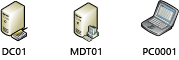
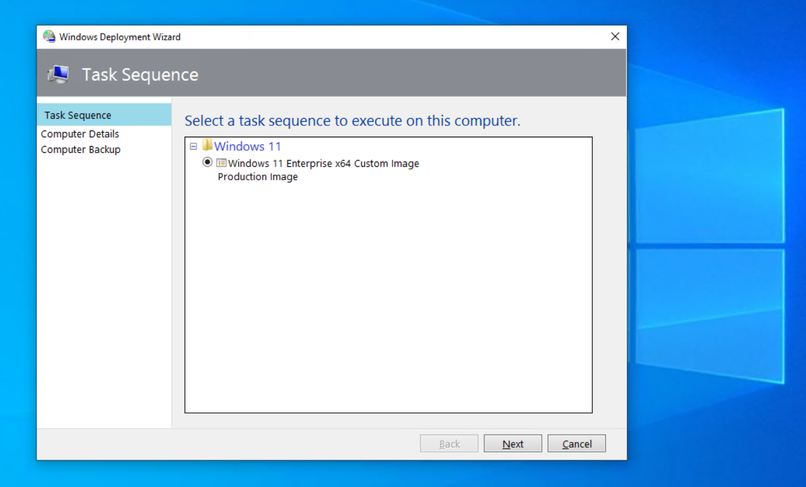

# Refresh a Windows 7 computer with Windows 10

**Applies to**
-   Windows 10

This topic will show you how to use MDT Lite Touch Installation (LTI) to upgrade a Windows 7 computer to a Windows 10 computer using the computer refresh process. The refresh scenario, or computer refresh, is a reinstallation of an operating system on the same machine. You can refresh the machine to the same operating system as it is currently running, or to a later version.

For the purposes of this topic, we will use three machines: DC01, MDT01, and PC0001. DC01 is a domain controller and MDT01 is a Windows Server 2012 R2 Standard server. PC0001 is a machine with Windows 7 Service Pack 1 (SP1) that is going to be refreshed into a Windows 10 machine, with data and settings restored. MDT01 and PC0001 are members of the domain contoso.com for the fictitious Contoso Corporation. For more details on the setup for this topic, please see [Deploy Windows 10 with the Microsoft Deployment Toolkit](deploy-windows-10-with-the-microsoft-deployment-toolkit.md#proof).



Figure 1. The machines used in this topic.

## <a href="" id="sec01"></a>The computer refresh process

Even though a computer will appear, to the end user, to be upgraded, a computer refresh is not, technically, an in-place upgrade. A computer refresh also involves taking care of user data and settings from the old installation and making sure to restore those at the end of the installation.
For a computer refresh with MDT, you use the User State Migration Tool (USMT), which is part of the Windows Assessment and Deployment Kit (ADK) for Windows 10, to migrate user data and settings. To complete a computer refresh you will:

1.  Back up data and settings locally, in a backup folder.

2.  Wipe the partition, except for the backup folder.

3.  Apply the new operating system image.

4.  Install other applications.

5.  Restore data and settings.

During the computer refresh, USMT uses a feature called Hard-Link Migration Store. When you use this feature, the files are simply linked in the file system, which allows for fast migration, even when there is a lot of data.

>[!NOTE] 
>In addition to the USMT backup, you can enable an optional full Windows Imaging (WIM) backup of the machine by configuring the MDT rules. If you do this, a .wim file is created in addition to the USMT backup. The .wim file will contain the entire volume from the computer, and helpdesk personnel can extract content from it if needed. Please note that this is a data WIM backup only. Using this backup to restore the entire machine is not a supported scenario.
 
### Multi-user migration

By default, ScanState in USMT backs up all profiles on the machine, including local computer profiles. If you have a machine that has been in your environment for a while, it likely has several domain-based profiles on it, including those of former users. You can limit which profiles are backed up 
by configuring command-line switches to ScanState (added as rules in MDT).

As an example, the following line configures USMT to migrate only domain user profiles and not profiles from the local SAM account database: ScanStateArgs=/ue:\*\\\* /ui:CONTOSO\\\*

>[!NOTE] 
>You also can combine the preceding switches with the /uel switch, which excludes profiles that have not been accessed within a specific number of days. For example, adding /uel:60 will configure ScanState (or LoadState) not to include profiles that haven't been accessed for more than 60 days.
 
### Support for additional settings

In addition to the command-line switches that control which profiles to migrate, the XML templates control exactly what data is being migrated. You can control data within and outside the user profiles

## <a href="" id="sec02"></a>Create a custom User State Migration Tool (USMT) template

In this section, you learn to migrate additional data using a custom template. You configure the environment to use a custom USMT XML template that will:

1.  Back up the **C:\\Data** folder (including all files and folders).

2.  Scan the local disk for PDF documents (\*.pdf files) and restore them into the **C:\\Data\\PDF Documents** folder on the destination machine.
    The custom USMT template is named MigContosoData.xml, and you can find it in the sample files for this documentation, which include:

    * [Gather script](https://go.microsoft.com/fwlink/p/?LinkId=619361)
    * [Set-OUPermissions](https://go.microsoft.com/fwlink/p/?LinkId=619362) script
    * [MDT Sample Web Service](https://go.microsoft.com/fwlink/p/?LinkId=619363)

### Add the custom XML template

In order to use the custom MigContosoData.xml USMT template, you need to copy it to the MDT Production deployment share and update the CustomSettings.ini file. In these steps, we assume you have downloaded the MigContosoData.xml file.
1.  Using File Explorer, copy the MigContosoData.xml file to the **E:\\MDTProduction\\Tools\\x64\\USMT5** folder.
2.  Using Notepad, edit the E:\\MDTProduction\\Control\\CustomSettings.ini file. After the USMTMigFiles002=MigUser.xml line add the following line:

    ``` syntax
    USMTMigFiles003=MigContosoData.xml
    ```
3.  Save the CustomSettings.ini file.

## <a href="" id="sec03"></a>Refresh a Windows 7 SP1 client

After adding the additional USMT template and configuring the CustomSettings.ini file to use it, you are now ready to refresh a Windows 7 SP1 client to Windows 10. In these steps, we assume you have a Windows 7 SP1 client named PC0001 in your environment that is ready for a refresh to Windows 10.

>[!NOTE]   
>MDT also supports an offline computer refresh. For more info on that scenario, see the USMTOfflineMigration property in the [MDT resource page](https://go.microsoft.com/fwlink/p/?LinkId=618117).
 
### Upgrade (refresh) a Windows 7 SP1 client

1.  On PC0001, log on as **CONTOSO\\Administrator**. Start the Lite Touch Deploy Wizard by executing **\\\\MDT01\\MDTProduction$\\Scripts\\Litetouch.vbs**. Complete the deployment guide using the following settings:
    
    * Select a task sequence to execute on this computer: Windows 10 Enterprise x64 RTM
    * Computer name: &lt;default&gt;
    * Specify where to save a complete computer backup: Do not back up the existing computer
      >[!NOTE]
      >Skip this optional full WIM backup. The USMT backup will still run.
         
2.  Select one or more applications to install: Install - Adobe Reader XI - x86

3.  The setup now starts and does the following:
    
    * Backs up user settings and data using USMT.
    * Installs the Windows 10 Enterprise x64 operating system.
    * Installs the added application(s).
    * Updates the operating system via your local Windows Server Update Services (WSUS) server.
    * Restores user settings and data using USMT.



Figure 2. Starting the computer refresh from the running Windows 7 SP1 client.

## Related topics

[Get started with the Microsoft Deployment Toolkit (MDT)](get-started-with-the-microsoft-deployment-toolkit.md)

[Create a Windows 10 reference image](create-a-windows-10-reference-image.md)

[Deploy a Windows 10 image using MDT](deploy-a-windows-10-image-using-mdt.md)

[Build a distributed environment for Windows 10 deployment](build-a-distributed-environment-for-windows-10-deployment.md)

[Replace a Windows 7 computer with a Windows 10 computer](replace-a-windows-7-computer-with-a-windows-10-computer.md)

[Configure MDT settings](configure-mdt-settings.md)
