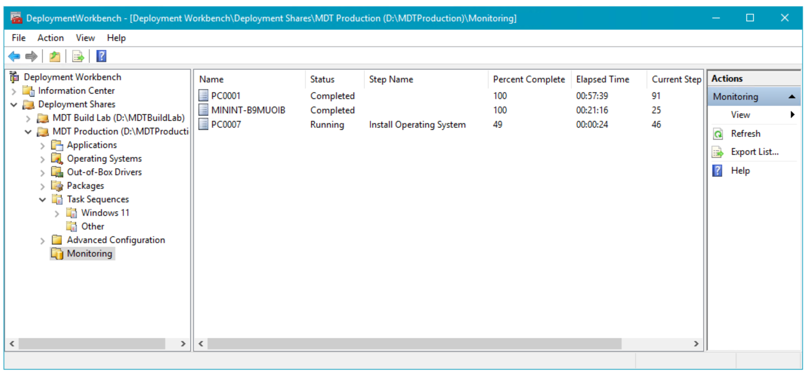

# Replace a Windows 7 computer with a Windows 10 computer

**Applies to**
-   Windows 10

A computer replace scenario for Windows 10 is quite similar to a computer refresh for Windows 10. However, because you are replacing a device, you cannot store the backup on the old computer. Instead you need to store the backup to a location where the new computer can read it. The User State Migration Tool (USMT) will be used to back up and restore data and settings. 

For the purposes of this topic, we will use four computers: DC01, MDT01, PC0002, and PC0007. 
- DC01 is a domain controller for the contoso.com domain.
- MDT01 is domain member server that hosts your deployment share.
- PC0002 is an old computer running Windows 7 SP1 that will be replaced by PC0007. 
- PC0007 is a new computer will have the Windows 10 OS installed prior to data from PC0002 being migrated. Both PC0002 and PC0007 are members of the contoso.com domain.

For more details on the setup for this topic, please see [Prepare for deployment with MDT](prepare-for-windows-deployment-with-mdt.md).


The computers used in this topic.

>HV01 is also used in this topic to host the PC0007 virtual machine for demonstration purposes, however typically PC0007 is a physical computer.

## Prepare for the computer replace

 To prepare for the computer replace, you need to create a folder in which to store the backup and a backup only task sequence to run on the old computer.

### Configure the rules on the Microsoft Deployment Toolkit (MDT) Production share

On **MDT01**:

1. Open the Deployment Workbench, under **Deployment Shares** right-click **MDT Production**, click **Properties**, and then click the **Rules** tab.
2. Change the **SkipUserData=YES** option to **NO**, and click **OK**.
3. Right-click **MDT Production** and click **Update Deployment Share**. Click **Next**, **Next**, and **Finish** to complete the Update Deployment Share Wizard with the default setttings.

### Create and share the MigData folder

On **MDT01**:

1. Create and share the **D:\\MigData** folder by running the following three commands in an elevated Windows PowerShell prompt:
   ``` powershell
   New-Item -Path D:\MigData -ItemType directory
   New-SmbShare -Name MigData$ -Path D:\MigData -ChangeAccess EVERYONE
   icacls D:\MigData /grant '"MDT_BA":(OI)(CI)(M)'
   ```
   ### Create a backup only (replace) task sequence

2. In Deployment Workbench, under the **MDT Production** deployment share, select the **Task Sequences** node and create a new folder named **Other**.

3. Right-click the **Other** folder and select **New Task Sequence**. Use the following settings for the New Task Sequence Wizard:

   * Task sequence ID: REPLACE-001
   * Task sequence name: Backup Only Task Sequence
   * Task sequence comments: Run USMT to backup user data and settings
   * Template: Standard Client Replace Task Sequence

4. In the **Other** folder, double-click **Backup Only Task Sequence**, and then in the **Task Sequence** tab, review the sequence. Notice that it only contains a subset of the normal client task sequence actions.

   

   The Backup Only Task Sequence action list.

## Perform the computer replace

During a computer replace, these are the high-level steps that occur:

1.  On the computer you are replacing, a special replace task sequence runs the USMT backup and, if you configured it, runs the optional full Window Imaging (WIM) backup.
2.  On the new computer, you perform a standard bare-metal deployment. At the end of the bare-metal deployment, the USMT backup from the old computer is restored.

### Run the replace task sequence

On **PC0002**:

1.  Sign in as **CONTOSO\\Administrator** and verify that you have write access to the **\\\\MDT01\\MigData$** share.
2.  Run **\\\\MDT01\\MDTProduction$\\Scripts\\LiteTouch.vbs**.
3.  Complete the Windows Deployment Wizard using the following settings:

    1.  Select a task sequence to execute on this computer: Backup Only Task Sequence
        * Specify where to save your data and settings: Specify a location
        * Location: \\\\MDT01\\MigData$\\PC0002
        
        >[!NOTE]
        >If you are replacing the computer at a remote site you should create the MigData folder on MDT02 and use that share instead.
         
    2.  Specify where to save a complete computer backup: Do not back up the existing computer

    The task sequence will now run USMT (Scanstate.exe) to capture user data and settings of the computer.

    

    The new task sequence running the Capture User State action on PC0002.

4.  On **MDT01**, verify that you have an USMT.MIG compressed backup file in the **D:\\MigData\\PC0002\\USMT** folder.

    

    The USMT backup of PC0002.

### Deploy the replacement computer

To demonstrate deployment of the replacement computer, HV01 is used to host a virtual machine: PC0007.

On **HV01**:

1.  Create a virtual machine with the following settings:

    * Name: PC0007
    * Location: C:\\VMs
    * Generation: 2
    * Memory: 2048 MB
    * Hard disk: 60 GB (dynamic disk)
    * Install an operating system from a network-based installation server

2.  Start the PC0007 virtual machine, and press **Enter** to start the Pre-Boot Execution Environment (PXE) boot. The VM will now load the Windows PE boot image from MDT01 (or MDT02 if at a remote site).

    

    The initial PXE boot process of PC0007.

3.  After Windows Preinstallation Environment (Windows PE) has booted, complete the Windows Deployment Wizard using the following settings:

    * Select a task sequence to execute on this computer:
        * Windows 10 Enterprise x64 RTM Custom Image
        * Computer Name: PC0007
        * Move Data and Settings: Do not move user data and settings.
        * User Data (Restore) > Specify a location: \\\\MDT01\\MigData$\\PC0002
        * Applications: Adobe > Install - Adobe Reader

4.  Setup now starts and does the following:

    * Partitions and formats the disk.
    * Installs the Windows 10 Enterprise operating system.
    * Installs the application.
    * Updates the operating system via your local Windows Server Update Services (WSUS) server.
    * Restores the USMT backup from PC0002.

You can view progress of the process by clicking the Monitoring node in the Deployment Workbrench on MDT01.



## Related topics

[Get started with the Microsoft Deployment Toolkit (MDT)](get-started-with-the-microsoft-deployment-toolkit.md)<br>
[Create a Windows 10 reference image](create-a-windows-10-reference-image.md)<br>
[Deploy a Windows 10 image using MDT](deploy-a-windows-10-image-using-mdt.md)<br>
[Build a distributed environment for Windows 10 deployment](build-a-distributed-environment-for-windows-10-deployment.md)<br>
[Refresh a Windows 7 computer with Windows 10](refresh-a-windows-7-computer-with-windows-10.md)<br>
[Configure MDT settings](configure-mdt-settings.md)
